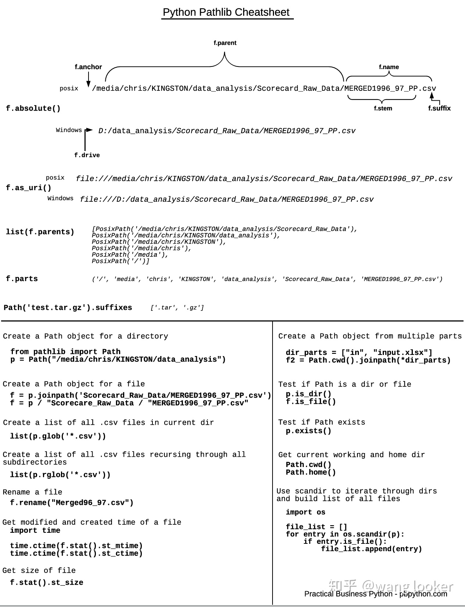

# Python pathlib 

> - [python路径操作新标准：pathlib 模块](https://zhuanlan.zhihu.com/p/139783331)





```python
from pathlib import Path

p = Path.cwd() # 获取当前目录

str(p) # 获取路径字符串

p.resolve() # 获取绝对路径
p.relative_to(str) # 相对其他路径的结果

p.name # 文件名或目录名
p.stem # 文件名，不含后缀
p.suffix # 后缀
p.parent # 父级目录
p.acchor # 目录最前面的 C:\ 或 /
p.parents # 所有父级目录
list(p.parents) # 所有父级目录

p.iterdir() # 扫描子路径
[subpath for subpath in p.iterdir()]

p.glob("*.txt") # 正则匹配路径
p.rglob("*.txt") # 正则递归匹配

p  = p / "dir" / "file.txt" # 路径拼接
p.joinpath("dir", "file.txt") 

p.is_file() # 判断是否为文件
p.is_dir() # 判断是否为目录
p.exists() # 判断是否存在

new_file = Path("file.txt")
new_file.touch(exist_ok=[True, False]) # 创建文件，文件存在是 exist_ok 为 True 则不进行任何操作，为 False 则报错。
new_path = Path("dir/subdir/3dir")
new_path.mkdir(parents=True) # 创建目录，parents=True 表示要创建多级目录

p.rmdir() # 删除目录，一次只删除一级目录，且目录必须为空
p.unlink() # 删除文件

open(p) # 打开文件，可以将 Path 作为参数

p.read_text() # 读取文本
p.read_bytes() # 读取 bytes
p.write_text() # 写入文本
p.write_bytes() # 写入 bytes

p.replace("newdir/new_file.txt") # 移动文件，会覆盖，目录要存在
new_file = p.with_name("new_file.txt")
p.replace(new_file) # 重命名文件
new_file = p.with_suffix(".md")
p.replace(new_file # 修改后缀
```
