# Learn Git Branching Walkthrough

> [Learn Git Branching](https://learngitbranching.js.org/?locale=zh_CN)
> 
> 一个很有意思的 Git 教程

## 基础篇

### Git Commit

> Git 仓库中的提交记录保存的是目录下所有文件的快照。
>
> Git 将当前版本与仓库中上一个版本进行对比，把所有差异打包到一起作为一个提交记录。
>
> Git 还保存了提交的历史记录，即提交记录有父节点。

### Git Branch

> Git 的分支非常轻量，只是简单地指向某个提交记录。
>
> 使用分支相当于：基于这个提交以及它的所有父提交进行新的工作。

使用 `git branch <branch-name>` 可以创建新的分支。

使用 `git checkout <branch-name>` 切换到指定的分支上。

使用 `git checkout -b <branch-name>` 可以创建并切换到新的分支。


### Git Merge

Merge 操作会创建创建一条特殊的提交记录，它有两个父节点。

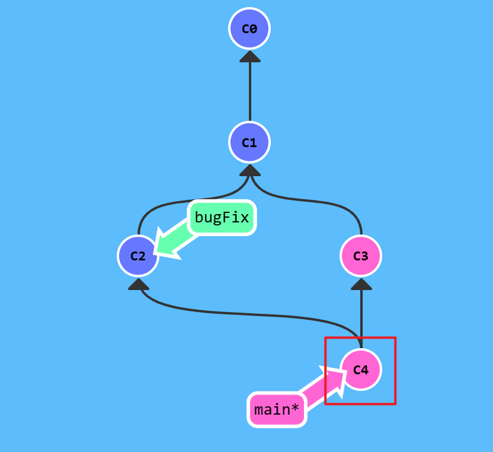

### Git Rebase

> **Rebase 实际上就是取出一系列的提交记录，“复制”它们，然后在另外一个地方逐个的放下去。**
> 
> Rebase 的优势就是可以创造更线性的提交历史，这听上去有些难以理解。如果只允许使用 Rebase 的话，代码库的提交历史将会变得异常清晰。

如图，两个分支，当前分支为 `bugFix`（由 `*` 标识）。

现在要把 `bugFix` 分支的工作直接移到 `main` 分支中，使两个并行开发的分支看起来像是按序开发。

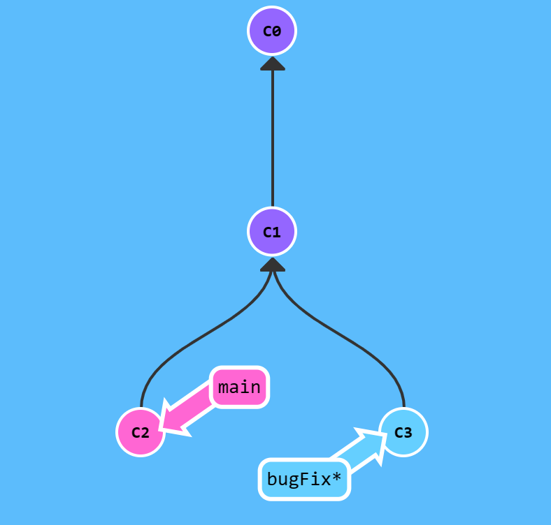

执行 `git rebase main` 命令后，如下图，`bugFix` 的分支的工作在 `main` 的顶端，原提交 `C3` 还存在，`C3'` 是 Rebase 在 `main` 分支上生成的副本。

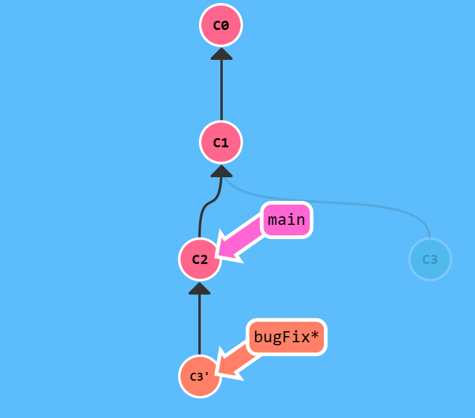

切换到 `main` 分支后，再执行 `git rebase bugFix` 命令，就可以更新 `main`。

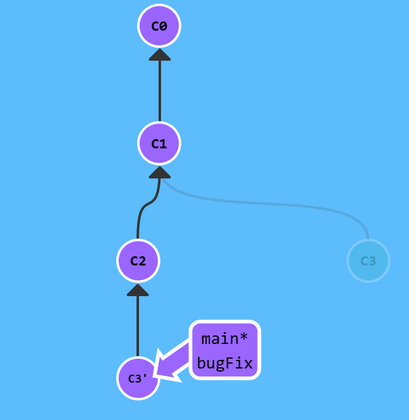


## 高级篇

### Detached HEAD

> `HEAD` 是一个对当前检出记录的符号引用 —— 也就是指向正在其基础上进行工作的提交记录。
>
> `HEAD` 总是指向当前分支上最近一次提交记录。大多数修改提交树的 Git 命令都是从改变 `HEAD` 的指向开始的。

`HEAD` 通常指向分支名，而 Detached `HEAD` 就是指向某个具体的提交记录而不是分支名。

```sh
HEAD -> main -> C1 

$ git checkout C1

HEAD -> C1
```

### 相对引用 `^` & `~`

相比直接使用哈希值指定提交记录，可以使用 `^` 移动到上一个提交记录，或使用 `~<num>` 向上移动多个提交记录。

### 撤销变更

> 在 Git 里撤销变更的方法很多。和提交一样，撤销变更由底层部分（暂存区的独立文件或者片段）和上层部分（变更到底是通过哪种方式被撤销的）组成。
>
> 主要有两种方法用来撤销变更 `git reset` 和 `git revert`

`git reset` 通过把分支记录回退到之前的提交记录来实现撤销改动。

而 `git revert` 则是生成了新的提交记录，如下图，`C2'` 就是用来撤销 `C2` 这个提交的，将这个更改推送到远程仓库就可以与别人分享本次撤销。

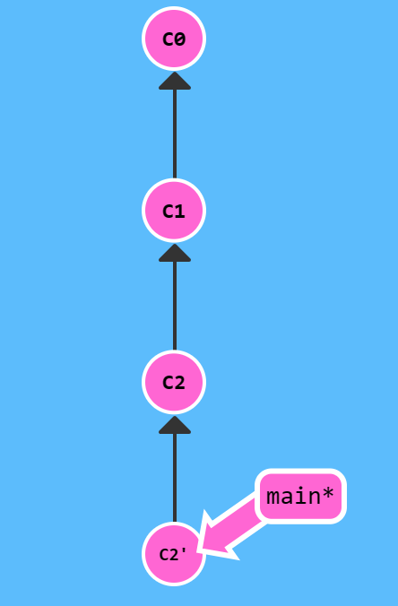


## 移动提交记录

> 自由修改提交树

### Git Cherry-pick

使用 `git cherry-pick` 来移动将一些提交记录复制到当前位置（`HEAD`）。

执行 `git cherry-pick C2 C4` 后，如下图，选取的两个分支就被复制到当前分支。

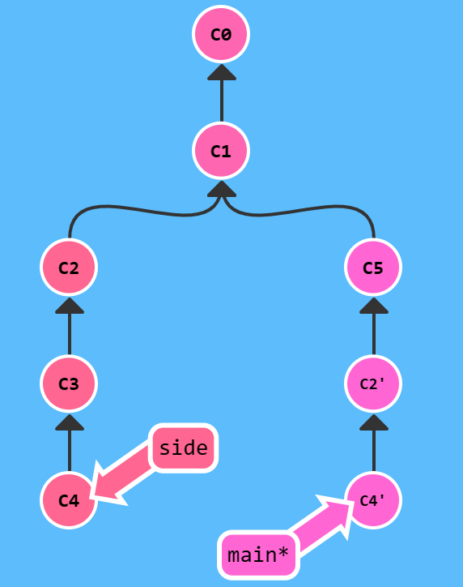

### 交互式 Rebase

Cherry-pick 适用于已知提交记录哈希值的情况。

如果想从一系列的提交记录中找到想要的记录，可以使用 `git rebase [--interactive, -i]`，Git 会提供显示备选提交记录的 UI 界面（实际上一般是编辑器界面）。

在这个界面中，可以完成以下操作：

- 调整提交记录的顺序（鼠标拖放）。
- 删除提交记录（切换 `pick` 状态来完成，关闭代表丢弃该记录）。
- 合并提交（此处不作介绍）。

执行 `git rebase -i HEAD~4`，对最近的四个提交记录进行编辑，如下图，删除 `C2`，并调整其他几个提交记录的顺序。

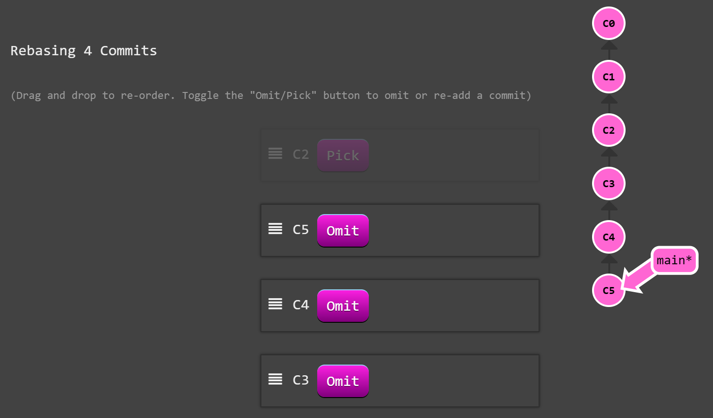

Git 将按照在界面指定的方式进行提交记录的复制操作，结果如下图。

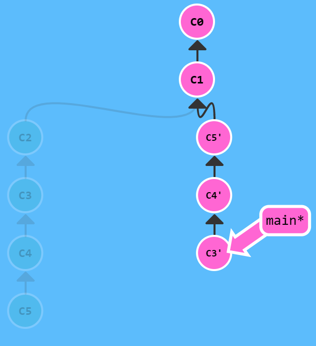


## 杂项

> Git 技术、技巧与贴士集合

### 只取一个提交记录

开发过程中，调试代码包含在提交记录中，而在最后合并回 `main` 分支时，不想合并这些调试语句。

只复制解决问题的那一个提交记录即可，使用前面的 `git rebase -i` 或 `git cherry-pick`。

### 提交的技巧

如下图，之前在 `newImage` 分支上进行了一次提交，然后又基于它创建了 `caption` 分支，然后又提交了一次。现在，要修改 `newImage` 的提交记录，显然它不是最新的。

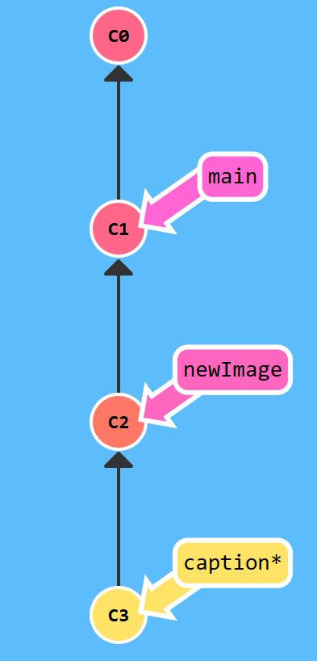

使用 rebase 的方案：

1. 先执行 `git rebase -i HEAD~2` 调整 `C2` 和 `C3` 的顺序。
2. 执行 `git commit --amend` 修改 `C2`。
3. 再执行 `git rebase -i HEAD~2` 调整回原来的顺序。
4. 最后执行 `git rebase caption main` 直接将 `main` 指向 `caption`。

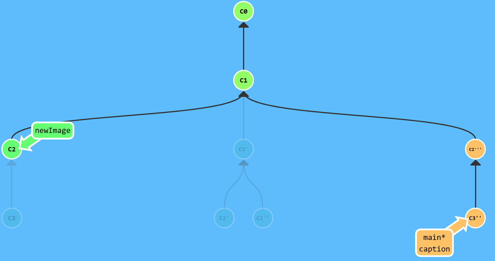

上述的方案使用 `rebase -i` 重排提交记录，然后就可以使用 `--amend` 修改它。此方案的问题是要进行两次排序，可能造成 `rebase` 导致的冲突。

下面来看使用 cherry-pick 的方案，cherry-pick 可以将提交树上任何地方的提交记录追加到 `HEAD` 上（只要不是 `HEAD` 的上游提交即可）。

1. 先执行 `git checkout main` 切换到 `main` 分支。
2. 执行 `git cherry-pick C2` 将 `C2` 复制到 `main`。
3. 执行 `git commit --amend` 修改 `C2'`。
4. 最后执行 `git cherry-pick C3` 将 `C3` 复制到 `main`。

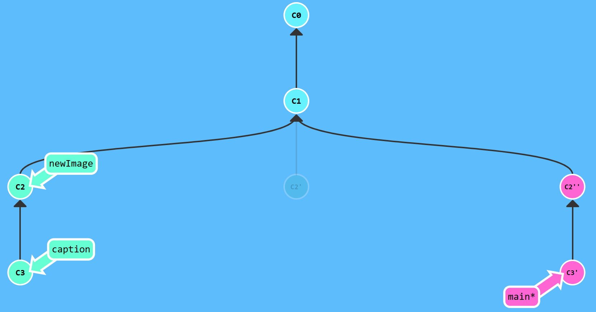

两种方案对 `main` 分支实现了相同的效果。

### Git Tag

> 分支很容易被人为或被新的提交移动，大部分分支都是临时的，且一直在变。
>
> 对于某些重要的提交记录，需要永久指向提交记录的标识。

`git tag <tag> <commit>` 操作可以永久地（当然也可以删除后创建同名的标签）为某个特定的提交记录打标签，使得可以像分支那样引用。

标签不会随新的提交而移动，也不能切换到某个标签上进行修改提交。

### Git Describe

标签在代码库中起着 “锚点” 的作用，`git describe <ref>` 可以描述距 `<ref>`（任何能被 Git 识别成提交记录的引用）最近的标签，默认是相对于 `HEAD`。

结果格式为 `<tag>_<numCommits>_g<hash>`，即标签名、相距提交数和当前提交记录的哈希值。


## 高级

> For the truly brave!

### 多次 Rebase

如下图，将一堆分支 rebase 到 `main` 上，要求是提交记录按序排列。

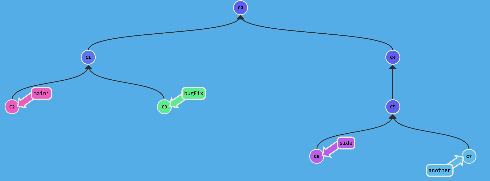

**只要记住命令格式：`git rebase <to> <from>`，将 `<from>` 复制到 `<to>` 上。**

按序执行以下的命令：

```shell
$ git rebase main bugFix
$ git rebase bugFix side
$ git rebase side another
$ git rebase another main
```

前三条是按序复制提交记录。**最后，由于 `main` 在 `another` 的上游，直接会更新 `main` 指向 `C7'`。**最终效果如下图。

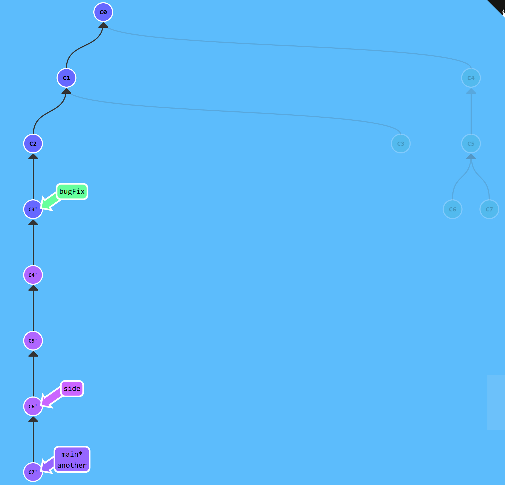

### 多个父节点

操作符 `^` 后面也可以跟数字，但与 `~` 不同，`^<num>` 是用来指定合并提交记录的某个父节点，默认为第一个父提交（按时间排序）。

更神奇的是，`^` 和 `~` 操作符支持链式操作，如下图，执行 `git checkout HEAD~^2~2` 可以将 `HEAD` 从 `main` 指向 `C3`。Amazing!

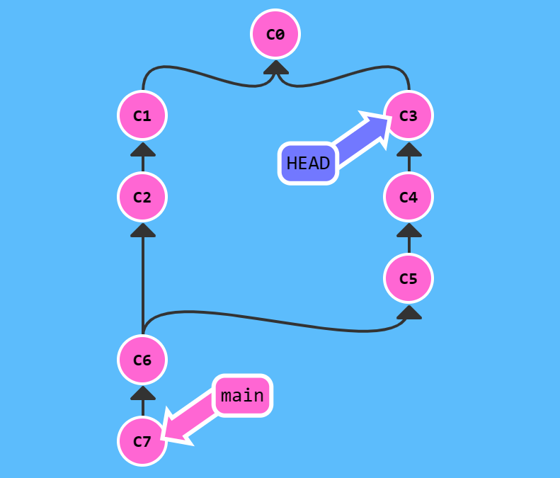

### 乱七八糟的分支

如下图，`main` 比其他分支多几个提交，要求把几次分支调整后添加到其他三个分支上。 

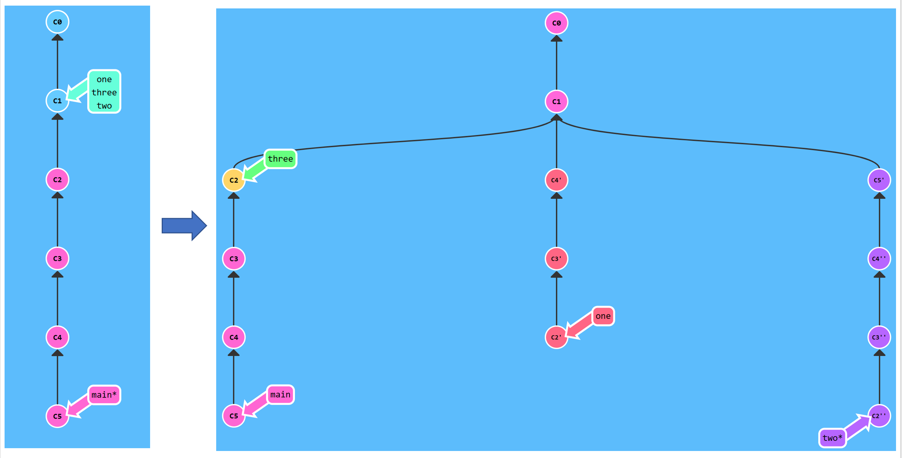

同样有多种方案可以实现，使用 rebase 操作：

```sh
$ git rebase main one     # 将 one 更新到 main
$ git rebase -i HEAD~4    # 重排并删除 one 上的几个提交
$ git rebase main two     # 将 two 更新到 main
$ git rebase -i HEAD~4    # 重排 two 上的提交
$ git rebase C2 three     # 将 three 更新到 main
```

或者使用 cherry-pick 操作：

```sh
$ git checkout one              # 切换到 one
$ git cherry-pick C4 C3 C2      # 将 C4、C3、C2 复制到 one 上
$ git checkout two              # 切换到 two
$ git cherry-pick C5 C4 C3 C2   # 将 C5、C4、C3、C2 复制到 one 上
$ git branch -f three C2        # 强制将 three 指向 C2
```

## Push & Pull -- Git Remotes

> 远程仓库只不过是本地仓库在另一个计算机上的拷贝，兼具备份和分享功能。
> 
> Git 远程仓库的操作实际可以归纳为两点：向远程仓库传输数据以及从远程仓库获取数据。

### Git Clone

Clone 操作可以在本地创建远程仓库的拷贝。

### 远程分支

> 远程分支反映了远程仓库（在上一次通信时）的状态。

检出到远程分支时将进入分离 `HEAD` 状态，即不能直接在这些分支上进行操作。

远程分支的命名格式为 `<remote_name>/<branch_name>`，Git 默认的远程仓库名为 `origin`。

### Git Fetch

Fetch 操作可以从远程仓库获取数据，在这个过程中，远程分支也会更新。

Fetch 操作分两步：从远程仓库下载本地仓库缺失的提交记录；更新远程分支指针。

远程分支被更新成远程仓库中相应分支的最新状态。

**Fetch 操作不会改变本地仓库的状态，既不会更新本地分支，也不会修改磁盘上的文件。**

### Git Pull

> 当远程分支有新的提交时，可以像合并本地分支那样来合并远程分支，如上述的使用 cherry-pick、rebase 和 merge 等操作。
>
> Git 提供了专门的 pull 操作了来完成抓取远程更新在合并到本地分支的过程。

Pull 操作就相当于 fetch + merge。

### Git Push

Push 操作负责将本地变更上传到指定的远程仓库，并在远程仓库上合并新的提交记录。

### 偏离的提交历史

> 上述的 pull 和 push 操作看起来很简单，而困难来自于远程仓库提交历史的偏离。

在本地修改期间，远程仓库发生了变更，使得本地与远程仓库不匹配。对于这种情况，Git 不允许 push 变更，而是会强制要求先合并远程最新的代码。

使用 rebase 调整或 merge 合并使本地变更与远程仓库相匹配。

`git pull --rebase` 就相当于 fetch + rebase。

### Locked Main

在实际项目中，`main` 分支可能被锁定，需要 pull request 流程来合并修改。

新建一个分支，push 这个分支并申请 pull request。

## To Origin And Beyond -- Advanced Git Remotes

### 推送 `main`

执行 `git pull --rebase; git push`，将本地变更 rebase 到远程分支的最新提交记录，再向远程仓库推送变更。

### 合并远程仓库

上述的操作使用 rebase 操作使本地仓库包含远程仓库的最新变更。

Rebase 的优点是可以是提交树变得很干净，所有提交都在一条线上；而缺点是会修改提交树的历史，即提交记录的顺序。

### 远程追踪

> 远程和本地的分支之间的关联关系是由分支的 remote tracking 属性决定的，即为本地分支指定了推送的目的地以及拉取后合并的目标。
>
> Clone 操作会自动设置这个属性。

可以手动指定远程追踪属性，第一种是 `git checkout -b <local-branch> <remote-branch>`，以创建本地分支并跟踪对应的远程分支。

第二种是使用 `git branch -u <remote-branch> <local-branch>` 命令，也可以省略本地分支名，即设置当前分支的远程追踪。

### Git Push 参数

Push 操作可以指定要推送目的地：`git push <remote> <place>`，指定参数后 push 操作会忽略当前检出分支的属性。`<place>` 参数指定了提交记录的来源和去向。

而对于来源和去向分支的名称不同的情况，使用冒号连接即可：`git push <remote> <source>:<destination>`，这个参数的实际值是任意一个 Git 能识别成提交记录的位置（也就是说还可以用 `^` 或 `~` 操作符）。远程仓库中的目的分支不存在时，会创建新的分支。

### Git Fetch 参数

Fetch 与 push 操作正相反，因此参数也很相似：`git fetch <remote> <place>`。不同的是，fetch 操作只会更新本地仓库的远程分支，而不会修改本地分支。

通过使用冒号链接的语法，fetch 可以直接更新本地分支，但不支持对当前分支操作。类似的，本地仓库中的目的分支不存在时，会创建新的本地分支。

与 push 操作通过检查当前检出分支属性确定目的地不同，如果没有指定参数，fetch 操作会下载所有的提交记录到各个远程分支。

### 奇怪的 `<source>`

在 push 和 fetch 操作中，可以不指定 `<source>` 参数，只保留冒号和 `<destination>`。

**Push 空到远程仓库，会删除远程仓库中的分支。**

**Fetch 空到本地，会在本地创建一个新分支。**

### Git Pull 参数

Pull 相当于 fetch + merge，因此参数类似，pull 操作唯一关注的是提交记录最终合并到哪里，即 `<destination>` 参数。

Pull 操作最终会将 fetch 到本地的 `<destination>` 分支合并到当前检出的分支。


