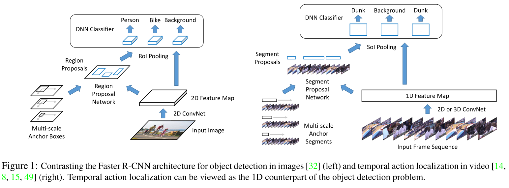
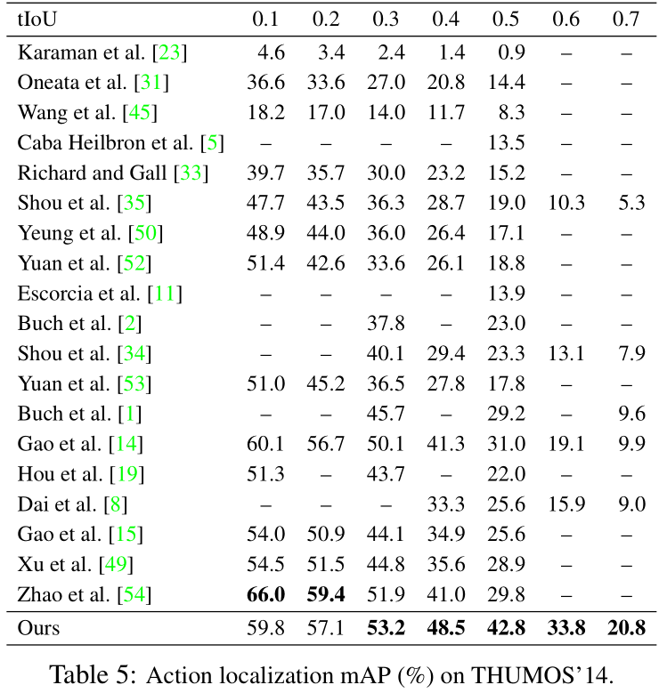
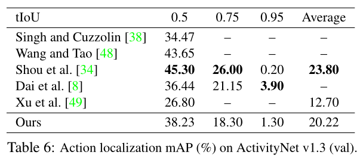

### 深度学习 作业 3

**Rethinking the Faster R-CNN Architecture for Temporal Action Localization 阅读报告**

#### 本文研究问题

时序动作定位（Temporal Action Localization）不仅要从视频中识别动作类别，还要检测每个动作开始和结束的时间。时序动作定位和目标检测都属于视觉检测问题范畴，因此很多研究人员想把在目标检测中达到很好效果的 Faster R-CNN 用于时序动作定位领域，而这样的迁移带来一些问题。本文的研究主要关注以下问题：

1. 如何处理动作持续时间的巨大变化；
2. 如何利用视频中动作的时间上下文信息；
3. 如何更好地融合多流特征。

#### 本文主要贡献

- 提出时序动作网络 TAL-Net，这是一种基于 Faster R-CNN 的新的视频动作定位的方法。
- 在 THUMOS'14 数据集上测试，在动作提议和定位方面都达到最先进的性能；同时在 ActivityNet 数据集上达到有竞争力的性能。

#### 本文工作

动作识别是要根据剪切后包含特定动作的视频识别动作类别，是一个分类问题的。但在现实应用中，视频通常未经修剪，想要识别的动作往往包含在与之无关的背景中。时序动作定位就是针对这样的场景，对于一个未经剪切的视频，时序动作定位要求识别视频中每个动作的开始和结束时间以及动作类别，这在视频分析中有很广泛的应用前景。Faster R-CNN 最开始被提出时是要解决目标检测问题，对于给定输入图像，输出带有目标类型标签的检测边界框。目标检测旨在检测二维空间，生成边界框，而时序动作定位是要检测一维的时间线，找出开始和结束时间。鉴于 Faster R-CNN 在目标检测领域的成功，它被扩展到时序动作定位领域。而跨领域的扩展就不可避免地带来一些问题，本文针对其中的几个问题做出改变，提出了 TAL-Net。

##### TAL-Net

首先要了解用于时序动作定位的 Faster R-CNN 架构，用于目标检测和时序动作定位的架构如下图。

与目标检测类似，分为两个阶段。首先根据给定的一系列帧，提取一维特征图，提交给分段提议网络，得出类别无关的段提议。然后对每个提议，通过池化和 DNN 分类器，计算动作类概率并进一步回归到段边界。

与现有的 Faster R-CNN 检测范式相比，TAL-Net 有三个主要的架构变化。

首先，与目标检测相比，动作定位中的时间变化范围很大。而 Faster R-CNN 基于共享特征表示来评估候选提案（即锚点），特征的时间范围（即感受野）和锚点的跨度之间的错位可能导致无法捕获信息。TAL-Net 主要使用多塔网络和扩张时间卷积两方面拉实现锚点的感受野与时间跨度对齐。

其次，时间上下文信息（即动作之间或之后发生的事情）往往是时序动作定位任务的关键信息。它可以帮助更准确地定位动作边界，同时提供动作分类的线索。而对 Faster R-CNN 的简单应用无法利用这种时间上下文信息，TAL-Net 在提议生成和动作分类阶段引入了利用上下文特征的方法。提议生成只计算了锚点内的，要加入上下文信息，在前后各取一段长度计算。在池化操作后添加一个全连接层，最后是对执行动作分类的全连接层。

最后，由于双流架构在动作分类工作中取得较好的效果，TAL-Net 将双流输入和特征融合用于时序动作定位任务，提出了一种后期融合的方案。使用两个不同的网络分别从 RGB 帧和叠加光流中提取一维特征图，输入到不同的提议生成网络，将生成的两个值计算平均值作为提议。对于每个提议，在两个特征图上并行执行池化，对每个输出应用不同的分类器，把最终结果做均值。

##### 实验

在 THUMOS’14 上进行消融实验和基准测试，该数据集包含来自 20 个动作类的视频。使用未修剪的视频，每个视频平均超过 3 分钟，平均包含 15 个以上的动作，任务特别具有挑战性。评估指标考虑两个任务：对于动作提议，使用已有的代码计算每个视频的不同平均提议数的平均召回率（AR），对于动作定位，使用不同 tIoU 阈值的平均精度（mAP）。为了提取特征图，首先在动作分类数据集上训练双流模型。针对 TAL-Net 的三点改进做了大量的消融实验，对于感受野对齐，设置了没有时间卷积的单塔网络、具有非扩张时间卷积的单塔网络（经典 Faster R-CNN）、具有非扩张时间卷积的多塔网络以及具有扩张时间卷积的多塔网络（TAL-Net）四组实验验证设计的有效性；对于上下文特征提取，对比加入上下文特征之前和之后生成的提议和动作定位效果；对于后期特征融合，比较和单流网络、早期和后期融合方案的动作定位效果。经过一系列的实验，最终验证了 TAL-Net 作出的三点改进设计的有效性。

将 TAL-Net 与动作提议和定位方面最先进的方法进行比较，结果如下表（左），TAL-Net 在提议较少的情况下由于所有的方法，证明 TAL-Net 生成的提案质量更高。在 tIOU 阈值为 0.5 时，以 42.8% 的 mAP 由于最先进的技术。同时还在 ActivityNet 验证集上与其他工作比较动作定位效果，结果如下表（右）。虽然结果不是最好，但是仍具有竞争力。作者认为，THUMOS‘14 是比 ActivityNet 更好的评估动作定位的数据集，因为 THUMOS‘14 的视频中具有更多的动作实例，并且每个视频包含大部分的背景，更具挑战性。

读完这篇文章，我觉得这种把相关领域的优秀成果迁移到自己研究领域的思路很有用。同时，在迁移的过程中，关注的问题场景不同也会导致一系列的问题。这时候就可以研究如何改进经典的成果，使其适应新领域的新问题。就那网络安全领域来说，现在很多设计检测或分类的工作都会有人尝试使用机器学习或深度学习的方法来解决，而在迁移的过程中可以根据应用场景的需要结合数据语义对原来的方法加以调整。
