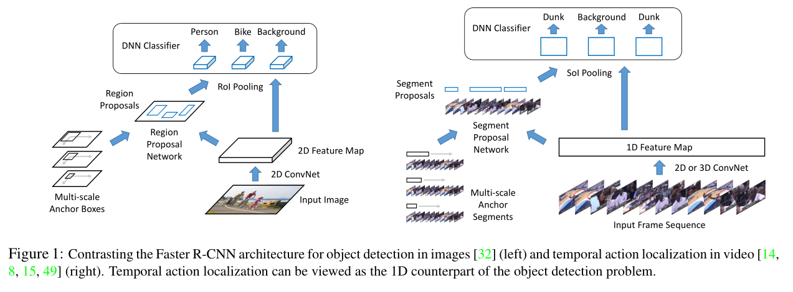
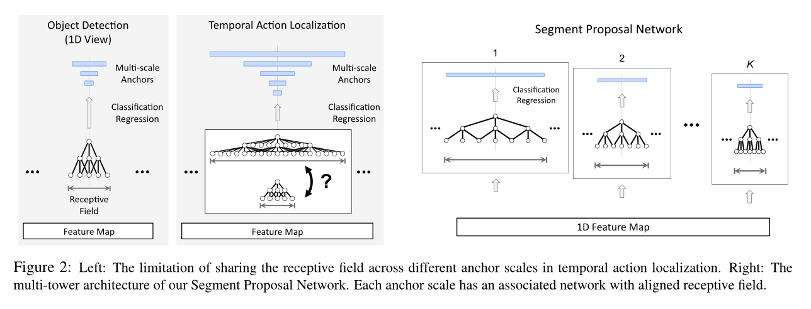
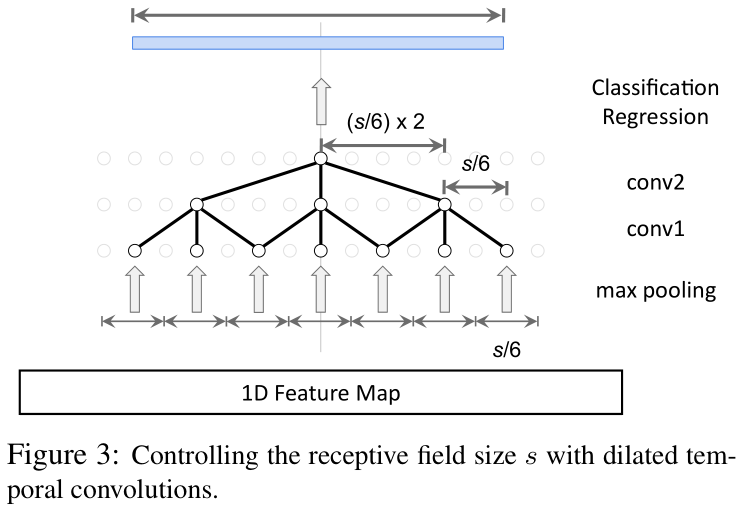
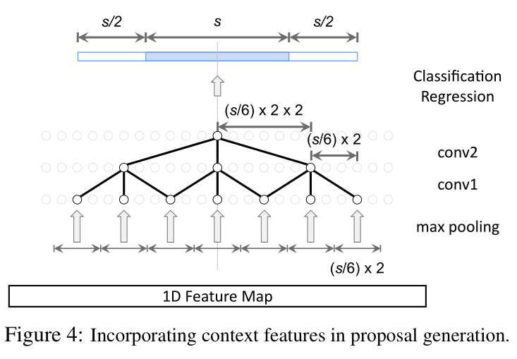
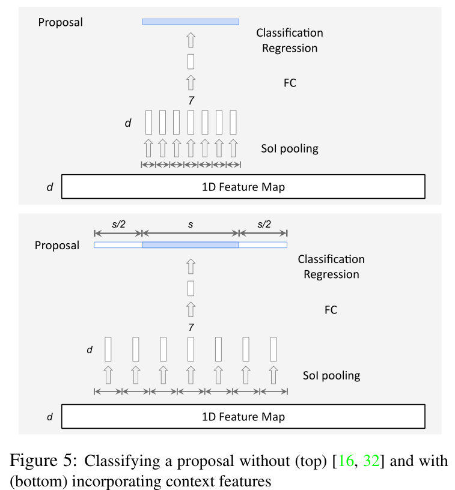
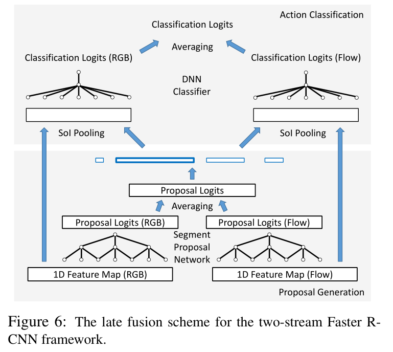
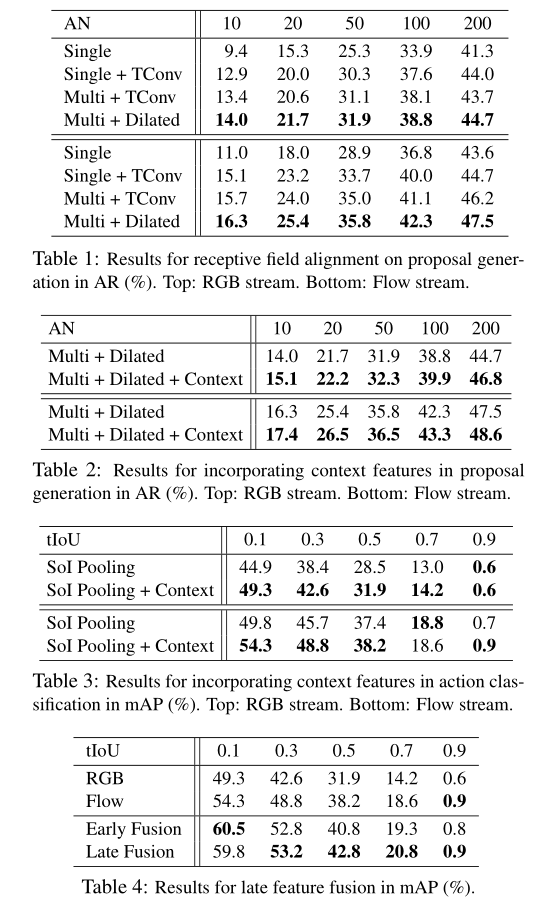
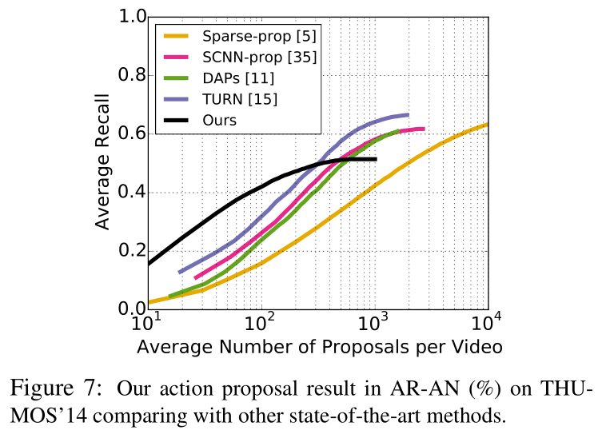
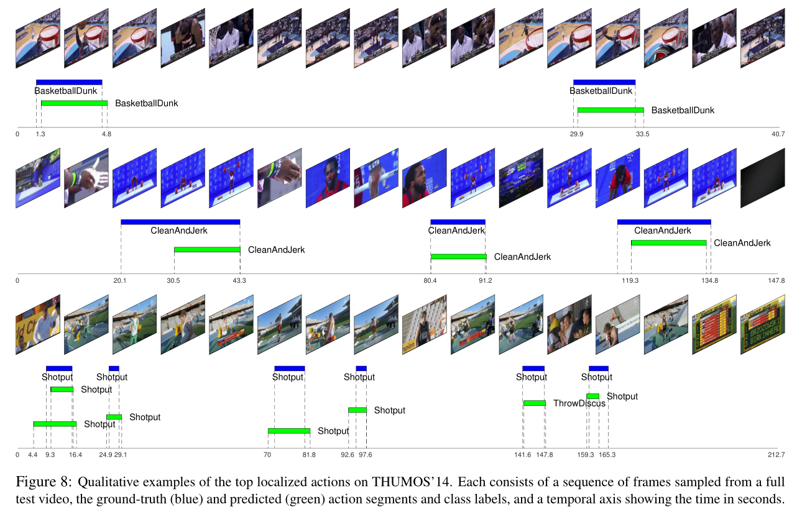

# Rethinking the Faster R-CNN Architecture for Temporal Action Localization

[toc]

## 摘要

我们提出了 TAL-Net，这是一种改进的视频时间动作定位方法，其灵感来自于 Faster RCNN 对象检测框架。  TAL-Net 解决了现有方法的三个主要缺点：（1）我们使用可以适应动作持续时间极端变化的多尺度架构来改进感受野对齐；  （2）我们通过适当扩展接受域，更好地利用动作的时间上下文来生成提议和动作分类；  (3) 我们明确考虑多流特征融合，并证明后期融合运动很重要。 我们在 THUMOS 的 14 检测基准和 ActivityNet 挑战中的竞争性能上实现了最先进的行动建议和定位性能。

## 引言

对人类行为的视觉理解是构建辅助人工智能系统的核心能力。该问题通常在动作分类的设置中进行研究 [44, 36, 29]，其目标是将时间修剪的视频剪辑强制选择分类为几个动作类之一。 尽管取得了丰硕的进展，但这种分类设置是不切实际的，因为现实世界的视频通常未经修剪，并且感兴趣的动作通常嵌入在无关活动的背景中。 最近的研究注意力逐渐转移到未修剪视频中的时间动作定位 [23, 31, 45]，其中的任务不仅是识别动作类，还要检测每个动作实例的开始和结束时间。 时间动作定位的改进可以推动大量重要主题的进展，从即时应用（例如提取体育视频中的亮点）到更高级别的任务（例如自动视频字幕）。

时间动作定位，如对象检测，属于视觉检测问题的范畴。 目标检测旨在在 2D 图像中生成空间边界框，而时间动作定位旨在生成一维帧序列中的时间段。 因此，许多动作定位方法都从目标检测的进步中汲取灵感。 一个成功的例子是使用基于区域的检测器 [17, 16, 32]。 这些方法首先从完整图像中生成一组与类别无关的区域提议，然后通过每个提议对其对象类别进行分类。 为了检测动作，可以遵循这一范式，首先从完整视频中生成片段建议，然后对每个建议进行分类。

在基于区域的检测器中，Faster R-CNN [32] 因其在公共基准 [27, 12] 上具有竞争力的检测精度而被广泛用于目标检测。 其核心思想是利用深度神经网络 (DNN) 的巨大能力为提案生成和对象分类这两个过程提供动力。 鉴于其在图像对象检测方面的成功，人们对使用 Faster R-CNN 进行视频中的时间动作定位有相当大的兴趣。 然而，这样的领域转移带来了一些挑战。 我们回顾了 Faster R-CNN 在动作定位领域的问题，并重新设计了架构以专门解决这些问题。 我们专注于以下方面：

1. 如何处理动作持续时间的巨大变化？

   与图像中对象的大小相比，动作的时间范围变化很大——从几分之一秒到几分钟。 然而，Faster RCNN 基于共享特征表示评估不同尺度的候选提案（即锚点），由于特征的时间范围（即感受野）和锚点的跨度之间的错位，可能无法捕获相关信息。我们建议使用多塔网络和扩张的时间卷积来强制执行这种对齐。

2. 如何利用时间上下文？ 

   动作实例前后的时刻包含用于定位和分类的关键信息（可以说比对象的空间上下文更重要）。Faster R-CNN 的幼稚应用将无法利用这种时间上下文。 我们建议通过扩展提案生成和动作分类中的接受域来显式编码时间上下文。

3. 如何最好地融合多流特征？ 

   最先进的动作分类结果主要是通过融合 RGB 和基于光流的特征来实现的。 然而，在探索 Faster R-CNN 的这种特征融合方面的工作有限。 我们提出了一种后期融合方案，并凭经验证明了其优于常见的早期融合方案。

我们的贡献有两个：（1）我们引入了时间动作定位网络（TAL-Net），这是一种基于 Faster RCNN 的视频动作定位新方法；  (2) 我们在 THUMOS 的 14 检测基准 [21] 上的动作提议和定位方面都实现了最先进的性能，以及在 ActivityNet 数据集上的竞争性能 [4]。

## 相关工作

**动作识别** 动作识别通常被表述为一个分类问题。输入是经过时间修剪以包含感兴趣的特定动作的视频，目标是对动作进行分类。由于大型数据集的引入和深度神经网络的发展，最近取得了巨大进展 [36, 29, 42, 47, 6, 13]。 然而，修剪输入的假设限制了这些方法在实际场景中的应用，其中视频通常未经修剪并且可能包含不相关的背景。

**时间动作定位** 时间动作定位假设输入是一个长的、未修剪的视频，旨在识别视频中每个动作实例的开始和结束时间以及动作标签。 由于其在视频数据分析中的潜在应用，该问题最近受到了广泛的研究关注。 下面我们回顾一下这个问题的相关工作。

早期方法通过应用时间滑动窗口和 SVM 分类器来对每个窗口内的动作进行分类来解决该任务 [23, 31, 45, 30, 52]。 他们通常提取改进的密集轨迹 [44] 或预训练的 DNN 特征，并在每个窗口中全局池化这些特征以获得 SVM 分类器的输入。 袁等人没有使用全局池化。  [52] 提出了一种多尺度池化方案来捕获多种分辨率的特征。然而，这些方法在计算上可能效率低下，因为需要在整个视频的不同时间位置的不同大小的窗口上详尽地应用每个动作分类器。

另一行工作生成逐帧或片断动作标签，并使用这些标签来定义动作的时间边界 [28, 37, 9, 25, 53, 19]。 这里的一个主要挑战是在预测单个标签时启用时间上下文推理。 莉亚等人。  [25] 提出了新的时间卷积架构来捕获远程时间依赖性，而其他人 [28, 37, 9] 使用循环神经网络。 其他一些方法在逐帧或逐段预测分数之上添加了一个单独的上下文推理阶段，以明确模拟动作持续时间或时间转换 [33, 53, 19]。

受最近基于区域的检测器在物体检测中取得成功的启发 [17, 16]，许多最近的方法采用了两阶段的建议加分类框架 [5, 35, 11, 2, 3, 34, 54]， 即首先从输入视频中生成一组稀疏的分类不可知片段提议，然后对每个提议的动作类别进行分类。 其中大量工作专注于改进分段建议 [5, 11, 3, 2]，而其他工作则专注于构建更准确的动作分类器 [34, 54]。 然而，这些方法中的大多数都无法在提案或分类阶段提供端到端的培训。 此外，建议通常是从预定义尺度的滑动窗口中选择的 [35]，其中边界是固定的，如果窗口不密集，可能会导致定位不精确。

作为基于区域的目标检测器的最新版本，Faster R-CNN 架构 [32] 由端到端的可训练提议和分类网络组成，并在两个阶段应用区域边界回归。 最近的一些工作已经开始将这种架构应用于时间动作定位 [14, 8, 15, 49]，并展示了竞争检测的准确性。 特别是 R-C3D 网络 [49] 是一个经典示例，它在许多设计细节上都紧跟原始 Faster R-CNN。虽然是一种强大的检测范式，但我们认为将 Faster R-CNN 架构天真地应用于时间动作定位可能会遇到一些问题。 我们建议在本文中解决这些问题。 当我们稍后介绍 TAL-Net 时，我们还将阐明我们对其他基于 Faster R-CNN 的方法的贡献 [14, 8, 15, 49]。

除了上面回顾的工作之外，还有其他类别的方法，例如基于单次检测器 [1, 26] 或强化学习 [50] 的方法。其他人也研究了弱监督环境中的时间动作定位 [40, 46]，其中只有视频级动作标签可用于训练。 另请注意，除了时间动作定位之外，还有大量关于时空动作定位的工作 [18, 22, 39]，这超出了本文的范围。

## Faster R-CNN

我们在本节中简要回顾了 Faster R-CNN 检测框架。  Faster R-CNN 首先被提出用于解决对象检测 [32]，其中给定输入图像，目标是输出一组检测边界框，每个边界框都标有一个对象类标签。 完整的管道由两个阶段组成：提案生成和分类。首先，输入图像由 2D ConvNet 处理以生成 2D 特征图。 然后使用另一个 2D ConvNet（称为 Region Proposal Network）通过对以特征图的每个像素位置为中心的一组尺度变化的锚框进行分类，来生成一组稀疏的类无关区域提议。 提案的边界也通过回归相对于锚框进行了调整。 其次，对于每个区域提议，区域内的特征首先被池化成一个固定大小的特征图（即 RoI 池化 [16]）。 使用池化特征，DNN 分类器然后计算对象类别概率并同时回归每个对象类别的检测边界。 图 1（左）说明了完整的流水线。该框架通常通过在第一阶段和第二阶段的训练之间交替进行训练[32]。

> 图 1：对比用于图像 [32]（左）和视频 [14、8、15、49]（右）中的时间动作定位的对象检测的 Faster R-CNN 架构。 时间动作定位可以被视为对象检测问题的一维对应物。

Faster R-CNN 自然地扩展到时间动作定位 [14, 8, 49]。 回想一下，对象检测旨在检测 2D 空间区域，而在时间动作定位中，目标是检测 1D 时间段，每个段由开始时间和结束时间表示。 因此，时间动作定位可以被视为对象检测的一维对应物。 用于时间动作定位的典型 Faster R-CNN 管道如图 1（右）所示。 与物体检测类似，它由两个阶段组成。 首先，给定一系列帧，我们通常通过 2D 或 3D ConvNet 提取 1D 特征图。 然后将特征图传递给 1D ConvNet 1（称为 Segment Proposal Network），以对每个时间位置的一组不同尺度的锚段进行分类，并回归它们的边界。这将返回一组稀疏的与类别无关的段建议。 其次，对于每个段提议，我们计算动作类概率并进一步回归段边界，首先应用一维 RoI 池化（称为“SoI 池化”）层，然后是 DNN 分类器。

## TAL-Net

TAL-Net 遵循用于时间动作定位的 Faster R-CNN 检测范式（图 1 右），但具有三个新颖的架构变化（第 4.1 至 4.3 节）。

### 感受野对齐

回想一下，在提议生成中，我们通过在特征图中的每个位置对一组不同尺度的锚点进行分类来生成一组稀疏的与类别无关的提议。 在目标检测 [32] 中，这是通过在特征图的顶部应用一个小的 ConvNet 来实现的，然后是一个带有 K 个过滤器的 1×1 卷积层，其中 K 是尺度的数量。 每个过滤器都会对特定比例的锚点进行分类。 这揭示了一个重要的限制：每个位置的锚分类器共享相同的感受野。 这种设计对于对象检测可能是合理的，但可能不能很好地推广到时间动作定位，因为与对象的空间大小相比，动作的时间长度可能会发生更大的变化，例如 在 THUMOS'14 [21] 中，动作长度范围从小于一秒到大于一分钟。 为了确保高召回率，应用的锚段因此需要具有广泛的尺度范围（图 2 左）。 但是，如果感受野设置太小（即时间短），提取的特征在分类大（即时间长）anchors时可能不包含足够的信息，而如果设置太大，提取的特征可能被不相关的特征所支配。 分类小锚时的信息。

为了解决这个问题，我们建议将每个锚点的感受野与其时间跨度对齐。 这是通过两个关键推动因素实现的：多塔网络和扩张的时间卷积。 给定一维特征图，我们的 Segment Proposal Network 由 K 个时间 ConvNet 的集合组成，每个 ConvNet 负责对特定尺度的锚段进行分类（图 2 右）。 最重要的是，每个时间 ConvNet 都经过精心设计，使其感受野大小与相关的锚点比例一致。 在每个 ConvNet 的末尾，我们应用两个内核大小为 1 的并行卷积层，分别用于锚点分类和边界回归。

> 图 2：左：在时间动作定位中跨不同锚尺度共享感受野的限制。 右图：我们的 Segment Proposal Network 的多塔架构。 每个锚尺度都有一个关联的网络，其具有对齐的感受野。

下一个问题是：我们如何设计具有可控感受野大小 s 的时间 ConvNets？ 假设我们使用内核大小为 3 的时间卷积滤波器作为构建块。 增加 s 的一种方法是简单地堆叠卷积层：如果我们堆叠 L 层，则 s = 2L + 1。然而，给定目标感受野大小 s，所需的层数 L 将随 s 线性增长，这很容易增加参数数量并使网络容易过拟合。 一种解决方案是应用池化层：如果我们在每个卷积层后添加一个内核大小为 2 的池化层，则感受野大小由 $s = 2^{(L+1)} − 1$ 给出。虽然现在 L 随 s 呈对数增长， 添加的池化层将成倍降低输出特征图的分辨率，这可能会牺牲检测任务中的定位精度。

为了在保持分辨率的同时避免模型过度增长，我们建议使用扩张的时间卷积。扩张卷积 [7, 51] 的作用类似于常规卷积，除了在与卷积核相乘时对输入特征图中的像素进行子采样而不是采用相邻的像素。 该技术已成功应用于 2D ConvNets [7, 51] 和 1D ConvNets [25]，以在不损失分辨率的情况下扩展感受野。 在我们的 Segment Proposal Network 中，每个时间 ConvNet 仅由两个扩张的卷积层组成（图 3）。 为了获得目标感受野大小 s，我们可以通过 r1 = s/6 和 r2 = (s/6) × 2 明确计算第 l 层所需的扩张率（即子采样率）rl。我们还在子采样之前平滑输入 通过在第一个卷积层之前添加内核大小为 s/6 的最大池化层。

> 图 3：用扩张的时间卷积控制感受野大小 s。

超出 [8, 14, 15, 49] Xu 等人的贡献。  [49] 遵循原始的 Faster R-CNN，因此它们在每个像素位置的锚点仍然共享感受野。 高等人。  [14, 15] 和戴等人。  [8] 将每个锚点的感受野与其跨度对齐。 然而，高等人。  [14, 15] 平均汇集了每个锚点范围内的特征，而我们使用时间卷积来提取结构敏感的特征。 我们的方法在精神上与 Dai 等人相似。  [8]，在每个锚点的范围内采样固定数量的特征； 我们使用扩张卷积来解决这个问题。

### 上下文特征提取

时间上下文信息（即在动作实例之前和之后发生的事情）是时间动作定位的关键信号，原因有两个。 首先，它可以更准确地定位动作边界。 例如，看到一个人站在跳水板的远端是一个强烈的信号，表明他很快就会开始“跳水”动作。 其次，它为识别边界内的动作类提供了强大的语义线索。例如，看到标枪在空中飞行表明一个人刚刚完成了“标枪投掷”，而不是“撑竿跳高”。因此，在动作定位管道中对时间上下文特征进行编码至关重要。 下面我们详细介绍我们在提案生成和动作分类阶段明确利用上下文特征的方法。

在提案生成中，我们展示了用于对锚进行分类的感受野可以与锚的跨度相匹配（第 4.1 节）。 然而，这只提取了anchor内的特征，而忽略了它前后的上下文。为了确保上下文特征用于锚点分类和边界回归，感受野必须覆盖上下文区域。 假设锚的尺度为 s，我们强制感受野也覆盖锚之前和之后长度为 s/2 的两段。 这可以通过将卷积层的膨胀率加倍来实现，即 r1 = (s/6) × 2 和 r2 = (s/6) × 2 × 2，如图 4 所示。因此，我们还将 初始最大池化层的内核大小为 (s/6) × 2。

> 图 4：在提案生成中结合上下文特征。

在动作分类中，我们执行 SoI 池化（即 1D RoI 池化）为每个获得的提议提取固定大小的特征图。 我们在图 5（上）中说明了输出大小为 7 的 SoI 池化机制。 请注意，在 RoI pooling [16, 32] 的原始设计中，pooling 严格应用于提案内的区域，其中不包括时间上下文。 我们建议扩展 SoI 池化的输入范围。 如图 5（下）所示，对于一个大小为 s 的提议，我们的 SoI 池化的范围不仅包括提议段，还包括提议前后两个大小为 s/2 的段，类似于 锚的分类。 在 SoI 池化之后，我们添加一个全连接层，然后是最终的全连接层，它对动作进行分类并回归边界。

> 图 5：在没有（顶部）[16, 32] 和（底部）结合上下文特征的情况下对提案进行分类

超出 [8, 14, 15, 49] Xu 等人的贡献。  [49] 没有在提议生成或动作分类中利用任何上下文特征。 戴等人。  [8] 在生成提议时包含上下文特征，但在动作分类中仅使用提议中的特征。 高等人。 仅在提案生成 [15] 或两个阶段 [14] 中利用上下文特征。 然而，他们对上下文区域内的特征进行了平均池化，而我们使用时间卷积和 SoI 池化来编码特征的时间结构。

### 后期特征融合

在动作分类中，大多数最先进的方法 [36, 29, 47, 6, 13] 依赖于双流架构，它并行处理两种类型的输入——RGB 帧和预先计算的光流 ——然后融合它们的特征来生成最终的分类分数。 我们假设这种双流输入和特征融合也可能在时间动作定位中发挥重要作用。 因此，我们为双流 Faster R-CNN 框架提出了一种后期融合方案。 从概念上讲，这相当于在提议生成和动作分类阶段执行传统的后期融合（图 6）。 我们首先使用两个不同的网络分别从 RGB 帧和堆叠光流中提取两个一维特征图。 我们通过不同的 Segment Proposal Network 处理每个特征图，该网络并行生成用于锚点分类和边界回归的 logits。 我们使用来自两个网络的 logits 的元素平均值作为最终 logits 来生成建议。 对于每个提议，我们在两个特征图上并行执行 SoI 池化，并在每个输出上应用不同的 DNN 分类器。 最后，来自两个 DNN 分类器的动作分类和边界回归的 logits 被逐元素平均以生成最终的检测输出。

> 图 6：双流 Faster RCNN 框架的后期融合方案。

请注意，融合两个特征的更直接的方法是通过早期融合方案：我们在特征维度中连接两个一维特征图，并应用与之前相同的管道（第 4.1 节和第 4.2 节）。 我们通过实验表明，上述后期融合方案优于早期融合方案。

超出 [8, 14, 15, 49] Xu 等人的贡献。  [49] 仅使用了单流特征（C3D）。 戴等人。 和高等人。 使用了双流特征，但要么没有执行融合[15]，要么只尝试了早期的融合方案[8, 14]。

## 实验

**数据集** 我们对 THUMOS'14 [21] 的时间动作检测基准进行消融研究和最先进的比较。 该数据集包含来自 20 个体育动作类的视频。 由于训练集仅包含没有时间注释的修剪视频，我们使用验证集中的 200 个未修剪视频（3,007 个动作实例）来训练我们的模型。 测试集包含 213 个视频（3,358 个动作实例）。 每个视频平均时长超过 3 分钟，平均包含 15 个以上的动作实例，使任务特别具有挑战性。 除了 THUMOS'14，我们在本节末尾单独报告了我们在 ActivityNet v1.3 [4] 上的结果。

**评估指标** 我们考虑两个任务：行动提议和行动本地化。 对于动作提议，我们使用 [11] 提供的公共代码计算每个视频的不同平均提议数 (AN) 下的平均召回率 (AR)。  AR 由所有召回值的平均值定义，使用 tIoU 阈值从 0.5 到 1，步长为 0.05。对于动作定位，我们使用不同的 tIoU 阈值报告平均精度 (mAP)。

**特征** 为了提取特征图，我们首先在 Kinetics 动作分类数据集 [24] 上训练双流“Inflated 3D ConvNet”（I3D）模型 [6]。I3D 模型建立在最先进的图像分类架构（即 Inception-v1 [41]）之上，但将它们的过滤器和池化内核扩展为 3D，从而产生非常深的、自然的时空分类器。 该模型将 64 个 RGB/光流帧的堆栈作为输入，执行时空卷积，并提取 1024 维特征作为平均池化层的输出。 我们以每秒 10 帧 (fps) 的速度提取 RGB 和光流帧作为 I3D 模型的输入。 为了计算光流，我们使用在人工生成的数据上训练的 FlowNet [10] 模型，然后使用无监督损失 [43] 对 Kinetics 数据集进行微调。 在对 Kinetics 进行训练后，我们修复模型并通过在帧序列中堆叠每 16 个 RGB/光流帧来提取平均池化层的 1024 维输出。 因此，我们的动作定位模型的输入是以 0.625 fps 从输入视频中采样的两个 1024 维特征图——用于 RGB 和光流。

**实现细节** 我们的实现基于 TensorFlow 对象检测 API [20]。在提议生成中，我们应用以下尺度的锚点：{1, 2, 3, 4, 5, 6, 8, 11, 16}，即 K = 9。我们将所有卷积和完全卷积的过滤器数量设置为 256  - Segment Proposal Network 和 DNN 分类器中的连接层。 我们在 Segment Proposal Network 之前和 SoI 池化层之后添加了一个内核大小为 1 的卷积层，以将特征维度减少到 256。 我们对提案输出应用了 tIoU 阈值为 0.7 的非最大抑制 (NMS)，并保留前 300 个提案进行动作分类。 相同的 NMS 分别应用于每个动作类的最终检测输出。  TAL-Net 的训练很大程度上遵循了 [20] 中的 Faster R-CNN 实现。 我们在补充材料中提供了详细信息。

**感受野对齐** 我们通过比较四个基线来验证感受野对齐的设计：（1）没有时间卷积的单塔网络（Single），其中每个锚点仅根据其中心位置的特征进行分类；  （2）具有非扩张时间卷积的单塔网络（Single+TConv），代表默认的Faster R-CNN架构；  (3) 具有非扩张时间卷积的多塔网络（Multi+TConv）；  (4) 具有扩张时间卷积的多塔网络（Multi+Dilated，建议的架构）。 所有时间卷积网络都有两层，内核大小均为 3。这里我们只考虑单流特征（即 RGB 或流）并使用 AR-AN 评估生成的建议。 结果报告在表中。  1（顶部用于 RGB，底部用于流动）。 这两个特征的趋势是一致的：Single 表现最差，因为它只依赖于中心位置的上下文；  Single+TConv 和 Multi+TConv 都比 Single 表现得更好，但仍然由于感受野未对齐而遭受不相关的上下文；  Multi-Dilated 优于其他方法，因为感受野与锚点的跨度正确对齐。

**上下文特征提取** 我们首先验证我们在提案生成中的上下文特征提取设计。 标签。 表 2 比较了合并上下文特征之前和之后生成的建议（顶部为 RGB，底部为流）。在包含上下文特征后，我们在两个流上都实现了更高的 AR。 接下来，给出更好的建议，我们评估动作分类中的上下文特征提取。 标签。 表 3 比较了合并上下文特征之前和之后的动作定位结果（顶部为 RGB，底部为流）。 类似地，在包含上下文特征后，我们几乎在两个流上的所有 AN 值上都实现了更高的 mAP。

**后期特征融合** 表 4 报告了两个单流网络和早期和晚期融合方案的动作定位结果。 首先，基于流的特征优于基于 RGB 的特征，这与动作分类中的常见观察一致 [36, 47, 6, 13]。
   其次，融合特征优于两个单流特征，表明 RGB 和流特征相辅相成。 最后，后期融合方案优于早期融合方案，除了 tIoU 阈值为 0.1，验证了我们提出的设计。

最先进的比较 我们将 TAL-Net 与最先进的方法在动作提议和定位方面进行比较。 图 7 显示了行动建议的 AR-AN 曲线。  TAL-Net 在低 AN 区域优于所有其他方法，表明我们的顶级提案具有更高的质量。 尽管我们的 AR 会随着 AN 的增加而提前饱和，这是因为由于 I3D 模型的高计算需求，我们以低得多的频率（即 0.625 fps）提取特征。 这降低了锚点的密度并降低了召回的上限。 标签。 图 5 比较了用于动作定位的 mAP。 当 tIoU 阈值大于 0.2 时，TAL-Net 达到最高的 mAP，表明它可以更准确地定位边界。 我们特别强调了我们在 tIoU 阈值 0.5 时的结果，其中 TALNet 以 11.8% 的 mAP 优于最先进的技术（42.8% 对来自 Gao 等人的 31.0% [14]）。

> 图 7：与其他最先进的方法相比，我们的行动建议在 THUMOS'14 上的 AR-AN (%) 结果。

**定性结果** 图 8 显示了 THUMOS'14 上顶级本地化操作的定性示例。 每个都包含从完整测试视频中采样的一系列帧、真实情况（蓝色）和预测（绿色）动作片段和类别标签，以及显示时间（以秒为单位）的时间轴。 在最上面的例子中，我们的方法准确地定位了视频中的两个实例。 在中间的例子中，动作类被正确分类，但由于准备和动作开始之间的细微差别，最左边预测的开始是不准确的。 在底部，“ThrowDiscus”由于上下文相似而被错误分类。

> 图 8：THUMOS'14 上顶级本地化操作的定性示例。 每个都包含从完整测试视频中采样的一系列帧、真实情况（蓝色）和预测（绿色）动作片段和类别标签，以及显示时间（以秒为单位）的时间轴。

**ActivityNet 上的结果** 表 6 显示了我们在 ActivityNet v1.3 验证集上的动作定位结果以及其他最近发布的结果。  TAL-Net 在 tIoU 阈值为 0.5 时优于其他基于 Faster R-CNN 的方法（38.23% vs. Dai 等人的 36.44% 和 Xu 等人的 26.80% [49]）。 请注意，与 ActivityNet 相比，THUMOS'14 是用于评估动作定位的更好数据集，因为前者每个视频具有更多动作实例，并且每个视频包含更大部分的背景活动：平均而言，THUMOS'14 训练集每个视频具有 15 个实例 每个视频有 71% 的背景，而 ActivityNet 训练集每个视频只有 1.5 个实例，每个视频只有 36% 的背景。

## 总结

我们介绍了 TAL-Net，这是一种改进的视频时间动作定位方法，其灵感来自于 Faster RCNN 对象检测框架。  TAL-Net 具有三个新颖的架构变化，解决了现有方法的三个主要缺点：（1）感受野对齐；  (2)上下文特征提取；  (3) 后期特征融合。我们在 THUMOS14 检测基准上的动作提议和定位方面都实现了最先进的性能，并在 ActivityNet 挑战中获得了竞争性能。

