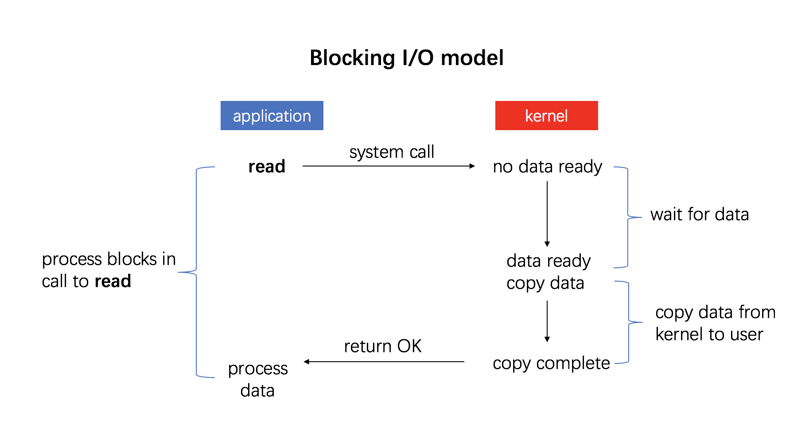
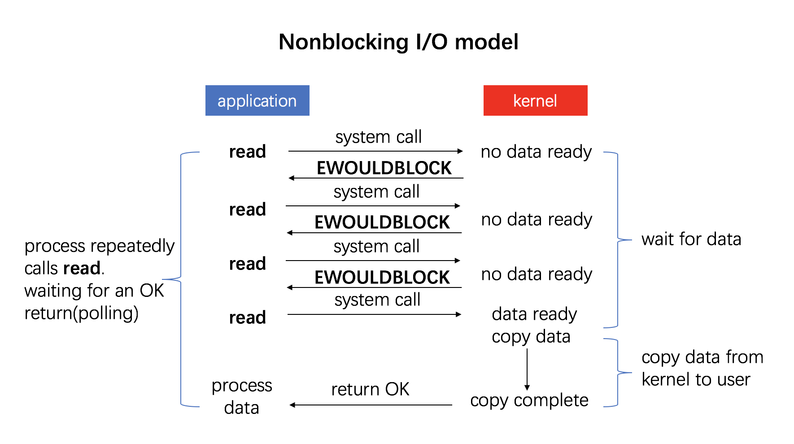
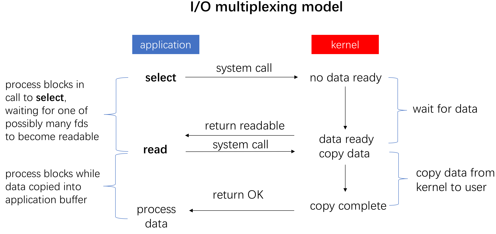
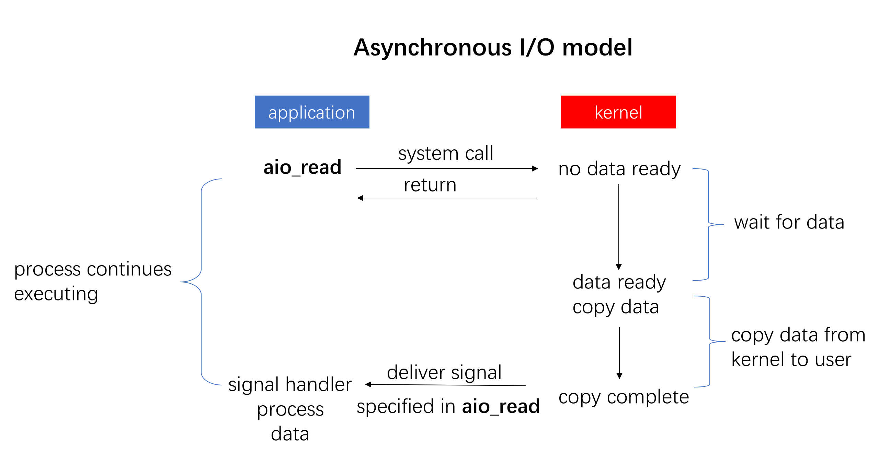

# I/O

[IO - 同步，异步，阻塞，非阻塞](http://liujunming.top/2018/12/26/IO-%E5%90%8C%E6%AD%A5%EF%BC%8C%E5%BC%82%E6%AD%A5%EF%BC%8C%E9%98%BB%E5%A1%9E%EF%BC%8C%E9%9D%9E%E9%98%BB%E5%A1%9E/)

[5 种 I/O 模型](https://zhuanlan.zhihu.com/p/115912936)

[Async I/O on Linux: select, poll, and epoll](https://jvns.ca/blog/2017/06/03/async-io-on-linux--select--poll--and-epoll/)

!!! tldr

    总结几种 I/O 模型。

阻塞

非阻塞

多路复用

异步 I/O
