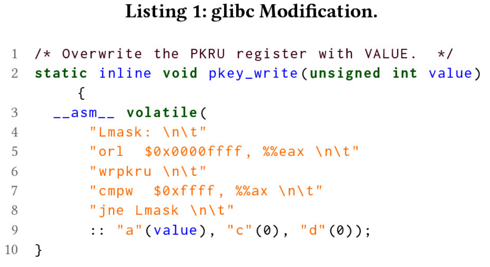
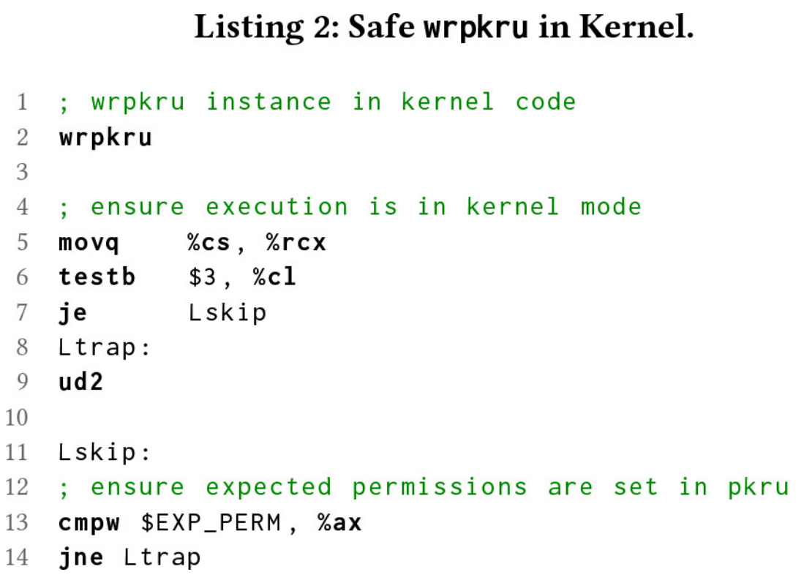
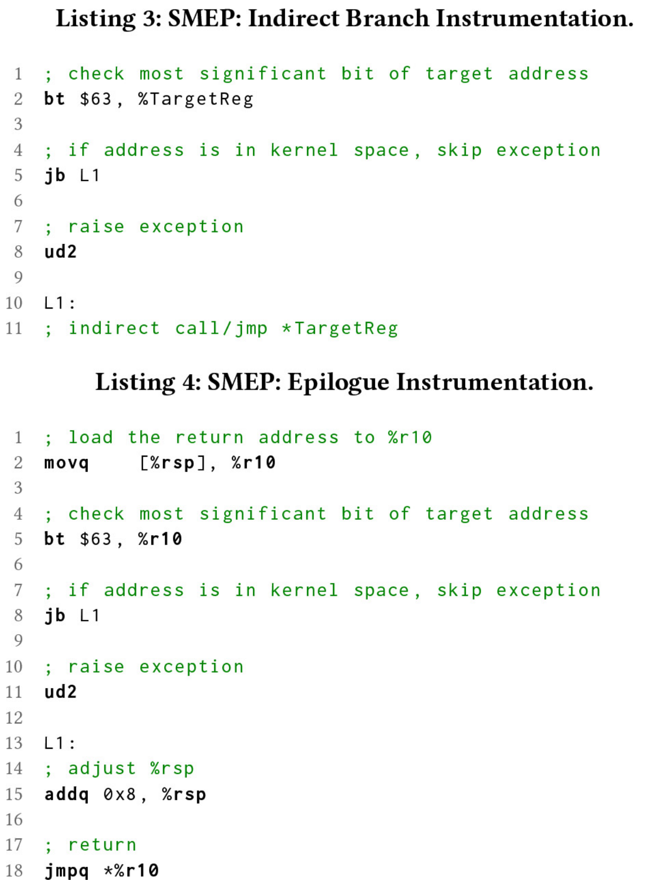
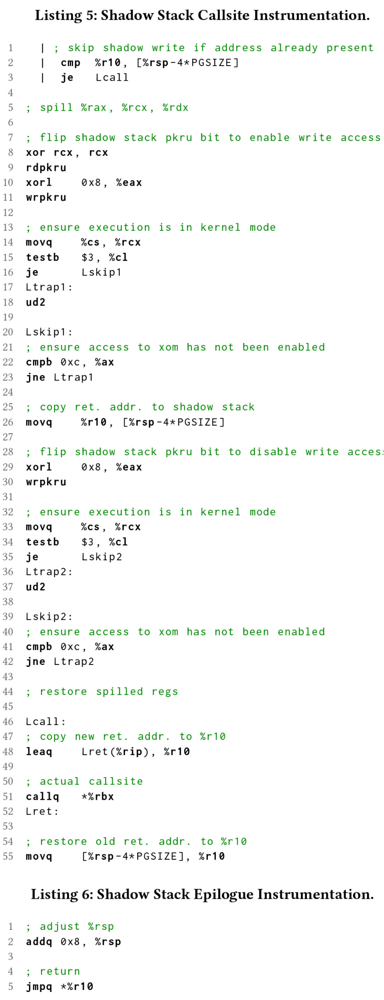

# Fast Intra-kernel Isolation and Security with IskiOS

[pdf]([RAID%202021]%20Fast%20Intra-kernel%20Isolation%20and%20Security%20with%20IskiOS.pdf)

OS 内核易受控制流劫持攻击，相应的防御措施需要高效的地址空间内隔离。本文提出 PKK 机制，将 PKU 用于内核空间，取代传统的 U/S 隔离，提供高效的内核内隔离。实现 Linux 变体 IskiOS，支持仅执行内存和 race-free 影子堆栈。

## Introduction 

CFI 和地址随机化等控制流劫持的防御措施都需要 OS 内核内的高效隔离内存。现有的内核内隔离通常依赖 SFI，执行边界检查，开销较大，灵活性低。而 PKU 仅适用于用户空间。

Protection Keys for Kernelspace, PKK，使用 PKU 硬件，动态禁用运行时内核的读写权限。PKK 开销较低，灵活性高，支持 SMEP 和 SMAP，与 KPTI 兼容。

!!! info

    Intel SDM 中提到了 Protection Keys for Supervisor, PKS，但未明确从哪代处理器开始支持（可能是 12 代，但是在 12 代 i7-12700H 上查看 CPUID 信息并未找到）。本文的 PKK 是在现有的机器上提供类似 PKS 的功能。

基于 PKK 开发的 IskiOS，为 Linux 内核提供仅执行内存 XOM 和写保护影子堆栈。不需要修改虚拟地址空间布局，兼容现有的内核内存分配器。

IskiOS 引入新的调用约定，免疫调用线程中的控制流劫持和跨线程的竞争。同时引入两个新技术来减少 PKU 域切换的频率：影子写优化和激进内联函数。

## Protection Keys for Kernelspace

将所有 PTE 的 U/S 位置位，用 MPK 实现 U/S 位的功能。U/S 位的效果可以通过将用户和内核页分配到不同的保护域模拟，在特权级切换时启用或禁用访问，并阻止在其他时间修改 PKRU。

将页表中所有 PTE 中的 U/S 位置位， 除了用于处理系统调用和中断的跳板页。保留 key 0-7 作为内核 MPK，所有内核内存都分配到这八个 key。在用户模式执行时就禁止读写这些页，切换到内核态时再启用。合法使用 PKU 的用户程序通过 pkey_alloc 从内核获取 key，改为只从 8-15 中分配。

### Controlling Use of WRPKRU

WRPKRU 不是特权指令，用户态也可执行。两方面：限制应用直接修改 PKRU 或跳转到内核中的 WRPKRU。

限制应用 WRPKRU，对于应用内存执行 W^X，可执行的就不可写。当内核将应用可执行页映射到虚拟地址空间时，扫描页内容，如果发现可能的 WRPKRU 指令，就用调试寄存器 DR0-3 监控地址。当取指到目标地址时，就会陷入，可以检查想要修改的 PKRU 值，确保应用不会修改 key 0-7。

观察到合法使用 MPK 的应用大多调用 libc 修改 PKRU，因此修改 glibc 中的 pkey_write 函数，屏蔽低 16 位。

为阻止应用跳转到内核中的 WRPKRU 执行，在内核中的 WRPKRU 指令之后插入特权级检查，确保处理器在 ring 0 执行。

### 兼容 SMEP

SMEP 用于防御 ret2usr 攻击。而 IskiOS 将所有内核内存配置为用户内存，必须关闭硬件的 SMEP。为阻止内核任意执行用户代码，IskiOS 在内核代码中添加控制流检查，针对每个间接控制流转换，确保特权执行仅在内核空间。

### 兼容 SMAP

同样，需要关闭 SMAP。通过禁用内核访问 key 8-15 模拟。

## Enhancing Security with PKK

攻击者是非特权用户，可在用户空间执行任意指令。

### Kernel XOM

代码复用攻击需要内存中代码的位置信息。高级的代码复用攻击利用缓冲区越界读取来找可用的代码。为此，IskiOS 将所有内核和内核模块代码页放在仅执行内存 XOM 区，可以执行而不可读。

将所有内核代码对应的 PTE 分配到保留的 key，并在 PKRU 中禁用访问（AD 置位）。

同时还要保护内核空间物理地址直接映射的部分，也需要使用保留的 key。

### Kernel Shadow Stack

高级代码复用攻击通常修改栈上的返回地址，而影子堆栈通过保护返回地址不被修改防御此类攻击。要求影子堆栈不可访问，且 race free，即不存在攻击者可以在其他核上修改的时间窗口。

影子堆栈的相关实现：通过插桩，在函数入口处复制返回地址到影子堆栈。对此，其他线程可能在 CALL 指令和函数入口之间修改栈上的物理地址。还有方案在函数末尾 RET 验证或从影子堆栈复制返回地址。对此，其他线程可能在验证或复制与函数返回之间修改返回地址。

IskiOS 利用 PKK 结合调用站点修改，提供首个写保护并 race free 的 影子堆栈。

并行影子堆栈，在原位置的固定偏移。分配专用的 key，运行时禁用写访问，需要写入时临时允许。

为避免竞争，修改调用约定，使用寄存器 R10 传递返回地址。函数调用时，首先保存 R10 到影子堆栈，然后将返回地址加载到 R10；函数返回时，跳转到 R10 中的地址，而不是用主栈上的返回地址。

本文的影子堆栈无法使用硬件的返回地址预测器。

## Performance Optimizations

WRPKRU 指令的开销约为 26 个时钟周期，每次向影子堆栈写入返回地址需要两次 WRPKRU。为尽可能地避免开销（WRPKRU 的执行次数），设计了两个优化。

### Shadow Write Optimization

当值已存在时，避免写入影子堆栈。比如，当一个函数调用 20 个其他函数时，只需在第一次调用时保存它的返回地址。同样，使用尾递归的优化的函数，使用 jmp 指令而不是 call 指令，也不需要再写入返回地址。

为此，设计了影子写优化 SWO，IskiOS 向每个调用站点添加代码，先检查要写入的返回地址是否已在影子堆栈中。如果是，则不再写入。减少 WRPKRU 指令会显著提升性能。

### Aggressive Inlining

另一个明显的优化方法时减少函数调用。为此，激进地增加编译器的内联阈值选项，直到未观测到性能提升。

## Implementation

### Kernel Modification

包括三个补丁，分别添加对 PKK、XOM 和影子堆栈的支持。

IskiOS-PKK 为所有虚拟内存启用 PKU 支持。将所有 PTE 中的 U/S 位置位，标记为用户页。将 PKEY 0-7 分配给内核空间，将用户页面的默认 PKEY 从 0 改为 8。默认情况下，内核只能访问 PKEY 0，而用户只能访问 PKEY 8。在进入和退出内核时修改 PKRU。

IskiOS-XOM 将所有内核代码页 PTE 中的 PKEY 改为 1，同时在 PKRU 中禁用对 PKEY 1 页的读写访问。

IskiOS-SS 将内核栈的大小从 16 KB 加倍到 32 KB，高半部分为影子堆栈，使用 PKK 禁止访问。然后修改进入和退出内核代码，以将 PKRU 保存和恢复到影子堆栈。另外，更新汇编代码，符合新的调用约定，更新标准的 CALL_NOSPEC 宏后，还需要手动更新 100 个调用站点。

### Compiler Instrumentation

使用 LLVM 插桩。

要实现 SMEP，要在间接分支和返回指令处插桩。

在 CALL 和 JMP 指令之前使用 BT 指令将目标地址的最高有效位存储到状态寄存器的 CF 标志位。如果地址在内核空间，则继续正常执行，否则会执行未定义的 UD2（0x0f0b）指令，内核崩溃。

在函数末尾，将目标地址加载到 R10，同样进行地址判断，并将 RET 指令替换为 JMP R10。

修改调用站点，将返回地址保存到影子堆栈，在每个函数的末尾使用影子堆栈上的返回值。修改编译器，保留 R10 以支持新的调用约定。

未启用影子写优化 SWO 时，在每个调用站点上使用 WRPKRU 清除 WD 允许写入。然后将返回地址复制到影子堆栈，再执行 WRPKRU 禁用写访问。再调用指令之前，将返回地址加载到 R10。开启 SWO 后，编译器通过简单的检查，确保仅在返回地址与影子栈顶内容不同时才入栈。函数返回时，调整栈指针，然后使用 JMP 跳转到 R10 中的地址。

