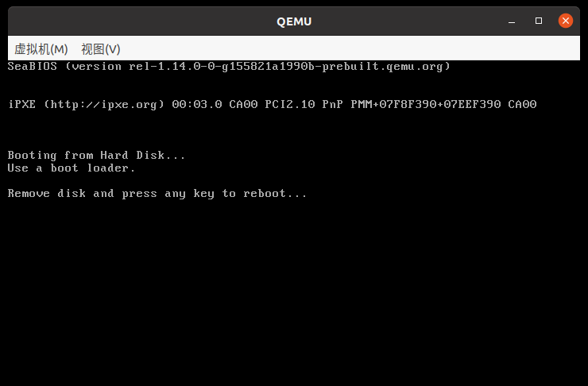

# Linux Kernel Booting Process

[Linux Inside - Booting](https://0xax.gitbooks.io/linux-insides/content/Booting/)

!!! tldr

    内核启动过程，包括：如何解压缩、如何设置页表、64 位启动还是否要从实模式开始、如何使用 bootloader 提供的页表。

通过 [内核构建过程](./kernel_building_process.md) 已经知道实际的启动镜像是 bzImage 而不是 vmlinux，所以启动过程应该是 bootloader 将 bzImage 加载到内存并执行，然后由 bzImage 进行一系列设置并解压缩内核到内存，最后才到后续的初始化工作。

涉及的代码主要在 *arch/x86/boot* 和 *arch/x86/boot/compressed* 目录中。

## From bootloader to kernel

### Poweron

加电后处理器进入 16 位实模式，并将 CS:IP 设置为 0xf000:0xfff0，CS 基地址为 0xffff0000。也就是说第一条指令在 0xfffffff0，称为 reset vector，通常是一个跳转指令。BIOS 在初始化和检查硬件之后，就要从引导设备加载 bootloader，并跳转执行。

### Bootloader

以 grub 为例，由 BIOS 加载的代码只是很小一部分，只做一些必要的初始化，之后就会将 grub core image 加载到内存，跳转到 `grub_main` 执行，进行后续的初始化后，给用户提供选择 OS 菜单，选择后就会开始执行选定的 OS。

[内核启动约定](https://docs.kernel.org/x86/boot.html) 中要求 bootloader 必须读取 kernel setup header（定义在 *arch/x86/boot/header.S*，位于 setup code 偏移 0x1f1），并填充启动约定中要求写入的字段。

```c
// arch/x86/boot/header.S

	.globl	hdr
hdr:
setup_sects:	.byte 0			/* Filled in by build.c */
root_flags:	.word ROOT_RDONLY
syssize:	.long 0			/* Filled in by build.c */
ram_size:	.word 0			/* Obsolete */
vid_mode:	.word SVGA_MODE
root_dev:	.word 0			/* Filled in by build.c */
boot_flag:	.word 0xAA55

// arch/x86/boot/setup.ld
. = ASSERT(hdr == 0x1f1, "The setup header has the wrong offset!");
```

根据启动约定，内核被加载到内存后的内存布局如下：

```
              ~                        ~
              |  Protected-mode kernel |
      100000  +------------------------+
              |  I/O memory hole       |
      0A0000  +------------------------+
              |  Reserved for BIOS     |      Leave as much as possible unused
              ~                        ~
              |  Command line          |      (Can also be below the X+10000 mark)
      X+10000 +------------------------+
              |  Stack/heap            |      For use by the kernel real-mode code.
      X+08000 +------------------------+
              |  Kernel setup          |      The kernel real-mode code.
              |  Kernel boot sector    |      The kernel legacy boot sector.
      X       +------------------------+
              |  Boot loader           |      <- Boot sector entry point 0000:7C00
      001000  +------------------------+
              |  Reserved for MBR/BIOS |
      000800  +------------------------+
              |  Typically used by MBR |
      000600  +------------------------+
              |  BIOS use only         |
      000000  +------------------------+

... where the address X is as low as the design of the boot loader permits.
```

当 bootloader 完成工作后，就要跳转到内核执行，地址为：`X+sizeof(KernelBootSector)+1`。其实就是跳过了已经弃用的内核引导扇区，从 setup 开始执行，X 是 kernel boot sector 的加载地址，其值由具体的 bootloader 决定。

### Kernel Setup

上面提到，在 setup 之前，其实是 linux 自带的 bootloader，现在已经弃用，直接用 bzImage 引导会报错：



报错的提示其实就是写在代码里的，同时为了支持 UEFI 启动，在开始处定义了幻数 MZ 并在之后定义了 PE 头：

```c
// arch/x86/boot/header.S

	.global bootsect_start
bootsect_start:
#ifdef CONFIG_EFI_STUB
	# "MZ", MS-DOS header
	.byte 0x4d
	.byte 0x5a
#endif

...

bugger_off_msg:
	.ascii	"Use a boot loader.\r\n"
	.ascii	"\n"
	.ascii	"Remove disk and press any key to reboot...\r\n"
	.byte	0

...

#ifdef CONFIG_EFI_STUB
pe_header:
	.ascii	"PE"
	.word 	0
```

跳过自带的 bootloader，真正的内核 setup 入口点 `_start` 在偏移 0x200 处，因此其他的 bootloader 就直接跳转到这个位置启动内核，代码如下：

```c
// arch/x86/boot/header.S

	# offset 512, entry point

	.globl	_start
_start:
		# Explicitly enter this as bytes, or the assembler
		# tries to generate a 3-byte jump here, which causes
		# everything else to push off to the wrong offset.
		.byte	0xeb		# short (2-byte) jump
		.byte	start_of_setup-1f
1:
```

`_start` 位置的代码还是一个跳转，紧接其后的标号 1 是剩余的 setup header，跳转指令跳过这部分，就到达了 `start_of_setup`，也就是实际上内核 setup 的开始，主要的工作就是为 C 语言运行准备环境：

- 设置段寄存器；
- 设置堆栈；
- 设置 BSS 段，将其全部清零；
- 跳转到 *arch/x86/boot/main.c* 中的 `main` 函数。

## Kernel setup and transition to protected mode

`main` 函数是第一个用 C 写的函数，要注意的是，处理器现在还是处于实模式（GCC 支持用 C 写实模式的代码），而这个 `main` 函数要做的就是进行一系列准备工作。

- 复制启动参数到 `boot_params` 结构体；
- 初始化控制台，启动参数中有 `earlyprintk` 是要初始化相关的串口；
- 初始化堆；
- 检查 CPU 类型，各种标志位；
- 探测内存布局，使用多种接口 e820、e801、88；
- 初始化键盘；
- 查询系统参数；
- 初始化显示模式；
- 调用 `go_to_protected_mode`。

而这个 `go_to_protected_mode` 将进行最后的准备工作后进入保护模式。

- 关中断，禁用 NMI；
- 使能 A20 地址线，通过多种方式尝试；
- 重置协处理器；
- 屏蔽主从 PIC 的所有中断；
- 设置 IDTR（为空）；
- 设置 GDT，定义了代码段、数据段和 TSS；
- 调用 `protected_mode_jump` 完成从实模式到保护模式的跳转。

`protected_mode_jump` 接受两个参数，保护模式代码入口 `code32_start` 和启动参数 `boot_params` 结构体地址，分别保存在 EAX 和 EDX 中。

- 将数据段索引写入 cx，将 TSS 索引写入 di；
- 设置 CR0.PE 使 CPU 进入保护模式；
- 通过一个长跳转进入 32 位代码；
- （下面就是保护模式代码）
- 将 CS 以外的段寄存器都指向数据段；
- 将 EAX 以外的通用寄存器清零；
- 跳转到 EAX 保存的地址，即传入的代码入口执行，`code32_start` 也是 setup header 中的字段，默认为 0x100000。

其中长跳转的代码如下：

```c
// arch/x86/boot/pmjump.S

	# Transition to 32-bit mode
	.byte	0x66, 0xea		# ljmpl opcode
2:	.long	.Lin_pm32		# offset
	.word	__BOOT_CS		# segment
```

`0x66` 操作符前缀允许混合执行 16 位和 32 位代码，`0xea` 为跳转指令的操作符，`.Lin_pm32` 跳转地址偏移，`__BOOT_CS` 为代码段描述符索引。

## Transition to 64-bit mode

根据内核启动约定，保护模式的内核被加载到 0x100000 处，64 位内核中就是定义在 *arch/x86/boot/compressed/head_64.S* 中的 `startup_32`。

!!! info

    使用 qemu，对 bios 和 uefi 两种 boot 方式分别 dump 物理内存。发现 bios 启动时，内核确实被加载到 0x100000，而在 uefi 启动时，却发现内核被加载到 0x1600200，而且似乎还是恒等映射的虚拟地址（gdb 断到这里之后查看控制寄存器，分页已开）。
 
    uefi 启动下找 startup_32/64 的方法：使用 tcg 而不是 kvm，使用 -d in_asm -D q.log 记录执行的汇编指令，然后按照 *arch/x86/boot/compressed/head_64.S* 中的指令搜索 q.log。

根据链接脚本 *arch/x86/boot/compressed/vmlinux.lds.S* 中的定义，`startup_32` 被放到 *arch/x86/boot/compressed/head_64.S* 的开头，这部分代码是为进入长模式做准备。

- 加载段寄存器，获取 `startup_32` 的加载地址；
- 建立栈；
- 检查 CPU 是否支持长模式，`CPUID` 指令；
- 计算重定位地址 CONFIG_RELOCATABLE，通过编译选项 -fPIC（位置无关代码）实现；
- 更新 GDTR，启用 PAE 模式；
- 初始化页表，2M 大页，映射了 4G 内存，最后将顶级页表基地址写入 CR3；
- 设置 EFER MSR，开启长模式；
- 将 `startup_64` 的地址入栈；
- 设置 CR0，开启分页；
- 执行 `LRET` 指令进入 64 位代码。

## Kernel decompression

`startup_64` 也定义在 *arch/x86/boot/compressed/head_64.S* 中，这部分代码将为进入内核做最后的准备工作。

- 准备内核解压缩，计算重定位地址；
- 复制压缩的内核复制到内存末端，跳转到解压代码；
- 清空 bss 段，然后调用 `extract_kernel` 函数解压内核。

`extract_kernel` 函数定义在 *arch/x86/boot/compressed/misc.c*，接受六个参数（参数都通过寄存器传递，DSDC89）:

- `rmode`：指向 `boot_params` 结构体的指针；
- `heap`：指向早期启动堆的起始地址；
- `input_data`：指向压缩的内核，定义在 *arch/x86/boot/compressed/piggy.S*（在构建过程中生成）文件中；
- `input_len`：压缩内核的大小；
- `output`：解压后内核的起始地址；
- `output_len`：解压后内核的大小。

`extract_kernel` 函数从图形/控制台初始化开始（因为内核不知道是从实模式开始还是直接从 bootloader 跳转过来），然后准备解压工作。

- 初始化堆指针；
- 调用 *arch/x86/boot/compressed/kaslr.c* 中的 `choose_random_location` 函数，选择内存镜像的地址；
- 检查，确保随机地址对齐；
- 调用 `__decompress` 函数，使用编译时指定的算法进行解压；
- 调用 `parse_elf` 解析解压后的内核，将各段加载到随机地址；
- 调用 `handle_relocations` 根据内核配置调整内核镜像的地址；
- 返回内核地址到 RAX。

最后，通过一个跳转指令就进入到内核中执行。


## KASLR

!!! todo

    KASLR 的过程以后有时间再看。

## The way to start_kernel

内核解压缩后，跳转到 *arch/x86/kernel/head_64.S* 中的 `startup_64` 中执行，到这里一直到 *init/main.c* 中的 `start_kernel` 的函数调用流程如下。

```c
// arch/x86/kernel/head_64.S
startup_64 ->
  // arch/x86/kernel/head64.c
  __startup_64
  early_idt_setup_early_handler
  x86_64_start_kernel ->
    x86_64_start_reservations ->
      // init/main.c
      start_kernel ->
        // arch/x86/setup.c
        setup_arch
        // init/main.c
        mm_init
        ...
```