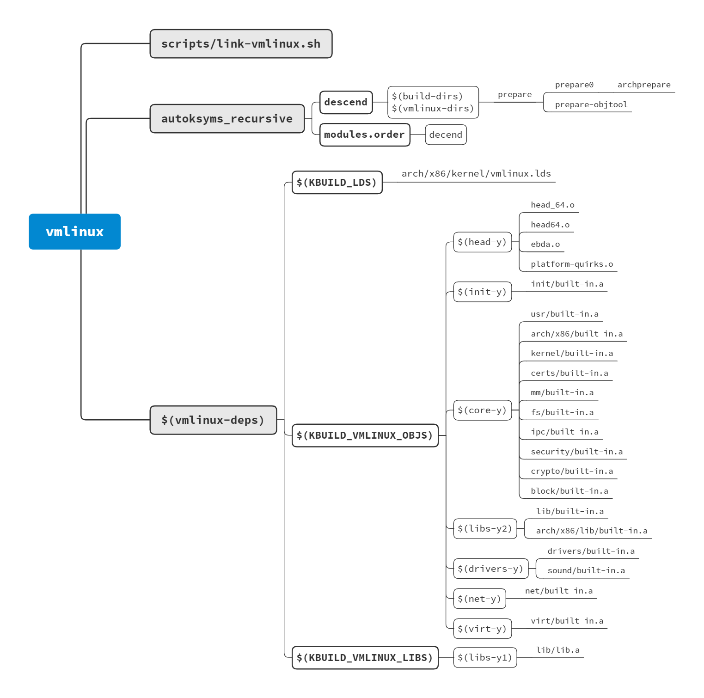

# Linux Kernel Building Process

[Kernel Exploring - 老司机带你探索内核编译系统](https://richardweiyang-2.gitbook.io/kernel-exploring/00_index)

[内核编译的背后](https://yunyanan.github.io/exploring_kbuild/)

!!! tldr

    按照 nested kernel 原论文的实现思路，由 nested kernel 进行系统初始化，创建页表并设置为只读后，再执行 outer kernel。而对于 linux kernel，能否采用这种实现方式，需要了解其编译构建过程。

内核编译过很多次，通过几篇内核编译系统相关的文章，了解以下几个方面的内容：

- 内核的构造，如何从各种复杂的子系统生成最终的单个二进制文件；
- 如何生成启动镜像 bzImage；
- 编译链接与内核启动过程的联系。

## Kernel Make Tips

内核编译流程无非就是设置好 *.config* 之后执行 `make -j$(nproc)`，然后 `make install` 或使用 `make bindeb-pkg` 直接生成可安装的 deb 包。

内核 Makefile 中的默认目标 all 在 x86 平台主要包含 vmlinux、modules 和 bzImage。vmlinux 就是源码根目录下的那个，modules 就是各种内核模块，而 bzImage，简单理解就是 elf 加载器以及压缩后的 vmlinux。

make 指定路径可以只编译小部分代码：

```shell
$ make M=/path/to/module
$ make /path/to/object.o
$ make /path/to/preprocess.i  # 指定文件预处理后的代码
$ make /path/to/asm.s         # 指定文件的汇编代码
```

`make FDARGS=<kernel-params> FDINITRD=<path/to/initrd> isoimage` 可以生成包含内核的可启动 iso 镜像。

## 内核文件 vmlinux 的生成过程

首先在 Makefile 中找到 `vmlinux` 目标的定义：

```makefile
# Kernel 5.6.0 Makefile

# Final link of vmlinux with optional arch pass after final link
cmd_link-vmlinux =                                                 \
	$(CONFIG_SHELL) $< $(LD) $(KBUILD_LDFLAGS) $(LDFLAGS_vmlinux) ;    \
	$(if $(ARCH_POSTLINK), $(MAKE) -f $(ARCH_POSTLINK) $@, true)

vmlinux: scripts/link-vmlinux.sh autoksyms_recursive $(vmlinux-deps) FORCE
	+$(call if_changed,link-vmlinux)

# scripts/Kbuild.include

cmd = @set -e; $(echo-cmd) $(cmd_$(1))

if_changed = $(if $(newer-prereqs)$(cmd-check),                              \
	$(cmd);                                                              \
	printf '%s\n' 'cmd_$@ := $(make-cmd)' > $(dot-target).cmd, @:)
```

生成 `vmlinux` 的过程就是将目标文件链接到一起的过程，调用 *scripts/Kbuild.include* 中定义的 `if_changed`，满足条件就调用拼接成的 `cmd_link-vmlinux`，将第一个依赖 *scripts/link-vmlinux.sh* 传给 shell 执行。

`vmlinux` 之后的两个依赖，其中 `autoksyms_recursive` 主要是做一些编译前的准备工作，定义如下：

```makefile
PHONY += autoksyms_recursive
ifdef CONFIG_TRIM_UNUSED_KSYMS
autoksyms_recursive: descend modules.order
	$(Q)$(CONFIG_SHELL) $(srctree)/scripts/adjust_autoksyms.sh \
	  "$(MAKE) -f $(srctree)/Makefile vmlinux"
endif
```

一般来说 `CONFIG_TRIM_UNUSED_KSYMS` 是未定义的，所以也不会执行这里的命令。依赖中的 `descend` 与后面其实是重复的，不太懂为什么要这样写，而 `modules.order` 目标主要是生成用来记录编译的外部模块的 *Modules.order* 文件，供 `modprobe` 命令加载和卸载模块使用。

而另一个依赖 `$(vmlinux-deps)` 是负责源码编译依赖，定义如下：

```makefile
# Makefile

include arch/$(SRCARCH)/Makefile

# Externally visible symbols (used by link-vmlinux.sh)
export KBUILD_VMLINUX_OBJS := $(head-y) $(init-y) $(core-y) $(libs-y2) \
			      $(drivers-y) $(net-y) $(virt-y)
export KBUILD_VMLINUX_LIBS := $(libs-y1)
export KBUILD_LDS          := arch/$(SRCARCH)/kernel/vmlinux.lds

vmlinux-deps := $(KBUILD_LDS) $(KBUILD_VMLINUX_OBJS) $(KBUILD_VMLINUX_LIBS)
```

可以看到，`vmlinux-deps` 其实就是链接文件、目标文件和库文件的集合。`$(KBUILD_VMLINUX_OBJS)` 就是所有内核子系统的根目标，具体展开如下：

```makefile
# arch/x86/Makefile

# Kernel objects

head-y := arch/x86/kernel/head_$(BITS).o
head-y += arch/x86/kernel/head$(BITS).o
head-y += arch/x86/kernel/ebda.o
head-y += arch/x86/kernel/platform-quirks.o

libs-y  += arch/x86/lib/

# See arch/x86/Kbuild for content of core part of the kernel
core-y += arch/x86/

# drivers-y are linked after core-y
drivers-$(CONFIG_MATH_EMULATION) += arch/x86/math-emu/
drivers-$(CONFIG_PCI)            += arch/x86/pci/

# must be linked after kernel/
drivers-$(CONFIG_OPROFILE) += arch/x86/oprofile/

# suspend and hibernation support
drivers-$(CONFIG_PM) += arch/x86/power/

drivers-$(CONFIG_FB) += arch/x86/video/

# Makefile 

ifeq ($(KBUILD_EXTMOD),)
# Objects we will link into vmlinux / subdirs we need to visit
init-y		:= init/
drivers-y	:= drivers/ sound/
drivers-$(CONFIG_SAMPLES) += samples/
net-y		:= net/
libs-y		:= lib/
core-y		:= usr/
virt-y		:= virt/
endif # KBUILD_EXTMOD

ifeq ($(KBUILD_EXTMOD),)
core-y		+= kernel/ certs/ mm/ fs/ ipc/ security/ crypto/ block/

init-y		:= $(patsubst %/, %/built-in.a, $(init-y))
core-y		:= $(patsubst %/, %/built-in.a, $(core-y))
drivers-y	:= $(patsubst %/, %/built-in.a, $(drivers-y))
net-y		:= $(patsubst %/, %/built-in.a, $(net-y))
libs-y1		:= $(patsubst %/, %/lib.a, $(libs-y))
libs-y2		:= $(patsubst %/, %/built-in.a, $(filter-out %.a, $(libs-y)))
virt-y		:= $(patsubst %/, %/built-in.a, $(virt-y))
```

而 `vmlinux-deps` 中的变量，都依赖于 `descend`，最终为 `vmlinux-dirs` 中的值：

```makefile
# Makefile

# The actual objects are generated when descending,
# make sure no implicit rule kicks in
$(sort $(vmlinux-deps)): descend ;

vmlinux-dirs	:= $(patsubst %/,%,$(filter %/, $(init-y) $(init-m) \
		     $(core-y) $(core-m) $(drivers-y) $(drivers-m) \
		     $(net-y) $(net-m) $(libs-y) $(libs-m) $(virt-y)))

build-dirs	:= $(vmlinux-dirs)

descend: $(build-dirs)
$(build-dirs): prepare
	$(Q)$(MAKE) $(build)=$@ \
	single-build=$(if $(filter-out $@/, $(filter $@/%, $(single-no-ko))),1) \
	need-builtin=1 need-modorder=1
```

而 `$(build-dirs)` 目标的规则最终执行的命令是 `make -f scripts/Makefile.build obj=$@\` 也就是到各个目录中执行编译。

而在所有子系统的根目标都编译完成后，就要把它们链接起来生成 vmlinux，由 *scripts/link-vmlinux.sh* 完成。



## 启动镜像 bzImage 的生成过程

编译完内核后，下一步就是要用 `make install` 安装内核，而 `intall` 目标的规则是在 *arch/x86/Makefile* 中定义的：

```makefile
# arch/x86/Makefile

boot := arch/x86/boot
install:
	$(Q)$(MAKE) $(build)=$(boot) $@
```

这里执行的命令是 `make -f scripts/Makefile.build obj=arch/x86/boot install`，最终执行 *arch/x86/boot/Makefile* 中的 `install` 目标：

```makefile
# arch/x86/boot/Makefile

install:
	sh $(srctree)/$(src)/install.sh $(KERNELRELEASE) $(obj)/bzImage \
		System.map "$(INSTALL_PATH)"
```

而在安装脚本 *arch/x86/boot/install.sh* 中，执行 `cat $2 > $4/vmlinuz` 命令，将 *arch/x86/boot/bzImage* 复制到安装路径。

而 `bzImage` 目标的生成规则定义在 *arch/x86/Makefile* 中：

```makefile
# arch/x86/Makefile

# Default kernel to build
all: bzImage

# KBUILD_IMAGE specify target image being built
KBUILD_IMAGE := $(boot)/bzImage

bzImage: vmlinux
ifeq ($(CONFIG_X86_DECODER_SELFTEST),y)
	$(Q)$(MAKE) $(build)=arch/x86/tools posttest
endif
	$(Q)$(MAKE) $(build)=$(boot) $(KBUILD_IMAGE)
	$(Q)mkdir -p $(objtree)/arch/$(UTS_MACHINE)/boot
	$(Q)ln -fsn ../../x86/boot/bzImage $(objtree)/arch/$(UTS_MACHINE)/boot/$@
```

执行的命令为 `make -f scripts/Makefile.build obj=arch/x86/boot arch/x86/boot/bzImage`，即执行 *arch/x86/boot/Makefile* 中的 `arch/x86/boot/bzImage` 目标：

```makefile
# arch/x86/boot/Makefile

quiet_cmd_image = BUILD   $@
silent_redirect_image = >/dev/null
cmd_image = $(obj)/tools/build $(obj)/setup.bin $(obj)/vmlinux.bin \
			       $(obj)/zoffset.h $@ $($(quiet)redirect_image)

$(obj)/bzImage: $(obj)/setup.bin $(obj)/vmlinux.bin $(obj)/tools/build FORCE
	$(call if_changed,image)
	@$(kecho) 'Kernel: $@ is ready' ' (#'`cat .version`')'
```

到这里就看懂了，就是用 *$(obj)tools/build* 工具生成 bzImage，依赖的文件是 *setup.bin* 和 *vmlinux.bin*，构建命令的格式为 `build setup vmlinux zoffset.h bzImage`。

*$(obj)tools/build* 的代码在 *arch/x86/boot/tools/build.c*，关键部分如下：

```c
  // open bzImage
  dest = fopen(argv[4], "w");

	// read setup.bin
	file = fopen(argv[1], "r");
	c = fread(buf, 1, sizeof(buf), file);

  // read vmlinux.bin
  fd = open(argv[2], O_RDONLY);
	kernel = mmap(NULL, sz, PROT_READ, MAP_SHARED, fd, 0);

  // write setup.bin to bzImage
  if (fwrite(buf, 1, i, dest) != i)
		die("Writing setup failed");

  // write vmlinux.bin to bzImage
  if (fwrite(kernel, 1, sz, dest) != sz)
		die("Writing kernel failed");
```

大概的流程就是打开 *bzImage*，然后将 *setup.bin* 和 *vmlinux.bin* （经过何种处理后）写入 *bzImage*。

下面继续探究 bzImage 的两个依赖 `setup.bin` 和 `vmlinux.bin` 的生成过程。

### setup.bin 的生成过程

`setup.bin` 目标的规则定义在 *arch/x86/boot/Makefile* 中：

```makefile
# arch/x86/boot/Makefile

OBJCOPYFLAGS_setup.bin	:= -O binary
$(obj)/setup.bin: $(obj)/setup.elf FORCE
	$(call if_changed,objcopy)
```

`if_changed` 在前面遇到过，满足条件会调用拼接的 `cmd_objcopy`，定义在 *scripts/Makefile.lib* 中：

```makefile
# scripts/Makefile.lib

# Objcopy
# ---------------------------------------------------------------------------

quiet_cmd_objcopy = OBJCOPY $@
cmd_objcopy = $(OBJCOPY) $(OBJCOPYFLAGS) $(OBJCOPYFLAGS_$(@F)) $< $@
```

也就是说，`setup.bin` 是由 `setup.elf` 目标经 `objcopy` 得到的，而 `setup.elf` 目标的定义：

```makefile
# arch/x86/boot/Makefile

setup-y		+= a20.o bioscall.o cmdline.o copy.o cpu.o cpuflags.o cpucheck.o
setup-y		+= early_serial_console.o edd.o header.o main.o memory.o
setup-y		+= pm.o pmjump.o printf.o regs.o string.o tty.o video.o
setup-y		+= video-mode.o version.o
setup-$(CONFIG_X86_APM_BOOT) += apm.o

# The link order of the video-*.o modules can matter.  In particular,
# video-vga.o *must* be listed first, followed by video-vesa.o.
# Hardware-specific drivers should follow in the order they should be
# probed, and video-bios.o should typically be last.
setup-y		+= video-vga.o
setup-y		+= video-vesa.o
setup-y		+= video-bios.o

SETUP_OBJS = $(addprefix $(obj)/,$(setup-y))

LDFLAGS_setup.elf	:= -m elf_i386 -T
$(obj)/setup.elf: $(src)/setup.ld $(SETUP_OBJS) FORCE
	$(call if_changed,ld)
```

总结，*setup.bin* 是从各种目标文件链接成 *setup.elf* 再 objcopy 生成的。

### vmlinux.bin 的生成过程

类似地，`vmlinux.bin` 目标的规则定义：

```makefile
# arch/x86/boot/Makefile

$(obj)/compressed/vmlinux: FORCE
	$(Q)$(MAKE) $(build)=$(obj)/compressed $@

OBJCOPYFLAGS_vmlinux.bin := -O binary -R .note -R .comment -S
$(obj)/vmlinux.bin: $(obj)/compressed/vmlinux FORCE
	$(call if_changed,objcopy)
```

同样，`vmlinux.bin` 也是 `objcopy` 得到的，只不过它依赖的是 `$(obj)/compressed/vmlinux`，执行 `make -f scripts/Makefile.build obj=arch/x86/boot/compressed arch/x86/boot/compressed/vmlinux`，目标的规则定义如下：

```makefile
# arch/x86/boot/compressed/Makefile

vmlinux-objs-y := $(obj)/vmlinux.lds $(obj)/kernel_info.o $(obj)/head_$(BITS).o \
	$(obj)/misc.o $(obj)/string.o $(obj)/cmdline.o $(obj)/error.o \
	$(obj)/piggy.o $(obj)/cpuflags.o

$(obj)/vmlinux: $(vmlinux-objs-y) FORCE
	$(call if_changed,check-and-link-vmlinux)
```

也就是要将 `vmlinux-objs-y` 中的所有目标都链接到一起。乍一看并没有发现 vmlinux.bin 的依赖与根目录 vmlinux 有什么关系，那内核代码是如何加载到 bzImage 中？

逐个查看依赖，发现这个 `$(obj)/piggy.o` 似乎比较神奇，其对应的源码文件 *arch/x86/boot/compressed/piggy.S* 竟然是编译时才生成的？！！！：

```makefile
# arch/x86/boot/compressed/Makefile

hostprogs	:= mkpiggy

suffix-$(CONFIG_KERNEL_GZIP)	:= gz
suffix-$(CONFIG_KERNEL_BZIP2)	:= bz2
suffix-$(CONFIG_KERNEL_LZMA)	:= lzma
suffix-$(CONFIG_KERNEL_XZ)	:= xz
suffix-$(CONFIG_KERNEL_LZO) 	:= lzo
suffix-$(CONFIG_KERNEL_LZ4) 	:= lz4

quiet_cmd_mkpiggy = MKPIGGY $@
      cmd_mkpiggy = $(obj)/mkpiggy $< > $@

targets += piggy.S
$(obj)/piggy.S: $(obj)/vmlinux.bin.$(suffix-y) $(obj)/mkpiggy FORCE
	$(call if_changed,mkpiggy)
```

`$(obj)/piggy.S` 目标的依赖有 `vmlinux.bin.gz`（此处以 gz 为例，实际后缀会根据 *.config* 中指定的内核压缩算法取值）和 `$(obj)/mkpiggy`。而 `mkpiggy` 目标被添加到 `hostprogs` 中。

[hostprogs](https://www.kernel.org/doc/html/latest/kbuild/makefiles.html#host-program-support) 是内核提供的机制，支持构建在编译阶段使用的可执行文件，将目标程序添加到 hostprogs 中，并添加对目标程序的显式依赖。

因此，在此处，生成 `piggy.S` 目标时，就会编译 *mkpiggy.c*，执行 `mkpiggy vmlinux.bin.gz > piggy.S` 生成 *piggy.S* 文件，其内容为：

```assembly
.section ".rodata..compressed","a",@progbits
.globl z_input_len
z_input_len = 11843278
.globl z_output_len
z_output_len = 53909412
.globl input_data, input_data_end
input_data:
.incbin "arch/x86/boot/compressed/vmlinux.bin.gz"
input_data_end:
```

而其中的 `incbin` 的作用，就是在汇编中直接包含一个文件，amazing!

那么下面再来看 `vmlinux.bin.gz` 目标的定义：

```makefile
# arch/x86/boot/compressed/Makefile

OBJCOPYFLAGS_vmlinux.bin :=  -R .comment -S
$(obj)/vmlinux.bin: vmlinux FORCE
	$(call if_changed,objcopy)

vmlinux.bin.all-y := $(obj)/vmlinux.bin
vmlinux.bin.all-$(CONFIG_X86_NEED_RELOCS) += $(obj)/vmlinux.relocs

$(obj)/vmlinux.bin.gz: $(vmlinux.bin.all-y) FORCE
	$(call if_changed,gzip)

# scripts/Makefile.lib
# Gzip
# ---------------------------------------------------------------------------

quiet_cmd_gzip = GZIP    $@
      cmd_gzip = cat $(real-prereqs) | gzip -n -f -9 > $@
```

可以看到，*vmlinux.bin.gz* 就是由根目录的 *vmlinux* 经 objcopy 得到的 *vmlinux.bin* 再压缩生成的。

总结，*vmlinux.bin* 是将压缩后的内核代码 *vmlinux.bin.gz* 包含在 *piggy.S* 中，生成目标 *piggy.o*，再与其他几个目标文件链接到一起，后经 `objcopy` 得到的。

## 内核编译架构

内核源码树的每个层次目录中的 Makefile 中定义好相应的目标，如果有下一层，就“进入”下一层继续编译，主要与 *scripts/Makefile.build* 文件相关。

参考上面的 `$(Q)$(MAKE) $(build)=`，其中 build 在 *scripts/Kbuild.include* 中定义为 `build := -f $(srctree)/scripts/Makefile.build obj`。

要注意的是，在内核编译过程中，当前目录始终是源码根目录，对于不同路径下目标的编译是通过 `$(obj)` 变量实现的。

## 重要的规则

### if_changed

这条规则用于判断依赖是否更新，非常常见，定义在 *scripts/Kbuild.include* 中：

```makefile
cmd = @set -e; $(echo-cmd) $(cmd_$(1))

# Execute command if command has changed or prerequisite(s) are updated.
if_changed = $(if $(newer-prereqs)$(cmd-check),                              \
	$(cmd);                                                              \
	printf '%s\n' 'cmd_$@ := $(make-cmd)' > $(dot-target).cmd, @:)
```

调用 `if` 函数，条件为真执行第一行，为假执行第二行。

判断条件为 `$(newer-prereqs)$(cmd-check)`，这两个的定义为：

```makefile
newer-prereqs = $(filter-out $(PHONY),$?)

ifneq ($(KBUILD_NOCMDDEP),1)
# Check if both commands are the same including their order. Result is empty
# string if equal. User may override this check using make KBUILD_NOCMDDEP=1
cmd-check = $(filter-out $(subst $(space),$(space_escape),$(strip $(cmd_$@))), \
                         $(subst $(space),$(space_escape),$(strip $(cmd_$1))))
else
cmd-check = $(if $(strip $(cmd_$@)),,1)
endif
```

第一个好理解，就是判断是否有比目标更新的依赖。第二个似乎是要比较两个字符串，`$1` 应该是函数的第一个参数，`$@` 是目标，以 `$(obj)/bzImage` 的规则为例：

```makefile
$(obj)/bzImage: $(obj)/setup.bin $(obj)/vmlinux.bin $(obj)/tools/build FORCE
	$(call if_changed,image)
	@$(kecho) 'Kernel: $@ is ready' ' (#'`cat .version`')'
```

也就是要比较 `cmd_image` 和 `cmd_arch/x86/boot/bzImage` 的值，而后者的值，定义在编译生成的 *arch/x86/boot/.bzImage.cmd* 中（稍后就知道它是怎么生成的了）。

因此，`if_changed` 在判断如果有依赖更新或命令变化后，会执行后面的命令：

```makefile
	@set -e; $(echo-cmd) $(cmd_$(1));                                                              \
	printf '%s\n' 'cmd_$@ := $(make-cmd)' > $(dot-target).cmd, @:)

# Name of target with a '.' as filename prefix. foo/bar.o => foo/.bar.o
dot-target = $(dir $@).$(notdir $@)
```

`echo-cmd` 就是输出内容，`cmd_$1` 就是真正要执行的命令，而 `$(dot-target).cmd` 就是刚才看的保存 `cmd_$@` 命令的文件。

而刚生成的 *.cmd* 文件是如何包含进来的，在 *Makefile* 中有：

```makefile
# read saved command lines for existing targets
existing-targets := $(wildcard $(sort $(targets)))

-include $(foreach f,$(existing-targets),$(dir $(f)).$(notdir $(f)).cmd)
```

include 了所有的目标对应的 *.cmd*。

## 特殊的目标和变量

### FORCE 目标

很多目标的依赖中都包含 `FORCE`，内核使用它来强制执行规则。`FORCE` 目标定义在 *Makefile* 中：

```makefile
PHONY += FORCE
FORCE:

# Declare the contents of the PHONY variable as phony.  We keep that
# information in a variable so we can use it in if_changed and friends.
.PHONY: $(PHONY)
```

看起来 `FORCE` 就是一个没有依赖也没有命令的规则。如果将它放在某个目标的依赖中，则这个目标一定会被重新生成。

还是用 `$(obj)/bzImage` 目标举例：

```makefile
$(obj)/bzImage: $(obj)/setup.bin $(obj)/vmlinux.bin $(obj)/tools/build FORCE
	$(call if_changed,image)
	@$(kecho) 'Kernel: $@ is ready' ' (#'`cat .version`')'
```

正常情况下，`make bzImage`，这条规则会被执行，如果所有的依赖都没有更新，只会输出 Kernel ready。而如果将 `FORCE` 从依赖中删除，当其他依赖没有更新时，就不会输出提示。

### existing_targets

在 *Makefile* 和 *scripts/Makefile.build* 中都有定义：

```makefile
# Read all saved command lines and dependencies for the $(targets) we
# may be building above, using $(if_changed{,_dep}). As an
# optimization, we don't need to read them if the target does not
# exist, we will rebuild anyway in that case.

existing-targets := $(wildcard $(sort $(targets)))

-include $(foreach f,$(existing-targets),$(dir $(f)).$(notdir $(f)).cmd)
```

## 重要的文件和关系

### Makefile.build

*scripts/Makefile.build* 是整个编译中，具体执行动作的核心文件，上面已经多次提到，在 *scripts/Kbuild.include* 中定义了 `build`：

```makefile
###
# Shorthand for $(Q)$(MAKE) -f scripts/Makefile.build obj=
# Usage:
# $(Q)$(MAKE) $(build)=dir
build := -f $(srctree)/scripts/Makefile.build obj
```

下面就简单看一下 *scripts/Makefile.build* 文件的内容。

首先是初始化各种变量：

```makefile
# Init all relevant variables used in kbuild files so
# 1) they have correct type
# 2) they do not inherit any value from the environment
obj-y :=
obj-m :=
...
```

然后引用相关文件，包括 *scripts/Kbuild.include* 和目标目录下的 kbuild 和 makefile。引用 *scripts/Makefile.lib*，包含对 `obj-y`、`obj-m` 变量的处理，一些编译链接选项变量定义和一些规则。

```makefile
include scripts/Kbuild.include

# The filename Kbuild has precedence over Makefile
kbuild-dir := $(if $(filter /%,$(src)),$(src),$(srctree)/$(src))
kbuild-file := $(if $(wildcard $(kbuild-dir)/Kbuild),$(kbuild-dir)/Kbuild,$(kbuild-dir)/Makefile)
include $(kbuild-file)

include scripts/Makefile.lib
```

而在 *scripts/Makefile.lib* 中有关于子目录的相关处理：

```makefile
# scripts/Makefile.lib

# Handle objects in subdirs
# ---------------------------------------------------------------------------
# o if we encounter foo/ in $(obj-y), replace it by foo/built-in.a
#   and add the directory to the list of dirs to descend into: $(subdir-y)
# o if we encounter foo/ in $(obj-m), remove it from $(obj-m)
#   and add the directory to the list of dirs to descend into: $(subdir-m)
__subdir-y	:= $(patsubst %/,%,$(filter %/, $(obj-y)))
subdir-y	+= $(__subdir-y)
__subdir-m	:= $(patsubst %/,%,$(filter %/, $(obj-m)))
subdir-m	+= $(__subdir-m)
ifdef need-builtin
obj-y		:= $(patsubst %/, %/built-in.a, $(obj-y))
else
obj-y		:= $(filter-out %/, $(obj-y))
endif
obj-m		:= $(filter-out %/, $(obj-m))

# Subdirectories we need to descend into
subdir-ym	:= $(sort $(subdir-y) $(subdir-m))
```

在 *scripts/Makefile.bulid* 中，会进入到下一层目录编译：

```makefile
# Descending
# ---------------------------------------------------------------------------

PHONY += $(subdir-ym)
$(subdir-ym):
	$(Q)$(MAKE) $(build)=$@ \
	$(if $(filter $@/, $(KBUILD_SINGLE_TARGETS)),single-build=) \
	need-builtin=$(if $(filter $@/built-in.a, $(subdir-obj-y)),1) \
	need-modorder=$(if $(need-modorder),$(if $(filter $@/modules.order, $(modorder)),1))

```

回到 *scripts/Makefile.build*，定义了默认目标 `__build`，将 `make` 要做的工作都放在依赖里：

```makefile
PHONY := __build
__build:


__build: $(if $(KBUILD_BUILTIN),$(builtin-target) $(lib-target) $(extra-y)) \
	 $(if $(KBUILD_MODULES),$(obj-m) $(mod-targets) $(modorder-target)) \
	 $(subdir-ym) $(always-y)
	@:
```

后面就是一些编译规则，比如如何编译出一个 *.o* 文件：

```makefile
# Built-in and composite module parts
$(obj)/%.o: $(src)/%.c $(recordmcount_source) $(objtool_dep) FORCE
	$(call cmd,force_checksrc)
	$(call if_changed_rule,cc_o_c)
```

再比如将多个 *.o* 文件编译成 *built-in.a* 文件：

```makefile
#
# Rule to compile a set of .o files into one .a file (without symbol table)
#
ifdef builtin-target

quiet_cmd_ar_builtin = AR      $@
      cmd_ar_builtin = rm -f $@; $(AR) cDPrST $@ $(real-prereqs)

$(builtin-target): $(real-obj-y) FORCE
	$(call if_changed,ar_builtin)

targets += $(builtin-target)
endif # builtin-target
```

鉴于 *scripts/Makefile.build* 文件的重要性，如果想调试编译某个目标的过程，可以修改规则，指向一个自定义的 *Makefile.build* 在其中修改以添加调试输出。