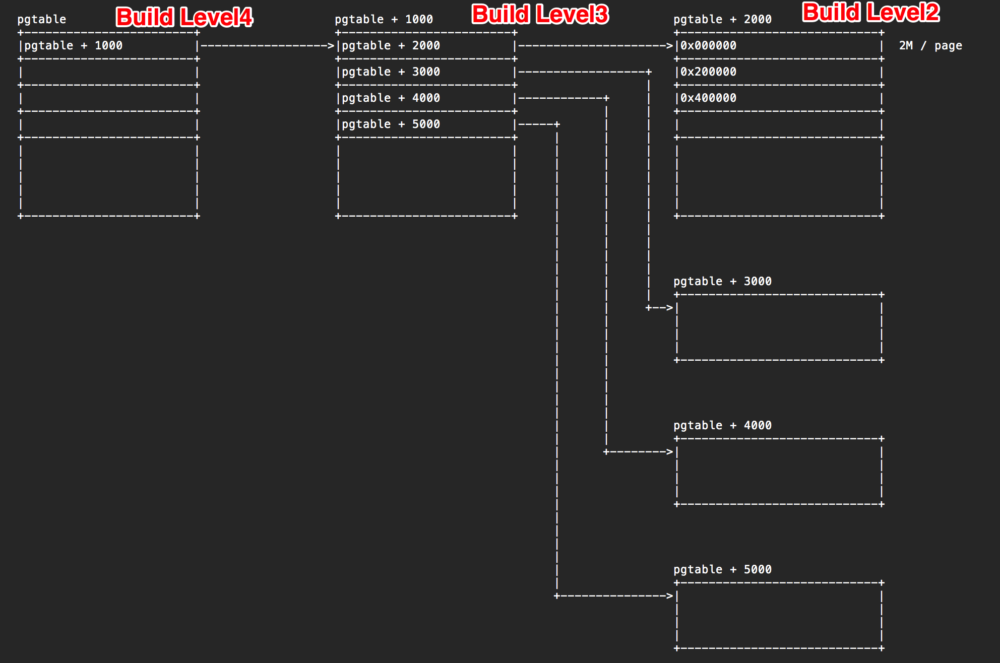
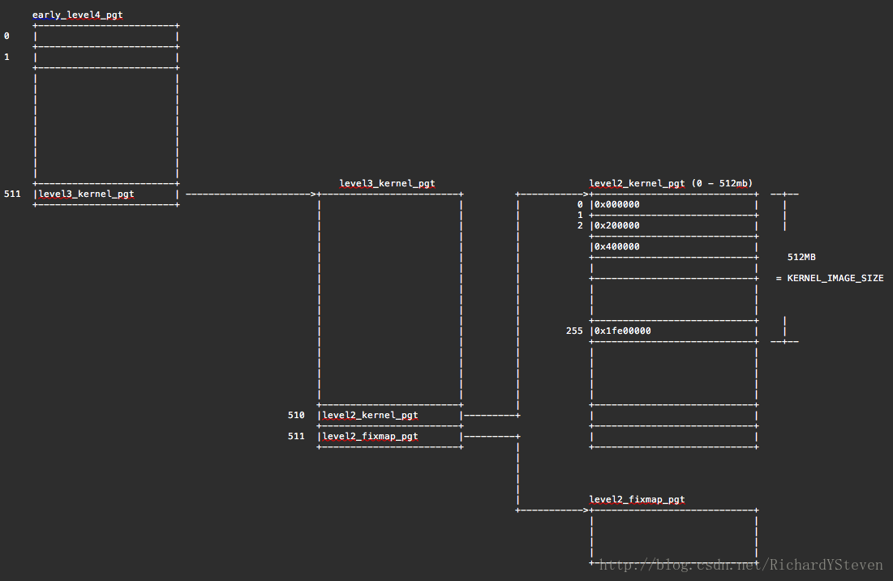
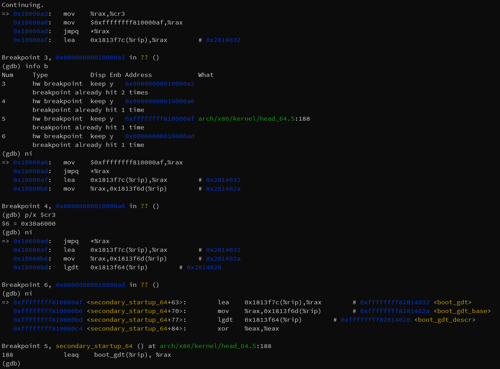
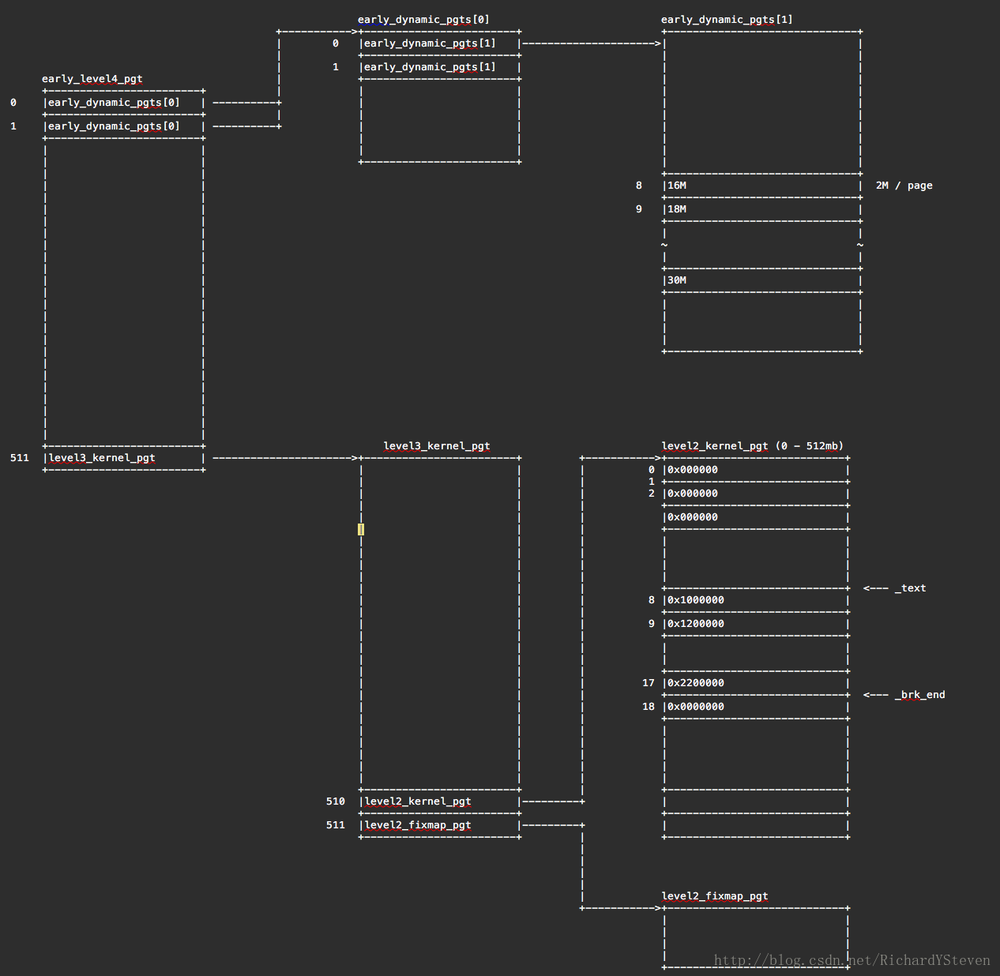
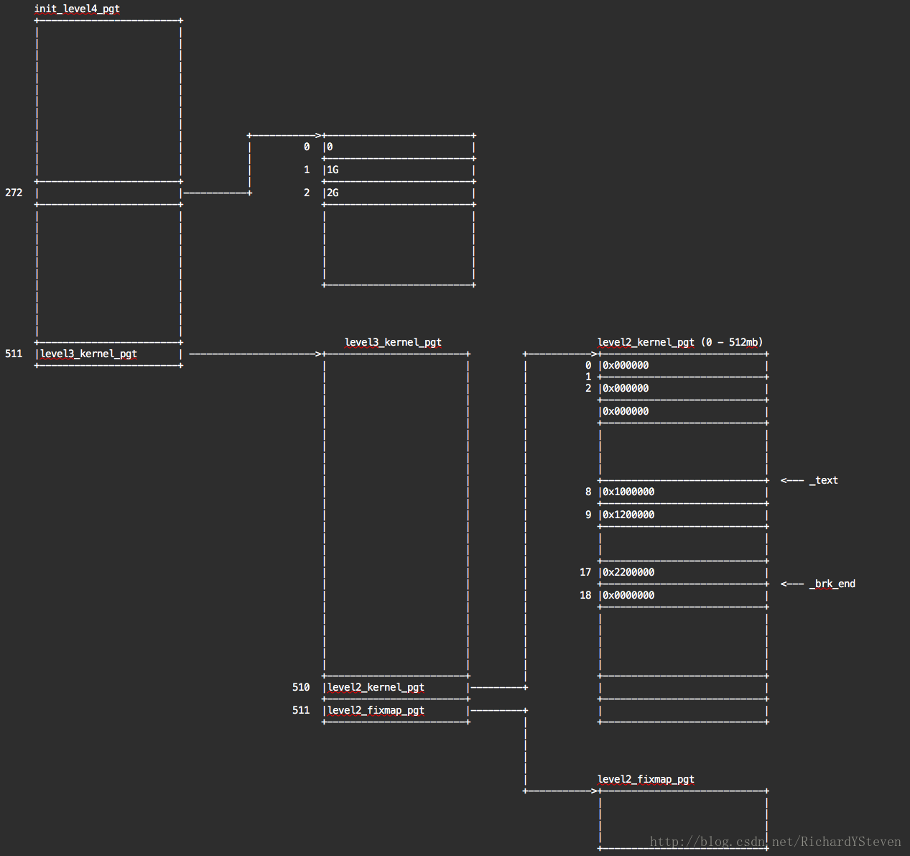
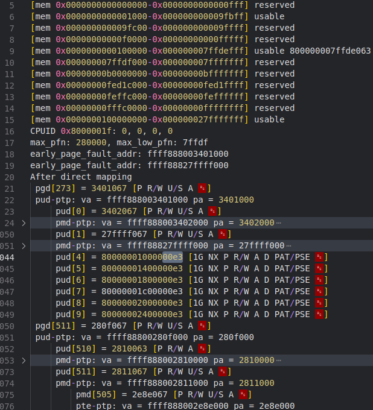

# Linux Kernel Page Table Evolution

[Kernel Exploring - 内核页表成长记](https://richardweiyang-2.gitbook.io/kernel-exploring/00-evolution_of_kernel_pagetable)

!!! tldr

    内核页表初始化过程，如何由最初的恒等映射转变为直接映射。page fault 函数在什么时候注册。

## Before decompression

在解压内核之前，为处理器进入 64 位做准备时，在 *arch/x86/boot/compressed/head_64.S* 中的 `startup_32` 部分配置了内核第一张页表。

!!! hint

    当然，如果 bootloader 根据 64 位的内核启动约定，直接跳转到 `startup_64` 处执行，则需要提供页表供内核使用。

第一张页表映射了 4G 的物理内存，采用 2M 大页，共使用 6 个页表页，顶级页表 1 个，3 级页表 1 个，2 级页表 4 个。采用恒等映射，即虚拟地址等于物理地址，如下图。



## Page table compiled in

内核解压后，跳转到 *arch/x86/kernel/head_64.S* 中的 `startup_64` 中执行，这里是解压后内核的起始部分。恒等映射无法满足内核的需求，因此需要重新创建页表，切换成直接映射（物理地址+基址）。

这部分页表的雏形其实已经写在代码里。而由于 KASLR 的存在，内核加载地址与编译时不同，因此需要计算加载的偏移，修正页表项。这些工作由 *arch/x86/kernel/head64.c* 中的 `__startup_64` 完成，主要涉及以下几个页表符号。

```c
// arch/x86/kernel/head_64.S

SYM_DATA_START_PTI_ALIGNED(early_top_pgt)
	.fill	512,8,0
	.fill	PTI_USER_PGD_FILL,8,0
SYM_DATA_END(early_top_pgt)

SYM_DATA_START_PAGE_ALIGNED(level3_kernel_pgt)
	.fill	L3_START_KERNEL,8,0
	.quad	level2_kernel_pgt - __START_KERNEL_map + _KERNPG_TABLE_NOENC
	.quad	level2_fixmap_pgt - __START_KERNEL_map + _PAGE_TABLE_NOENC
SYM_DATA_END(level3_kernel_pgt)

SYM_DATA_START_PAGE_ALIGNED(level2_kernel_pgt)
	/*
	 * 512 MB kernel mapping. We spend a full page on this pagetable
	 * anyway.
	 *
	 * The kernel code+data+bss must not be bigger than that.
	 *
	 *  This table is eventually used by the kernel during normal
	 *  runtime. 
	 */
	PMDS(0, __PAGE_KERNEL_LARGE_EXEC,
		KERNEL_IMAGE_SIZE/PMD_SIZE)
SYM_DATA_END(level2_kernel_pgt)

SYM_DATA_START_PAGE_ALIGNED(level2_fixmap_pgt)
	.fill	(512 - 4 - FIXMAP_PMD_NUM),8,0
	pgtno = 0
	.rept (FIXMAP_PMD_NUM)
	.quad level1_fixmap_pgt + (pgtno << PAGE_SHIFT) - __START_KERNEL_map \
		+ _PAGE_TABLE_NOENC;
	pgtno = pgtno + 1
	.endr
	/* 6 MB reserved space + a 2MB hole */
	.fill	4,8,0
SYM_DATA_END(level2_fixmap_pgt)

SYM_DATA_START_PAGE_ALIGNED(level1_fixmap_pgt)
	.rept (FIXMAP_PMD_NUM)
	.fill	512,8,0
	.endr
SYM_DATA_END(level1_fixmap_pgt)
```

其实从符号定义来看就差不多能知道这个页表的结构，如下图(注意还是 2M 大页）。而 `__startup_64` 中要做的就是修正这些页表项中由于 KASLR 可能存在的地址偏差。

```c
early_top_pgt[511] -> level3_kernel_pgt[0]
level3_kernel_pgt[510] -> level2_kernel_pgt[0]
level3_kernel_pgt[511] -> level2_fixmap_pgt[0]
level2_kernel_pgt[0]   -> 512 MB kernel mapping
level2_fixmap_pgt[506] -> level1_fixmap_pgt
```



## Identity mapping again

在 `__startup_64` 的后半部分，又建立了覆盖整个内核镜像大小的恒等映射，将 `early_top_pgt` 的前两个表项指向 `early_dynamic_pgts`。

```c
early_top_pgt[0], early_top_pgt[1] -> early_dynamic_pgts[0]
early_dynamic_pgts[0][0], early_dynamic_pgts[0][1] -> early_dynamic_pgts[1]
```

建立这段恒等映射是为了页表切换，相关代码如下。

```c
	/* Setup early boot stage 4-/5-level pagetables. */
	addq	phys_base(%rip), %rax
	movq	%rax, %cr3

	/* Ensure I am executing from virtual addresses */
	movq	$1f, %rax
	ANNOTATE_RETPOLINE_SAFE
	jmp	*%rax
1:
```

先设置 CR3，然后将标号 1 的地址（虚拟地址）写入 RAX 并跳转过去，就从之前的恒等映射切换到直接映射的虚拟地址执行。而如果在新的页表中没有恒等映射，那么 MOV-to-CR3 之后，RIP 依旧是恒等映射的地址，下一条指令取指直接失败，系统崩溃。使用 GDB 调试页表切换过程，如下图。可以看到，跳转之后就到了有符号的虚拟地址空间执行（调试这段代码最好每条指令都设一个硬件断点，不然用 ni 停不下来）。



而在进入 *arch/x86/kernel/head64.c* 中的 `x86_64_start_kernel` 中后，会将 `early_top_pgt` 除最后一项以外的部分都清零，因为已经用不到恒等映射，并将最后一项复制到未来的顶级页表 `init_top_pgt`。

在很久之后的 *arch/x86/kernel/setup.c* 中的 `setup_arch` 会调用 *arch/x86/mm/init_64.c* 中的 `cleanup_highmap` 对内核镜像相关的页表映射进行裁剪，只留下从 `_text` 到 `_brk_end` 这段空间的映射。裁剪后的页表如下图。（图上还画上了已经清零的 `early_top_pgt` 的前两项）



## Mapping the whole memory

`setup_arch` 会调用 `init_mem_mapping` 直接映射完整物理地址，基地址为 `0xffff888000000000`，即 `virtual_addr = phys_addr + 0xffff888000000000`。对应 `init_level4_pgt` 的第 273 (`(0xffff888000000000 >> 39) & 0x1ff`)项（图中是旧版 Linux，当时的基地址还是 `0xffff880000000000`，因此是 272）。



下面探究直接映射包含的物理地址范围，在 `init_mem_mapping` 中加入页表遍历，设置虚拟机内存为 8G 后的直接映射页表结构如下图。



其中高端连续的内存部分都映射为 1G 的大页，而 4G 以下的部分，因为有内存不可用，则被映射为 2M 或 4K 页。

值得注意的是，最终映射到的物理地址空间最高地址已经到了 10G，可以参考上图中最开始的 e820 表，并不是所有物理内存都可用，因此需要把内存条上的地址往后错开。而这部分信息来自 memblock，从硬件 e820 获取。

直接映射的函数调用流程如下。先划分内存区域，然后从高到低逐级分配和建立页表。

```c
// arch/x86/mm/init.c

init_mem_mapping ->
  init_memory_mappiing(0, ISA_END_ADDRESS)
  memory_map_bottom_up() / memory_map_top_down() ->
    init_range_memory_mapping ->
      for_each_mem_pfn_range()
        init_memory_mapping ->
          split_mem_range
          kernel_physical_mapping_init ->
            __kernel_physical_mapping_init ->
              alloc_low_page
              phys_p4d_init ->
                phys_pud_init ->
                  alloc_low_page
                  phys_pmd_init ->
                    alloc_low_page
                    phys_pte_init ->
                      set_pte_init

```

从 `alloc_low_page` 的代码来看，部分页表页是在 `pgt_buf_start` 到 `pgt_buf_top` 的范围内分配，而这个范围只有 12 个页，具体是否使用这段内存是在 `init_range_memory_mapping` 中根据要映射的物理地址判断跟当前空闲的缓冲区起始地址 `pgt_buf_end` 以及 `pgt_buf_top` 比较。如果不能使用，就要从 memblock 分配。

## Monitoring PTPs

到此已经了解了内核页表初始化的大概流程，而在直接映射后的内核对页表页分为两类：

- 有符号的几个页表页，如 `init_top_pgt`（被 define 为 `swapper_pg_dir`）、`level3_kernel_pgt`，这些的地址都是在内核数据段，内核可以通过基地址为 `0xffffffff80000000` 的虚拟地址访问修改（即顶级页表第 511 项）；
- 而对于后续分配的页表，不在数据段，需要通过直接映射虚拟地址（即基地址 `0xffff888000000000`，顶级页表第 273 项）访问，

而要实现嵌套内核架构，监控内核对页表的修改，就需要将这些页表页设置为只读，并控制 page fault 处理程序。（先监控修改，然后将修改的地方改为嵌套内核提供的接口）。

首先就是要找到所有的内核页表页，最简单的方法就是遍历然后记录，但如何维护一个不重复的 PTP 地址列表？`struct Page` 结构体中是否有标志页表页的字段？

而设置为只读的方法，还是要通过设置对应的页表项，以及开启 CR0.WP。而页表项控制的是通过某个虚拟地址访问该物理页时的权限，因此需要将映射到页表页的所有页表项找到。这里可能需要去看内核的反向映射（但是不确定对于内核页表是否有反向映射）。

控制 page fault 处理程序，可以 hook 现有的处理程序，或者修改对应的 IDT 表项。

## Page fault

早期的中断处理，在 *arch/x86/kernel/head_64.S* 中 `startup_64` 调用 `__startup_64` 之后，调用 *arch/x86/kernel/head64.c* 中的 `early_idt_setup_early_handler`，根据预定义的 `early_idt_handler_array` 设置对应的中断处理程序为 `early_idt_handler_common`，而后者又调用 `early_exception`，根据中断号进行后续处理。

其中，page fault 由 `early_make_pgtable` 处理，处理方式就是建立对应页表，并且还是以 `__PAGE_OFFSET` 为基址，相当于是提前建立直接映射页表，只不过不是在 `init_top_pgt` 而是在 `early_top_pgt`。之后在 `init_mem_mapping` 中建立好直接映射之后会切换 CR3，也就弃用了 `early_top_pgt`。

后期的中断处理程序的注册，主要使用 *arch/x86/kernel/idt.c* 中的 `idt_setup_from_tables`，根据预定义的中断处理程序表设置 IDT，如 `early_idts`、`early_pf_idts` 和 `def_idt` 等。

其中，page fault 的处理程序注册由 `setup_arch` 在调用 `init_mem_mapping` 之后马上调用 `idt_setup_early_pf`，设置处理程序为 `page_fault`。其定义在 *arc/x86/entry/entry_64.S* 中，使用 `idtentry` 和 `idtentry_part` 宏，最终执行 *arch/x86/mm/fault.c* 中的 `do_page_fault`：

```c
.macro idtentry_part do_sym, has_error_code:req, read_cr2:req, paranoid:req, shift_ist=-1, ist_offset=0
...
.macro idtentry sym do_sym has_error_code:req paranoid=0 shift_ist=-1 ist_offset=0 create_gap=0 read_cr2=0
...
idtentry page_fault		do_page_fault		has_error_code=1	read_cr2=1
```