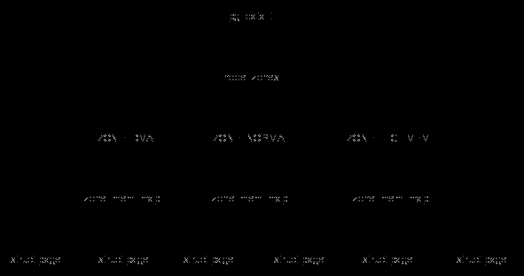

# Linux Kernel Physical Memory Management

[Kernel Exploring - 自底向上话内存](https://richardweiyang-2.gitbook.io/kernel-exploring/00-memory_a_bottom_up_view)

[Understanding the Linux Virtual Memory Manager - Describing Physical Memory](https://www.kernel.org/doc/gorman/html/understand/understand005.html)

!!! tldr

    内核如何管理物理内存，`struct Page` 结构体，自底向上：从 e820 到 memblock 再到伙伴系统、slub。

## Get memory layout from e820 hardware

x86 平台上，由 e820 硬件侦测物理内存分布，软件通过 0x15 中断与其通信。从软件角度看，e820 保存了一张内存布局表，内容如下。

```
BIOS-e820: [mem 0x0000000000000000-0x000000000009fbff] usable
BIOS-e820: [mem 0x000000000009fc00-0x000000000009ffff] reserved
BIOS-e820: [mem 0x00000000000f0000-0x00000000000fffff] reserved
BIOS-e820: [mem 0x0000000000100000-0x000000007ffdefff] usable
BIOS-e820: [mem 0x000000007ffdf000-0x000000007fffffff] reserved
BIOS-e820: [mem 0x00000000b0000000-0x00000000bfffffff] reserved
BIOS-e820: [mem 0x00000000fed1c000-0x00000000fed1ffff] reserved
BIOS-e820: [mem 0x00000000feffc000-0x00000000feffffff] reserved
BIOS-e820: [mem 0x00000000fffc0000-0x00000000ffffffff] reserved
BIOS-e820: [mem 0x0000000100000000-0x000000027fffffff] usable
```

每条 e820 表项包含起始地址，内存大小和内存类型。

*arch/x86/boot/main.c* 中的 `main` 负责在实模式进行一系列初始化，为进入保护模式做准备。调用 `detect_memory` 探测物理内存布局，其中就调用了 `detect_memory_e820` 从 e820 硬件获取内存信息，通过 0x15 中断遍历整个表，将其保存在 `boot_params.e820_map`。

在后续 *arch/x86/kernel/x86.c* 中的 `setup_arch` 中，调用 `e820__memory_setup` 将获取的内容拷贝到内核中的结构 `e820_table`，并进行排序。

相关的函数调用如下。

```c
// arch/x86/boot/main.c
main ->
  // arch/x86/boot/memory.c
  detect_memory ->
    detect_memory_e820

// init/main.c
start_kernel ->
  // arch/x86/kernel/setup.c
  setup_arch ->
    // arch/x86/kernel/e820.c
    e820__memory_setup ->
      x86_init.resources.memory_setup() -> e820__memory_setup_default
      e820__print_table
    e820__reserve_setup_data
    e820__finish_early_params
    e820_add_kernel_range
```

## Memblock

Memblock 是内核启动时用的内存分配器，在伙伴系统准备好之前，都是使用它分配物理内存。

Memblock 管理了两端内存区：`memblock.memory` 和 `memblock.reserved`。所有物理上可用的内存区域都会被添加到 `memblock.memory`，而被分配或被系统占用的区域则会添加到 `memblock.reserved`，而被分配的内存空间并不会从 `memblock.memory` 区域移除。

如下图，系统中由三段可用的内存空间，而其中两个已被分配。如果想要释放已分配的内存，`memblock.memory` 不会有变化，只要从 `memblock.reserved` 中移除即可。

```
+---------------------------+   +---------------------------+
|         memblock          |   |       Array of the        |
|  _______________________  |   |      memblock_region      |
| |        memory         | |   |                           |
| |      memblock_type    |-|-->| [start1, end1)            |
| |_______________________| |   |                           |
|                           |   | [start2, end2)            |
|                           |   |                           |
|                           |   | [start3, end3)            |
|                           |   |                           |
|                           |   +---------------------------+
|                           |                                
|  _______________________  |   +---------------------------+
| |       reserved        | |   |       Array of the        |
| |      memblock_type    |-|-->|      memblock_region      |
| |_______________________| |   |                           |
|                           |   |  [start1, end1)           |
|                           |   |                           |
|                           |   |  [start2, end2)           |
|                           |   |                           |
+---------------------------+   +---------------------------+
```

几个重要的 API：

- `memblock_add` 和 `memblock_remove` 从下层获取可用的内存区域加入到 `memblock.memory`；
- `memblock_alloc_*`，分配内存，其中调用`memblock_find_in_range` 和 `memblock_reserve`，找到空闲内存区域，将其加入 `memblock.reserved`）；
- `memblock_free` 释放内存。
- 将内存区域加入或移除 `memblock.memory` 或 `memblock.reserved` 都是调用 `memblock_add_range` 实现。

从 e820 到 memblock 的函数调用如下。

```c
// init/main.c
start_kernel ->
  // arch/x86/kernel/setup.c
  setup_arch ->
    // arch/x86/kernel/e820.c
    e820__memory_setup
    memblock_set_current_limit
    e820__memblock_setup
```

在 `e820__memblock_setup` 中，遍历 `e820_table`，将内存信息添加到 memblock 中。

## NUMA node info

NUMA, Non-Uniform Memory Access（非均匀内存访问），在处理器计算机上，内存访问时间取决于内存相对于处理器的位置。而在 NUMA 架构下，处理器访问其自身的本地内存比非本地内存（属于其他处理器或共享内存）更快。总的来说，NUMA 架构下分配物理内存需要区别对待，不同区域的内存称为不同的节点，节点之间定义距离的概念衡量内存访问时间的差异。

内核需要获取物理内存的 NUMA 信息，即某块内存对应哪个 NUMA 节点。x86 平台下，相关的函数调用如下。

```c
// arch/x86/kernel/setup.c
setup_arch ->
  // arch/x86/mm/numa_64.c
  initmem_init ->
    // arch/x86/mm/numa.c
    x86_numa_init ->
      numa_int ->
        x86_acpi_numa_init/amd_numa_init
        numa_cleanup_meminfo
        numa_register_memblk
```

内核获取的 NUMA 相关信息保存在 `numa_meminfo` 结构中，通过 `numa_register_memblk` 将信息映射到 memblock 中。

QEMU 开启 NUMA 模拟的配置如下，使用 memdev 将指定内存区域分配给 NUMA 节点。（这里设置成 3 和 5 是为了看 `ZONE_DMA32` 在两个 NUMA 中的构成，见下节）。

```
/usr/local/bin/qemu-system-x86_64 \
 -m 8G \
 -smp 2 \
 -object memory-backend-ram,id=mem0,size=3G \
 -object memory-backend-ram,id=mem1,size=5G \
 -numa node,nodeid=0,cpus=0,memdev=mem0 \
 -numa node,nodeid=1,cpus=1,memdev=mem1 \
 -cpu host \
 -enable-kvm \
 --machine q35 \
 -kernel ../arch/x86/boot/bzImage \
 -append "earlyprintk=ttyS0 debug console=ttyS0 pti=on nokaslr memblock=debug" \
 -initrd initramfs.cpio\
 -fsdev local,security_model=passthrough,id=fsdev-fs0,path=./shared \
 -device virtio-9p-pci,id=fs0,fsdev=fsdev-fs0,mount_tag=test_mount \
 -monitor unix:hmp-monitor,server,nowait \
 -nographic \
```

内核启动参数中添加 `memblock=debug`，就可以在 dmesg 中查看相关信息：

```c
// 从 e820_table 获取信息之后，没有 NUMA 节点信息（初始化 memblock 时将 numa_id 设置为了 MAX_NUMNODES，因此不会输出）。
MEMBLOCK configuration:
 memory size = 0x00000001fff7dc00 reserved size = 0x00000000026b30fc
 memory.cnt  = 0x3
 memory[0x0]	[0x0000000000001000-0x000000000009efff], 0x000000000009e000 bytes flags: 0x0
 memory[0x1]	[0x0000000000100000-0x000000007ffdefff], 0x000000007fedf000 bytes flags: 0x0
 memory[0x2]	[0x0000000100000000-0x000000027fffffff], 0x0000000180000000 bytes flags: 0x0
...
// 从 numa_meminfo 获取 NUMA 信息之后，见上节的配置，因为将内存从 3G 处划分，所以这里的最后一块又被分开。
// 不过是在 5G 处分开的，因为从 e820 获取的内存信息已经是错开 2G 的。
MEMBLOCK configuration:
 memory size = 0x00000001fff7dc00 reserved size = 0x000000000277f000
 memory.cnt  = 0x4
 memory[0x0]	[0x0000000000001000-0x000000000009efff], 0x000000000009e000 bytes on node 0 flags: 0x0
 memory[0x1]	[0x0000000000100000-0x000000007ffdefff], 0x000000007fedf000 bytes on node 0 flags: 0x0
 memory[0x2]	[0x0000000100000000-0x000000013fffffff], 0x0000000040000000 bytes on node 0 flags: 0x0
 memory[0x3]	[0x0000000140000000-0x000000027fffffff], 0x0000000140000000 bytes on node 1 flags: 0x0
```

## Node-Zone-Page

Node, Zone, Page 是内核中内存管理模块的常见概念，下图展示了它们之间的关系。



下图展示了Node 和 Zone 的关系。

```c
Memory

                 16M                   4G                            6G
   [   ZONE_DMA   |      ZONE_DMA32     |            ZONE_NORMAL      ]
                                3G
   ^                             ^                                    ^
   |<---      Node0          --->|<---          Node1             --->|
```

Node 是从内存亲和性（处理器访问内存的时间不同）出发的定义，表现为地址上的分布，但实际上不是从地址出发的定义。

而 Zone 是从地址大小出发的定义，不论系统上的内存多大，每个 zone 的空间是一定的，比如 `ZONE_DMA` 一定是 16M 以下的空间。

所以在某些 node 上的 zone 是空的，比如 Node1 就没有 `ZONE_DMA`。

对应上图，内核初始化完成后的 Node-Zone 相关结构如下，其中的 node_data 就是 `pg_data_t`。

```c
   node_data[0]                                                node_data[1]
   (typedef struct pglist_data {} pg_data_t)                   (typedef struct pglist_data {} pg_data_t)
   +-----------------------------+                             +-----------------------------+        
   |node_id                <---+ |                             |node_id                <---+ |        
   |   (int)                   | |                             |   (int)                   | |        
   +-----------------------------+                             +-----------------------------+    
   |node_zones[MAX_NR_ZONES]   | |    [ZONE_DMA]               |node_zones[MAX_NR_ZONES]   | |    [ZONE_DMA]       
   |   (struct zone)           | |    +---------------+        |   (struct zone)           | |    +---------------+
   |   +-------------------------+    |0              |        |   +-------------------------+    |empty          |
   |   |                       | |    |16M            |        |   |                       | |    |               |
   |   |zone_pgdat         ----+ |    +---------------+        |   |zone_pgdat         ----+ |    +---------------+
   |   |                         |                             |   |                         |        
   |   |                         |    [ZONE_DMA32]             |   |                         |    [ZONE_DMA32]        
   |   |                         |    +---------------+        |   |                         |    +---------------+   
   |   |                         |    |16M            |        |   |                         |    |3G             |   
   |   |                         |    |3G             |        |   |                         |    |4G             |   
   |   |                         |    +---------------+        |   |                         |    +---------------+   
   |   |                         |                             |   |                         |        
   |   |                         |    [ZONE_NORMAL]            |   |                         |    [ZONE_NORMAL]       
   |   |                         |    +---------------+        |   |                         |    +---------------+   
   |   |                         |    |empty          |        |   |                         |    |4G             |   
   |   |                         |    |               |        |   |                         |    |6G             |   
   +---+-------------------------+    +---------------+        +---+-------------------------+    +---------------+

```

- `ZONE_DMA` 和 `ZONE_DMA32` 的大小是固定的；
- Node0 上的 `ZONE_NORMAL` 为空；
- Node1 上的 `ZONE_DMA` 为空。

在 *mm/page_alloc.c* 中的 `calculate_node_totalpages` 中加入输出 zone 信息的代码，在 dmesg 中可以看到：

```c
Node[0] Zone info:
	 ZONE_DMA -> [0x00001000 -- 0x01000000]       // [4K, 16M)
	 ZONE_DMA32 -> [0x01000000 -- 0x100000000]    // [16M, 4G)
	 ZONE_Normal -> [0x100000000 -- 0x140000000]  // [4G, 5G)
	 ZONE_Movable -> [0x00000000 -- 0x00000000]   // [0, 0) NULL
	 ZONE_Device -> [0x280000000 -- 0x280000000]  // [10G, 10G) NULL
Node[1] Zone info:
	 ZONE_DMA -> [0x01000000 -- 0x01000000]       // [16M, 16M) NULL
	 ZONE_DMA32 -> [0x100000000 -- 0x100000000]   // [4G, 4G) NULL
	 ZONE_Normal -> [0x140000000 -- 0x280000000]  // [5G, 10G)
	 ZONE_Movable -> [0x00000000 -- 0x00000000]   // [0, 0) NULL
	 ZONE_Device -> [0x280000000 -- 0x280000000]  // [10G, 10G) NULL
```

可以看到，内存被划分为 node，每个 node 又被划分为 zone，虽然不是每个 zone 都有内存，但内核还是把 page 相关的信息保存在 zone 中。

内存分配时，先决定从哪个 node 上分配，找到适合本地执行的内存，然后再决定去哪个 zone 上分配。或者也可以按照 zone 分配，如某些设备只能使用 ZONE_DMA 的内存，那么按照 zone 分配更快。下面先看看 zone 和 page 时怎么联系的，如下图。

```c
      struct zone
      +------------------------------+      The buddy system
      |free_area[MAX_ORDER]  0...10  |
      |   (struct free_area)         |
      |   +--------------------------+
      |   |nr_free                   |  number of available pages
      |   |(unsigned long)           |  in this zone
      |   |                          |
      |   +--------------------------+
      |   |                          |           free_area[0]
      |   |free_list[MIGRATE_TYPES]  |  Order0   +-----------------------+
      |   |(struct list_head)        |  Pages    |free_list              |
      |   |                          |           |  (struct list_head)   |
      |   |                          |           +-----------------------+
      |   |                          |
      |   |                          |           free_area[1]
      |   |                          |  Order1   +-----------------------+
      |   |                          |  Pages    |free_list              |
      |   |                          |           |  (struct list_head)   |
      |   |                          |           +-----------------------+
      |   |                          |
      |   |                          |              .
      |   |                          |              .
      |   |                          |              .
      |   |                          |
      |   |                          |
      |   |                          |           free_area[10]
      |   |                          |  Order10  +-----------------------+
      |   |                          |  Pages    |free_list              |
      |   |                          |           |  (struct list_head)   |
      |   |                          |           +-----------------------+
      |   |                          |
      +---+--------------------------+
```

- 每个 zone 上有一个 `free_area` 数组；
- 每个数组元素中包含一个链表；
- 每个链表元素指向一个表达 $2^N$ 大小内存的页。(但是似乎没看到要怎么找对应的 page 结构体)

怎么感觉就是伙伴系统，分配的时候找对应的 zone，查看是否有可以使用的页，如果没有指定大小的页，就去更高阶的链表上找。（后面会有伙伴系统）

内存按照 node 和 zone 划分的目的还是为了分配和回收内存。而分配的顺序时按照 `pg_data_t` 中的按照 zone 顺序排好的链表 `node_zontlists`，如下图。

```c
   node_data[]
   +-----------------------------+
   |node_zonelists[MAX_ZONELISTS]|
   |   (struct zonelist)         |
   |   +-------------------------+
   |   |_zonerefs[]              | = MAX_NUMNODES * MAX_NR_ZONES + 1
   |   | (struct zoneref)        | Node 0:
   |   |  +----------------------+    [ZONE_NORMAL]        [ZONE_DMA32]         [ZONE_DMA]
   |   |  |zone                  |    +---------------+    +---------------+    +---------------+
   |   |  |   (struct zone*)     |    |               |    |               |    |               |
   |   |  |zone_idx              |    |               |    |               |    |               |
   |   |  |   (int)              |    +---------------+    +---------------+    +---------------+
   +---+--+----------------------+
                                   Node 1:

                                      [ZONE_NORMAL]        [ZONE_DMA32]         [ZONE_DMA]
                                      +---------------+    +---------------+    +---------------+
                                      |               |    |               |    |               |
                                      |               |    |               |    |               |
                                      +---------------+    +---------------+    +---------------+
```

每个 `node_data` 都有自己的 `node_zonelists`，用于表示该 NUMA 节点上分配内存时如何按照 zone 找到空闲内存的顺序。

## Sparsemem

每个物理内存页都对应一个 `struct page` 结构体，那么给定物理地址，如何找到对应的结构体。

原始的解决方案，系统中的 `struct page` 都存在一个超大的静态数组中，每个物理页帧都有对应的 page 结构体。这带来一些问题，比如内存当中有空洞，即某些物理地址并不在内存上存在，也就不需要有对应的结构体。为此，内核引入了 sparsemem 稀疏内存，只有有效的物理内存页才会有对应的 `struct page` 存在。

Sparsemem 方案减少了内存占用，同时也带来一个问题，通过物理页帧获取对应的结构体 `pfn_to_page` 会比原来慢，原来的静态数组，就是直接基址加上偏移（页帧号× `struct page` 大小）就得到结构体。

Sparsemem 引入了 section 的概念，所谓 section 就是比 page 更大的内存区域，但又比 node 的范围小，x86_64 上 section 大小为 128M。

那么整个系统的物理内存就被分成一个个 section，由 `struct mem_section` 结构体表示，结构体中保存了该 section 范围内 `struct page` 结构体的地址。使用 sparsemem 之后，如果某个 section 为空（内存空洞），那么就不会分配这个 section 中的 page 结构体。

内核使用全局的 `mem_section` 数组管理系统内存，每个元素管理 128M 的内存。

```c
    mem_section[NR_SECTION_ROOTS][SECTIONS_PER_ROOT]

    = [DIV_ROUND_UP(NR_MEM_SECTIONS, SECTIONS_PER_ROOT)] [SECTIONS_PER_ROOT]

        [0]          [1]                                [SECTIONS_PER_ROOT - 1]
        +------------+------------+        +------------+------------+
    [0] |            |            |   ...  |            |            |
        +------------+------------+        +------------+------------+

        +------------+------------+        +------------+------------+
    [1] |            |            |   ...  |            |            |
        +------------+------------+        +------------+------------+

        +------------+------------+        +------------+------------+
    [2] |            |            |   ...  |            |            |
        +------------+------------+        +------------+------------+
```

`struct mem_section` 结构体中的 `section_mem_map` 指向 page 结构体数组。

```c
    mem_section                     
    +-----------------------------+
    |pageblock_flags              |
    |   (unsigned long *)         |
    |                             |
    |                             |
    +-----------------------------+         mem_map[PAGES_PER_SECTION]
    |section_mem_map              |  ---->  +------------------------+
    |   (unsigned long)           |    [0]  |struct page             |
    |                             |         |                        |
    |                             |         +------------------------+
    +-----------------------------+    [1]  |struct page             |
                                            |                        |
                                            +------------------------+
                                       [2]  |struct page             |
                                            |                        |
                                            +------------------------+
                                            |                        |
                                            .                        .
                                            .                        .
                                            .                        .
                                            |                        |
                                            +------------------------+
                                            |struct page             |
                                            |                        |
                                            +------------------------+
                   [PAGES_PER_SECTION - 1]  |struct page             |
                                            |                        |
                                            +------------------------+
```

内核 sparsemem 相关初始化的函数调用如下，主要做的工作就是判断 section 是否存在，以及为存在的 section 分配 memmap 。

```c
// arch/x86/kernel/setup.c
setup_arch ->
  e820__memblock_setup() 
  init_mem_mapping()
  initmem_init()
  // arch/x86/mm/init_64.c
  x86_init.paging.pagetable_init() -> paging_init() ->
    // mm/page_alloc.c
    sparse_memory_present_with_active_regions(MAX_NUMNODES) ->
        memory_present
    // mm/sprase.c
    sparse_init ->
        sparse_init_nid
    // arch/x86/mm/init.c
    zone_sizes_init
```

前面提到 sparsemem 会使 `pfn_to_page` 变慢，相关的定义如下。更改后，先要找到 section，然后再计算 page 结构体的地址，比原来多了一步。其实从这里就能看出 sparsemem 的本质，section 结构体仍然是连续的，但是把 page 结构体改为动态分配，对于永远不会用到 `pfn_to_page` 的地址（内存空洞），就不再分配 page。另外，最后的计算是 `section_mem_map + pfn`，看起来似乎应该是 `section_mem_map + pfn - section_start_pfn`。而在这段定义上面的注释也说明了这个问题。

```c
// include/asm-generic/memory_model.h
// 没有 sparsemem
#define __pfn_to_page(pfn)	(mem_map + ((pfn) - ARCH_PFN_OFFSET))
// CONFIG_SPARSEMEM
/*
 * Note: section's mem_map is encoded to reflect its start_pfn.
 * section[i].section_mem_map == mem_map's address - start_pfn;
 */
#define __pfn_to_page(pfn)				\
({	unsigned long __pfn = (pfn);			\
	struct mem_section *__sec = __pfn_to_section(__pfn);	\
	__section_mem_map_addr(__sec) + __pfn;		\
})
```

## Page struct

`struct page` 可以说是内核中最复杂的结构体定义了，因为每个物理页都对应一个 page 结构体，所以要极尽压缩空间，因此就诞生了一个 union 里定义了 7 个结构体的神奇操作。

!!! todo

    union 中有一个结构体是与页表页相关，可能会用到。

其中 flags 字段标志了页的属性，在 *include/linux/page-flags-layout.h* 和 *include/include/page-flags.h* 中定义了一系列关于该字段的布局和宏定义。

对字段的操作主要有三类：

- `PageXXX()`：用于判断属性；
- `SetPageXXX()`：用于设置页属性：
- `ClearPageXXX()`：用于清楚页属性。

## Buddy system

系统启动初期使用 memblock 管理内存，而在启动之后 memblock 无法满足需求，就需要新的页分配器。内核进行 Node-Zone-Page 一系列设置就是为页分配器做准备。

内核从 e820 获取物理内存布局，建立 memblock。同时在 sparsemem 初始化过程中动态分配了 page 结构体。而内核是如何将物理内存页与 page 结构体相对应，并将 page 结构体加入到对应的 zone 中呢？

相关的函数调用如下。整个流程就是遍历 memblock 的内存信息，填充 page 结构体的过程。

```c
// init/main.c
start_kernel ->
  mm_init ->
    // arch/x86/mm/init_64.c
    mem_init ->
      memblock_free_all ->
        // mm/memblock.c
        free_low_memory_core_early ->
          for_each_free_mem_range
            __free_memory_core ->
              ...
              __free_pages_core ->
                set_page_refcounted
                __free_pages ->
                  __free_one_page

```

同时可以看到，初始化 page 其实是调用内存释放的方法。内存释放通常使用 *mm/page_alloc.c* 中的 `free_pages`，最终调用 `__free_one_page`。伙伴系统分配器，释放时会判断相邻的页是否空闲，如果是则合并，然后继续判断。最终，释放的页都添加到 `zone->free_area[order].free_list` 上。

页分配的核心函数是 `__alloc_pages_nodemask`，分配的过程就是按照优先级搜索 node 和 zone，找到匹配的 zone 则在其 free_area 链表取下一个。如果分配到高阶的 page，就将高阶部分放回对应的 `frea_area` 中。

下面探究伙伴系统中的具体算法，即如何实现分配 $1 - 2^{10}$ 的空闲页。释放时合并页的相关代码如下。

```c
// mm/page_alloc.c
__free_one_page()

  while (order < max_order - 1) {
    ...
		buddy_pfn = __find_buddy_pfn(pfn, order);
		buddy = page + (buddy_pfn - pfn);

		if (!pfn_valid_within(buddy_pfn))
			goto done_merging;
		if (!page_is_buddy(page, buddy, order))
			goto done_merging;
		/*
		 * Our buddy is free or it is CONFIG_DEBUG_PAGEALLOC guard page,
		 * merge with it and move up one order.
		 */
		if (page_is_guard(buddy))
			clear_page_guard(zone, buddy, order, migratetype);
		else
			del_page_from_free_area(buddy, &zone->free_area[order]);
		combined_pfn = buddy_pfn & pfn;
		page = page + (combined_pfn - pfn);
		pfn = combined_pfn;
		order++;
	}
```

其中最重要的是 `__find_buddy_pfn`，即找到当前 page 结构体的伙伴，代码如下。

```c

/*
 * Locate the struct page for both the matching buddy in our
 * pair (buddy1) and the combined O(n+1) page they form (page).
 *
 * 1) Any buddy B1 will have an order O twin B2 which satisfies
 * the following equation:
 *     B2 = B1 ^ (1 << O)
 * For example, if the starting buddy (buddy2) is #8 its order
 * 1 buddy is #10:
 *     B2 = 8 ^ (1 << 1) = 8 ^ 2 = 10
 *
 * 2) Any buddy B will have an order O+1 parent P which
 * satisfies the following equation:
 *     P = B & ~(1 << O)
 *
 * Assumption: *_mem_map is contiguous at least up to MAX_ORDER
 */
static inline unsigned long
__find_buddy_pfn(unsigned long page_pfn, unsigned int order)
{
	return page_pfn ^ (1 << order);
}
```

找当前 pfn 的伙伴的方法其实就是将 pfn 中第 order 位取反，而想找当前的 pfn 在第 order+1 的父节点（即这段 $2^{order+1}$ 个页的起始），就将 order 位清零。在上面 `__free_one_page` 的代码中，`combined_pfn = buddy_pfn & pfn` 其实就是将 order 位清零（因为 pfn 和 buddy_pfn 只有第 order 位不同），得到合并后的 `combined_pfn`。

Page 结构体中有两个重要的引用计数，帮助伙伴系统管理。

- `_refcount`：即引用计数，记录当前页的使用者个数；
- `_mapcount`：记录当前页映射到到页表的次数，初始为 -1。

在内核中如果后者大于前者，则称此页被 pin 住。页在伙伴系统中时引用计数为 0，有新的使用者，使用 `get_page` 增加计数，在 `put_page` 中，会检查引用计数是否为零，减到零则释放给伙伴系统。

## per_cpu_pageset

伙伴系统和 zone 的信息时对等的，如果每次都要从伙伴系统获取页，随着 CPU 个数的增加，对伙伴系统的竞争越来越大。为此，内核引入 `per_cpu_pageset`（pcp），先从 zone 这个大仓库中拿出一些页，放入每个 cpu 的小仓库，释放时也是先放回 pcp，满了之后再还给 zone。zone 结构体中的 pcp 结构如下。

```c
      struct zone
      +------------------------------------------------------------------------------------------------+
      |pageset                                                                                         |
      |   (struct per_cpu_pageset *)                                                                   |
      |   cpu0                          cpu1                                cpuN                       |
      |   +--------------------------+  +--------------------------+  ...   +--------------------------+
      |   |pcp                       |  |pcp                       |        |pcp                       |
      |   |  (struct per_cpu_pages)  |  |  (struct per_cpu_pages)  |        |  (struct per_cpu_pages)  |
      |   |  +-----------------------+  |  +-----------------------+        |  +-----------------------+
      |   |  |count                  |  |  |count                  |        |  |count                  |
      |   |  |high                   |  |  |high                   |        |  |high                   |
      |   |  |batch                  |  |  |batch                  |        |  |batch                  |
      |   |  |                       |  |  |                       |        |  |                       |
      |   |  |lists[MIGRATE_PCPTYPES]|  |  |lists[MIGRATE_PCPTYPES]|        |  |lists[MIGRATE_PCPTYPES]|
      +---+--+-----------------------+--+--+-----------------------+--------+--+-----------------------+
```

zone 上记录了每个 cpu 上小仓库的信息：

- `count`：有多少页；
- `high`：如果页数量超过 high，则还给 zone；
- `batch`：pcp 没有页，则从 zone 中分配 batch 个页。

## slub

!!! todo

     有时间看一下 slub 分配器的相关内容。以前看 KVM 的代码中用到 kmem_cache，应该就是 slub 的接口。