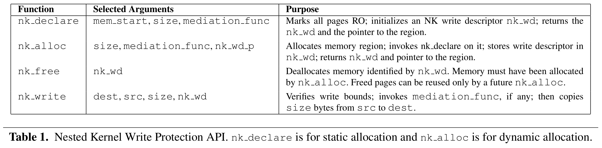
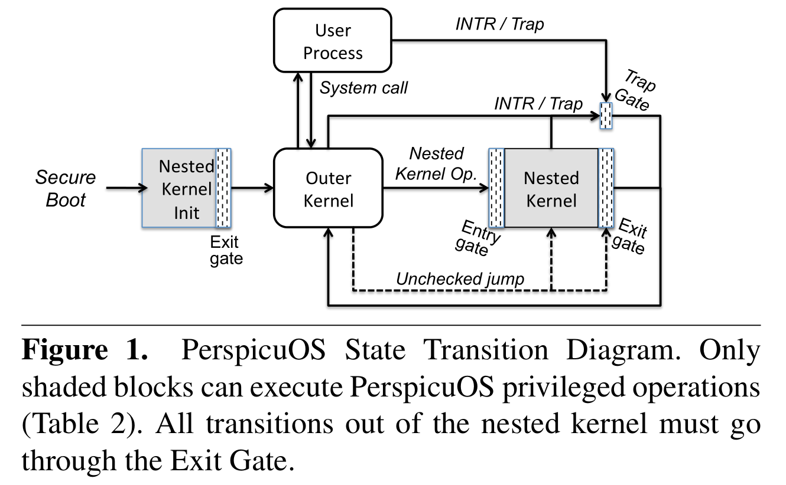
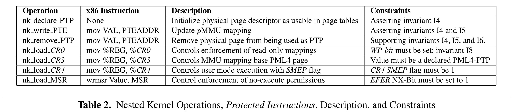
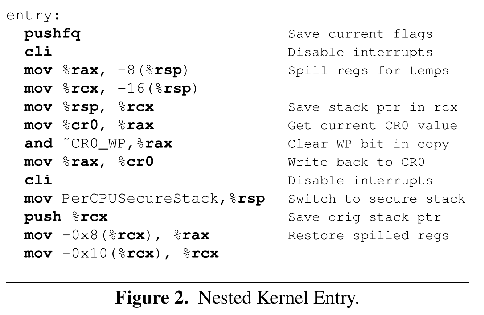
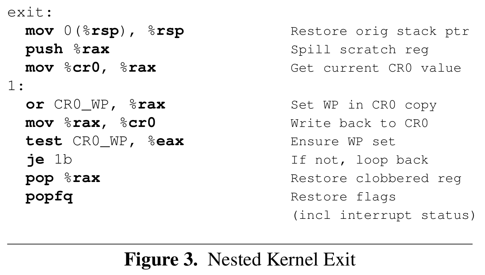

# Nested Kernel: An Operating System Architecture for Intra-Kernel Privilege Separation

[pdf]([ASPLOS%202015]%20Nested%20Kernel%20An%20Operating%20System%20Architecture%20for%20Intra-Kernel%20Privilege%20Separation.pdf)

[xmind-pdf](nested_kernel_mind.pdf)

宏内核操作系统导致内核中的任何漏洞利用可获取完全的管理员特权，从而破坏计算基系统的安全性。Nested Kernel 操作系统架构通过在传统的宏内核中嵌套一个小的隔离内核解决此问题。嵌套内核介入所有的虚拟内存地址转换的更新，以确保对物理内存的保护，从而显著减少实施内存访问控制的可信计算基。将嵌套内核架构合并到 x86-64 上的 FreeBSD，通过写保护 MMU 地址转换和内核不可信部分降权的方式在最高硬件特权级运行整个操作系统。

## Introduction

宏内核中对内核任一部分的漏洞利用都会获取内存和系统资源的完整权限。已有的方法主要是完全放弃宏内核而重构微内核系统或使用虚拟化进行透明的隔离。

本文提出嵌套内核架构，其关键设计特征是将一小部分内核代码和数据运行在称为嵌套内核的隔离环境，其他部分则是不可信的外部内核。嵌套内核通过以下方式隔离和介入内存修改：配置所有映射（页表页）为只读；确保不可信代码运行时执行安全策略。

文章实现了一个具体原型 PerspicuOS，嵌套内核和外核都运行在同一硬件特权级。利用硬件机制（MMU、IOMMU 和 CR0.WP）确保外核代码只读。

为确保外核不会禁用写保护，将其降权，将外核代码中的写 CR0 替换为调用嵌套内核服务，并限制仅执行验证后的外核代码，保证内核完整性。

为内核开发者提供了两个内核内写保护服务：写中介和写记录，允许内核开发小组部署安全策略以隔离和控制对内核敏感数据的访问。可实施只写一次策略、仅附加策略和写记录策略。

对 FreeBSD 9.0 内核的修改，大概需要 2000 行代码修改，将内存隔离的 TCB 限制在 5000 行以内的嵌套内核代码。

本文贡献：

- 新的 OS 组织策略，nested kernel，在宏内核中嵌套一个更高特权的保护域，
- x86 平台上的嵌套内核实现，PerspicuOS。
- 评估三种内核中的内存访问控制策略。
- 提供全生命周期内核代码完整性保护的 OS 设计。

## Nested Kernel Approach

嵌套内核架构通过虚拟化硬件功能（MMU）保证介入和隔离内核内保护域。

### System Overview

嵌套内核架构将宏内核拆分重组成两个特权域：嵌套内核和外核。嵌套内核拥有全部系统权限，拥有修改底层物理 MMU（pMMU）状态的独占特权。嵌套内核通过虚拟接口（vMMU）介入外核对 pMMU 的修改。

嵌套内核在创建虚拟到物理转换的最后阶段隔离 pMMU 更新，也就是转换变为处理器可用的点。对 x86 架构，就是修改页表页（PTP）上的页表项（PTE）。外核仍负责虚拟内存子系统，而嵌套内核介入所有的 pMMU 更新并实施访问控制策略。

### Design Principles

嵌套内核架构包含建立虚拟地址映射的机制和接口。

**将资源控制（策略）和保护机制（MMU）分离**。仅提供更新虚拟到物理地址映射的更新机制。最小化特权域 TCB，最大化移植性和灵活性。

**操作系统协同设计和显式接口**。联合设计实现 OS 内显式地保护，而不是通过外部工具透明保护。

**基于 MMU 状态而不是指令的特权分离**。在访问 pMMU 方面执行特权分离，包括内存（PTP）和处理器状态（CR0.WP）。

**最小化架构依赖**。尽可能是硬件不可知的，仅需硬件提供具有页粒度保护的分页机制和对外核代码执行写保护的能力。

**细粒度资源控制**。利用虚拟化 MMU 实现细粒度资源控制，以便保护内核数据结构。

**可忽略不计的性能影响**。嵌套内核提供隔离和特权分离而不需要分离地址空间，且将外核和嵌套内核运行在同一特权级 ring 0，减少开销。

### Virtualizing the MMU via API Emulation

pMMU 的运行时隔离具有以下属性，由不变量 I1 和 I2 保证。

**嵌套内核属性**：嵌套内核通过 vMMU 介入所有对 pMMU 的修改。

**不变量 I1**：外核执行时，受保护数据的 active 虚拟到物理映射配置为只读。

**不变量 I2**：外核执行时，强制执行 active 虚拟到物理映射的写保护。

所有 active 虚拟到物理映射是指被处理器用于决定页保护的映射，而 inactive 映射不会影响内存访问权限。

嵌套内核通过以下方式执行 I1：要求显式初始化 PTP；创建更新 PTE 的显式接口；将所有 PTP 对应的 PTE 设置为只读。任何未被显式初始化或由外核通过 vMMU 声明的 PTP 都无法使用以执行 I1。

后续会详述如何在 PerspicuOS 中确保 I2 执行。

### Intra-Kernel Memory Write Protection Services

嵌套内核可以在系统上的任何物理页实施内存访问控制策略。嵌套内核提供 API 以在内核内存上指定和执行策略，写保护 API 如下，包括内存分配和字节粒度中介策略的数据写功能。

客户端使用内核内保护服务分配受嵌套内核保护且仅从嵌套内核代码写入的内存区域。使用 nk_declare 静态声明或通过 nk_alloc 动态分配，嵌套内核初始化写描述符并分配相关的内存区。

客户端通过中介函数的形式指定写保护策略，中介函数执行受写保护内核对象的更新策略，在任何写入之前由嵌套内核调用。即使没有中介函数，所有更新必须由嵌套内核写入，阻止内存损坏漏洞的覆盖。

创建写描述符 nk_wd 后，外核通过 nk_write 函数执行写入。类似字节级的复制操作，写入之前执行两次检查：验证写入是否在 nk_wd 指定的区域内；调用中介函数。

## 3 PerspicuOS: A Nested Kernel Prototype

PerspicuOS 利用 x86 硬件支持进行高效开关 MMU 写保护并控制外核可使用的指令。具体来说，将所有到 PTP 的映射配置为只读，并降权外核使其无法在 ring 0 禁用写保护（通过扫描外核代码确保其中不含禁用 WP-bit 的指令的方式）。

### 3.1 Threat Model and Assumptions

外核可能被攻击者完全控制企图任意修改 CPU 状态，攻击者还可能修改外核源码。不需要外核的控制流完整性，攻击者可能重定向到嵌套内核的关闭写保护代码上执行（因此需要阻止这种控制流转移）。

嵌套内核源代码和二进制是可信的，通过安全启动机制加载。同时中介函数也是可信的。

### 3.2 Protection Properties and Invariants

前面提到，嵌套内核通过执行两个不变量 I1 和 I2 来支持嵌套内核属性。I1 要求 PTP 相关映射只读，I2 要求配置要在外核执行时启用。

#### 3.2.1 Supporting Invariant I1

x86 架构中所谓的 active 映射就是 CR3 寄存器指定的一系列 PTP。为确保受保护物理页的所有映射被标记为只读（即 I1），执行以下不变量。

**不变量 I3**：确保在外核执行前没有未验证的映射。

**不变量 I4**：仅声明的 PTP 用于映射。

**不变量 I5**：所有到 PTP 的映射设置为只读。

**不变量 I6**：CR3 仅加载预先声明的顶级 PTP。

#### 3.2.2 Supporting Invariant I2

要确保外核执行时开启写保护。x86 长模式的处理器可开启写保护（CR0.PE/PG/WP, CR4.PAE, EFER.LME 都置位）。外核可能通过修改 WP-bit、禁用分页和劫持控制流等方式关闭保护。确保外核执行时 WP 始终置位，以及禁用分页、SMM 中断等操作都要由嵌套内核控制。对此，执行以下两个不变量。

**不变量 I7**：外核执行前，CR0.WP/PG 标志位要置位。

**不变量 I8**：CR0.WP 不会被外核禁用。

禁用分页后，处理器会将虚拟地址当作物理地址，后面会讲，不可能阻止外核禁用分页。为此，执行以下不变量。

**不变量 I9**：禁用分页后控制流会指向嵌套内核。

另外，外核可能调用 SMM，因此需要控制 SMI 中断。

**不变量 I10**：嵌套内核控制 SMM 中断处理和执行。

以上的不变量成立，外核可能尝试操纵 CPU 状态或外核内存，将控制流从嵌套内核转移到外核而不启用 WP。为此，需要防止对嵌套内核的两种控制流攻击：中断控制流路径和嵌套内核堆栈状态操作。

为确保从嵌套内核到外核的所有退出路径都启用 WP，执行以下不变量。

**不变量 I11**：调用外核的中断/陷阱处理程序之前，启用 WP。

中断例程是嵌套内核的一部分，需要将 IDT 放入受保护内存，且对 IDTR 的修改也要是嵌套内核独占的操作。

**不变量 I12**：IDT 必须是写保护的，IDTR 只能由嵌套内核更新。

同时，为防止返回地址被外核篡改，嵌套内核代码需使用其位于受保护内存中的独立堆栈。

**不变量 I13**：嵌套内核堆栈对来自外核的修改是写保护的。

### 3.3 System Initialization

PerspicuOS 必须确保所有到受保护页（PTP、嵌套内核数据等）的映射配置为只读，且根据 I3 和 I7 在外核执行前开启分页。

流程如下图，使用安全启动加载嵌套内核初始化功能，在初始化并验证页表后才启动外核。

### 3.4 Virtual MMU Interface

PerspicuOS 提供一组函数，即嵌套内核操作，以允许外核配置 pMMU。嵌套内核操作介入底层 x86 指令（受保护指令）以隔离 MMU，分两类，通过写内存控制配置硬件 PTP 和控制处理器控制寄存器更新。

嵌套内核根据数据将物理页分类，以执行 pMMU 更新策略。页类型有 PTP、嵌套内核代码和数据、外核代码和数据、用户代码和数据以及由内核内写保护服务保护的数据。页类型信息、映射数和所有虚拟地址列表保存在物理页面描述符中。外核使用 nk_declare_PTP 指定物理页作为 PTP 使用。

声明后外核无法直接修改，而是使用 nk_write_PTE 写入，同时执行检查和验证。嵌套内核使用上述的物理页类型信息和现有映射列表确保：PTE 没有指向数据页，则将指向已声明的 PTP；所有到 PTP 的映射都写保护，分别确保 I4 和 I5。

还要保护嵌套内核代码、数据和堆栈页。确保 pMMU 更新不会写入由嵌套内核保护的任何内核数据。

另一组操作用于配置分页硬件本身。更新 CR3 的接口，确保它仅指向声明过的顶级 PTP。用于修改其他寄存器的接口可确保分页和内核代码完整性保护不会被外核禁用。

### 3.5 Lifetime Kernel Code Integrity

为阻止外核执行受保护指令，首先在代码设置为特权模式可执行前进行验证，然后实施全生命周期内核代码完整性，确保 I6 和 I8。通过扫描二进制代码确保不包含受保护指令（包括为对齐的指令），执行加载时外核代码验证。通过配置处理器和 pMMU 执行动态完整性：所有内核页默认不可执行 NX；验证后的内核代码页映射为只读；用户空间代码和数据通过 SMEP 确保特权模式下不可执行。

以上需要从外核删除修改 EFER 和 CR4 寄存器，它们也是表 2 中描述的受保护指令。

### 3.6 Virtual Privilege Switches

嵌套内核和外核共享一个地址空间，嵌套内核操作本质上是嵌套内核的函数调用，且由禁用和启用 WP 的入口和出口包装。在嵌套内核操作中禁用 WP 会发生虚拟特权级切换。下面介绍入口和出口门，以及如何确保外核不会再禁用 WP 时执行（I11、I13）以及门如何确保中介函数执行（I4、I5）。

#### 3.6.1 Nested Kernel Entry and Exit Gates

嵌套内核入口和出口门确保嵌套内核和外核之间有明确的特权边界。

入口禁用中断，关闭写保护，再禁用中的，切换到安全嵌套内核堆栈；出口执行反向的顺序。使用两个禁用中断指令，避免外核通过中断破坏嵌套内核状态。

#### 3.6.2 Interrupts

PerspicuOS 在嵌套内核执行时禁用中断，因为其功能较少，禁用中断不会影响性能。然而长时间运行的中介函数可能需要在中断启用时运行，作为未来工作。

PerspicuOS 要确保中断出现是 WP 置位，或外核直接调用禁用 WP 指令并在第二个禁用中断指令前执行中断。攻击者可能通过向中介函数提供输入，使其生成中断或陷阱，如果处理程序在外核运行，那它将在禁用 WP 下运行。为此，隔离 x86 中断例程表，执行 I12，配置所有的中断和陷阱先发送给嵌套内核陷入门，嵌套内核设置 WP 后才将控制流转移到外核处理例程，执行 I11。

#### 3.6.3 Nested Kernel Stack

为执行 I13，嵌套内核使用单独的堆栈，进入嵌套内核后，保存外核堆栈指针，并切换到预先分配的嵌套内核堆栈。退出嵌套内核时，恢复原来的外核堆栈指针。

#### 3.6.4 Ensuring Write Mediation

嵌套内核和外核代码在同一地址空间，提高特权切换效率。但外核可以直接跳转到修改受保护状态的指令。如外核跳转到写入 PTP 的指令，从而绕过 vMMU。但是这种写入会因写保护而失败，因为这种跳转绕过了入口门，也就无法关闭 WP。

### 3.7 Privileged Register Integrity

虽然之前提到的内核代码完整性保护可以，但外核可以跳转到嵌套内核中配置寄存器的指令。为此，嵌套内核在外核执行时从虚拟地址空间取消映射包含这些指令页面，仅在需要时映射它们。使用此方法执行 I6 和 I12，因为这些寄存器的直接修改允许外核获得控制权。

然而，这不适用于 CR0（对应 I8），因为进入和退出门都要切换 WP。因此，禁用 CR0 指令必须映射到与外核相同的地址空间。而 x86 仅支持将寄存器值复制到控制寄存器，使得外核可能先设置 RAX 值然后跳转到出入和退出门中的设置 CR0 指令。受保护指令 mov REG, CR0, CR0 仅在入口、出口和陷阱门出现。

入口门不需要验证加载到 CR0 的值，因为它的目的就是禁用 WP，而退出和陷阱门在修改 CR0 后的控制流会返回到外核，因此需要确保 WP 置位。为此，在出口门插入了一个简单的检查循环，确保启用了 WP，执行 I8。这些是代码中写入 CR0 的唯一实例，因此要确保外核无法使用这些指令绕过 WP。

x86 架构中，分页启用有两种情况：保护模式（CR0.PG/PE）或长模式（CR0.PG/PE、CR4.PAE、EFER.LME）。要处理外核禁用分页的情况，将入口门的虚拟地址与包含陷入到嵌套内核的代码的物理地址相匹配。执行 I9，即禁用分页后，控制流指向嵌套内核。

如果长模式的处理器仅用了 PAR 或 LME，会发生一般性保护故障。因为，位未被更新，而是出现陷阱。不需要其他解决方案。

### 3.8 Allocating Protected Data Structures

PerspicuOS 引入内核内写保护接口，用于分配和更新受写保护的数据结构。创建一个预定义的 ELF 存储区域保护全局静态定义的数据结构。内核开发者使用 C 宏定义受写保护的数据结构，宏使用特殊的编译器指令通知链接器将对象分配到指定区域。然后，宏将对象连同计算的边界注册到写描述符表，生成 nk_wd。

一个主要的挑战是克服保护粒度的差距，特别是保护和不保护的数据位于同一页。嵌套内核接口支持就地保护，但性能较差：每个未受保护对象都需要一个陷入和模拟周期。修改链接器脚本，将受保护的区域放在单独的页，以便只将写保护数据放到该区域。

### 3.9 Mediation Functions

在理想的嵌套内核实现中，中介函数不在 TCB 中。无论策略数量多少，都能保证 TCB 足够小，且策略之间相互不信任。但为了简化实现并确保写入之前执行中介函数，将其合并到 TCB。

### 3.10 Implementation

在 FreeBSD 9.0 上实现 PerspicuOS。将写入 PTP 的所有实例替换为使用嵌套内核 API 的函数，并插入验证检查。修改陷阱处理程序以检查 WP，没有实现 IDT 和 IDTR 保护。移植了表 2 中的函数并实现了嵌套内核调用。移植了所有写入 MSR 的实例位确保 EFER.NX 置位。

## Enforcing Intra-Kernel Security Policies

嵌套内核支持内核内安全策略。

写保护策略：只写一次、仅附加、写记录。

嵌套内核控制系统中所有的虚拟内存映射，可以实现更多的系统安全属性。

