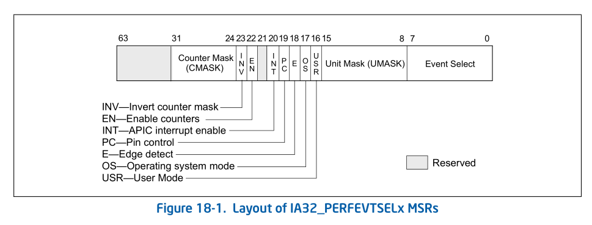
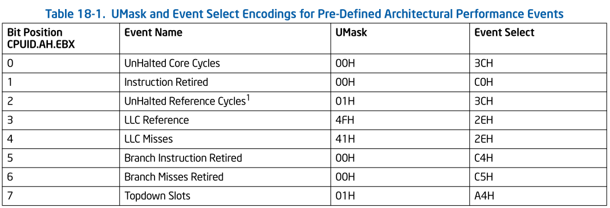
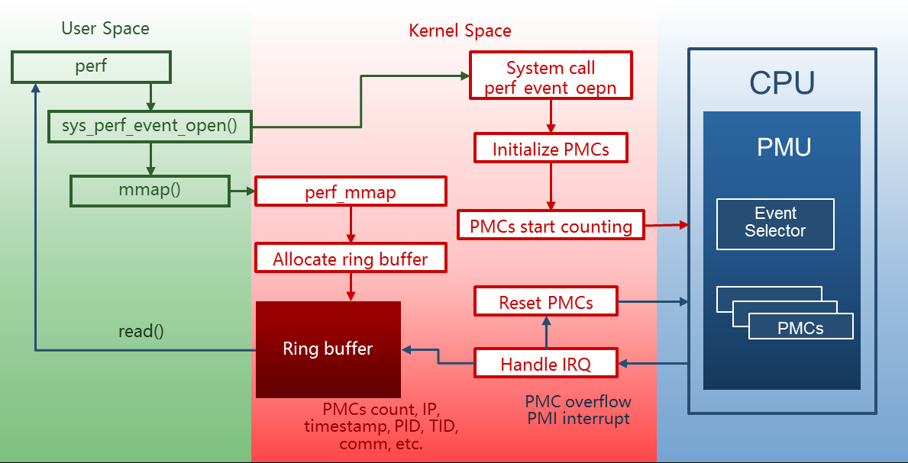

# perf & PMU

## 性能监控单元 PMU

性能监控单元（PMU）允许软件针对某种硬件时间设置计数器，由硬件统计该事件的发生次数。

PMU 主要包括两类寄存器（MSR）：

- 性能事件选择寄存器：软件对该寄存器编程指定要监控的事件
- 性能监控计数寄存器（PMC）：指定的性能事件在 PMC 中计数

性能监控支持两种模式：**计数**和**基于中断的事件采样**，具体后面会介绍。

对于不同的处理器架构以及型号，支持的 PMU 事件种类和数量，及 PMU 寄存器的格式可能存在不同。

Intel 手册中就有 5 种不同架构的性能监控。（架构性能监控是指架构通用的性能监控信息，包括 SEL 和 PMC 格式和地址等。另外还有根据处理器型号不同而不同的性能事件，需要根据具体型号检索 https://perfmon-events.intel.com/）

下面以其中 Version 1 为例，介绍 Intel 处理器的性能监控支持。

### Architectural Performance Monitoring V1

配置架构性能监控事件需要对**性能事件选择寄存器**进行编程，即IA32_PERFEVTSELx MSR（以下简称 SEL），其数量有限。性能事件监控结果记录在**性能监控计数器**，即 IA32_PMCx MSR（以下简称 PMC）。两种寄存器成对使用。

同一版本的架构性能监控中：

- SEL 格式一致
- SEL 和 PMC 的 MSR 地址相同
- 每个逻辑处理器都有自己的一组 SEL 和 MSR，超线程之间不共享。

CPUID.0AH 提供了以下信息：

- 单个逻辑处理器中软件可用的 PMC 数量（SEL 与 PMC 成对）。
- 每个 PMC 支持的位数。
- 单个逻辑处理器支持的架构性能监控事件数量。

下图为 V1 中 SEL 寄存器的格式：

其中重要的字段：

- Event select field bit 0-7：选择用于检测微架构条件的事件逻辑单元
- Unit mask（UMASK）field bit 8-15：上个字段选中的逻辑单元可能有监控多个事件的能力，使用 UMASK 指定具体事件。
- Counter mask（CMASK）field bit 24-31：如果该域的值大于 0，那么该值会与一个时钟周期内产生的事件数相比较
  - 如果产生的事件数大于 CMASK 值，那么 PMC 加一
  - 否则 PMC 不增加

其他硬件提供的特性：

- 固定功能性能计数器和相关的控制寄存器
  - Fixed performance counters
  - 一些计数器只能度量某一特定的事件，而不能配置成度量不同的事件的通用目的 PMC。
- 全局控制寄存器
  - Global control registers
  - 可用于控制所有或一组控制寄存器或计数器的全局控制寄存器

下表展示了架构预定义的性能事件。

## perf 原理

- perf 通过系统调用 `sys_perf_event_open` 在发送监控请求。
- 内核根据 perf 提供的信息在 PMU 上初始化一个 PMC。
- PMC 随指定事件发生而累加。
- 在 PMC 溢出时，PMU 触发一个 PMI 中断。
- 内核在 PMI 中断处理函数中保存以下信息，形成一个采样：
  - PMC 值
  - 触发中断的指令地址 RIP
  - 时间戳
  - 进程 PID、TID 等信息。
- 内核将采样放入与用户空间共享的 ring buffer。
- perf 利用 mmap 从 ring buffer 读取采样并解析。
  - 根据 pid 等信息找到进程
  - 根据 RIP 和 ELF 文件符号表等信息找到触发 PMI 中断的函数

## perf 两种模式

根据处理器性能监控支持，perf 支持两种模式：

- 基于计数
  - 给定时间内的事件发生次数会被记录下来
  - perf 读取相应的 PMC 获取次数
  - perf stat 选项就是单纯统计计数
- 基于事件采样
  - 设置事件每发生 N 次产生一次中断，由中断处理函数记录相关信息
  - perf 读取并解析采样信息
  - perf top 和 record 都是采样模式
- 基于事件采样的采样周期：perf 允许使用两种模式表示采样周期
  - 事件发生次数
    - 用户指定次数，样本之间的采样周期固定
    - 如 `perf record -e cache-misses -c 1000 -a -- sleep 5`
      - 设置 cache-misses 事件每发生 1000 次采样一次
      - sleep 可以指定采样的总时间，单位是秒，支持浮点。
  - 采样频率（每秒采样数）
    - perf 默认方式 1000Hz
    - 内核动态调整采样周期以达到目标平均速率
    - 如 `perf record -F 99 -e cache-misses -a -- sleep 10`
      - 设置以 99Hz 的频率对 cache-misses 事件采样
- Intel PEBS 机制
  - PMC 溢出到处理器响应 PMI 中断之间存在延迟，导致 PMI 中断处理函数收集到错误的指令地址
  - PEBS 机制，在 PMC 溢出时将处理器上下文直接保存到内存，而不是在响应中断后才保存
  - perf 中使用事件名后缀 :p、:pp 或 :ppp 指定采样的精度。

## perf 使用

PMC 数量有限，由具体处理器型号决定。一般开启超线程后每个逻辑处理器有 4 个通用的 PMC，**同时能监控的性能事件有限**。

perf 的几种监控粒度：

- `-a` 选项，对系统上所有 CPU 进行监控
- `-C <cpu-list>` 选项，对指定 CPU 进行监控
- `-p <pid-list>` 选项，对指定进程监控
- `-t <tid-list>` 选项，对指定线程监控
- `-u <uid>` 选项，对指定 uid 拥有线程监控
- `--per-thread` 选项，

后几种监控粒度是由内核提供支持。硬件的 PMC 数量限制了同时能监控的事件数量（事件数多于 PMC 数，内核会使用时间多路复用，为每个事件提供访问监控硬件的机会。运行结束后，perf 根据启用的总时间与运行时间来缩放计数），而**同时监控的进程数量由内核实现决定**（由内核中的 PMI 中断处理等功能确定从硬件获取的事件数是属于哪个进程或线程的）。

关于监控的时间粒度，根据上节归纳的 perf 工作模式，可以使用 sleep 命令指定一次监控的总时间来控制粒度，还可以根据事件发生次数采样。