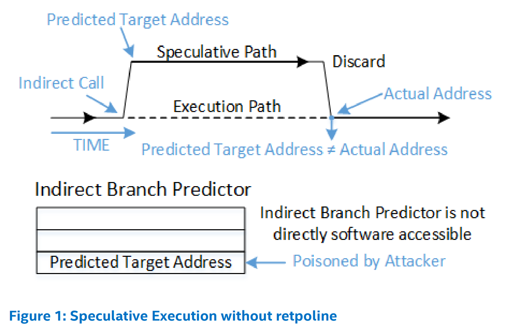
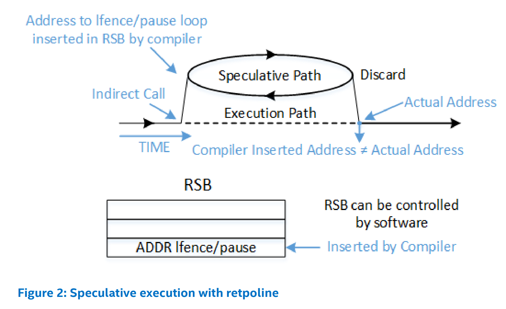
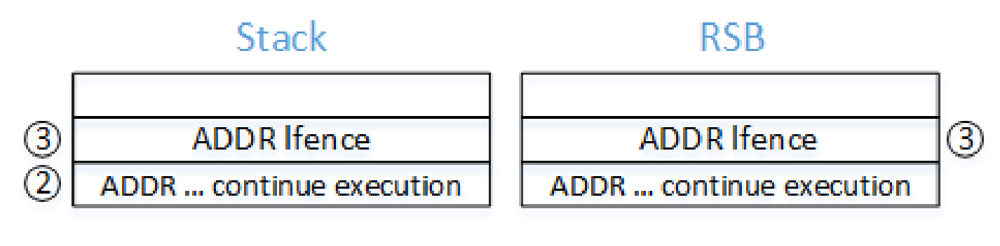
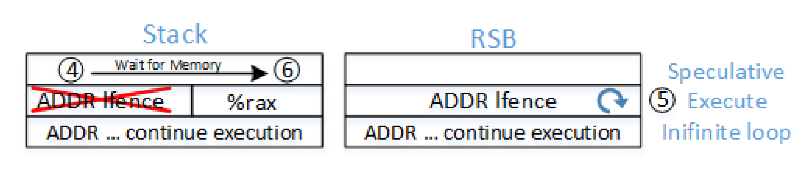
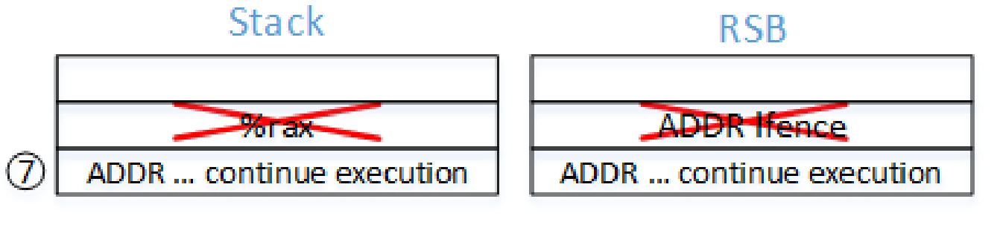
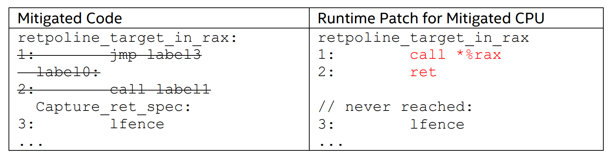

# Retpoline

[Retpoline in Kernel](http://happyseeker.github.io/kernel/2018/05/31/retpoline-in-kernel.html)

[retpoline 原理与部署](http://terenceli.github.io/%E6%8A%80%E6%9C%AF/2018/03/24/retpoline)

[Branch Target Injection/CVE-2017-5715/INTEL-SA-00088](https://www.intel.com/content/www/us/en/developer/articles/technical/software-security-guidance/advisory-guidance/branch-target-injection.html)

[Indirect Branch Restricted Speculation, IBRS](https://www.intel.com/content/www/us/en/developer/articles/technical/software-security-guidance/technical-documentation/indirect-branch-restricted-speculation.html)

[Single Thread Indiect Branch Predictors, STIBP](https://www.intel.com/content/www/us/en/developer/articles/technical/software-security-guidance/technical-documentation/single-thread-indirect-branch-predictors.html)

[Indirect Branch Predictor Barrier, IBPB](https://www.intel.com/content/www/us/en/developer/articles/technical/software-security-guidance/technical-documentation/indirect-branch-predictor-barrier.html)

[Retpoline: A Branch Target Injection Mitigation](https://www.intel.com/content/www/us/en/developer/articles/technical/software-security-guidance/technical-documentation/retpoline-branch-target-injection-mitigation.html)

!!! tldr

    retpoline 是 Google 开发的针对 Spectre v2 的漏洞环节技术，性能影响较低，因此进入主线内核。之前看的 static_call 机制在此基础上做了进一步优化。

## Spectre v2

Branch Target Injection（分支目标注入）针对处理器推测执行使用的的间接分支预测器。通过控制分支预测器操作（training），攻击者可以让处理器推测执行某些指令，利用这些指令对缓存状态的影响推断数据。

对于条件直接分支，推测执行的代码只有两种选项：分支目标或继续执行，攻击者无能为力。然而，间接分支指令可以在更广泛的目标集合执行代码。分支目标注入的工作原理就是使间接分支推测地执行一段 gadget，创建一个基于受害者敏感数据的侧信道。

处理器的间接分支预测器对以下指令有效：

| Branch type        | Instruction                        | Opcode    |
| ------------------ | ---------------------------------- | --------- |
| Near Call Indirect | CALL r/m16, CALL r/m32, CALL r/m64 | FF /2     |
| Near Jump Indirect | JMP  r/m16, JMP r/m32, JMP r/m64   | FF /4     |
| Near Return        | RET, RET Imm16                     | C3, C2 lw |

分支目标注入漏洞利用的五个组成元素：

1. 受害者拥有想要获取的秘密数据，对于 OS 内核，包括用户权限之外的任何数据。
2. 攻击者需要引用秘密数据，通常是受害者地址空间的指针。受害者和攻击者之前通过公开信道传递指针，如系统调用接口。
3. 在受害者执行的包含易被利用的间接分支部分，引用必须可用。
4. 攻击者影响分支预测推测地错误预测并执行 gadget，通过侧信道（通常是缓存侧信道）泄露秘密数据。
5. gadget 必须在推测窗口执行，当处理器发现预测错误就会关闭窗口。


## Hardware Mitigation

硬件缓解措施使间接分支控制机制，为系统软件提供接口以阻止攻击者控制间接分支预测，比如在恰当的时机使预测器失效。对于现有的处理器，可以通过更新系统软件和处理器微码的方式支持。

设置相应的 MSR 标志位可以开启三种间接分支控制机制：

- IA32_SPEC_CTRL MSR bit-0：Indirect Branch Restricted Speculation, IBRS 限制间接分支推测执行，置位后可以限制间接分支预测，具体是在特权级切换时作用。
- IA32_SPEC_CTRL MSR bit-1：Single Thread Indirect Branch Predictors, STIBP 单线程间接分支预测器，避免分支预测受同驻逻辑核控制。
- IA32_PRED_CMD MSR bit-0：Indirect Branch Predictor Barrier, IBPB 间接分支预测屏障，置位后创建一个屏障，同一逻辑处理器上，屏障之前的执行的软件无法控制屏障之后的分支预测目标。（CPU 不能跨过屏障进行分支预测）主要用于上下文切换。

而 IBRS 会带来难以接受的性能损耗，因此就引入了基于软件的技术，称为 return trampoline，简称 retpoline。其本质就是用代码序列代替间接的近 JMP 和 CALL 指令，改为直接跳转，将分支目标地址放在栈上，使用 RET 指令跳转。下面就来详细看看内核中 retpoline 的实现。

## Retpoline

### Concept

间接分支随处可见。

缓解推测执行安全问题分为两方面：直接操纵推测硬件或间接控制推测行为。前者是通过微码更新或硬件寄存器操作。而间接控制是通过软件限制或约束推测。Retpoline 是一种混合方法，需要更新微码，使某些处理器模型的硬件行为更可预测。主要是一种软件方法，利用底层硬件支持缓解分支目标注入。

分支目标注入需要影响间接分支的推测目标，间接 JMP 和 CALL 指令从间接分支预测器获取最可能的推测执行目标。简介分支预测器是一个较大的硬件结构，操作系统难以管理。Retpoline 不是要管理或预测其行为，而是一种绕过间接预测器的方法。使用 retpoline 前后的间接分支预测流程如下：





RET 指令的预测不同于 JMP 和 CALL 指令，而是依赖于 Return Stack Buffer, RSB 返回栈缓冲区，RSB 就是一个栈，执行 CALL 指令时，push 一项，执行 RET 时 POP 一项，容易由软件控制。

### Implementation

Retpoline 的实现其实就是用一段指令替换之前的间接跳转指令，CPU 推测执行会进入一个死循环。下面是间接 JMP 指令的替换指令序列：

```assembly
# Before
jmp *%rax

# After retpoline
    call load_label
capture_ret_spec:
    pause; lfence
    jmp capture_ret_spec
load_label
    mov %rax, (%rsp)
    ret
```

此例中，要跳转到 RAX 寄存器中的地址。没有 repoline，处理器会从间接分支预测器获取推测可能被攻击者控制的推测执行地址。而这里的 retpoline 序列通过几个节点将推测执行拆分为非推测执行。

1. `call load_label` 将下一条 `pause; lfence` 的地址压栈并填入 RSB，然后跳转。
2. `mov %rax， (%rsp)` 将间接跳转地址（RAX）写到栈顶，此时栈顶的返回地址与 RSB 中不同。
3. 如果在 RET 时处理器推测执行，会根据 RSB 中的地址跳转到 `pause; lfence`，陷入死循环。（后面会介绍这个序列的重要性）
4. 最终，处理器发现推测执行的 RET 地址与内存栈上的地址不同，推测执行停止，然后跳到 RAX 地址处。

对于间接 CALL 指令，方法相同但更复杂：

```assembly
# Before
call *%rax

# After
    jmp label2
label0:
    call label1
capture_ret_spec:
    pause; lfence
    jmp capture_ret_spec
label1:
    mov %rax, (%rsp)
    ret
label2:
    call label0
    ... continue execution
```

1. `jmp label2` 跳转到 `call label0`。
2. `call label0` 将下一条指令地址压栈并填入 RSB，然后跳转。
3. `call label1` 将 `pause; lfence` 的地址压栈并填入 RSB，然后跳转。
4. `mov %rax, (%rsp)` 将间接跳转地址（RAX）写到栈顶，此时栈顶的返回地址与 RSB 中不同。
5. 如果在 RET 时处理器推测执行，会根据 RSB 中的地址跳转到 `pause; lfence`，陷入死循环。
6. 最终，处理器发现推测执行的 RET 地址与内存栈上的地址不同，推测执行停止，然后跳到 RAX 地址处。
7. 当间接 CALL 返回时，根据 RSB 和内存栈中的地址从步骤 2 压栈的地址处继续执行。

内存栈和 RSB 中内容的变化如下：







### Deploying Retpoline

大多数间接分支是由编译器生成的，因此部署 retpoline 需要重新编译需要缓解的软件。支持 retpoline 的编译器可以避免生成易受攻击的间接 CALL 或 JMP 指令。对于不是由编译器生成的代码，如内联汇编，需要手动替换 retpoline 序列。

最好的选择是程序本身在一个集中位置提供 retpoline 序列，让编译器引用这些序列，减少冗余代码。这样为每个间接 call site 提供了更紧凑的指令序列，还将 retpoline 实现集中到一组受控的位置。支持运行时 patching 的程序（如 Linux 内核）还可以评估系统是否受分支目标注入的威胁，从而可以将程序提供的 retpoline 序列替换为非缓解序列。



### Interaction with Control-flow Enforcement Technology, CET

CET 用于防御 ROP 攻击，而 retpoline 与 ROP 方法相似，可能被 CET 误报。为此未来实现了 CET 的 Intel 处理器还应该包括分支目标注入的硬件缓解措施（增强的 IBRS），消除对 retpoline 的需求。在这种处理器上，可以使用运行时 patching 消除与 CET 的冲突。

### Speculation Barriers

Retpoline 序列包括注入 LFENCE、PAUSE 和 INT 3 之类的慢速指令，这些指令仅在死循环的推测执行代码中执行，因此不会对性能产生较大影响。

LFENCE 的体系结构规范定义为：LFENCE 用于确保前面的访存操作完成前，后面的指令不会执行，也就限制了其周围的推测执行。可能会影响处理器性能，但也算是作为缓解推测执行侧信道攻击的工具。

然而，以上的控制行为只在其实际执行（retire 阶段）LFENCE 时才需要，而仅存在于推测执行中的 LFENCE 性能影响可能更小。

PAUSE 其实并不能保证在旧指令执行完成前延迟后续指令。

### Retpoline in Kernel

Linux 内核启用 retpoline 支持需要设置编译选项 CONFIG_RETPOLINE。