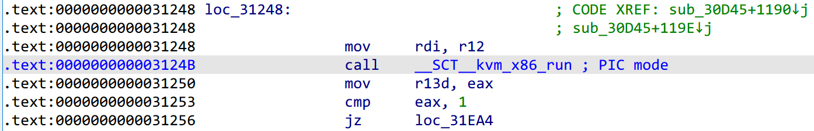
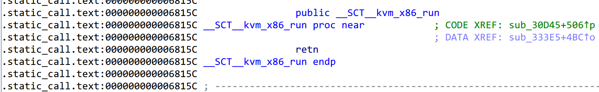
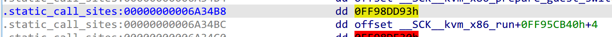
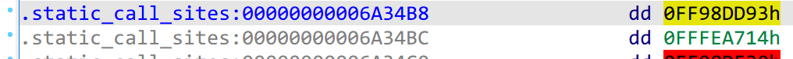
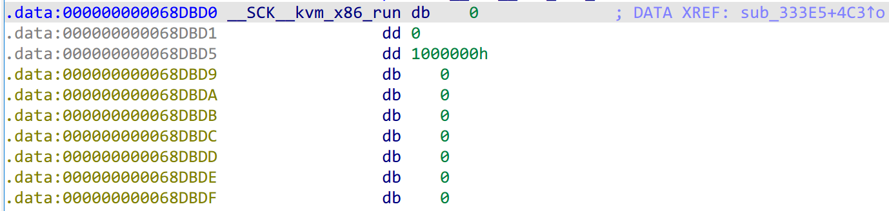
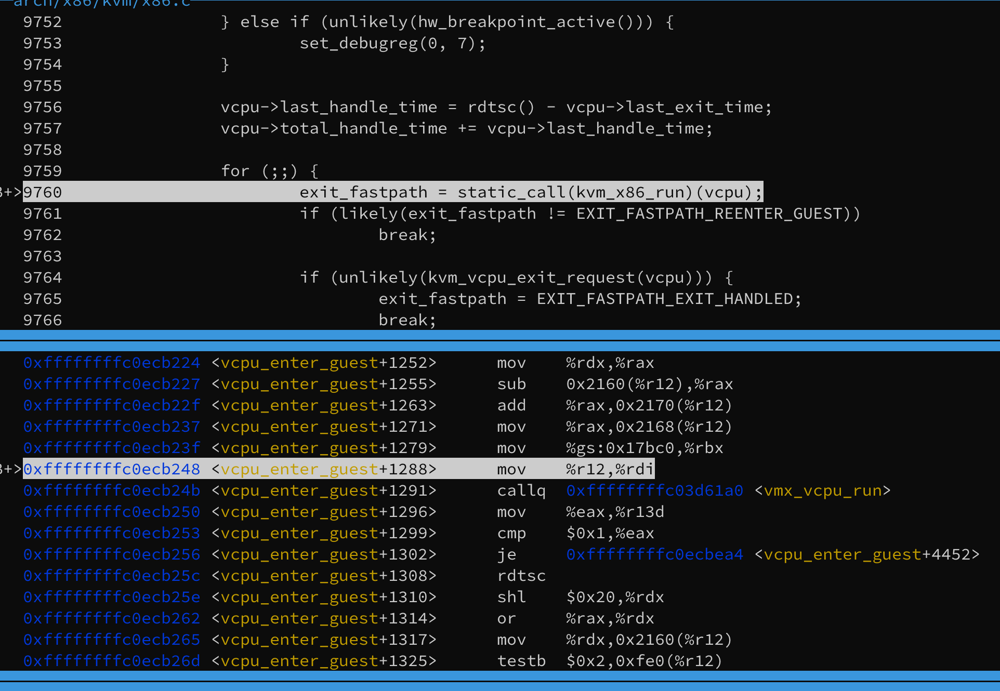

# Linux static_call

[Avoiding retpolines with static calls](https://lwn.net/Articles/815908/)

[Static calls - lwn.net](https://lwn.net/Articles/771209/)

[[PATCH v2 02/13] static_call: Add basic static call infrastructure](https://lore.kernel.org/lkml/20191007083830.64667428.5@infradead.org/)

[PATCH v2 06/13 x86/static_call: Add inline static call implementation for x86-64](https://lore.kernel.org/lkml/20191007083830.87232371.5@infradead.org/)

[Linux Kernel 5.10 Introduces Static Calls to Prevent Speculative Execution Attacks](https://thenewstack.io/linux-kernel-5-10-introduces-static-calls-to-prevent-speculative-execution-attacks/)

!!! tldr

    在看 KVM 代码时发现有 `static_call(kvm_x86_run)(vcpu)` 的用法，查了一下，涉及到 Linux 新引入的 static_call 机制。

从调用代码开始分析，即 `static_call(kvm_x86_run)`，相关的宏定义有：

```c
// include/linux/static_call_types.h
#define STATIC_CALL_TRAMP_PREFIX	__SCT__
#define STATIC_CALL_TRAMP_PREFIX_STR	__stringify(STATIC_CALL_TRAMP_PREFIX)
#define STATIC_CALL_TRAMP_PREFIX_LEN	(sizeof(STATIC_CALL_TRAMP_PREFIX_STR) - 1)
#define STATIC_CALL_TRAMP(name)		__PASTE(STATIC_CALL_TRAMP_PREFIX, name)
#define STATIC_CALL_TRAMP_STR(name)	__stringify(STATIC_CALL_TRAMP(name))

#define __raw_static_call(name)	(&STATIC_CALL_TRAMP(name))
/*
 * __ADDRESSABLE() is used to ensure the key symbol doesn't get stripped from
 * the symbol table so that objtool can reference it when it generates the
 * .static_call_sites section.
 */
#define __STATIC_CALL_ADDRESSABLE(name) \
	__ADDRESSABLE(STATIC_CALL_KEY(name))

#define __static_call(name)						\
({									\
	__STATIC_CALL_ADDRESSABLE(name);				\
	__raw_static_call(name);					\
})

#define static_call(name)	__static_call(name)
```

将 `static_call(kvm_x86_run)(vcpu)` 展开得到（其中 ADDRESSABLE 用于确保符号不从符号表中删除，这里就不展开了）：

```c
({
  __STATIC_CALL_ADDRESSABLE(kvm_x86_run)
  &__SCT__kvm_x86_run
})(vcpu)
```

那么这种形式是如何最终调用到 `vmx_vcpu_run` 的呢。

首先来看没有 static_call 的情况。在 *arch/x86/kvm/x86.c* 中，声明了 `kvm_x86_ops` 结构体，类型是 `kvm_x86_ops`（以下不指明类型，说的都是作为变量的 `kvm_x86_ops`），其成员是一堆函数指针，即 x86 架构下 KVM 的各种操作。对 *x86.c* 来说，并不关心底层是 AMD 还是 Intel，只要能实现 `kvm_x86_ops` 中的函数就行。

以 VMX 为例，在 *arch/x86/kvm/vmx/vmx.c* 中实现各种操作函数，并将其赋给一个 `kvm_x86_ops` 类型的 `vmx_x86_ops`。而 *x86.c* 中如何访问其中的函数呢，是通过 VMX 初始化函数 `vmx_init` 实现的。

`vmx_init` 是 kvm-intel 模块的初始化函数，它会调用 `kvm_init`，即 KVM 的初始化函数，传入的参数就有 `vmx_init_ops`。定义如下：

```c
static struct kvm_x86_init_ops vmx_init_ops __initdata = {
	.cpu_has_kvm_support = cpu_has_kvm_support,
	.disabled_by_bios = vmx_disabled_by_bios,
	.check_processor_compatibility = vmx_check_processor_compat,
	.hardware_setup = hardware_setup,

	.runtime_ops = &vmx_x86_ops,
};
```

其中的 `runtime_ops` 成员指向了 `vmx_x86_ops`。而在 `kvm_init` 中，会调用 `kvm_arch_hardware_setup`。其中就会把 `ops->runtime_ops` 的值复制到 `kvm_x86_ops` 中， 也就是将 `vmx_x86_ops` 的函数指针值暴露给 *x86.c*。这样，*x86.c* 中的函数就可以通过 `kvm_x86_ops.func` 调用所需的操作函数，如在 `vcpu_enter_guest` 中就可以调用 `kvm_x86_ops.run` 从而调用 `vmx_vcpu_run` 进入 VM 执行。

以上是没有 static_call 的情况，而在引入了 static_call 机制之后。在声明 `kvm_x86_ops` 后，定义了一个宏 `KVM_X86_OP`：

```c
// include/linux/static_call_types.h
#define STATIC_CALL_KEY_PREFIX		__SCK__
#define STATIC_CALL_KEY_PREFIX_STR	__stringify(STATIC_CALL_KEY_PREFIX)
#define STATIC_CALL_KEY_PREFIX_LEN	(sizeof(STATIC_CALL_KEY_PREFIX_STR) - 1)
#define STATIC_CALL_KEY(name)		__PASTE(STATIC_CALL_KEY_PREFIX, name)
#define STATIC_CALL_KEY_STR(name)	__stringify(STATIC_CALL_KEY(name))

struct static_call_key {
	void *func;
	union {
		/* bit 0: 0 = mods, 1 = sites */
		unsigned long type;
		struct static_call_mod *mods;
		struct static_call_site *sites;
	};
};

#define DECLARE_STATIC_CALL(name, func)					\
	extern struct static_call_key STATIC_CALL_KEY(name);		\
	extern typeof(func) STATIC_CALL_TRAMP(name);

// arch/x86/include/asm/static_call.h

#define __ARCH_DEFINE_STATIC_CALL_TRAMP(name, insns)			\
	asm(".pushsection .static_call.text, \"ax\"		\n"	\
	    ".align 4						\n"	\
	    ".globl " STATIC_CALL_TRAMP_STR(name) "		\n"	\
	    STATIC_CALL_TRAMP_STR(name) ":			\n"	\
	    insns "						\n"	\
	    ".type " STATIC_CALL_TRAMP_STR(name) ", @function	\n"	\
	    ".size " STATIC_CALL_TRAMP_STR(name) ", . - " STATIC_CALL_TRAMP_STR(name) " \n" \
	    ".popsection					\n")

#define ARCH_DEFINE_STATIC_CALL_NULL_TRAMP(name)			\
	__ARCH_DEFINE_STATIC_CALL_TRAMP(name, "ret; nop; nop; nop; nop")

// include/linux/static_call.h
#define DEFINE_STATIC_CALL_NULL(name, _func)				\
	DECLARE_STATIC_CALL(name, _func);				\
	struct static_call_key STATIC_CALL_KEY(name) = {		\
		.func = NULL,						\
		.type = 1,						\
	};								\
	ARCH_DEFINE_STATIC_CALL_NULL_TRAMP(name)

// arch/x86/kvm/x86.c
#define KVM_X86_OP(func)					     \
	DEFINE_STATIC_CALL_NULL(kvm_x86_##func,			     \
				*(((struct kvm_x86_ops *)0)->func));
#define KVM_X86_OP_NULL KVM_X86_OP
```

在 *arch/x86/include/asm/kvm-x86-ops.h* 中使用了这个宏：

```c
...
KVM_X86_OP(run)
KVM_x86_OP_NULL(handle_exit)
...
```

其实就是为 `kvm_x86_ops` 结构体类型的函数指针成员创建对应的 static_call。以 `KVM_X86_OP(run)` 为例，展开得到：

```c
extern struct static_call_key __SCK__kvm_x86_run;
extern typeof(run) __SCT__kvm_x86_run;
struct static_call_key __SCK__kvm_x86_run = {
  .func = NULL,
  .type = 1,
};
asm(".pushsection .static_call.text, \"ax\"		\n"	\
	    ".align 4						\n"	\
	    ".globl " __SCT__kvm_x86_run "		\n"	\
	    __SCT__kvm_x86_run ":			\n"	\
	    ret; nop; nop; nop; nop "						\n"	\
	    ".type " __SCT__kvm_x86_run ", @function	\n"	\
	    ".size " __SCT__kvm_x86_run ", . - " __SCT__kvm_x86_run " \n" \
	    ".popsection					\n")
```

通过 `KVM_X86_OP` 在二进制文件中为符号 `__SCT__kvm_x86_run` 创建了一个临时的 trampoline，临时是因为在之后就会更新。

上面提到，在 `kvm_arch_hardware_setup` 中，会将 `vmx_x86_ops` 的值复制到 `kvm_x86_ops`，而在启用 static_call 机制后，紧接着要做的就是调用 `kvm_ops_static_call_update` 更新由 *kvm-x86-ops.h* 中定义的 static_call。

```c
static inline void kvm_ops_static_call_update(void)
{
#define KVM_X86_OP(func) \
	static_call_update(kvm_x86_##func, kvm_x86_ops.func);
#define KVM_X86_OP_NULL KVM_X86_OP
#include <asm/kvm-x86-ops.h>
}
```

重新定义了 `KVM_X86_OP` 然后更新所有的函数指针的 static_call。

```c
// include/linux/static_call.h
#define STATIC_CALL_TRAMP_ADDR(name) &STATIC_CALL_TRAMP(name)

#define static_call_update(name, func)					\
({									\
	typeof(&STATIC_CALL_TRAMP(name)) __F = (func);			\
	__static_call_update(&STATIC_CALL_KEY(name),			\
			     STATIC_CALL_TRAMP_ADDR(name), __F);	\
})
```

还是以 `KVM_X86_OP(run)` 为例，展开得到：

```c
typeof(__SCT__kvm_x86_run) __F = kvm_x86_ops.run;
__static_call_update(&__SCK__kvm_x86_run, &__SCT__kvm_x86_run, __F);
```

实际更新的操作在 `__static_call_update` 中：

```c
// kernel/static_call.c
void __static_call_update(struct static_call_key *key, void *tramp, void *func)
{
	struct static_call_site *site, *stop;
	struct static_call_mod *site_mod, first;

	cpus_read_lock();
	static_call_lock();

	if (key->func == func)
		goto done;

	key->func = func;

	arch_static_call_transform(NULL, tramp, func, false);
  ...
}
```

后面的代码比较复杂，出现了两个结构体 `static_call_mod` 和 `static_call_site`。其实在之前已经用过，在 `static_call_key` 中有一个 union 成员：

```c
// include/linux/static_call_types.h
struct static_call_key {
	void *func;
	union {
		/* bit 0: 0 = mods, 1 = sites */
		unsigned long type;
		struct static_call_mod *mods;
		struct static_call_site *sites;
	};
};

/*
 * The static call site table needs to be created by external tooling (objtool
 * or a compiler plugin).
 */
struct static_call_site {
	s32 addr;
	s32 key;
};

// include/linux/static_call.h
struct static_call_mod {
	struct static_call_mod *next;
	struct module *mod; /* for vmlinux, mod == NULL */
	struct static_call_site *sites;
};
```

暂时不去管其中的细节，只关心对于 `KVM_X86_OP(run)` 是如何实现 `static_call(kvm_x86_run)` 调用 `vmx_vcpu_run` 的。

`__static_call_update` 的三个参数分别为：`&__SCK__kvm_x86_run, &__SCT__kvm_x86_run, vmx_vcpu_run`，而在其中的 `arch_static_call_transform` 函数中有：

```c
// arch/x86/kernel/static_call.c
static inline enum insn_type __sc_insn(bool null, bool tail)
{
	/*
	 * Encode the following table without branches:
	 *
	 *	tail	null	insn
	 *	-----+-------+------
	 *	  0  |   0   |  CALL
	 *	  0  |   1   |  NOP
	 *	  1  |   0   |  JMP
	 *	  1  |   1   |  RET
	 */
	return 2*tail + null;
}

static void __ref __static_call_transform(void *insn, enum insn_type type, void *func)
{
	const void *emulate = NULL;
	int size = CALL_INSN_SIZE;
	const void *code;

	switch (type) {
    ...

	case JMP:
		code = text_gen_insn(JMP32_INSN_OPCODE, insn, func);
		break;
  ...
  }

	if (memcmp(insn, code, size) == 0)
		return;

	if (unlikely(system_state == SYSTEM_BOOTING))
		return text_poke_early(insn, code, size);

	text_poke_bp(insn, code, size, emulate);
}

void arch_static_call_transform(void *site, void *tramp, void *func, bool tail)
{
	mutex_lock(&text_mutex);

	if (tramp) {
		__static_call_validate(tramp, true);
		__static_call_transform(tramp, __sc_insn(!func, true), func);
	}
...
}
```

`__static_call_transform` 参数为 `&__SCT__kvm_x86_run, JMP, vmx_vcpu_run`，调用 `text_gen_insn` 生成一个目的地址为 `vmx_vcpu_run` 的 JMP 指令，然后使用 `text_poke_early` 将这条指令复制到 `__SCT__kvm_x86_run` 处，覆盖之前的 ret。

即将 `` 处指令替换为目标为的 JMP 指令。`tramp` 即 `__SCT__kvm_x86_run` 从原来的 `ret; nop; nop; nop; nop` 替换了 `JMP vmx_vcpu_run`。

现在，执行到 `static_call(kvm_x86_run)` 即指令 `call __SCT__kvm_x86_run`，执行 `JMP vmx_vcpu_run`，即跳转到目标函数，JMP 没有改变栈结构，在 ret 时会直接返回到之前 call 指令压栈的返回地址，即调用 `static_call(kvm_x86_run)` 处。

仍存在的问题是还是依赖于 trampoline，根据 *include/linux/static_call.h* 中的注释和各种 patch 的相关说明，启用 static_call inline 会在系统运行时 patch 内核，直接调用目标函数。

在 `__static_call_update` 函数的后半段，根据 key 对应的 mod 和 site 进行处理。但对于 KVM 中的 static_call，在定义之后没有看到对 mod 和 site 的修改，所以这里暂且认为都是 NULL（key 中的 type, mod, site 组成 union，定义是只设置了 type=1，而在后续使用 mod 或 site 的时候做了 &~1 的操作，也就是去掉了 type）。

那这样似乎 KVM 并没有做 inline static_call 的优化。放下代码，去看实际的二进制文件。

在 *kvm.ko* 文件中的 `static_call(kvm_x86_run)` 部分如下：





搜索 `__SCK__kvm_x86_run`，在 .static_call_sites 段中找到：



这个 offset 是 ida 的分析结果，而转换成十六进制为：



这个段里的数据应该都是 `static_call_site` 结构体，也就是 addr 和 key，这让我联想到在看 `__static_call_update` 函数时看到两个函数：

```c
static inline unsigned long __static_call_key(const struct static_call_site *site)
{
	return (long)site->key + (long)&site->key;
}

static inline void *static_call_addr(struct static_call_site *site)
{
	return (void *)((long)site->addr + (long)&site->addr);
}
```

两个函数都将 site 的成员与其地址相加，而在此处，我们也尝试做这样的运算得到：

```python
>>> hex(0x6A34B8+0xFF98DD93)
'0x10003124b'
>>> hex(0x6A34BC+0xFFFEA714)
'0x10068dbd0'
```

前者是 addr+&addr，得到的是 `call __SCT__kvm_x86_run` 这条指令的地址，而后者是 key+&key，得到的是 `__SCK__kvm_x86_run` 的地址。



同时，我们还知道了，KVM 中 static_call 的 site 并不是 NULL，那问题就来了，是在哪里设置了 site。不急，姑且根据二进制文件里的值走一遍 `__static_call_update` 的后续流程。最终又会调用 `arch_static_call_transform` 函数，参数为 `site_addr, NULL, vmx_vcpu_run, 0`，其中 site_addr 就是 call 指令所在地址。也就是说这里即将 patch call 指令，将 static_call 从 trampoline 改为 inline。

```c

static void __ref __static_call_transform(void *insn, enum insn_type type, void *func)
{
	const void *emulate = NULL;
	int size = CALL_INSN_SIZE;
	const void *code;

	switch (type) {
	case CALL:
		code = text_gen_insn(CALL_INSN_OPCODE, insn, func);
		if (func == &__static_call_return0) {
			emulate = code;
			code = &xor5rax;
		}
    ...
  ...
}

void arch_static_call_transform(void *site, void *tramp, void *func, bool tail)
{
	mutex_lock(&text_mutex);

  ...

	if (IS_ENABLED(CONFIG_HAVE_STATIC_CALL_INLINE) && site) {
		__static_call_validate(site, tail);
		__static_call_transform(site, __sc_insn(!func, tail), func);
	}

	mutex_unlock(&text_mutex);
}
```

还是调用 `text_gen_insn` 生成了一个目的地址为 `vmx_vcpu_run` 的 call 指令，覆盖到原 call 指令地址处，实现了 inline static_call 的优化。

查看 patch 后的二进制文件，gdb 双机调试，可以看到在 `static_call(kvm_x86_run)` 处指令为直接 callq 到 `vmx_vcpu_run`：



到这里，问题只剩下内核在哪里设置 static_call_site 的值。

回头再看几个 static_call 相关文件的注释：

```c
// include/linux/static_call_types.h
/*
 * The static call site table needs to be created by external tooling (objtool
 * or a compiler plugin).
 */

// include/linux/static_call.h
/*
 * Implementation details:
 *
 *   If the arch has CONFIG_HAVE_STATIC_CALL_INLINE, then the call sites
 *   themselves will be patched at runtime to call the functions directly,
 *   rather than calling through the trampoline.  This requires objtool or a
 *   compiler plugin to detect all the static_call() sites and annotate them
 *   in the .static_call_sites section.
 */

// arch/x86/include/asm/static_call.h
/*
 * For CONFIG_HAVE_STATIC_CALL_INLINE, this is a temporary trampoline which
 * uses the current value of the key->func pointer to do an indirect jump to
 * the function.  This trampoline is only used during boot, before the call
 * sites get patched by static_call_update().  The name of this trampoline has
 * a magical aspect: objtool uses it to find static call sites so it can create
 * the .static_call_sites section.
 */ 
```

大概了解流程：

objtool 在编译时负责扫描 `__SCT__` 开头的符号，构造 .static_call_sites 段，内核运行时先从这个段加载 mod 和 site 等数据结构，然后据此进行 static_call_update 操作。

过多的细节就不再展开，代码是看不完的，越看越多。