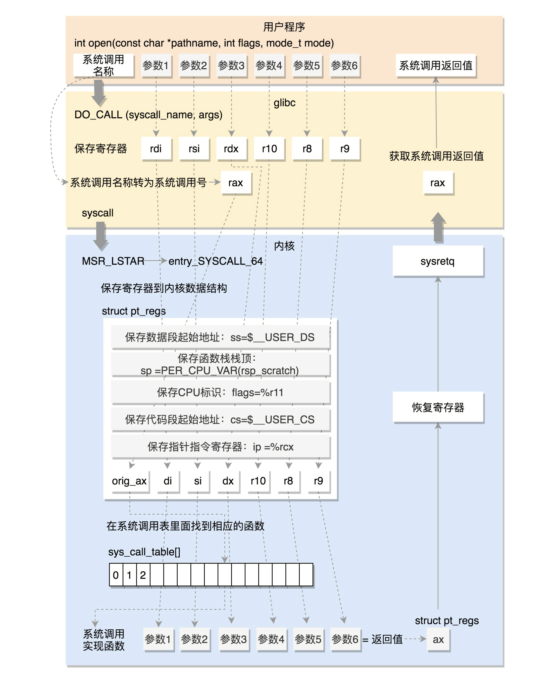

# Linux system call

[Linux 系统调用](https://www.cnblogs.com/schips/p/linux_syscall.html)

[Linux HOOK 系统调用（基于 4.18.0 内核）](https://www.jianshu.com/p/ec279253f377)

[Linux 系统调用内核源码解析（基于 4.18.0-87 版本内核）](https://blog.csdn.net/weixin_42915431/article/details/105747994)

- int 0x80
- syscall
- sysenter

Linux 64 位系统调用传参。

