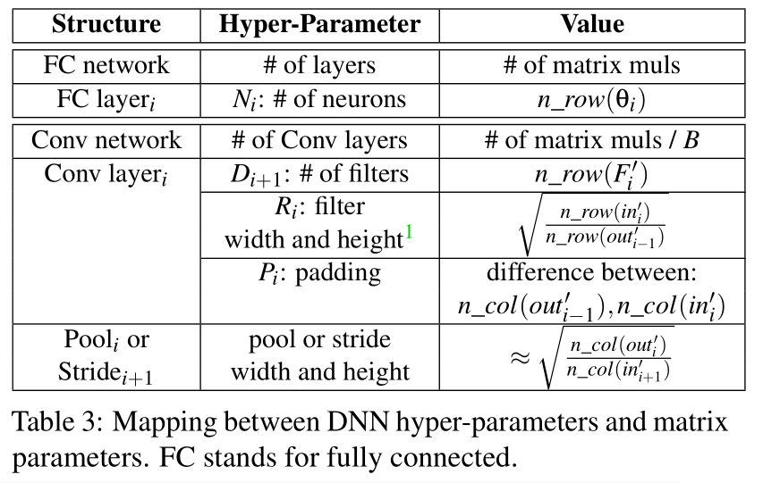
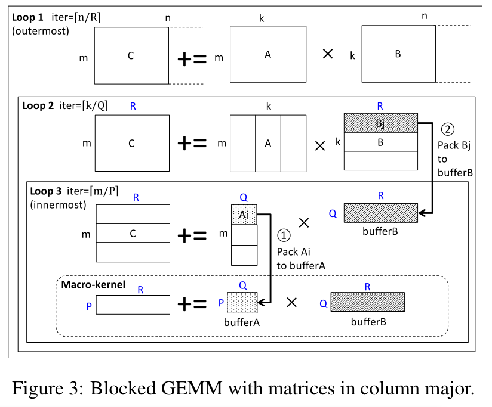
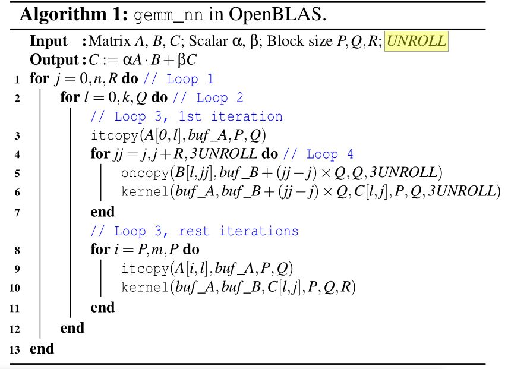
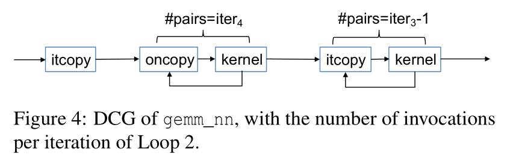

# Cache Telepathy：Leveraging Shared Resource Attacks to Learn DNN Architectures

[pdf]([USENIX%202020]%20Cache%20Telepathy%20Leveraging%20Shared%20Resource%20Attacks%20to%20Learn%20DNN%20Architectures.pdf)

## Abstract

DNN 引起良好的精度得以迅速普及。一个 DNN 的架构（超参数）决定了它的准确率和性能，通常是保密的。攻击云中的 DNN 而获取其架构具有潜在的商业价值。

本文提出了 Cache Telepathy，利用缓存侧信道获取 DNN 架构的有效机制。攻击基于 DNN 的推理很大程度上依赖于 tiled GEMM，DNN 的架构参数决定了 GEMM 的调用数量和矩阵维数。这些都可以从缓存侧信道泄露。

使用 Prime+Probe 和 Flush+Reload 攻击运行在 OpenBLAS 和 Intel MKL 库的 VGG 和 ResNet DNN。VGG-16 搜索空间从 $5.4 \times 10^{12}$ 减到 16，ResNet-50 从 $6\times 10^{46}$ 减到 512。

## Introduction

MLaaS，提供 DNN 的基础设施。可信客户像 MLaas 服务提供商提交 DNN 或训练数据，服务提供商托管 DNN，允许源程的非可信用户提交 DNN 查询并收费。攻击者在现代 CPU 上通过缓存侧信道攻击获取云上 DNN 的参数信息。

### Contribution

1. 分析 DNN 超参数与 GEMM 调用及其参数的映射关系
2. 实现了第一次使用缓存侧信道攻击来提取 CPU 上的 DNN 架构
3. 评估了对 VGG 和 ResNet DNN 的攻击

## Background

### DNN

深度神经网络 DNN 是一种 ML 算法，使用了多层非线性处理单元进行特征提取和转换。主要有全连接神经网络（多层感知器）和 CNN。

DNN 架构，即 超参数，给定了网络结构：

1. 层数
2. 层类型，全连接、卷积、池
3. 层之间的连接，包括顺序和非顺序连接。非顺序的可能是把前两层的输出相加作为下一层的输入。
4. 每层的超参数，每层的神经元数，过滤器数量、大小、步长。
5. 每层的激活函数

每层 DNN 的计算都涉及到对输入神经元的乘积累加 multiply-accumulate，DNN 权重用来指定运算此属。全连接的层中，每条边就是一个带权值的 MACC，卷积层的每个过滤器就是一个多维的权重数组。用作滑动窗口计算神经元点积。

DNN 训练阶段就是从网络结构和训练集开始，试图找到 DNN 的权值以最小化预测误差。训练在 GPU 上进行，而推理阶段一般就在 CPU 上进行。

### 以往的隐私攻击都需要 DNN 架构

主要有三种 DNN 的隐私攻击，目标不同，都需要知道 DNN 结构。

- 模型提取攻击，攻击者想要获取与原网络足够相近的网络。开始知道 DNN 结构，创建一个合成的数据集，从原网络请求分类结果，使用这些结果用原结构训练出网络。
- 成员推断攻击，推理原训练集的组成，数据样本在训练集中的概率。也需要知道 DNN 结构，创建多个合成数据集，根据这个结构训练出多个网络，在这些网络上运行推理，其中一些输入是在训练集中，一些不在。然后比较结果找出训练集中的数据输出的模式。这些信息用于推断原训练集的组成。特别的，给定一个数据样本，它们在原网络上推理，获取输出查看这个输出是否与之前获得的模式匹配，越匹配就说明越有可能存在于原训练集。
- 超参数窃取攻击，窃取 ML 算法中使用的损失函数和正则化项。先通过模型提取攻击获取 DNN 权值，然后找到最小化训练预测始误的损失函数。

### 基于缓存的侧信道攻击

- Flush+Reload 要求攻击者与受害者共享敏感数据，可以通过页面重复数据消除技术 page de-duplication 实现。flush --> wait --> reload
- Prime+Probe 不要求页共享。构造冲突地址集（驱逐集）。先填充驱逐集到 cache，wait，最后 probe，判断受害者是否访问了 line。

### 威胁模型

缓存计时攻击以快速减小 DNN 结构的搜索空间，依赖于以下的假设。

- 黑盒执行，黑河攻击中，攻击者只能通过官方查询接口访问 DNN。攻击者实现不知道 DNN，包括超参数、权重和训练集。
- 假设攻击者进程可以使用现有的一些技术与运行 DNN 推理的受害者进程定位到同一个处理器芯片上。现在的 MLaaS 允许用户上传自己的代码进行训练和推理。攻击者可以将自己伪装成 MLaaS 进程，而云调度程序很难区分。
- 攻击者可以分析受害者使用的 ML 框架和线性代数库。

## 攻击概览

Cache Telepathy 的目标就是大幅减小目标 DNN 架构的搜索空间。先讨论攻击如何帮助其他的 DNN 隐私攻击，然后概述攻击过程。

为其他攻击提供基本的初始化步骤。

攻击基于两点：

- 首先，DNN 推理严重依赖 GEMM。分析了 GEMM 在 ML 框架中的应用，给出了 DNN 超参数与矩阵参数之间的映射关系。
- 其次，高性能的 GEMM 算法易受缓存侧信道攻击，因为它们都是通过矩阵 tiling 在缓存层次进行调整。也就是把矩阵分块，避免 cache conflict。当分块大小公开或者容易推断时，攻击者可以利用缓存侧信道计算块数从而知道矩阵维度。

Cache Telepathy 包括缓存攻击和后续处理步骤。首先通过缓存攻击监控矩阵乘法获取矩阵参数。然后基于 DNN 超参数与矩阵参数的映射关系逆向 DNN 架构。最后对剩余未发现超参数的可能值剪枝，生成一个搜索空间。如果我们生成合理数量的候选结构，其超参数与原网络相同或相似，则攻击成功。

## 将 DNN 映射到矩阵参数

DNN 超参数如何映射到矩阵参数。对于顺序连接的 DNN。

经过一顿分析，得到下表：

看不懂就直接跳过了，直接看攻击构造部分。

## 攻击矩阵乘法

设计侧信道攻击来获取矩阵乘法参数。

先分析最近的 BLAS 库，这些库都优化了分块矩阵乘法。介绍如何从 OpenBLAS 的 GEMM 实现获取信息，然后再以 MKL 为例推广到其他库。

### 分析 OpenBLAS

`gemm_nn` 计算 $C=\alpha A\cdot B + \beta C$，维度分别为 [m,k], [k, n], [m,n]。目的就是提取 m, n, k

针对现代的多级缓存层次结构进行优化，使用 Goto's 算法，如下图。

底部的宏内核执行基本操作，将矩阵 A 中的 [P, Q] 块与 B 中的 [Q, R] 块相乘。用汇编写的，通过考虑 CPU 管道结构和寄存器可用性进行优化。块大小使得 A 的 [P, Q] 适合 L2 cache，[Q, R]  适合 L3 cache。

三层循环，三个循环遍历。

内层通过展开循环加速。

### 定位探测地址

要知道 m, n, k，首先要知道上面四个循环的遍历值，然后用两个公式来算。

我们知道 P, Q, R, UNROLL，开源代码里都有。

使用 `itcopy, oncopy, kernel` 函数的地址作为探索地址。

### 提取矩阵维度的过程

通过计算 DCG, Dynamic Call Graph 提取矩阵维度

## GEMM 攻击的推广

攻击可以推广到其他的 BLAS 库，因为都用了分块矩阵乘。

## 环境配置

攻击实施，使用 F+R 和 P+P，攻击者和受害者在不同的物理核上，共享 LLC。

在 F+R 中，攻击者和受害者t通过 page de-duplication 共享 BLAS 库。攻击者探测 itcopy 和 oncopy 中的地址。根据模型，并不需要探测 kernel 函数的地址。

P+P 攻击 LLC，构造两个冲突集，都是每 2000 周期探测。