# EPTI

**EPTI: Efficient Defence against Meltdown Attack for Unpatched VMs**

## Introduction

### 背景和问题

Meltdown 的补丁 KPTI 隔离了用户空间和内核空间的页表，成功阻止内核内存泄漏。但是部署这一补丁往往需要重启，而且往往要更新到新内核版本。更重要的是，在特权级转换时的页表切换（会刷新 TLB）带来巨大性能开销，特别是对系统调用密集型程序产生较大影响。本文提出 EPTI，针对云上虚拟机的 Meltdown 防御方案，性能优于 KPTI。实验结果显示，EPTI 可以达到和 KPTI 相当的安全保证，服务器上的平均性能开销为 6%，比 KPTI 少了大约 45%。

### 研究思路

- EPTI 使用两个 EPT 隔离用户空间和内核空间，所有的内核空间都不会被映射到用户态 EPT 中，实现了与 KPTI 相同的效果。
- EPT 的切换是通过在 VM 中使用硬件特性 EPT switching 实现的，无需 hypervisor 参与。
- EPT switching 不需要刷新 TLB，因为每个 EPT 都有自己的 TLB，因此减少开销。
- EPTI 可以通过虚拟机迁移技术无缝部署在云环境上。

## Motivation and Background

Meltdown

### KPTI

- Linux 4.15 之后，之前的版本可能有问题
- 页表切换，TLB 刷新带来的开销，PCID 可以避免 TLB 刷新，但 Linux 在 4.14 之后才支持。

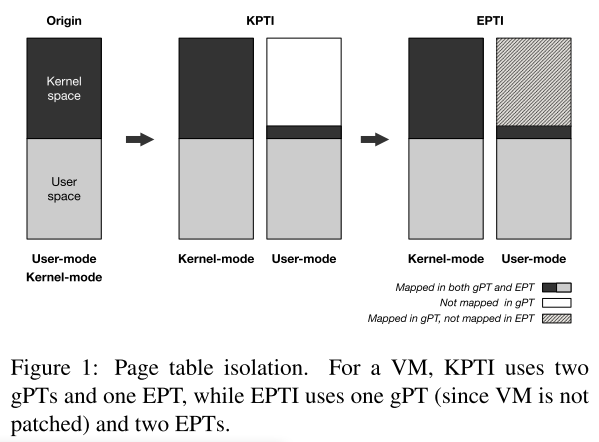

### EPT

gPT: GVA to GPA; EPT: GPA to HPA

- EPT-TLB：加速 GPA to HPA
- combined-TLB：加速 GVA to HPA

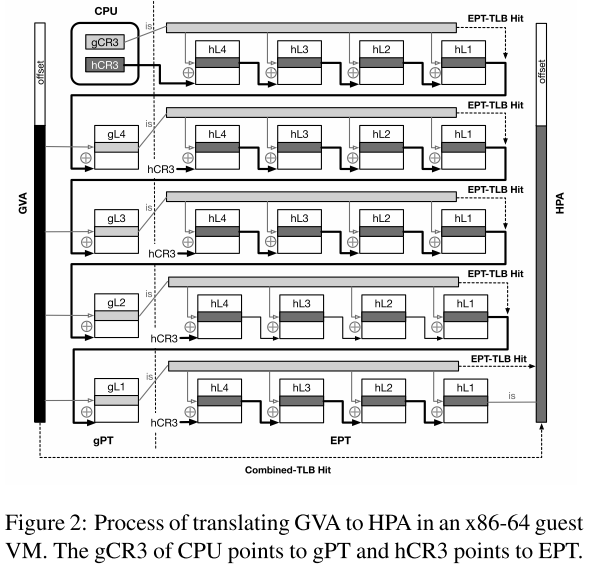

### EPTP switching with VMFUNC

允许 VM 在不触发 VM Exit 的条件下，在由 hypervisor 定义列表之内切换 EPTP。

测试 EPTP switching 时的 TLB 行为：

首先有两个 EPT，EPT-0 和 EPT-1：

1. 先用 invlpg 指令刷新所有 TLB，然后访问 EPT-0 中的目标地址（填充 EPT-0 的 TLB）。然后测试在 EPT-0 和 EPT-1 下目标地址的访问时间，可得每个 EPT 在 TLB 中都有自己的映射区域，互不干扰。
2. 在 EPT-0 下通过写 CR3 和 invplg 刷新 TLB，发现两种操作都会刷新所有 EPT 的 TLB。

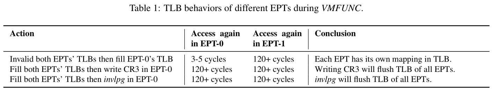

## System Overview

EPTI 的三个目标：

1. 实现与 KPTI 相当的安全级别。
2. 支持对未补丁 VM 的无缝保护。
3. 比 KPTI 更好的性能。

构造两个 EPT，EPTk 和 EPTu，保证用户态程序运行时无法访问到内核空间数据。直观的想法是从 EPTu 中去除所有内核态的 HPA 页映射，但是因为内核会把所有 GPA 直接映射到 GVA，这意味着要删除所有的 GPA 映射，当然不可行。另一种思路是将 gPT 中映射内核空间的页都在 EPTu 中重映射到 0 页。这样当用户进程尝试使用 GVA 访问内核地址时，无法完成地址转换，因为找不到对应的页。这就需要知道哪些页是用来映射内核空间的，EPTI 通过跟踪 gL3 来找。

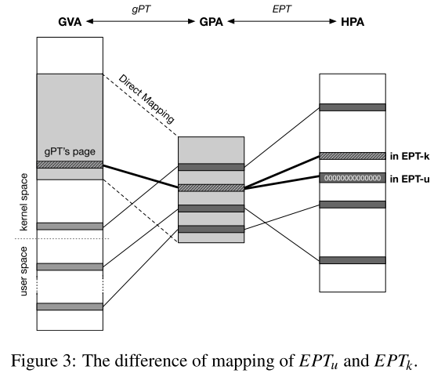

然后要解决的问题是切换 EPT 的时间点，定位特权级切换的指令，使用二进制插桩动态重写内核代码，在内核态出口和入口插入两端跳板代码，实现 EPT switching。这样就可以与虚拟机迁移配合，实现无缝保护。

上述的设计在安全性和性能上还存在很多挑战，比如恶意进程可以通过调用 VMFUNC 切换到 EPTk 来继续实施 Meltdown 攻击。

## Design of EPT Isolation

EPTI 的设计，首先要构造 EPTu，删除其中所有的内核地址映射，这就需要跟踪内核 gPT 页面。然后就是添加跳板代码进行 EPT switching，最后构造 EPTk 让恶意用户无法切换到它。

### 在 EPTu 中将内核空间 gPT 置零

在 EPTu 中将用于内核空间映射的 gPT 对应的页映射到归零的物理页。Linux 使用 4 级页表转换 48 位虚拟机地址，每个进程都有不同的 gL4 页。为了最小化对 EPTu 的修改，只将用于内核地址转换的 gL3 页归零。如下图，内核的 gL3 在不同的 gPT 之间共享。

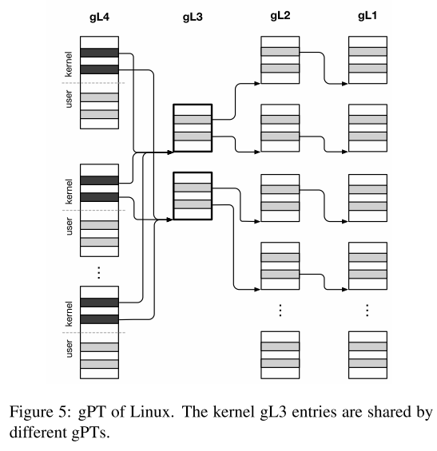

置零之后，在用户态访问内核地址会触发 page fault，因为 GVA 没有映射。而内核运行在 EPTk 上，它无法填充 EPTu 中的归零 gL3 页，攻击者永远无法访问内核内存。

### 追踪 EPTk 的 gPT 页

要进行上一步操作，EPTI 首先要找到内核的所有 gL3 页。具体而言，在 VMCS 中设置 CR3_LOAD_EXITING 标志位，VM 内核修改 CR3 时，会触发 VM Exit，hypervisor 可以遍历 gPT 以获取用于内核空间映射的所有 gL3 页的列表。同时为了监控新分配的 gL3 页，将所有 gL4 页面在 EPTk 中都映射为只读，每次 VM 内核向 gL4 添加新的 gL3 时，都会陷入 hypervisor 更新 gL3 页列表。

### EPT switching 跳板

跳板代码如下：

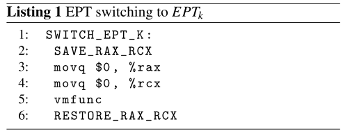

RAX 和 RCX 包含 VMFUNC 索引和参数，而且都是 caller-saved，需要跳板代码保存和恢复寄存器值。需要确保跳板代码在两个 EPT 中都能允许，且有保存 caller-saved 寄存器值的地方。

在 EPTu 中，只有跳板代码所在页能映射到内核空间，同一 gPT 页中的其他的页表项都置零。修改 VM 的内核态入口（IDT 表项或 MSR）指向跳板代码，如下图。在 EPTk 中，EPTI 将跳板代码插入到 VM 内核直接映射区域末端，然后重写内核修改退出点将控制流转移到跳板代码。

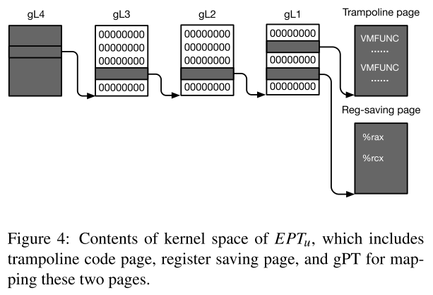

> 这里的意思是跳板代码都在内核态，那么切换到 EPTk 的代码应该插入到内核态入口（中断或系统调用）已经切换到内核态之后（此时还是 EPTu），切换回 EPTu 的代码应该插入在退出点之后（否则在切换回 EPTu 之后就无法执行剩余的内核态代码）。所以就需要在 EPTu 中有映射跳板代码的页表项所在页，但是这个页中的其他页表项应该都置零。

VMFUNC 不会保存任何寄存器值，所以需要在跳板代码里保存，并在之后恢复。有一个问题是多核情况下，其他核可能会覆写保存寄存器值的地址。EPTI 为每个 vCPU 提供一个内存页来保存或恢复寄存器值，而对于这一页，不同 vCPU 会映射到不同的物理页，同一 vCPU 的 EPTk 和 EPTu，这一页会映射到同一物理页。

与实时迁移相结合，EPTI 可以无缝保护而不需要重启 VM。云提供商可以把 VM 迁移走，然后更新 hypervisor，然后再把 VM 迁移回来。在 EPTI 上恢复 VM 执行，需要把跳转代码映射到 VM，重写中断和系统调用入口和退出点，启用 gPT 监控和 VM 内的 EPTP switching。

### 恶意 EPT switching

以上的设计都基于只有内核才能切换 EPT 的假设。但实际上，VMFUNC 也可以在用户态使用，也就意味着恶意进程可以用 VMFUNC 切换到 EPTk 继续实施 Meltdown 攻击。

通过对 Meltdown 的测试发现，虽然 Meltdown 可以读没有权限的内存，但是不能取不可执行的代码。所以将 EPTk 中的用户内存设置为不可执行，这样恶意切换到 EPTk 也无法执行代码。具体而言，EPTI 将 VM 的内核内存映射为可执行，其他都是不可执行。而内核模块是可以通过加载或卸载来动态修改的，EPTI 监控所有对内核模块进行地址转换的 gPT 页面的写操作，因为 Linux 内核为内核模块保留了一个固定的 GVA 区域，所以这个监控只影响加载或卸载内核模块的性能。

## Optimizations

前面也提到，EPTI 需要捕获 VM 中的加载 CR3 和写 gL4 操作，这会带来性能问题：

- EPTI 捕获所有的加载 CR3 操作，但实际上只需要捕获新页表，没用的 CR3 操作会触发无谓的 VM Exit。
- EPTI 把 EPTk 都标记为只读，但是每次访存时，CPU 都会更新页表项的 Access/Dirty 标志位，内核访存会触发大量的 VM Exit。
- 为了跟踪内核的所有 gL3 页，EPTI 捕获所有的 gL4 写操作，但是每个进程都有一个 gL4 页，这些进程的内核地址映射相同，因此可以优化。

### 选择跟踪 VM CR3

EPTI 利用硬件特性减少捕获加载旧 CR3 值触发的 VM Exit。Intel 在 VMCS 中提供了 4 个 CR3_TARGET_VALUE 字段。如果 VM 中加载的 CR3 值与这些值匹配，就不会触发 VM Exit。将满足每秒触发 VM Exit 超过阈值 A，或触发 VM Exit 综述超过阈值 B 的 CR3 值写入 VMCS 的字段。

### 设置 gPT Access/Dirty 标志位

为了消除 CPU 设置 A/D 标志位触发的 VM Exit，需要允许 CPU 在 gPT 而不允许内核这么做。二者访问路径不同：内核通过 GVA（gPT+EPT）写 gPT，CPU 通过 GPA（EPT only）。因此，EPTI 在 EPT 中将 gPT 页 映射为可写，以允许 CPU 更新标志位。为了捕获内核修改 gPT 页，将其 GVA 重定向到在 EPTk 中映射为只读的新 GPA。具体而言：修改目标页的 gL1 表项将其映射到新的 GPA；把新的 GPA 只读映射到原来的 HPA。

### 捕获 gL3 页而不是 gL4

根据以下的观察采用另一种优化方法：

- Linux 内核为不同用途保留内存区域，并且永远不会更改大多数区域的映射。
- 每个 gL3 页可以翻译 512 GB 的虚拟地址空间，在 VM 中，内核 gL3 页的数很少改变。
- 在 Linux 实现中，内核仅在现有 gL3 页的所有条目都在使用中或连续空闲条目不够时才创建新的 gL3 页。

基于以上观察，EPTI 默认直接捕获内核对 gL3 页面的修改。当使用 gL3 的最后一个条目时，意味着稍后内核可能会分配一个新的 gL3 页。EPTI 就开始捕获加载 CR3 和写 gL4 操作，直到分配一个新的 gL3 页。通过这种优化，EPTI 几乎不需要捕获加载 CR3 和 写 gL4 操作，将减少大部分 VM Exit。

## Evaluation

尝试回答几个问题：

1. EPTI 能否防御 Meltdown 攻击
2. EPTI 对内核关键操作（如系统调用）的性能影响
3. EPTI 对真实服务器应用的性能影响
4. EPTI 对多个 VM 的性能影响
5. EPTI 的优化减少了多少 VM Exit
6. EPTI 能否在不同的内核版本是工作，性能如何
7. 能否将 VM 实施迁移到已部署 EPTI 的 hypervisor 上，性能如何

首先是安全性，使用 Meltdown PoC 测试，在 KPTI 和 EPTI 上都无法攻击成功。在 PoC 中使用 VMFUNC 试图切换到 EPTk 以实施攻击，也未成功。

然后就是进行各种性能测试，五个对照系统：Linux without KPTI，KPTI，EPTI 的不同优化版本（EPTI-No, EPTO-CR3, EPTI-CR3+L3）。首先是用 LMBench 测试一些关键操作（如系统调用）的性能表现，结果如下。

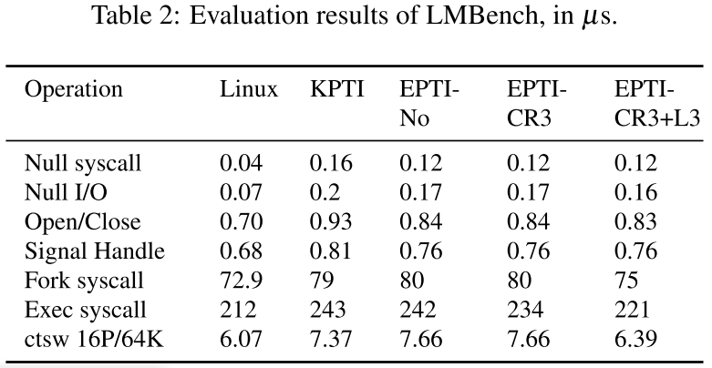

SPEC_CPU 2006 项目之后就是对各种应用进行性能测试，包括 Fs_mark, Redis, PostgreSQL, MongoDB, Apache, Nginx, 多 VM。

然后测试 EPTI 优化对性能和 VM Exit 数量的影响。最后还测试了多个 Linux 内核版本和 VM 实时迁移的性能。

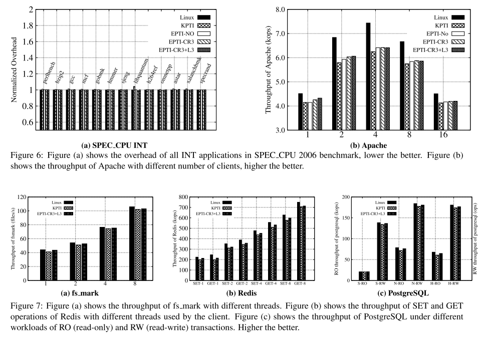

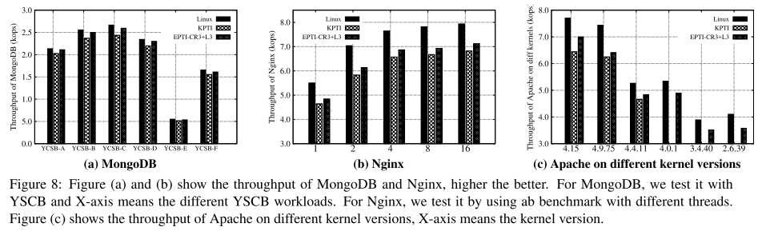

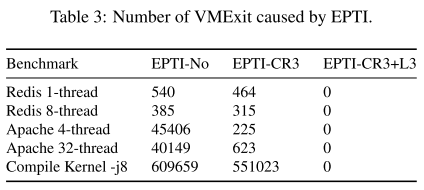

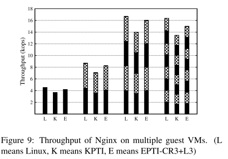

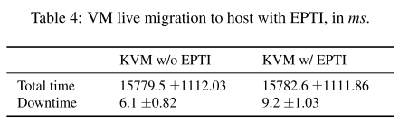

## Discussion

讨论支持 32 位 Linux、支持五级页表、支持 Windows 要做的调整。

由于要修改 VM 内核和 gPT，当前的实现对 VM 不透明。修改不会影响 VMI 和内核完整性检查等。VMM 可以使修改对 VM 透明，如使用 XnR（eXecute-no-Read）阻止内核读取跳板代码页，同时允许执行它。

与 KPTI 相比最大的三个优点：兼容性、性能和无缝部署。

