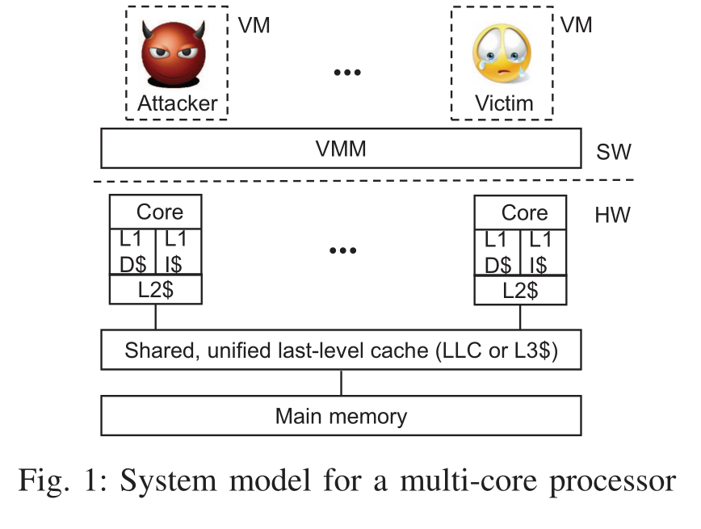
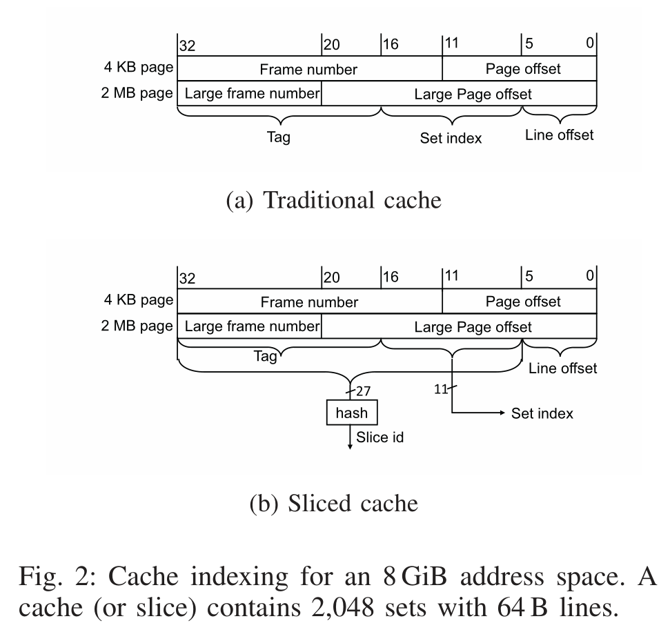
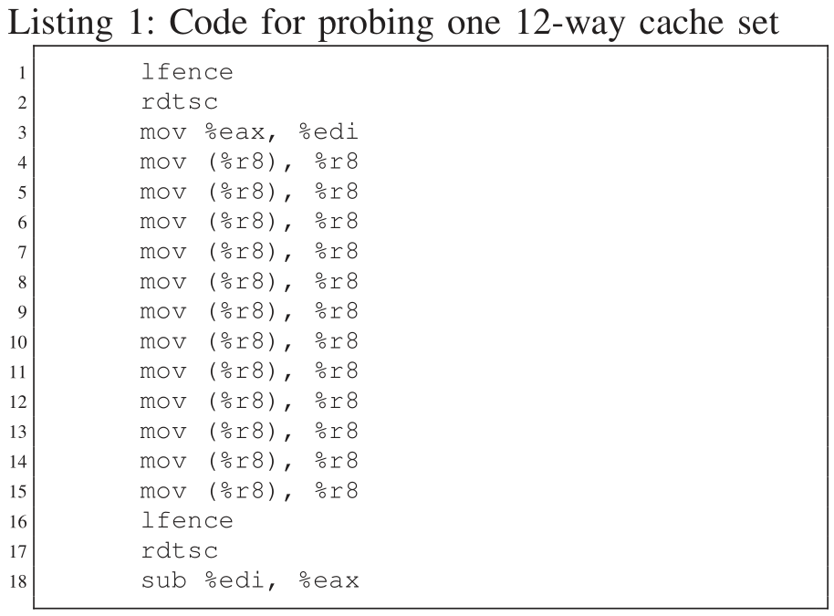
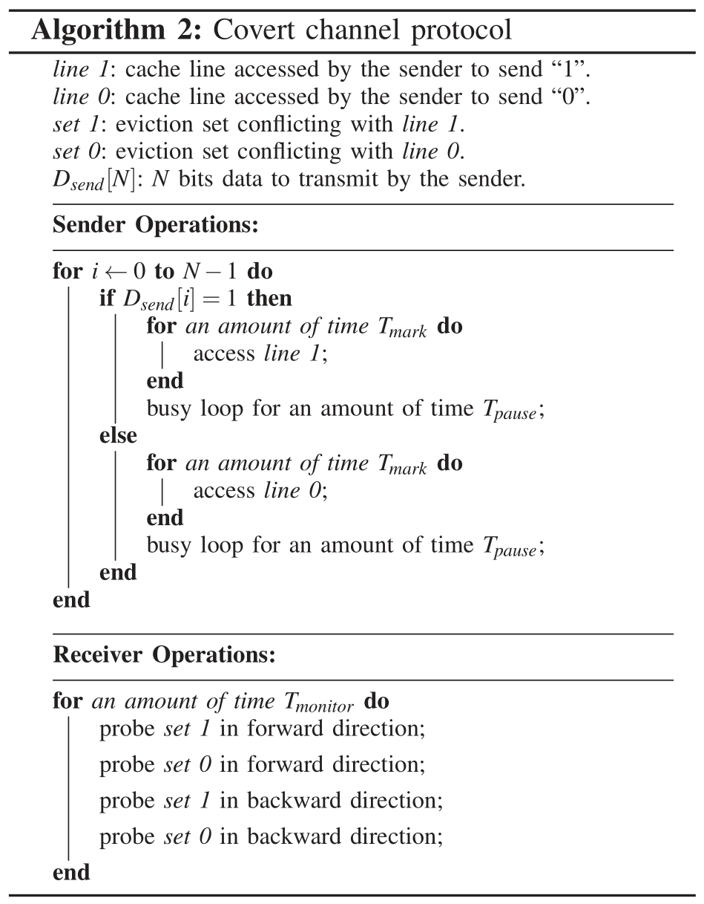
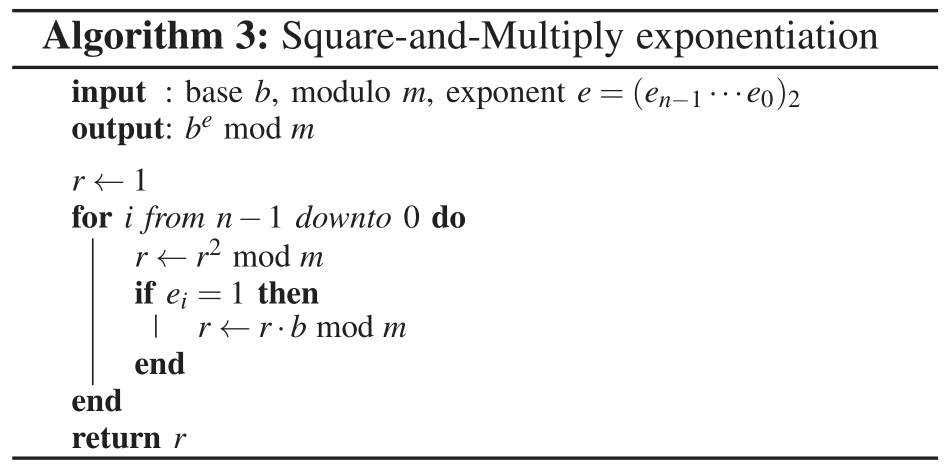
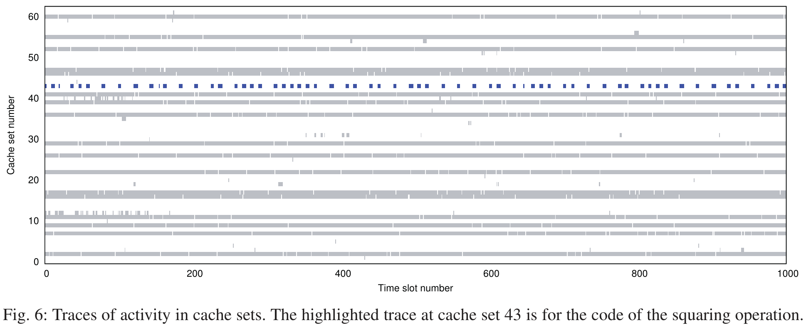

# LLC Prime+Probe[^1]

[pdf]([S&P%202015]%20Last-Level%20Cache%20Side-Channel%20Attacks%20are%20Practical.pdf)

针对 LLC 的 Prime+Probe 侧信道攻击实现，在多个版本的 GnuPG 上演示了跨核、跨 VM 攻击。实现了高分辨率，不依赖于操作系统或 VMM 的弱点，也不依赖于攻击者和受害者之间的共享内存。

## Introduction

之前的 P+P 侧信道攻击只作用于 L1 Cache，限制了攻击的适用范围。如果能在 LLC 上构造跨核攻击，更符合现实条件。然而，LLC 比 L1 大几个数量级（i5-4210H 上，3M LLC/32KB L1d/32KB L1i），访问速度慢得多，大大降低了可观测事件的时间分辨率，从而降低了信道带宽，因此大多数 LLC 上的攻击不适合密码分析。一个例外是 Flush+Reload[^2] ，它依赖内存共享实现高分辨率。

本文对 P+P 的改进可用于实际的 LLC 攻击：

- 演示了对 LLC 的异步 P+P 攻击，该攻击不需要在攻击者和受害者之间共享核心或内存，不利用 VMM 漏洞，也不要求已知 Intel 处理器上的 LLC 哈希函数。
- 两种实现 LLC P+P 的关键技术：攻击者在不知道虚拟地址映射的情况下构造驱逐集、使用时间访问模式而不是传统的空间访问模式来识别受害者的安全关键访问。
- 测量跨 VM 隐蔽计时信道，可实现带宽高达 1.2Mb/s。
- 展示跨 VM 从依赖于秘密的执行路径中提取密钥的侧信道攻击，可攻击 ElGamal 解密实现的快速幂算法。
- 展示对依赖于密码的数据访问模式的攻击，在最新的 GnuPG ElGamal 的滑动窗口模幂实现上演示。

## Challenges in Attacking the LLC

### Attack Model

针对虚拟化环境中的信息泄露，攻击者控制一个与受害者驻留在同一个多核处理器上的 VM。受害者 VM 根据秘密数据（如加密密钥）进行计算，假设攻击者已知受害者运行的加密软件。不依赖于 VMM 的漏洞或特定的 VMM 平台，也不认为攻击者与受害者共享核心、共享内存，或者攻击者与受害者同步。

### Prime+Probe

本文的基于 LLC 的跨核心、跨 VM 攻击基于 Prime+Probe，攻击者可以据此获知受害者 VM 访问哪个缓存组。攻击者监控受害者的缓存使用情况：

- 攻击者使用自己的代码或数据填充一个或多个缓存组。
- 攻击者在受害者执行并利用缓存时等待指定的一段时间。
- 攻击者继续执行并测量加载它准备的每一组数据或代码的时间，如果受害者访问了这些缓存组，将逐出攻击者的一些行，攻击者测量这些行的内存访问延迟将增加。

### Overview of challenges for efficient Prime+Probe attacks on the LLC

在 LLC 上构造有效的 P+P 攻击比在 L1 上要困难得多，主要有以下挑战：

- LLC 对跨核心的内存访问的可见性。

  一般 L1 和 L2 可以满足处理器的大部分内存访问，这意味着 LLC 对受害者内存活动的可见性低于 L1 缓存。如果攻击者对 LLC 状态的操作不影响受害者 VM 使用的 L1/L2 状态，受害者的代码或数据访问将永远不会到达 LLC，攻击者也就无法观测。

  利用缓存包容性（*inclusive*），L1 中有的数据 LLC 中肯定有，只要从 LLC 中将数据逐出，就可以从所有缓存层次结构中逐出，保证受害者不会访问 L1/L2。

- 探测大容量 LLC 的时间明显更长。

  L1 上的 P+P 会填充并探测整个 L1，然后分析缓存占用空间，以识别受害者内存活动相关的空间模式。而 LLC 比 L1 大几个数量级，无法识别精确的分辨率。

  首先精确定位与受害者的安全关键访问相关的少数几个缓存组，然后在填充和探测阶段仅监控这些缓存组，而不是监控整个 LLC。

- 识别与受害者的安全关键访问对应的缓存组。

  攻击者不知道受害者的虚拟地址，也无法控制如何映射到物理地址。

  一次监控一个缓存组，扫描整个 LLC，寻找与执行安全关键访问的受害者一致的对该缓存组的时间访问模式。特定的时间访问模式取决于所使用的算法，在后面会以快速幂和滑动窗口两种算法为例展示如何识别关键行。

- 在未知地址映射的情况下构造 LLC 一个特定缓存组的驱逐集。

  为了监控受害者对一个特定缓存组的访问，攻击者需要能够填充这一缓存组。需要构造一个驱逐集，即找到自己的地址空间中的一组内存行，这些内存行都映射到特定的缓存组。驱逐集至少要 W 个内存行，然后访问这些内存就可以把缓存组中的旧行逐出。构造 L1 的驱逐集很简单，攻击者可以完全控制虚拟地址空间，可以任意选择具有缓存组索引位的虚拟地址。而 LLC 是物理地址索引，要针对特定的缓存组，攻击者恢复部分地址映射。同时 Intel 的缓存分片使攻击进一步复杂化，攻击者还需要知道分片 ID。

- 探测分辨率。

  提取细粒度信息（如加密密钥）需要精细的探测分辨率。LLC 的探测分辨率受攻击者执行探测的速度限制，比 L1 慢得多。一方面 LLC 关联度高，填充和探测需要的内存访问多，更重要的是，LLC 的访问延迟长，探测时间增加，即使攻击者的所有内存行都在 LLC 中，但因为 L1/L2 关联度低，还是会遇到 L1/L2 miss。LLC miss 会导致超过 150 个周期的延迟，而 L1/L2 miss 的延迟在 40 个周期以内。

## Constructing the Eviction Set

### Methodology

使用大页解决隐藏的地址映射问题。VMM 的大页支持允许 VM 物理内存中的大页由物理内存中的大页备份。2M 的大页使得所有索引位都在页内偏移中，就相当于 LLC 是虚拟地址索引，只有攻击者需要大页。但要注意，大页无法定位 LLC 分片。但是不需要逆向分片的哈希函数，可以通过搜索冲突的内存地址来构造驱逐集。首先，分配一个至少两倍于 LLC 大小的缓冲区，在这个缓冲区中，选择一组具有相同缓存组索引位的行。然后使用算法 1 为每个分片的给定缓存组构造驱逐集。首先创建一个冲突集，包含潜在冲突内存行的子集，对每个分片，冲突集中的 W 个内存行映射到相同的缓存组。冲突集实际上是所有切片的驱逐集的并集。然后再使用算法将冲突集划分成单独的驱逐集，每个分片一个。使用的 `probe` 函数检查候选内存行能否被一组内存行逐出。Intel 的分片哈希函数旨在将冲突行均匀分布在所有 LLC 切片中，因此两倍于 LLC 大小的缓冲区足以构造所需的冲突集。

当处理器核心数是 2 的幂时，只有标志位（除了行内偏移和组索引位外的高位）用于计算 LLC 分片，因此计算出一个缓存组的驱逐集后，可以直接修改组索引位来直接构造其他缓存组的驱逐集，无需重复算法 1。

构造完驱逐集之后，就可以实施 P+P 攻击，将驱逐集中的所有内存行组织成一个随机顺序的链表，随机排列可防止硬件预取驱逐集中的内存行。组织成链表可以保证串行化访问。

### Optimizations

抖动：探测阶段也作为下一次攻击的填充，但是由于 LRU 替换策略，可能导致攻击者在探测时逐出自己的数据：受害者访问要逐出内存行时，会逐出缓存组中攻击者第一个访问的元素（因为是最旧的数据）。这时候攻击者探测，还是按之前的顺序遍历，先访问被逐出的第一个元素，就会把第二个元素逐出，形成自驱逐。使用双向链表，反向遍历，最大限度减少自驱逐，最后访问最旧的元素。（现在的 Intel 处理器使用 Quad-Age 替换策略，可以反复双向遍历确保填充缓存组。）

与 L1/L2 的交互：攻击者的数据也部分缓存在 L1/L2 中，从这里面读数据比 LLC 更快，这种时间变化也会引入噪声。LLC 和 L1/L2 的关联度相差越大，这种影响越小。可能的优化方法是测量每个元素的访问时间，而不是整体总时间，但这样增加了探测的时间。

## Probing Resolution

使用隐蔽信道测试探测分辨率和有效性，使用的隐蔽信道协议如下。

发送方和接收方在没有同步的情况下同时执行，使用归零（Return-to-Zero, RZ）自计时编码方案。发送方和接收方各自分配一个至少为 LLC 大小的缓冲区，并使用大页备份。任选两个缓存组索引（最好不受其他内存访问的干扰）。发送方从其分配的缓冲区选择两个内存行，分别表示 0 和 1，它们映射到选择的两个缓存组中。要发送 1，则发送方在一段时间 $T_{mark}$ 内连续访问内存行 1，要发送 0 就在 $T_{mark}$ 时间内连续访问内存行 0。

监听发送方之前，接收方先为两个内存行构造对应的驱逐集，然后使用 P+P 监控这两个驱逐集。为了最大化信道容量，将连续探测之间的空闲间隔设置为 0。

## Attacking the Square-and-Multiply Exponentiation

下面以快速幂为例来展示如何从依赖于秘密的执行路径中泄露信息。

### Square-and multiply exponentiation

模幂运算 $r \equiv b^e\mod m$，在 RSA 中，泄露指数可能会导致私钥的泄露。快速幂（平方-乘）算法通过扫描指数的二进制位来计算模幂。

每个平方-模-乘-模对应指数位 1，平方-模之后没有乘法对应位 0。因此可以跟踪快速幂算法的执行恢复指数。攻击的主要挑战是找到保存相关受害者代码的缓存组。

这里以 GnuPG 1.4.13 中的快速幂实现为例，受害者反复执行 GnuPG 解密 3072 位 ElGamal 公钥加密的的短文件。对于 3072 位的 ElGamal，GnuPG 使用密钥长度为 403 位（Wiener 表返回值 $269 * 1+50%$）。攻击完全独立于硬件平台，适用于所有具有包容性缓存和大页映射的处理器，也是用于快速幂算法的其他实现，适用于执行路径依赖于秘密信息的任何算法。

### Implementing the attack

攻击的核心思想是监控平方运算的使用，处理位 1 时，操作序列是 平方-模-乘-模，处理位 0 时，操作序列是 平方-模-平方-模。那么通过观测后续平方操作之间的时间就可以恢复指数。

下面就是跟踪缓存组活动来寻找这种模式，为了跟踪缓存组，以 5000 周期的时间间隙，足以在每个平方操作中多次探测。在每个时隙内，填充缓存组，等待时隙结束，然后探测缓存组。

下面是几个缓存组的活动踪迹，每行显示了超过 1000 个时隙的单个缓存组的轨迹。

如图，一些缓存组几乎连续访问，还有一些几乎未访问过，缓存组 43 是唯一一个展示了期望的平方代码的活动模式的缓存集，典型的活动脉冲跨越 4-5 个时隙。脉冲之间的时隙大约为 6 个时隙（对应 0），16-17 个时隙（对应 1）。不过还有一些单个时隙或超过 20 个时隙的暂停。

为了识别缓存组，将缓存组的轨迹与包含单个脉冲的模式相关联：该模式有 6 个没活动的时隙，后面是 5 个活动的时隙和另外 6 个没有活动的时隙。计算轨迹中与模式匹配良好的位置的数量，并将具有大量匹配的轨迹标记为候选，传递给用户来决定是否确实属于平方缓存集。

可以利用 GnuPG 二进制文件的一些信息减少搜索空间，4K 页内偏移和缓存集索引存在一些重叠，攻击者只需搜索组索引与受害者代码的页内偏移匹配的缓存组，这将搜索空间减少了 64 倍。需要受害者执行约 120 次才能定位缓存组，而服务器上要执行两倍甚至更多。

[^1]:Fangfei Liu, Yuval Yarom, Qian Ge, Gernot Heiser, Ruby B. Lee, Last-Level Cache Side-Channel Attacks are Practical, S&P 2015.
[^2]: Yuval Yarom and Katrina Falkner, FLUSH+RELOAD a High Resolution,Low Noise,L3 Cache Side-Channel Attack, USENIX 2014.