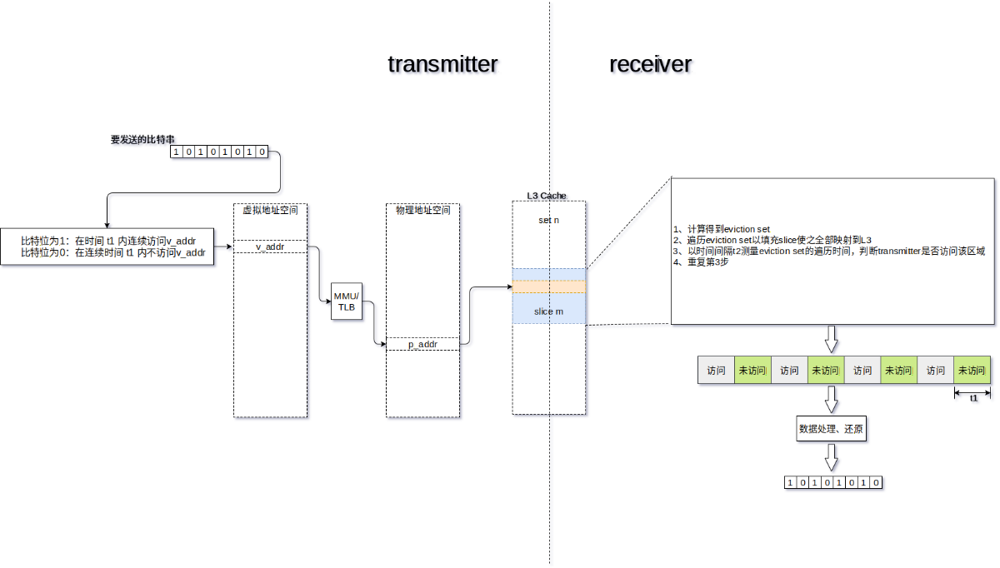
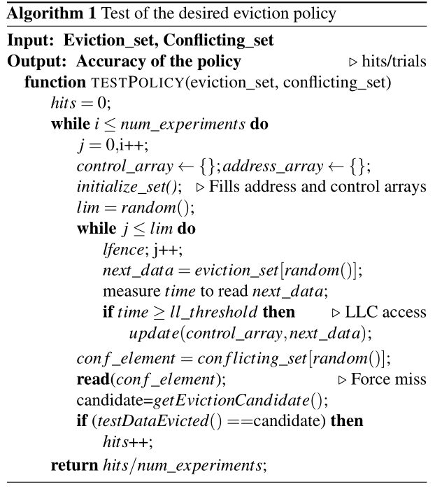
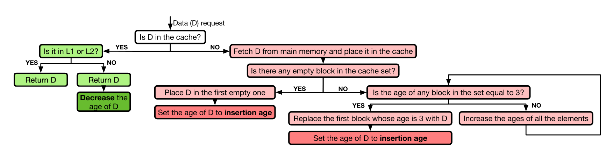
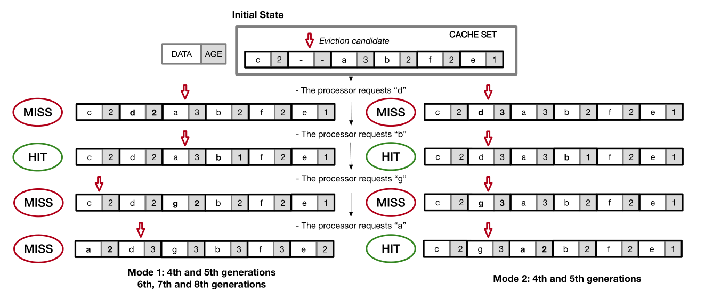
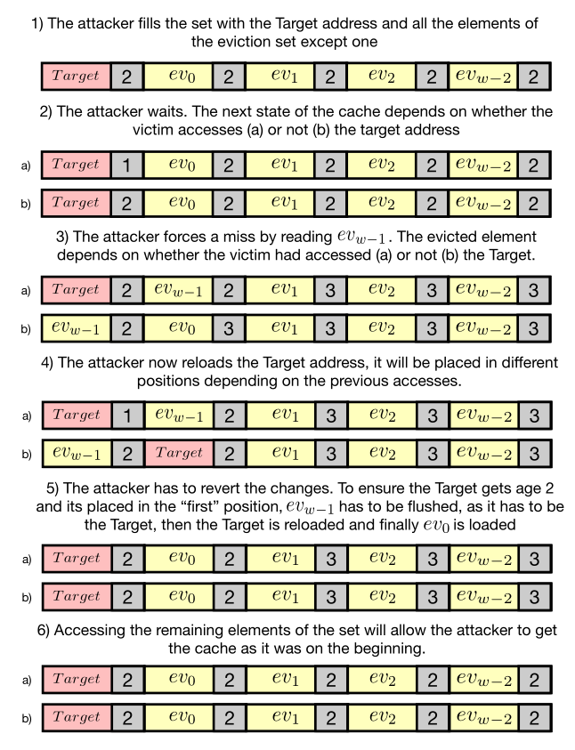
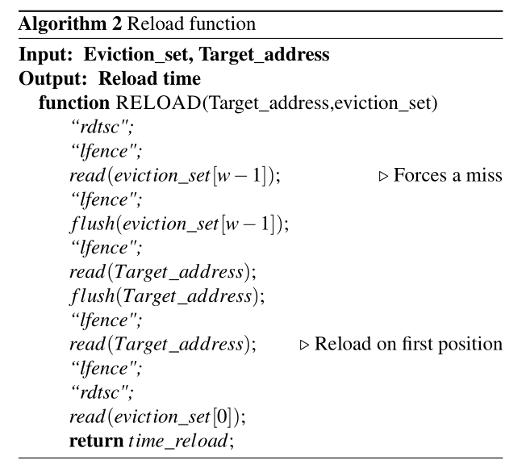

# RELOAD+REFRESH: Abusing Cache Replacement Policies to Perform Stealthy Cachce Attacks

[pdf]([USENIX%202020]%20RELOAD+REFRESH%20Abusing%20Cache%20Replacement%20Policies%20to%20Perform%20Stealthy%20Cache%20Attacks.pdf)

## 摘要

缓存攻击检测主要依赖于：如果不改变 cache 状态并驱逐被观测进程的 cache 内容，就无法实现缓存攻击。

巧妙地使用 cache 替换策略，就可以跟踪受害者进程的缓存访问而不必强制驱逐受害者数据。

提出了恢复处理器缓存替换策略的方法论。

## Introduction

任何依赖于 secret 生成的缓存利用都可能被攻击。

硬件防护未部署，系统层防护影响性能。

对用户来说唯一看上去可行的方法就是检测攻击。

使用硬件性能计数器 Hardware Performance Counter HPC 检测正在进行的微架构攻击。

HPC 包括现代处理器中的寄存器，监控硬件事件，像 cache miss。

检测的前提是攻击对受害者产生了可测量的影响。

本文描述了一种攻击方法，实现从受害者处获取信息的同时保持受害者数据在 cache 中，因此不会显著影响受害者行为，检测更难。

### Contribution

- 引入测试现代处理器不同的缓存替换策略的方法论
- 揭示了 4-8 代 intel CPU 使用的缓存替换策略
  - 扩展了对现代缓存的理解，为改进传统的缓存攻击奠定基础
- 提出 RELOAD+REFRESH，利用 intel 缓存替换策略实现根据受害者的内存访问获取信息
- 提出的攻击对受害者仅造成了可忽略的 cache miss，使得无法被当前的防护措施检测到。

## Background and related work

### Cache 架构

low level, L1 and L2

Last Level Cache, LLC L3

intel 的 LLC 是分成若干 slice，由环形总线互连。每个元素的物理地址通过一个复杂的函数映射到 slice 中。

L3 通常是 inclusive 的，容易保持缓存一致性。

Skylake Server 结构使用了 non-inclusive 的 LLC。

cache 是 w 路组相联，由 S 个 set，每个 set 是有 w 个 line，一个 line 是 64 bytes。

物理地址分为 line 内偏移，低 6 位；set index，$log_2S$ 位；tag 剩余的位。

### Cache replacement policies

cache 满的时候决定那个元素要被逐出（写回内存）

常规的策略：

- FIFO，LRU，NRU(LRU approximation)，LFU，CLOCK，pseudo-random
- LRU 类的策略对于工作集大于缓存大小的内存密集型工作或扫描（一次性突发请求）表现不佳
- 适应工作负载变化的自适应算法
  - ARC: LRU & LFU
  - CAR: LFU & CLOCK

保持逐出策略的同时修改插入策略也可以提高性能。

- LRU Insertion Policy
- BIP, Bimodal 有时候插入到 MRU 位置
- DIP，动态选择，看哪个造成的 cache miss 少

利用 Re-reference Interval Prediction 的替换算法，每个 line 使用 2 bits，预测是否会被 re-referenced。需要替换时会逐出预测的最长间隔的 line，提出了 Static 和 Bimodal 两种，使用 set dueling 来决定哪个策略适合。

intel 处理器，cache 替换策略称为 **Quad-Age LRU** 没有公开文档。

逆向处理器 cache 策略的工作都是执行不同的内存访问序列，通过估算或测量 cache miss 来比较。但是他们没有解释缓存中的哪些具体元素会被换出。

本文是首个全面描述现代 intel 处理器上实现的缓存替换策略，我们可以通过访问序列的信息准确确定 set 中的哪个元素会被换出。

### 缓存攻击

缓存攻击通过监控缓存利用（hit 和 miss 的序列）还恢复受害者信息。

当软件的内存访问模式是由 secret 决定时，攻击者就可以推断出敏感数据。

传统的缓存攻击主要有几类：

- FLUSH+RELOAD
- PRIME+PROBE
- EVICT+TIME

前两个及其变体分辨率较高。

缓存攻击都是针对 LLC 的，基本都是三部分：

- initialization 攻击者准备缓存内容
- waiting 等待受害者执行
- recovering 攻击者通过缓存状态恢复信息

#### FLUSH+RELOAD

依赖于共享内存，需要 memory deduplication 开启。

用 clflush 去掉 target lines，等待受害者执行，最后测量之前 flushed 数据的 reload 时间。时间短就说明受害者访问了，因为又被换入了 cache。

FLUSH+FLUSH 通过 clflush 时间来判断，避免访问缓存。

#### PRIME+PROBE

不知道操作系统测信，理论上可以可应用到所有系统，还可以从动态分配数据回复信息。

先用攻击者自己的数据填充到受害者数据所在的 cache，然后等待，最后 probe 需要的 set，通过时间变化找到受害者行为。

通过限制计时器访问或者加入计时噪音防御，变体 PRIME+ABORT 可以克服（使用 TSX）。

## 恢复 Intel 缓存逐出策略

软件模拟硬件。

使用自己的数据填充一个 set，访问这个数据然后触发一个需要的 cache miss，观察哪个元素被逐出。

需要构造一个驱逐集（w 路组相联中，找到 w 个不同的地址，这些地址都映射到同一个特定的 set）和一个冲突集（另一个驱逐集，映射到同一个 set，地址不同）。

前人的工作已经恢复了地址映射函数，或者描述了如何构造驱逐集。

当 $N_{core} = 2^n$ 时，就可以使用 hash func 计算 set 和 slice 号，其他情况可以直接构造驱逐集。

要注意的是，访问顺序对推断逐出策略非常重要，因此我们使用 lfence 充当一个屏障，确保实际的内存访问顺序是顺序的。以防止乱序执行

实验设计如下：

先确定，当缓存有空间的时候不会逐出数据。先用驱逐集填充一个 set，然后随机 flush 掉一个 line，然后填入冲突集中的一个 line，这时候 set 里得应该就是 驱逐集 w-1 个外加冲突集的一个，测量访问驱逐集那 w-1 个的时间就可以确定它们都还在 cache 里，而冲突集的那个是被加载到 flush 掉的那个位置。

恢复替换策略的过程就是将实际的数据演化过程与各种策略的理论过程进行比较。

使用两个 w 大的数组 address_array 模拟研究的那个 set，用来存这个 set 里数据的地址。control_array 是决定哪个地址要被逐出的控制位。需要实现函数，更新 address_array, control_array 以及给出逐出的候选地址。这些都基于测试的替换策略实现。

initialize_set 都是确保测试的 set 是空的，先 fill 然后 flush all。address_array 包括驱逐集的地址以及初始化的控制位。

以测试 NRU 为例。每个 line 使用一个 bit 作为控制位，当访问时置位，如果某次置位使得所有的控制位都为 1，则全部清零。冲突时，NRU 会逐出第一个控制位为 0 的。所以实验中的 control_array 的可能值就是 -1, 0, 1。通过 testDataEvicted 测试逐出的是否是 NRU 预测的元素（即 getEvictionCandidate 的返回值）。

### 结论

最后测试发现，不同的处理器虽然缓存插入的策略有所不同，但是缓存替换的策略都是相同的。

即 **Quad-Age LRU**，如下图，检索到就 decrease，先淘汰 age=3 的，插入的时候设定一个初始的 age。没有 age=3 的就全体递增，从头开始淘汰。

各个机器上只是在插入的 age 初始值不同。4 5 代的有 mode1=2, mode2=3，而之后的都是 mode1=2

以下是 cache 的模拟流程

## RELOAD+REFRESH

有了共享机制，如果攻击者知道了替换策略，那么他就可以把受害者可能用到的数据 target 放到 cache 某个 set 的特定位置。而 set 中数据的位置和 age 都是可以通过访问顺序控制的，进而又能够确定特定的替换候选，那么攻击者就可以把 target 设置为候选。如果受害者使用了 target，那么它的 age 减小，就不再是候选。攻击者可以强制制造一个 cache miss，然后检查 target 是否还在 cache 中。如果还在，说明受害者访问了，攻击者也就得到了想要的信息。同时受害者是从 cache 里访问的，也没有触发 cache miss。这就是 RELOAD+REFRESH。

linux 使用了 kernel same-page merging 提高内存的利用率。攻击者需要先通过逆向获取想要监控的地址，还需要构造与其映射到同一 set 上的驱逐集。

下图描述了攻击的步骤以及 cache 可能的状态。

首先插入把 target 插入到第一个，然后把驱逐集里的 w-1 个都填充到后面。剩下的一个用来触发冲突。因为低级的 cache 路数要小于 LLC，当填充后面元素的时候会把 target 从低级 cache 里替换掉。

这样之后 target 就变成了逐出的候选。然后攻击者等待受害者执行。如果受害者访问了 target，那么 set 里的第二个元素就变成了逐出候选。如果没访问，target 还是候选。然后攻击者访问驱逐集剩下的那个来触发冲突，就会替换掉候选。然后再访问 target，时间短就说明 target 没被替换，即受害者访问了 target。然后需要通过 REFRESH 将 cache 恢复到初始状态，把触发冲突的那个再从 cache中换出来，用于下一轮。

而当 cache 使用 mode2=3 时，前几步都相同，最后是需要判断攻击者和受害者是否在同一个 core 上。如果不在，那么其他元素 age=3，target 还是候选，就不需要 refresh 了。另一方面，如果是在同一个核，就需要 refresh，因为 target 在低级缓存里还存在。而 reload 的时间可以判断受害者和攻击者是否在同一个 core 上。

另外，mode2=3 不需要共享内存就可以进行可检测的快速跨核心 cache 攻击。攻击者用自己的数据填充 set，所有的 age=3，候选就是第一个。如果受害者使用了数据，那么候选就被替换。而受害者之后使用这个数据都会从低级缓存中取，则 L3 cache 中的 age 不变。那么攻击者只需要访问第一个元素就可以知道受害者是否访问 target。

以上为 RELOAD+REFRESH 的步骤。

先填充 target 和 w-1 个驱逐集元素，然后等待受害者执行，最后执行 RELOAD 和 REFRESH 步骤。

RELOAD 得到受害者访问的信息，REFRESH 用来做好恢复信息的准备。

RELOAD 不需要 flush target，除非受害者不访问。而为了避免用 if，就直接 flush。时间短意味着受害者访问。

REFRESH 的代码是针对 12 路组相联的，因为 target 和驱逐集的第一个元素已经在 cache 里了，限制只需要把剩下的元素的 age 减到 2 就行了。为了避免乱序执行，使用了链表的方式访问这些数据。这个函数就行 PRIME+PROBE 里的 probe 截断。refresh 的时间还可以用来检测是否又其他的进程在用这个set。

### Noise

攻击依赖于元素插入到 cache set 的时间以达到对受害者避免 cache miss，对攻击者可以知晓 target 是否被访问。如果其他的进程使用了映射在同一个 cache slice 的数据，那么攻击的效率会降低，还可能会触发一些检测机制。

前面提到 refresh 步骤的时间可以用来判断是否存在有其他进程访问这个 set 的情况。攻击者可以稍微改一下方式。如果产生噪声的进程仅使用了一个地址，那么攻击者可以轻松处理，规避检测同时获取信息。诀窍就是把 target 放在 set 的另一个位置，比如就第二个。如果别人用到了映射到这个 set 的任何一个数据，那么被替换的数据就是 set 中的第一个数据了。当攻击者触发冲突时，候选就还是 target（受害者访问 target）或者第三个元素。通过 reload 获取信息，然后必须从第三个元素开始 refresh，把 noise 逐出 cache。

## 与之前的方法比较

### Covert Channel 隐蔽通道

为了研究这个攻击的分辨率，将其与以前的两种攻击比较。我们用类似的方法在两个进程之间构造了一个隐蔽通道。

sender 通过访问共享库内存地址传输 1，不访问传输 0。一旦访问了内存位置，等待固定时间，再次读取数据。receiver 通过上述的技术监控缓存的利用确定传输的是 0 还是 1。

PRIME+PROBE 攻击按照不同的方式进行。不适用避免替换策略变化的 zig-zag 模式。使用这种方式会增加误报数量，因为有时无法从 cache 中删除数据。我们以相同的顺序访问 w 大小的驱逐集，元素以链表形式访问。如果缓存的初始状态已知，这意味着我们最多需要 2 次 probe 来从cache 中驱逐数据，防止对目标的访问发生在探测截断的中间。
