# Sok: Cache Side-Channel Attacks[^1]

[toc]

文章总结了 2007-2018 年提出的缓存侧信道攻击和对应的缓解、检测措施。

### Attacks

攻击种类和代码

#### Prime+Probe[^2]

基于 LLC 的跨核攻击通常使用 P+P，属于访问驱动攻击。攻击者通过 P+P 了解受害者进程使用了哪些缓存集，攻击过程如下图。

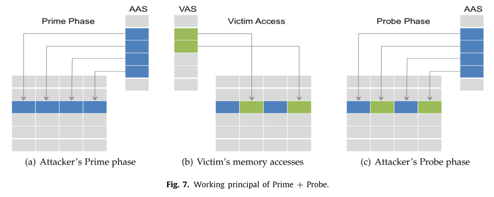

1. Prime 阶段，攻击者进程用自己的数据填充缓存组
2. 等待受害者执行
3. Probe 阶段，测量之前已加载进缓存中数据的时间。

如果受害者访问的数据在相同的缓存组，就会把攻击者数据从缓存中逐出，导致访问时间长。攻击者通过这种方式定位受害者的敏感地址范围。攻击需要先构造驱逐集。

LLC 上实施 P+P 相比 L1 由很多困难：

- L1 和 L2 满足处理器的大部分内存访问，这意味着 LLC 对受害者内存活动的可见性低于 L1。——利用缓存包容性，从 LLC 中清除数据即代表着从所有缓存中清除。

- P+P 可以操纵整个 L1 缓存，而 LLC 比 L1 大很多，这意味着 LLC 上攻击的分辨率很低。——首先精确定位受害者执行安全关键访问对应的少数几个缓存组，用 P+P 之监视这几个缓存组，而不是监控整个 LLC。

- 怎么识别受害者相关缓存组是一个问题，攻击者不知道虚拟地址和地址转换（LLC 是 PIPT）——扫描整个 LLC，一次只监控一个缓存组，找到与受害者执行关键访问一致的缓存访问模式。

- 为了监控受害者对某个特定缓存组的访问，攻击者需要构造一个驱逐集（自己的地址空间中的一组内存行），驱逐集中的地址都会映射到要监控的那个缓存组中。W 组相联的缓存就需要 W 个地址作为驱逐集。问题在于，L1 是 VIVT，可以简单地选择相同索引位的虚拟地址，而 LLC 是 PIPT，构造驱逐集需要恢复部分的地址映射，而特别是在虚拟化环境中很困难。同时，处理器对 LLC 的分片也使攻击进一步复杂化。——作者使用大页构造驱逐集，缓存地址映射如下图，如果使用 2MB 的大页，组索引被包含在页内偏移中，也就实现了 VIPT 的 LLC。但是大页还不足以定位 LLC 分片，不同于其他人逆向了分片的哈希函数，作者通过搜索冲突的内存地址来构造驱逐集，分配一个两倍于 LLC 大小的缓冲区，在这里首先选择一组可能冲突的内存行，即索引位相同，然后迭代地构造驱逐集。

  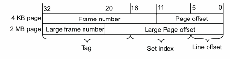

  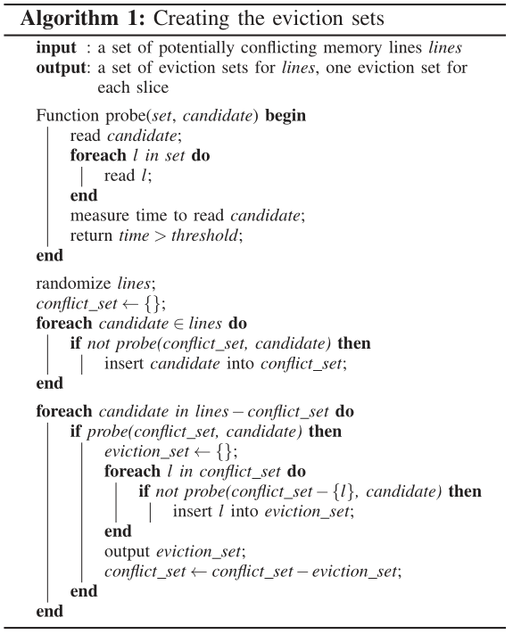

- 探测分辨率，提取密钥由较高的分辨率要求。LLC 上的 P+P 可以异步允许，不需要抢占受害者，分辨率仅受攻击者探测速度的限制，而 LLC 比 L1 要慢得多。LLC 容量更大，初始化和探测都需要较长时间，同时访问延迟更大。探测比 L1 满一个数量级。Probe 函数如下，将驱逐集的内存行组织成随机顺序的链表，可以防止 prefetch，同时保证访问是序列化进行的。

  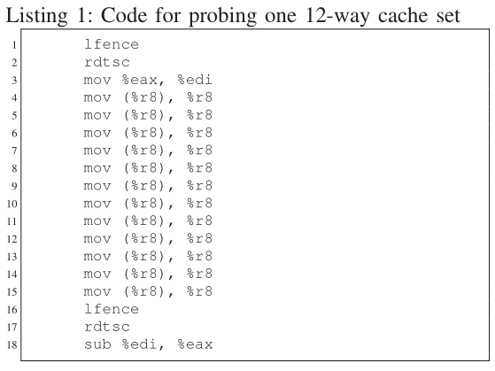


#### Evict+Time[^3]

顾名思义，E+T 攻击是逐出缓存行然后测量执行时间，如下图。

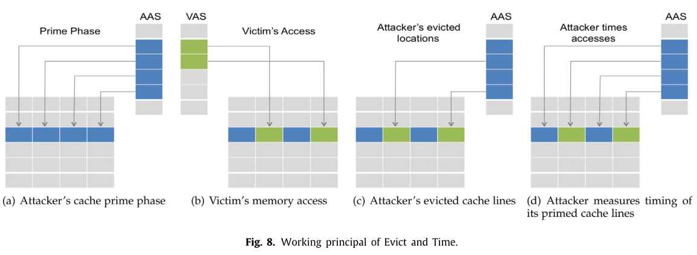

1. 先让受害者执行一次，测量执行时间
2. 攻击者用自己的数据填充缓存组
3. 受害者执行，攻击者测量受害者执行时间的变化

如果在攻击者填充缓存后受害者执行的时间变长就说明受害者可能访问了被逐出的行。

#### Evict+Reload[^4]

E+R 是 F+R 的一个变体，如下图。

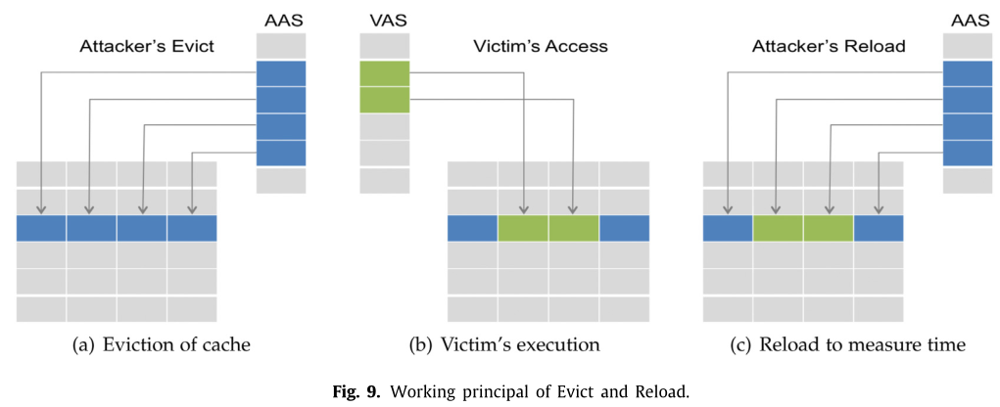

1. 攻击者用自己的数据填充缓存组
2. 等待受害者执行
3. 攻击者测量重新加载缓存行的时间

原作者提出 E+R 的目的其实是替代 F+R，以证明在不适用 clflush 的情况下也可以实施缓存攻击。[^4] Evict 是通过访问操作系统放置在大页中的大数组中的物理上一致的地址来完成的。

#### Flush+Reload[^5]

F+R 不同于 P+P 和 E+T 的机制，属于访问驱动攻击。依赖于页面共享和 x86 的 clflush，如下图。

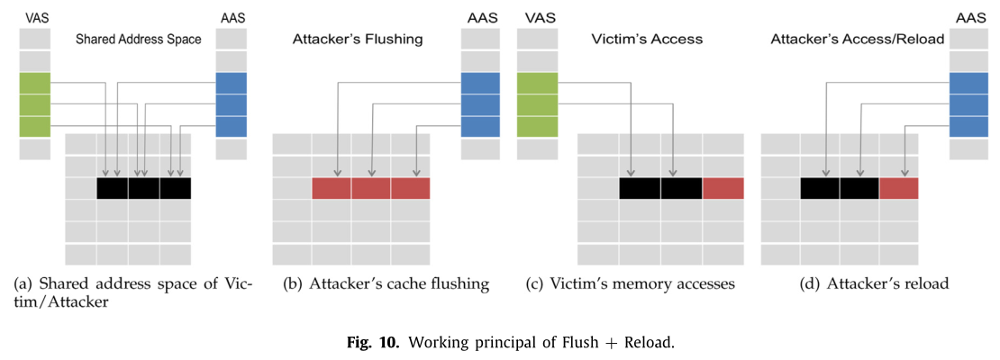

1. 攻击者和受害者共享一段内存空间
2. 攻击者使用 clflush 指令从缓存中清除共享的缓存行
3. 等待受害者执行
4. 攻击者重新加载共享缓存行并测量访问时间

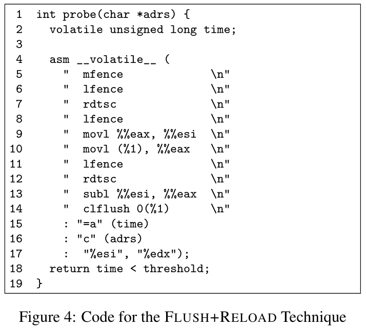

优点就是精度高，广泛应用与各种瞬态执行攻击。攻击的关键是等待时间，需要根据受害者的执行情况确定合适的等待时间，避免受害者访问与攻击者重载重叠或错过受害者访问。

攻击之前需要计算时间阈值，一般就是把从 L1 和内存访问的时间取加权均值。

```c
static void detect_flush_reload_threshold() {
  ...
  // L1 time
  maccess(ptr);
  for (i = 0; i < count; i++) {
    start = rdtsc();
    maccess(ptr);
    end = rdtsc();
    reload_time += (end - start);
  }
  // Memory time
  for (i = 0; i < count; i++) {
    start = rdtsc();
    maccess(ptr);
    end = rdtsc();
    flush(ptr);
    flush_reload_time += (end - start);
  }
  reload_time /= count;
  flush_reload_time /= count;
 
  config.cache_miss_threshold = (flush_reload_time + reload_time * 2) / 3;
}
```

#### Flush+Flush[^6]

F+F 算是 F+R 的变体，依赖 clflush 指令的时间差，如下图。

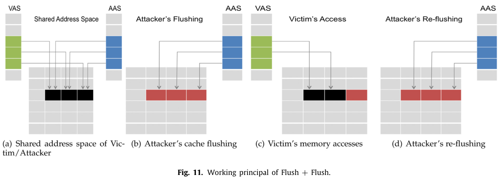

跟 F+R 类似，就是把 reload 换成了 flush，根据 clflush 指令执行时间由地址是否在缓存中决定。F+F 最大的好处就是不会产生过多的内存读取操作，规避了针对此的检测。F+F 的效率比较高，但是错误率略高于 F+R 和 P+P。

#### Prime+Abort[^7]

P+A 在准确率和效率方面比上面的技术都强，属于访问驱动攻击。现有的技术主要就是三步：初始化、等待和测量。与上面几个都不同的是，P+A 不依赖于计时器，而是使用 Intel TSX（事务同步扩展），如下图。

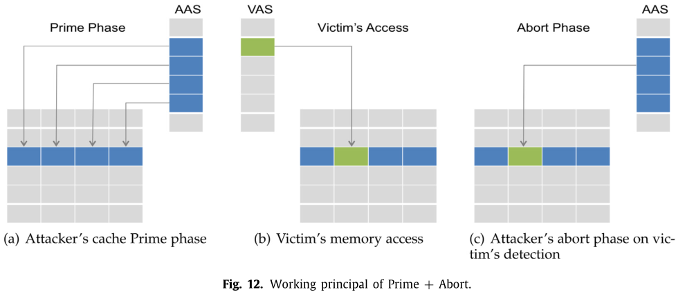

1. 攻击者用自己的工作集填充缓存
2. 等待受害者执行
3. 攻击者在工作集上执行事务

不需要计算时间阈值，如果受害者将攻击者的缓存行逐出，那么就会触发事务的 abort。

根据 TSX 事务中止的其中三种原因，设计三种基于 TSX 的攻击：

- 在缓存行粒度上与其他线程或进程存在读-写或写-写内存冲突——Naive TSX-based Attack，在事务中访问目标地址，受害者如果再访问就会触发 abort，需要共享内存，而且不能检测读-读的冲突，这意味着攻击者和受害者之一必须写，不能用于只读内存。

- 事务中写入的缓存行被从 L1 中逐出——P+A-L1，类似于 P+P，需要构造驱逐集，构造 L1 上的驱逐集还是很容易的，因为缓存组索引就是页内偏移的高 6 位。在此之后，就只需要打开一个 TSX 事务写驱逐集，然后等待中止。

- 事务中读取的缓存行被从 L3 中逐出——P+A-L3，与 LLC 上的 P+P 一样，构造驱逐集的方式较 L1 上复杂，还是使用大页便于指定缓存组索引，不同的是使用 abort 代替 probe。

  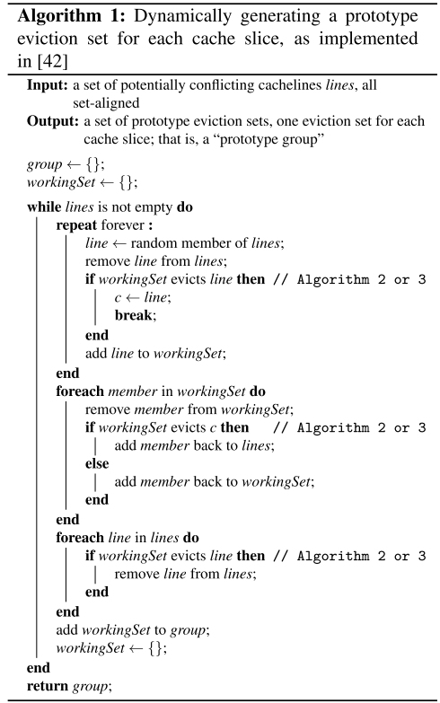

  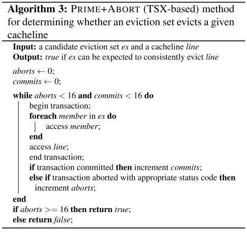

TSX-based 攻击不需要通过计时来判断受害者是否访问，只需要等待 TSX 中断后的硬件回调，不仅降低开销，还可以无限期地等待，直到受害者访问发生。攻击不需要预定义的时间间隔，分辨率很高。也有缺点，就是不能同时监控多个目标（P+P 里是缓存组，F+R 里是地址），无法区分多个目标的访问。

#### Reload+Refresh[^8]

2020 年新提出的 R+R 方法。对缓存侧信道攻击的检测大多是依据缓存命中或未命中数，R+R 通过利用缓存替换策略，可以跟踪受害者进程的缓存访问而不必强制驱逐受害则数据。

首先作者逆向出 Intel 处理器的 LLC 替换策略 Quad-Age LRU，如下图。

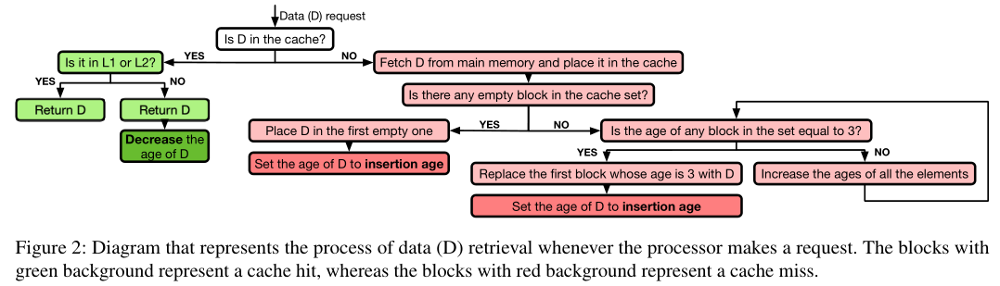

大概就是缓存组满时淘汰 age 最大的缓存行，age 范围 0-3，开始插入时为 2，访问后会 -1。

在共享内存的前提下，攻击者可以使用替换策略，攻击者可以将想要探测受害者是否访问的目标地址的缓存行放在缓存组的指定位置并控制对应的 age。那么攻击者将目标地址设置为替换候选（缓存组中的第一个位置），且，如果受害者访问了目标地址，它的 age -1，就不再是候选。攻击者强制制造一个未命中来从缓存组中逐出一个元素，然后检查目标地址是否还在缓存中，如果在，就说明受害者访问了目标地址。下图是整个过程中可能的缓存状态。

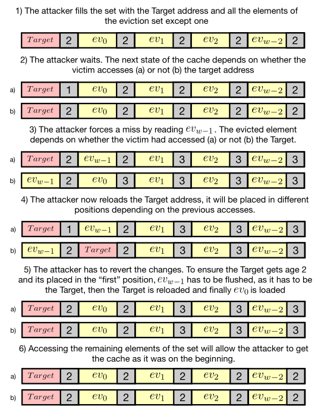

Reload 和 Refresh 操作的伪代码如下。

<center>
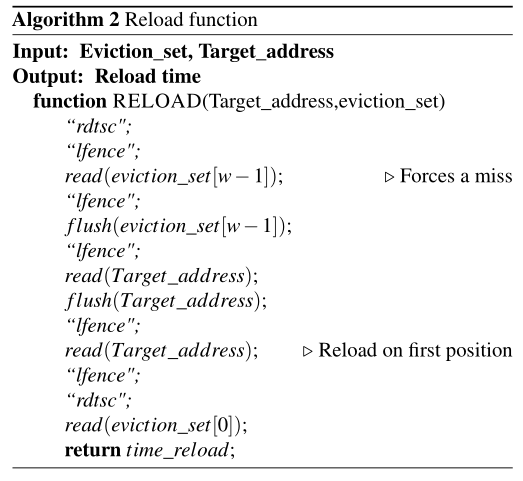
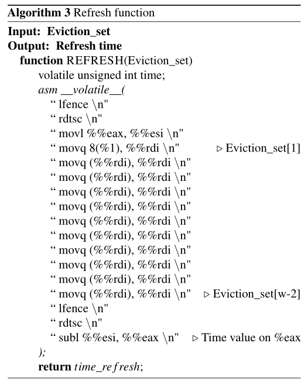
</center>

实际攻击中，先填充目标地址和 w-1 个驱逐集元素，然后等待受害者执行，最后执行 Reload 和 Refresh 操作，Reload 得到受害者访问的信息，Refresh 做好恢复信息的准备。

#### 总结

下图列出了前六种攻击针对密码系统的实现。

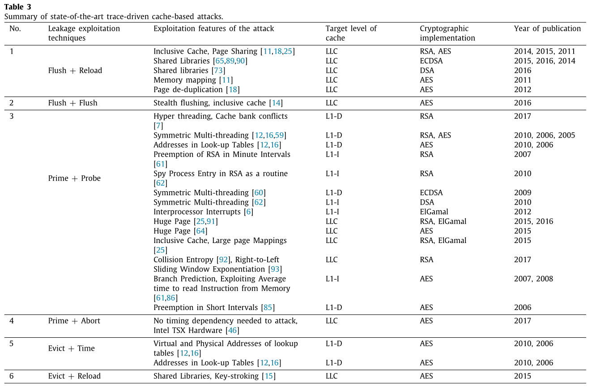


### 参考文献

[^1]:Maria Mushtaq, et al. Winter is here! A decade ofcache-based side-channel attacks, detection & mitigation for RSA. Information Systems 2020.

[^2]:F. Liu, Y. Yarom, Q. Ge, G. Heiser, R.B. Lee, Last-level cache side-channel attacks are practical, S&P 2015.
[^3]:E. Tromer, D.A. Osvik, A. Shamir, Efficient cache attacks on AES, and countermeasures, Journal of Cryptology 2010.

[^4]:D. Gruss, R. Spreitzer, S. Mangard, Cache template attacks: Automating attacks on inclusive last-level caches, USENIX 2015.

[^5]:Y. Yarom, K. Falkner, Flush+reload: A high resolution, low noise, l3 Cache
side-channel attack, USENIX 2014.

[^6]:D. Gruss, C. Maurice, K. Wagner, S. Mangard, Flush + flush: A fast and stealthy cache attack,  DIMVA 2016.
[^7]:D. Craig, K. David, P. Leo, T. Dean, Prime + abort: A timer-free highprecision l3 cache attack using intel TSX, USENIX 2017.
[^8]:Samira Briongos, Pedro Malagón, and José M. Moya, RELOAD+REFRESH: Abusing Cache Replacement Policies to Perform Stealthy Cache Attacks, USENIX 2020.

