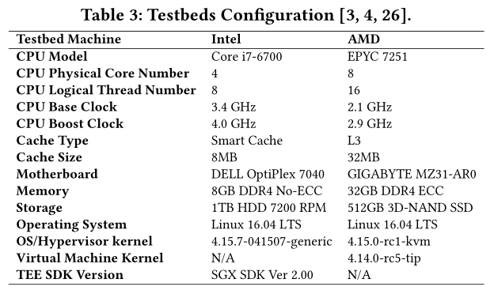

# Comparison of Intel SGX and AMD Memory Encryption

[pdf]([HASP%202018]%20A%20Comparison%20Study%20of%20Intel%20SGX%20and%20AMD%20Memory%20Encryption%20Technology.pdf)

硬件辅助可信执行环境（Trusted Execution Environment, TEE）：ARM TrustZone、Intel Management Engine、AMD Platform Security Processor、Intel Software Guard eXtension 和 AMD Memory Encryption 等。下面从功能、使用场景、安全性和性能影响几个方面比较 Intel SGX 和 AMD 内存加密。

基于虚拟机的安全隔离，可信计算基（TCB）包括 HV 和 OS，代码量大、漏洞多，性能损耗较大。一个替代方案是利用硬件辅助 TEE，硬件实现隔离执行，缩小 TCB，确保性能和安全性提升。

ARM TrustZone、Intel ME、AMD-PSP、SMM 等都未提供通用的适用于用户程序的安全解决方案。而 Intel SGX 和 AMD 内存加密是通用的硬件辅助 TEE。

## Backgroud

### Intel Software Guard eXtensions, SGX

Intel SGX 是 x86 架构中首个通用硬件辅助 TEE，引入一组新的 CPU 指令，允许用户程序创建和使用称为 enclave （安全区）的硬件辅助 TEE。SGX 保证运行时安全区代码和数据的机密性和完整性，即使底层高特权级软件（HV 或 OS）是恶意的。SGX 还可以抵御物理内存访问类攻击。在 SGX 安全模型中，TCB 是 CPU，系统的其他部分都假定不可信。

SGX 创建了一个有限大小的加密内存区，称为安全区页面缓存（Enclave Page Cache, EPC），所有的安全区都 EPC 内创建，EPC 大小可以设置为 32M、64M、128M。SGX 提供了硬件访问控制机制保护安全区内存，对安全区内存的非法访问会触发 page fault。SGX 还提供在系统内存和 EPC 之间安全传输数据的能力，使用硬件内存加密引擎（Memory Encryption Engine, MEE）实现加密解密。安全区代码只能运行在 ring 3，访问 EPC 外的内存受 OS 控制。

#### SGX 应用设计

每个 SGX 应用至少包括两部分：在安全区中执行 EPC 上的可信代码以及执行在不可信系统内存上的不可信代码。不可信代码通过调用 ECREATE、EADD 和 EINT 指令完成安全区创建过程。如果安全区应用需要大于 EPC 的内存，SGX 提供的内存交换机制可以在 EPC 和不可信系统内存之间安全地交换内存。内存页交换需要 OS 和系统软件支持而且会带来性能开销。安全区初始化后，不可信代码通过 EENTER 指令调用安全区代码，处理器从保护模式切换到安全区模式。然后处理器在安全区中执行被调函数。EEXIT 指令退出安全区，控制流回到不可信代码。除了用户创建的安全区，SGX 使用一些架构安全区辅助本地或远程证明机制，SGX 还提供了安全区封装机制来保护安全区的磁盘数据。

#### SGX 远程证明

远程证明（Remote Attestation）评估安全区身份、结构、内部代码完整性，并保证真正的 Intel SGX 处理器正执行在安全区中。此外，远程证明提供服务提供商和安全区应用之间的初步秘密共享，以帮助通过不可信的网络建立可信信道。服务提供商可以通过远程机制评估远程安全区状态。

#### 安全区封装

SGX 提供了安全区密封机制（Enclave Stealing），对安全区秘密加密以安全地存储到不可信的存储介质上（硬盘加密）。此外，安全区密封可以在安全区因停电或应用程序本身破坏时恢复安全区秘密。密封文件由每个平台唯一的私人密钥加密，安全区密封可以帮助安全区从密封文件恢复数据和密钥，无需执行新的远程证明。

### AMD Memory Encryption Technology

AMD 内存加密技术主要针对公共云基础设置，特别是 IaaS。解决两类攻击：系统软件级和物理访问攻击。前者是高特权级实体恶意目的分析 Guest 内存，或根据 HV 漏洞部署针对同驻 Guest 的侧信道攻击。后者包括内存 I/O 窃听攻击和冷启动攻击。AMD 内存加密在 SoC 上添加 AES 128 加密引擎，在数据进入或离开 SoC 时透明地解密和加密数据。

基于内存加密，AMD 提出了两个主要的安全特性，安全内存加密（Secure Memory Encryption, SME）和安全加密虚拟化（Secure Encrypted Virtualization, SEV）。二者均由 OS 或 HV 管理，无需更改应用软件。加密密钥的生成、存储和交付由 AMD 安全处理器（Secure Processor, SP）管理，且对平台的不可信部分隐藏。AMD 安全处理器使用 32 位的 Arm Cortex A5，运行一个由 AMD 签名的内核。

#### SME

SME 旨在解决物理访问攻击，其内存加密密钥由 AMD-SP 随机生成，并在启动时加载到内存控制器。OS 通过设置页表项的加密标志位 C-bit 使用 SME，C-bit 置位后，对该内存页的访问被定向到加密引起。SME 支持 DMA。

#### Transparent SME, TSME

TSME 即在启动时透明地加密所有内存页，可以通过 BIOS 开启，对 OS 和用户软件都是透明的。

#### SEV

SEV 通过提供加密虚拟机隔离来解决高特权级系统软件攻击。SEV 使用虚拟机特定的加密密钥加密并保护虚拟机的内存空间免受 HV 和同平台其他虚拟机的攻击。SEV 的内存加密对受保护虚拟机中执行的用户软件透明，不需要修改软件。SEV 使用内存加密引擎使用不同的密钥对同一平台上的不同虚拟机的内存空间加密。Guest 与加密密钥一一对应，代码和数据到达 SoC 时，SEV 在 Cache 中标记所有与 Guest 关联的代码和数据，限制只允许标记所有者虚拟机访问。数据离开 SoC 时，通过标记确定加密密钥，使用密钥加密。

此外，初始化受 SEV 保护的虚拟机需要与 AMD-SP 直接交互，AMD-SP 提供一组 API 用于配置和管理云平台，HV 的驱动可以调用这些 API。SEV 架构中，Guest 所有者可以管理秘密数据并生成用于迁移或调试的策略。使用 Diffie-Hellman 密钥交换协议在 Guest 所有者和 AMD-SP 之间构建安全信道。Guest 所有者可以验证 AMD-SP 并交换信息以设置受保护的 VM。SEV 架构还定义了共享页面（未加密）和私有页面（加密）。在 Guest OS 中将 C-bit 置位标识私有页面。SEV 有一些硬件机制强制保护这些页的安全性[^1]。SEV 中只允许在共享内存中使用 DMA。

AMD 几种内存加密安全特性对比如下表。

## 比较评估

### 实验平台

### 功能和使用场景比较

Intel SGX 受 EPC 大小的限制，旨在为微服务和小型应用提供安全保障。有一些研究工作将 SGX 用于大型且复杂的工作负载。使用 SGX 需要修改软件，以前的应用程序不进行代码重构的话难以迁移到 SGX 中。SGX 运行在 ring 3，不适用于需要大量系统调用的应用。另外，EPC 的大小限制了需要更大可信内存空间的性能。

AMD SEV 旨在解决公有云上的跨虚拟机和基于 HV 攻击，使用内存加密和 AMD-V 虚拟化提供免受攻击的加密虚拟机。SEV 的保护对用户程序透明，适用于未修改或遗留应用的 TEE。SEV 支持大容量的可信内存，适用于复杂的企业级的应用和服务。然而，SEV 把底层 OS 和 HV 放到 TCB 中，削弱了安全能力，不适用于需要增强等级的安全保护。

> 论文原话：
>
> However, SEV puts the underlying OS and hypervisor in the TCB, thus it is susceptible to a broader class of attacks, therefore weakening its security protection capabilities.
>
> 在 SEV-SNP（第三代 SEV）的白皮书中提到：
>
> Under SEV-SNP, all other CPU software components and PCI devices are treated as fully untrusted...
>
> SEV and SEV-ES use the threat model of a "benign but vulnerable" hypervisor. In this threat model, the hypervisor is not believed to be 100% secure, but it is trusted to act with benign intent. Meaning that while the hypervisor was not actively trying to compromise the SEV VMs underneath it, it could itself have exploitable vulnerabilities.
>
> 也就是说最初的 SEV 确实把 HV 加入到 TCB。之后还会详细看 SEV-SNP 的白皮书。

AMD 内存加密适用于保护复杂和传统应用程序，Intel SGX 适用于保护小型但安全敏感的工作负载。

### 安全性比较

TEE 最重要的还是安全性。从设计架构和攻击面比较 SGX 和内存加密。首先是内存加密引擎的实现，AMD MME 使用 AES ECB 模式，ECB 模式会泄露密文信息[^2]。为了缓解信息泄露，AMD 在加密之前使用基于物理地址的 tweak 算法，保证不同内存地址的相同明文会生成不同的密文。然而 AMD 内存加密未向 Guest 的加密内存空间提供内存完整性保护，削弱了保护能力。而 Intel MEE 使用经过调整的 AES CTR 模式，SGX 提供内存完整性保护。

#### Intel SGX 漏洞

一个攻击向量是 DoS 攻击，SGX 中的可信代码要依赖不可信 OS 处理系统调用。恶意 OS 可以拒绝安全区请求甚至直接 kill 进程。即使 OS 是善意的，DoS 攻击仍可由一个恶意 SGX 应用发起，通过违反安全区内存访问完整性迫使 CPU 进入锁定模式。攻击向量还可能来自安全区内的多线程，多线程引入了新的攻击面。利用安全区内代码的同步错误漏洞，如 UAF 和 TOCTTOU，可以控制安全区内代码的控制流。

SGX 中的另一种强大的攻击向量是侧信道攻击，SGX 的 TCB 是 CPU，而数据在 CPU 中以明文形式存在。尽管 SGX 在上下文切换时对缓存数据进行硬件保护，但事实表明，通过测量缓存访问会把泄露安全区数据。Spectre 攻击对 SGX 有效。

#### AMD 内存加密漏洞

AMD 内存加密旨在解决两类攻击，SME 提供对物理访问攻击的保护，而 SEV 用来抵御从高特权级系统软件的攻击。而 SME 或 SEV 都未提供内存完整性保护，这就导致恶意 HV 可以操纵 Guest 的加密内存页。CTS lab 的报告[^3]介绍了一组影响 AMD EPYC 及其他 AMD 处理器的漏洞，攻击者通过绕过硬件验证启动在 AMD-SP 上安装恶意软件，进而泄露加密密钥。主要是利用 AMD-SP 的固件漏洞。

AMD TEE 也受侧信道攻击威胁，原因也是在 SoC 中数据是以明文存在，Cache 中的数据是明文。SEV 利用 KVM 提供每个直接处理器访问，这带来了性能提升，也引入新的攻击面。在 SEV 保护的虚拟机中可以成功执行 Spectre PoC。AMD 内存加密的安全保护更弱，SGX 通过硬件强制执行内存访问控制和内存完整性保护来划分边界。二者都有后续的增强实现。

### 性能比较

性能决定了 TEE 的应用范围。开发几个在 SGX 和 AMD 上都兼容的测试程序，使用标准库保证公平。测试分为三类：首先是浮点密集型负载，在不封装数据的情况下执行浮点密集型程序，分析 TEE 的执行能力；其次是内存加密引擎性能，通过 MEE 封装数据评估两个 TEE 的 MEE 性能；最后是综合工作负载，反映 TEE 的整体性能，在公有云环境遵守安全协议的复杂程序。

个人感觉两个 TEE 的应用场景很难重叠，难以比较性能。

[^1]:[AMD x86 Memory Encryption Technologies | USENIX](https://www.usenix.org/conference/usenixsecurity16/technical-sessions/presentation/kaplan)

[^2]:[[1712.05090\] Secure Encrypted Virtualization is Unsecure (arxiv.org)](https://arxiv.org/abs/1712.05090)
[^3]: [amdflaws_whitepaper.pdf (safefirmware.com)](https://safefirmware.com/amdflaws_whitepaper.pdf)

