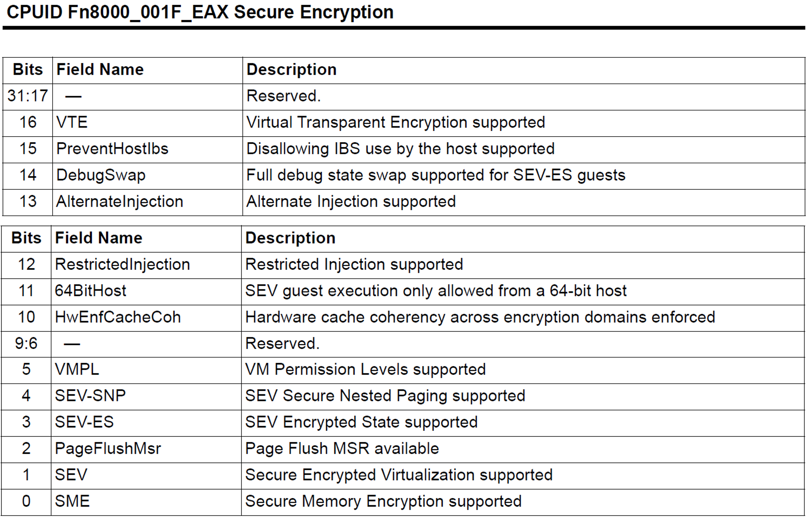
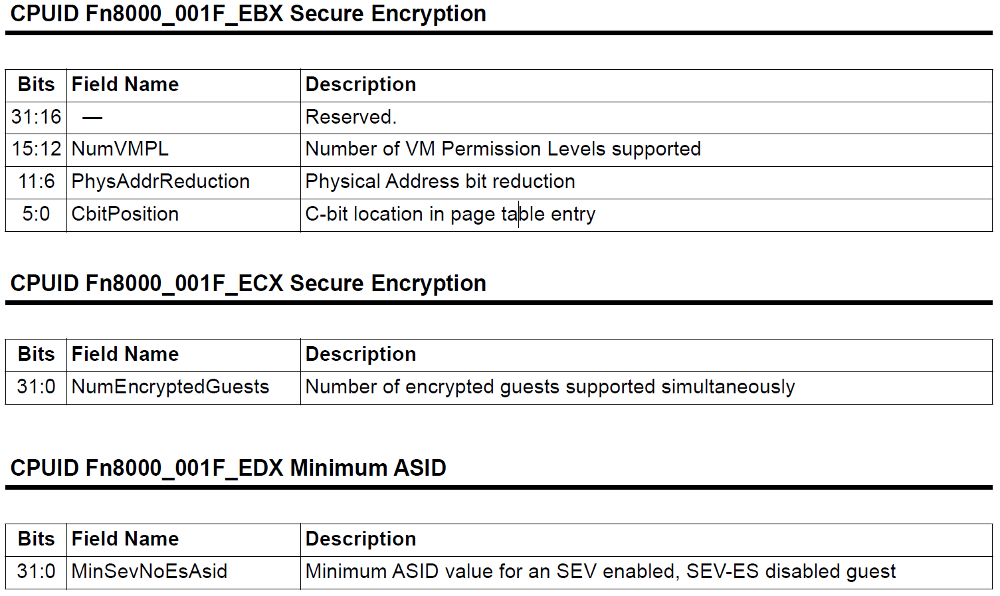
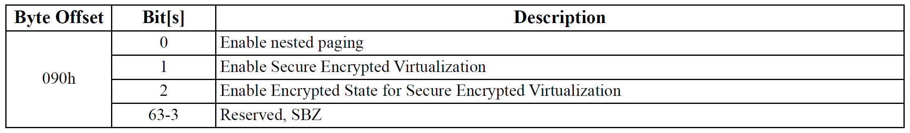
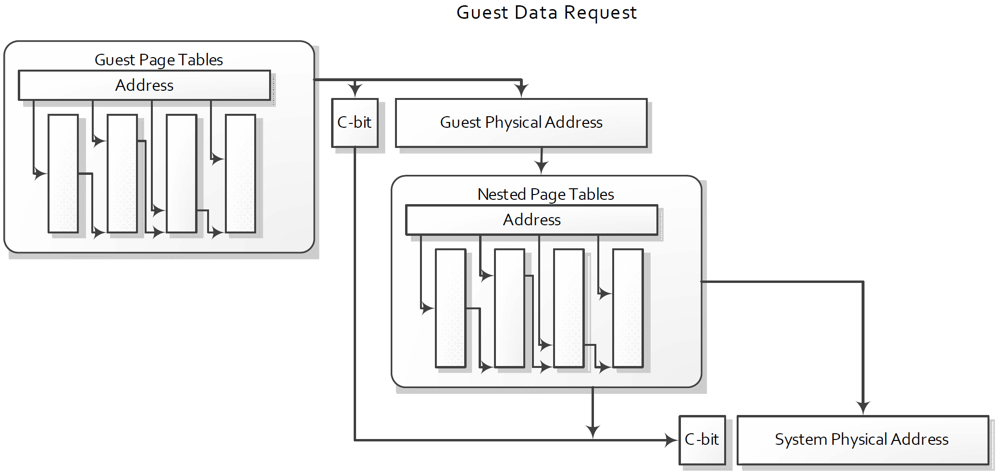
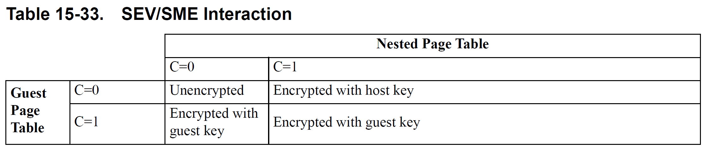
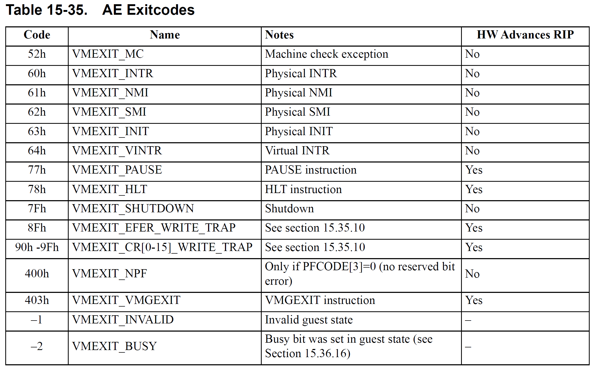

# AMD Manual for SEV

### 15.34 Secure Encryption Virtualization

#### Determining Support for SEV

`CPUID 8000_001F[EAX]` 中 bit-1 用于指示是否支持 SEV，bit-0 指示 SME。

`CPUID 8000_001F[EBX]` 和 `CPUID 8000_001F[ECX]` 关于内存加密的额外信息，如支持的密钥数量，以及使用哪个页表位标记加密页面。

启用 SEV 后，物理地址长度缩短，47-43 位保留。

#### Key Management

每个 SEV VM 对应一个加密密钥，而 SME 使用一个单独的密钥。SEV 密钥又 AMD-SP 安全处理器管理。HV 协调 AMD-SP 驱动加载密钥，分配 ASID 作为密钥索引。

#### Enabling SEV

`MSR C001_0010(SYSCFG)` 的 bit-23 置位开启内存加密，否则 SEV 相关设置会被忽略。然后设置 VMCB 偏移 `090h` 为虚拟机开启 SEV。

需要检查开启 NPT，`MSR C001_0015(HWCR)[SmmLock]` 以及 ASID 在 SEV 范围内（由 `CPUID 8000_001F[ECX]` 指定）。

#### Supported Operating Modes

SEV 可以在任何模式的 guest 启用，但是只有长模式和 PAE 模式才能控制内存加密，否则加密所有内存。

#### SEV Encryption Behavior

对于数据页，根据 gPT 的 C-bit 确定内存页的加密状态。而对于取指和页表遍历的内存访问都忽略 C-bit 而视为私有。guest 希望外部代码访问这些内存页需要显式地复制到共享内存区。

#### Page Table Support

C-bit 由 `CPUID 8000_001F[EBX]` 指定，如果它在地址位中，那么在嵌套页表遍历时会被屏蔽。HV 不需要知道 guest 将哪些页标记为私有。

gPA 中的 C-bit 被保存并用于最后嵌套地址转换后的 sPA。

#### Restrictions

某些硬件实现可能不会强制确保使用不同 C-bit 或密钥的同一物理页面的映射之间的一致性，更改 C-bit 或密钥时，需要从 CPU 中刷新页面。

#### SEV Interaction with SME

SEV 与 SME 结合使用，gPT 控制 guest 内存加密，nPT 控制共享内存的加密。

#### Page Flush MSR

如果不支持跨加密域的一致性，且 HV 希望读取加密页面，首先要从所有 CPU 缓存中刷新目标页。可以在所有核上运行 WBINVD 或使用 `VMPAGE_FLUSH MSR(C001_011E)` 实现。CPU 支持在 `CPUID 8000_001F[EAX]` 中 bit-2 指定。

VMPAGE_FLUSH MSR 是只写的寄存器，用于刷新 guest 的 4K 页。HV 将页的 hVA 和 guest ASID 写入到此 MSR，硬件会执行 write-back invalidation，CPU 缓存中的脏数据会被加密地写回内存。使用 hPT 执行地址转换，命中并逐出 guest 缓存的内存。VMPAGE_FLUSH MSR 只会刷新由 guest 标记为私有的内存页，如果 HV 不知道页是否为私有并希望从缓存中刷新，还应该使用标准的 CLFLUSH。

#### SEV_STATUS MSR

Guest 通过读取 `SEV_STATUS MSR(C001_0131)` 确定当前哪些 SEV 特性已激活。它指示了 HV 在上一次 VMRUN 为 guest 启用了哪些 SEV 特性。此 MSR 只能在 guest 模式读取且是只读的，HV 无法解惑对此 MSR 的访问。

#### Virtual Transparent Encryption, VTE

VTE 强制使用 guest 密钥加密 guest 的所有内存访问。HV 在 VMCB 偏移 `090h` bit-5 标志位，仅在 SEV 开启且 SEV-ES 关闭时有用。VTE 开启后 CPU 将所有的 guest C-bit 看作 1，gPT 中的 C-bit 被忽略。

### 15.35 Encrypted State (SEV-ES)

#### Determining Support for SEV-ES

`CPUID 8000_001F[EAX]` bit-3 指示 SEV-ES 支持。

#### Enabling SEV-ES

设置 VMCB 偏移 `090h` bit-2 标志位启用 SEV-ES，还需要启用 SEV 和 LBR（偏移 `B8h` bit-0）。

对于开启了 SEV 关闭 SEV-ES 的 VM 的 ASID 有范围限制，由 `CPUID 8000_001F[EDX]` 指定最小的可用作此类 VM 的 ASID。如 EDX 值为 5，ECX（指定 SEV ASID 最大数）为 15，则表示使用 ASID 1-4 的 VM 必须是 SEV & SEV-ES 的，而使用 ASID 5-15 的 VM 是 SEV（SEV-ES disabled）。

首次运行 SEV-ES VM 之前，HV 需要与 AMD-SP 协调 guest 创建初始加密状态映像。

#### SEV-ES Overview

SEV-ES 默认保护 guest 寄存器状态，仅允许 guest 本身根据需要授予选择性的访问权限。首先，VM Exit 发生时，所有 VM 寄存器状态都被加密保存。仅在 VMRUN 之后解密恢复。某些类型的 VM Exit 事件会导致 guest 触发新的异常，称为 \#VC 异常，表明 guest 执行了需要 HV 参与的操作，如 I/O 访问。guest OS 中的 VC handler 负责确定要为 HV 的模拟操作公开什么寄存器状态，同时会检查来自 HV 的返回值，在认为输出可接受时更新 guest 状态。

需要公开的寄存器状态使用 GHCB 管理，由 guest 指定将某个共享页作为 GHCB，允许 HV 访问。HV 只能读取 GHCB 中的状态，而所有传统的 VMCB 状态都使用 guest 密钥加密并受完整性保护。

VC handler 中，guest 使用新的 VMGEXIT 指令切换上下文，HV 检查 GHCB 确定 guest 请求的服务。

#### Types of Exits

SEV-ES 将 VM Exit 分为 AE 和 NAE。AE 通常是与 guest 执行异步发生的事件或不需要暴露 guest 寄存器状态的事件。所有其他的 VM Exit 都是 NAE，在 NAE 事件中，guest 需要确定要在 GHCB 中公开的寄存器状态。两类事件都只有在 VMCB 中拦截标志位置位时才会发生。

HV 在 VMCB 的 EXITCODE 字段获取 AE 事件代码。而 NAE 事件会导致由 guest 处理的 \#VC 异常。

某些指令导致的 AE 会使 CPU 自增 RIP，VMRUN 后从下一条指令恢复执行。

在 nested page fault 中，没有保留位错误的才会被视为 AE，用于帮助区分需求未命中（需要 HV 分配页）和 MMIO 模拟（HV 需要模拟设备）导致的 NPF。因此，HV 可以在它打算模拟的所有 MMIO 页上设置保留的页表位，确保 MMIO 触发 NAE 事件，然后可以调用 guest VC handler 协助模拟。作为 AE 事件的 NPF 不会调用任何 guest 程序，由 HV 分配内存后恢复 guest。

当 guest 启用了 SEV-ES 后，VMCB 偏移 `D0h` 指令字节永远不会再 NPF 时保存到 VMCB。

#### \#VC Exception

SEV-ES VM 触发 NAE 事件时，硬件会生成 VMM Communication Exception, \#VC 异常。\#VC 异常是使用异常向量 29 的精确、促进性、fault-type 异常，无法屏蔽。\#VC 异常的错误代码等于 NAE 的 VMEXIT 代码。

要响应 \#VC 异常，guest 中的 VC handler 会检查错误代码，决定将哪些寄存器状态复制到 GHCB。然后执行 VMGEXIT 指令触发 AE 切换到 HV。HV 执行 VMRUN 返回后，guest 恢复到 VMGEXIT 指令之后，handler 查看 GHCB 中 HV 的返回值，更新寄存器状态。

HV 不应该设置 VMCB 标志位解惑 \#VC 异常，会使 guest 无法正确处理 NAE。类似的，也应该避免为将在 VC handler 中发生的事件设置拦截位。

#### VMGEXIT

VMGEXIT 指令允许 guest VC handler 调用 HV，会触发带有 VMEXIT_VMGEXIT 代码的 AE，类似于 trap，后续的 VMRUN 会恢复到 VMGEXIT 之后。VMGEXIT 没有 HV 拦截位，因为 guest 执行会无条件导致 AE。

开启 SEV-ES 后，VMGEXIT 仅在 guest 中有效，而未开启 SEV-ES 时，VMGEXIT 将被视为 VMMCALL。

#### GHCB

GHCB 是 guest 与 HV 的共享内存页，guest 通过 `GHCB MSR(C001_0130)` 设置 GHCB 物理地址 gPA，保存在 VMCB `0A0h` 中。GHCB MSR 只能在 guest 模式下读写，host 模式访问会导致 \#GP。

硬件不会直接访问 GHCB，对格式不做要求。

#### VMRUN

SEV-ES 未启用时，VMSA 数据存在 VMCB 页的 `400h` 偏移处，而启用后存在独立的 VMSA 页，由 VMCB `108h` 处的 VMSA 指针指定其物理地址 sPA。硬件通过 guest VEK 访问 VMSA。

SEV-ES 启用后，执行 VMRUN 指令时，硬件从 VMSA 指针的地址加载 guest 状态。除了标准的 VMRUN 行为之外，此时的 VMRUN 还会执行以下动作：

- 计算 guest 状态的校验和以验证完整性
- 执行 VMLOAD 加载额外的 guest 寄存器状态
- 加载 GPR（General-Purpose Register）状态
- 加载 guest FPU 状态

开启 SEV-ES 后，所有 GPR 和 FPU 状态保存在 VMSA 中。如果 VMRUN 操作的任何部分出现故障或完整性校验和不匹配，会生成 \#VMEXIT(VMEXIT_INVALID)。启用 SEV-ES 后，VMRUN 会忽略 VMCB clear 标志位，始终重新加载完整的 guest 状态。

对于 SEV-ES VM，虽然 VMRUN 加载完整的 guest 状态，但是只将传统 VMRUN 定义的最小 HV 状态保存到 host 保存区（其物理地址由 `VM_HSAVE_PA MSR(C001_0117h )` 指定）。HV 自身应将所需的附加段状态和 GPR 值保存到 host 保存区，后续的 VMEXIT 中由硬件恢复。VMRUN 时硬件不会自动保存 HV 状态如 FS、STAR 或 GPR 值。

SEV-ES 限制了对 guest 的事件注入，不能注入软件中断和异常向量 3 和 4，否则 VMRUN 会失败，错误码 VMEXIT_INVALID。

#### Automatic Exits

SEV-VM 执行 AE 时，硬件会自动将 guest 状态保存到加密的 VMSA，并从 host 状态保存区恢复执行 HV。除了标准的 VMEXIT 恢复/保存状态流程，还需要执行以下步骤：

- 执行 VMSAVE 保存额外 guest 寄存器状态
- 保存 guest GPR 状态
- 保存 guest FPU 状态
- 计算并保存 VMSA 的校验值
- 执行 VMLOAD 恢复 HV 寄存器状态
- 加载 host GPR 状态
- 重初始化 FPU 状态

所有寄存器值要么从 host 保存区加载，要么初始化为默认值，因此 guest 寄存器状态对 HV 不可见。

#### Control Register Write Traps

不推荐使用 `CR[0-15]_WRITE` 拦截 SEV-ES VM 事件，这些截获发生在控制寄存器修改之前，HV 无法修改控制寄存器本身。推荐 HV 使用` CR[0-15]_WRITE_TRAP` 和 `EFER_WRITE_TRAP` 标志位代替，会在寄存器被修改后触发 AE 事件。这使得 HV 能够跟踪 guest 并验证是否开启了所需的特性，陷入时控制寄存器的新值保存在 EXITINFO1 中。只有 SEV-ES VM 支持 CR trap。

硬件会忽略 SEV-ES VM 对 EFER.SVME 的写入。

#### Interaction with SMI and \#MC

如果在执行 SEV-ES VM 时发生 SMI，不会立即执行 SMI handler。SMI 会挂起并生成 \#VMEXIT(SMI)，执行 STGI 指令后会将 SMI 置于 HV 上下文，无视 VMCB 的 SMI 拦截标志位。（STGI 即将全局中断标志位 Global Interrupt Flag, GIF 置位）

### 15.36 Secure Nested paging (SEV-SNP)

