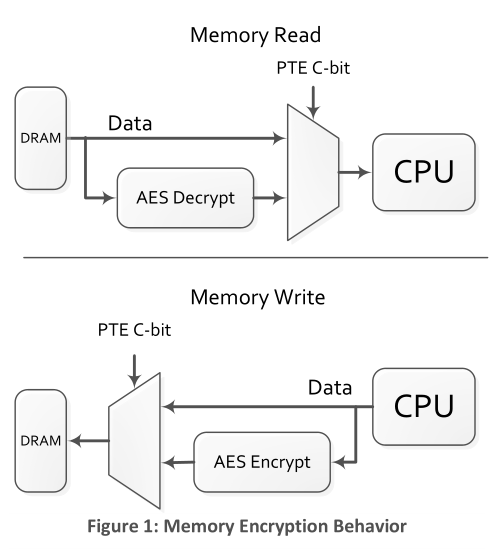
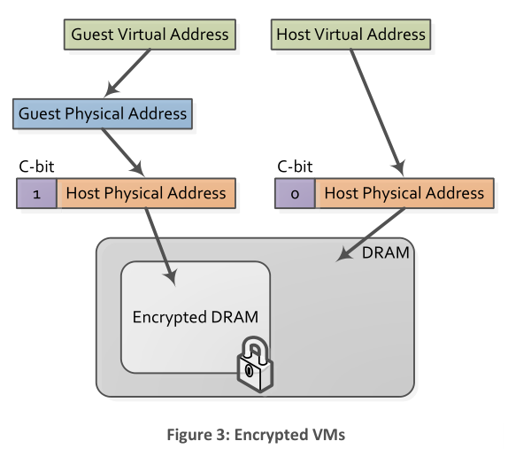
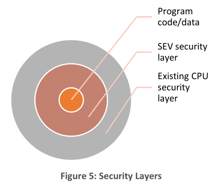
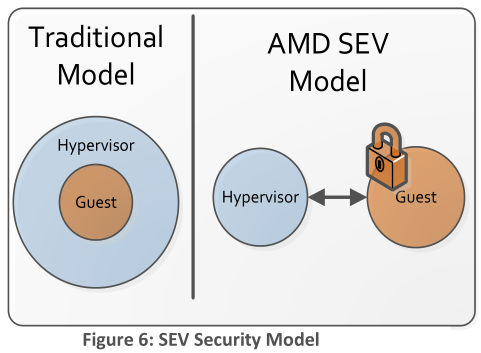
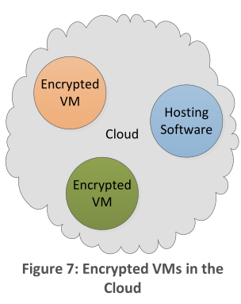
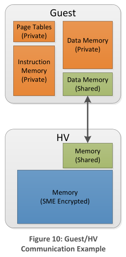
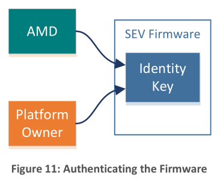
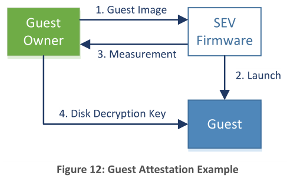

# AMD Memory Encryption

[pdf](./AMD_Memory_Encryption_Whitepaper_v7-Public.pdf)

## Secure Memory Encryption, SME

### 概述

 内存控制器中包含 AES 引擎，写入内存时加密，读内存时解密。

AES 密钥每次重启会随机生成，由 AMD Secure Processor, AMD-SP 管理，32 位微控制器（ARM Cortex-A5），相当于集成在 AMD SOC 上的专用安全子系统。密钥存储在专用的硬件寄存器，外界无法查看明文。SME 不需要软件参与密钥管理。

对哪些内存页进行加密是由 OS 或 Hypervisor 通过页表控制。开启内存加密后，物理地址 47 位（称之为 C-bit）用于标志是否加密内存页。

> AMD Manual 2, 7.10 Secure Memory Encryption:
>
> "Additionally, in some implementations, the physical address size of the processor may be reduced when memory encryption features are enabled, for example from 48 to 43 bits. In this case the upper physical address bits are treated as reserved when the feature is enabled except where otherwise indicated."
>
> 开启 SME，没有特殊说明时，高位物理地址被保留 ，与页表项的其他保留位一样，在地址转换时，如果非零就会触发 page fault。

### 使用模式

#### 全加密

把所有内存页的 C-bit 都置位，加密所有的内存。OS、Hypervisor 和 VM 都使用相同的密钥加密，支持 DMA，对设备而言，加密内存访问只是 C-bit 置位的普通访问。

> DMA、IOMMU；设备虚拟化、VFIO、Virtio

#### 部分加密

C-bit 的使用让内存加密更灵活，只需要加密敏感数据，可以减少性能开销。

可以通过把 NPT 表项的 C-bit 都置位来加密 VM，可以抵抗恶意的服务提供商。

### SME 注意事项

首先是硬件不会保证加密和未加密页面副本之间的一致性。因此软件在修改 C-bit 时必须在页表修改之前从 cache 中刷新页面。

> 加密引擎在 SoC 和存储系统之间，而 Cache 整合在 SoC 中，那 Cache 里的数据是 ~~加密后的~~ 未加密的明文，具体还要看 AMD 手册。
>
> [Does anyone know what mode of AES that SEV (or SME) uses? I have been reading th... | Hacker News (ycombinator.com)](https://news.ycombinator.com/item?id=23831597)
>
> AES 标准的分块大小为 128 bits，AMD 并未明确密钥长度以及加密模式。

另外，设备向加密内存发出 DMA，但是它们也需要将 C-bit 置位，无法在 32 位旧设备上完成。软件可以利用 IOMMU 将设备请求地址重映射到设置了 C-bit 的位置。

### 透明 SME

SME 需要 OS 或 Hypervisor 支持，对于要加密整个内存且运行旧 OS 和 Hypervisor 的系统，可以使用 Transparent SME, TSME。TSME 会加密所有的内存页，不考虑 C-bit 的设置。TSME 不需要软件适配。

TSME 可以通过 BIOS 设置在支持的平台上开启，一旦 TSME 开启，其他内存加密特性不再生效。

## Secure Encrypted Virtualization, SEV

软硬件的发展，系统整合很多功能，系统的复杂性以及整合带来的攻击面都给系统安全性带来挑战。

Secure Encrypted Virtualization, SEV 是 AMD 架构中的新特性，旨在更好地处理现代系统的复杂性和隔离需求。SEV 利用密码学增强隔离性，加密代码和数据，并启用了一种全新的安全模型，在这个模型中，可以通过加密方式保护代码免受更高特权级代码如 Hypervisor 的影响。

### SEV 安全模型

传统的系统使用特权级环模型，高权限代码可以完全访问低权限代码。

在 SEV 模型中，执行在不同特权级的代码（也就是 Hypervisor 和 Guest）是隔离开的，无法访问另一级别的资源。即使 Hypervisor 级别是传统意义上的高特权级，SEV 使用密码学实现级别隔离。这为低特权级代码提供了额外的安全性，无需信任高特权级代码。Hypervisor 和 Guest 之间还可以通信，但会受到严格控制。

SEV 围绕这样一个威胁模型构建：攻击者不仅有权在机器上执行用户级代码，还可能在更高特权的 Hypervisor 中执行恶意代码。攻击者还有可能有访问机器的物理权限。在这些情况下，SEV 提供额外的保证来帮助保护 Guest 虚拟机代码和数据免受攻击。要注意的是，SEV 不能防止针对 Guest 的 dos 攻击。

### SEV 使用场景

SEV 使用的内存加密可以提供与 SME 相同的安全优势，用于物理攻击保护。

#### 云计算

云计算的发展存在各种安全挑战。云基础设施和人员并不都可信，特别是在处理敏感数据时。多用户之间共享硬件资源也会带来安全问题。

SEV 通过从硬件层面提供更好的安全隔离提高云计算的安全等级。SEV 可以保护使用中的数据，即使云数据中心中的恶意管理人员也无法访问托管 VM 中的数据。

#### 沙箱

SEV 可以构建安全沙箱环境，软件在环境中执行，与系统上其他软件隔离。沙箱可以是 VM 那样有自己的磁盘和 OS，也可以实现更细粒度的隔离。例如， SEV 硬件可以将 Docker 容器与主机系统隔离，更好地保护机密数据。

### SEV 架构

#### 概述

SEV 是 AMD-V 架构（AMD 硬件虚拟化架构）的扩展，开启后，SEV 使用 VM ASID 标记所有代码和数据来指示数据源于或用于哪个 VM。在 SOC 内部，标签始终与数据一起保存，防止该数据被所有者以外的任何人使用。在 SOC 外部，128 位的 AES 加密保护数据。数据离开或进入 SOC 时，硬件使用标签相关的密钥加密或解密数据。

> AMD: Address Space IDentifier, ASID
>
> Intel: Process-Context IDentifier
>
> 主要用于 TLB
>
> [Translation lookaside buffer - Wikipedia](https://en.wikipedia.org/wiki/Translation_lookaside_buffer#PCID)
>
> [x86 - How many bits there are in a TLB ASID tag for Intel processors? And how to handle 'ASID overflow'? - Stack Overflow](https://stackoverflow.com/questions/52813239/how-many-bits-there-are-in-a-tlb-asid-tag-for-intel-processors-and-how-to-handl)

每个 VM 以及 Hypervisor 都关联一个标签，对应一个加密密钥。数据仅限拥有标签的 VM 使用。如果其他任何程序访问，只能看到加密后的数据，实现 VM 之间以及 VM 和 Hypervisor 之间的加密隔离。

#### 加密内存

SEV 使用与 SME 相同的高性能加密引擎，也使用页表项的 C-bit 标记页面是否加密，会有一些其他的限制条件。

SEV 的一个关键特性是 Guest 可以选择将哪些数据内存页设为私有，通过标准 CPU 页表实现，完全由 Guest 控制。私有内存使用 Guest 专用的密钥加密，而共享内存可以使用 Hypervisor 密钥加密。一般情况下，Guest 会将所有代码和数据映射为私有，指定公开的共享页面除外。安全起见，SEV 硬件需要一些内存（指令页和页表）始终是私有的，以保护 VM。

#### 密钥管理

SEV 的安全很大程度上依赖于内存加密密钥的安全。运行在 AMD-SP 中的 SEV 固件提供了安全的密钥管理接口，Hypervisor 使用这个接口为 Guest 开启 SEV 并执行常用的 SEV 管理活动，如启动、允许、快照、迁移和调试 Guest 等。

SEV 固件执行三个主要安全属性：平台身份验证、已启动 Guest 的证明，Guest 数据的机密性。

对平台进行身份验证可防止恶意软件或设备伪装成合法平台。平台的真实性由其身份密钥证明。此密钥由 AMD 签名，以证明该平台是具有 SEV 功能的可信 AMD 平台。密钥还由平台拥有者签名，以向 Guest 拥有者或远程平台上的其他固件展示机器的管理和拥有者。

Guest 启动证明向 Guest 所有者证明它们的 Guest 在启用 SEV 的情况下安全地启动。SEV 相关 Guest 状态各种组件（包括初始内存内容）的签名由固件提供给所有者，以验证 Guest 是否处于预期状态。Guest 所有者可以据此确保 Hypervisor 在向 Guest 传输机密信息之前不会干扰 SEV 的初始化。过程举例如下图。首先，所有者向云计算系统提供 Guest Image，固件协助启动 Guest，并返回一个度量结果。如果所有者认可度量结果，它就会提供进一步的敏感信息给 Guest，允许它继续启动。

Guest 的机密性是通过使用只有 SEV 固件知道的内存加密密钥来加密内存实现的。SEV 管理接口不允许在未正确验证接收方的情况下将内存加密密钥（或者任何其他敏感 SEV 状态）导出到固件之外。这可以防止 Hypervisor 获取对密钥的访问权限，从而访问 Guest 数据。

接口还提供了将 Guest 数据迁移到另一个支持 SEV 的平台的机制。Guest 的内存内容在传输过程中会保持加密状态。一旦远程平台通过身份验证，SEV固件就会安全地发送 Guest 的内存加密密钥，以便远程平台可以继续运行 Guest。Hypervisor 可以借助这种机制在启用 SEV 后实现安全的迁移和快照功能。

### SEV 软件影响

#### Hypervisor

与传统虚拟化一样，SEV 还是依赖 Hypervisor 实现很多功能，但减少了对 Hypervisor 的安全依赖。运行时，Hypervisor 与 AMD-SP 通信协调内存加密密钥的管理。这种通信是通过 AMD-SP 驱动程序完成的，涉及的任务包括在 VM 即将运行时通知 AMD-SP，从而允许 AMD-SP 将相应的加密密钥加载到 AES-128 加密引擎。Hypervisor 还与 AMD-SP 通信以建立安全机制来执行 Guest 证明、迁移等。

即使 Hypervisor 可以控制 VM 的 ASID 并选择加密密钥，但 AMD 并不认为这是一个安全问题，因为一个加载的加密密钥没有意义，除非 Guest 已使用该密钥加密。如果加载不正确的密钥或 Guest 使用了错误的 ASID，那么 Guest 的第一次取指就会失败，内存用错误的密钥解密，导致垃圾数据执行，很有可能导致故障。

> CROSSLINE: Breaking "Security-by-Crash" based Memory Isolation in AMD SEV, CCS 2021
>
> 工作证明了 AMD 的 Security-by-Crash 的策略是不可靠的，后续会详细阅读论文。

#### Guest

启用 SEV 的 Guest OS 必须了解这一硬件特性并配置页表。这可以通过与 SME 全内存加密模式类似的方法来完成，大多数页表项的 C-bit 被设置为 1。

对启用 SEV 的 Guest 而言，一个重要的注意事项就是 SEV 硬件不允许 DMA 访问 Guest 加密内存。所有 DMA，无论是物理还是模拟，都必须发生在共享 Guest 内存中。因此，Guest OS 可以选择为 DMA 分配共享内存页面（C-bit 置零），或将数据复制到特殊缓冲区（反弹缓冲区 *bounce buffer*）。

最后要注意的是，SEV 支持多核 Guest，并且可以在核之间共享数据，不会造成额外的性能损失。Hypervisor 为一个 Guest 的所有 VCPU 实例使用相同的 ASID。

### SEV 特别注意事项

SME 的注意事项也适用于 SEV，特别是在使用不同的 C-bit 访问页面之前要从缓存中刷新页面。此外，在更换硬件内存加密密钥之前，Hypervisor 也必须执行完全缓存刷新，以确保使用该密钥的任何修改数据都已写回内存。

最后，由于在 64 位和 32 位 PAE 模式下运行时 C-bit 只能由 Guest OS 控制，在所有其他模式下，SEV 硬件强制将 C-bit 置位。这允许 Guest OS 启动后立即运行加密代码，并安全地过渡到最终模式。

## 总结

SME 灵活且强大，允许 OS 或 Hypervisor 进行内存加密。主要针对物理硬件攻击的保护。SME 不需要更改应用程序软件，通过适当地修改 OS 和 Hypervisor 保护系统中所有程序。

SEV 增强了虚拟机安全，它支持允许 Hypervisor 无法直接访问的加密 Guest。这为云计算用户提供了新的保护。基于 AMD-V 技术，SEV 可用于云和 Docker 等模型，为虚拟化环境提供新的安全模型，使用专用硬件引擎快递透明地执行 VM 加密。