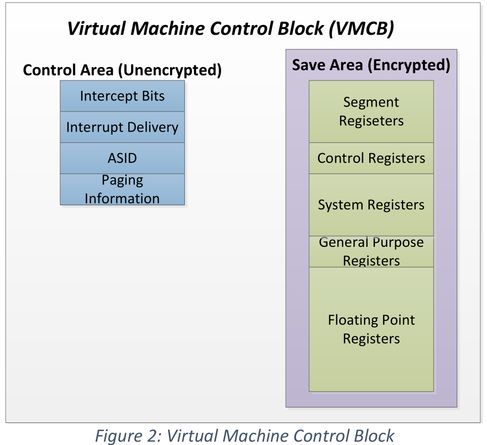
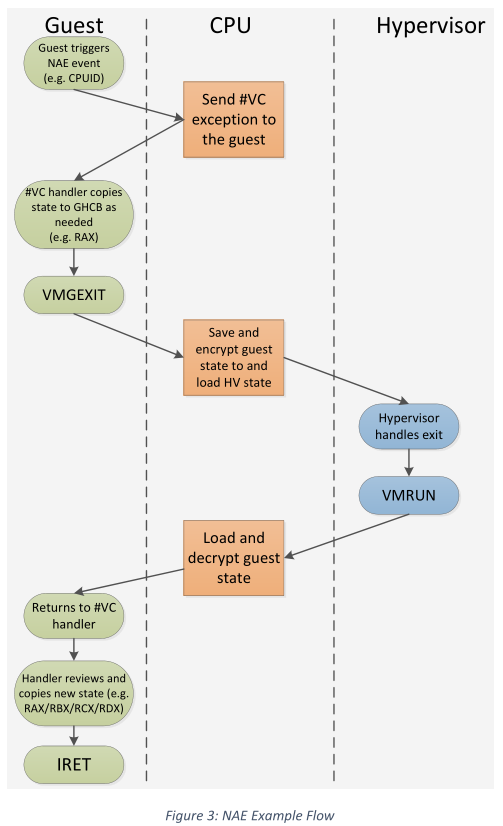

# AMD SEV with Encrypted State

[pdf](./Protecting%20VM%20Register%20State%20with%20SEV-ES.pdf)

AMD SEV 结合了内存加密和 AMD-V 虚拟化，支持加密虚拟机，是云计算等多租户环境的理想选择，可以防止各种跨虚拟机和基于 HV 的攻击。但是当 VM 中断或停止运行时，其寄存器内容会保存到 HN 内存，因此可以窃取信息或更改 Guest 状态值，如指针、加密密钥等。SEV with Encrypted State, SEV-ES 通过 VM 停止运行时加密保护所有 CPU 寄存器内容，同时提供完整性保护，旨在保护 Guest 寄存器状态免受恶意 HV 攻击，包括读取、篡改和重放。难点在于有时 HV 确实要访问 VM 寄存器以提供设备模拟、MSR 处理等服务，难以从访问中检测出恶意使用。为此，SEV-ES 让 Guest 选择它要暴露给 HV 的信息，类似于 SEV 中选择共享内存页面。

### 加密寄存器状态

在之前的 AMD-V 架构中，保存和恢复 VM 寄存器由几步完成，VMRUN 指令用于转移控制权到 Guest，它只保存和加载部分机器状态，不包括系统寄存器和通用寄存器。在恢复 Guest 之前，HV 要用 VMLOAD 指令加载额外的系统状态，还可能要使用 XRSTOR 加载浮点寄存器状态。

SEV-ES 将这些操作结合到一个原子硬件指令 VMRUN 中，启用 SEV-ES 后执行 VMRUN，CPU 会加载所有 Guest 寄存器信息。当 VM 停止运行时，硬件会把所有状态保存到内存中。原子过程保证 HV 和 Guest 之间的切换无法打断，Guest 信息不会泄漏到 HV。硬件保存和恢复 Guest 寄存器状态时，会使用 VM 的内存加密密钥加密保存到内存中。同时还会计算一个完整性校验值，保存在软件无法访问的 DRAM 中，在之后恢复状态之前确保未被篡改。

在 SEV-ES 架构中，虚拟机控制结构（Virtual Machine Control Block, VMCB）分为两部分：控制域，由 HV 所有并管理，包括 HV 想拦截的事件、中断传递信息等；保存域，用于保存 VM 寄存器状态，启用 SEV-ES 后，这部分就会被加密和完整性保护。

### VM Exits

HV 可以通过设置 VMCB 中的 Intercept Bits 配置触发 VM Exit 的事件。传统 AMD-V 架构中，发生 VM Exit 事件后，硬件将控制权交给 HV，使用事件代码指示原因。

在 SEV-ES 架构中，VM Exit 事件分为两组：自动（Automatic Exits, AE）和非自动（Non-Automatic Exits, NAE）。NAE 事件是指需要 HV 模拟的事件，而 AE 事件不需要模拟，包括异步中断、关机、特定的页错误。

启用 SEV-ES 后，AE 事件导致控制权转移到 HV，CPU 硬件保存并加密 Guest 寄存器状态。之后通过 VMRUN 指令恢复 Guest。而 NAE 事件由 Guest 中的特定行为触发，不会切换到 HV，而是生成一个新的异常 #VC，必须由 Guest 处理。

### VMM Communication Exception, \#VC

\#VC 异常表示 Guest OS 执行了需要 HV 模拟的事件，VC handler 要决定如何响应和请求 HV 中的服务。SEV-ES 设计了通信结构（Guest Hypervisor Communication Block, GHCB），它保存在共享页中，Guest 和 HV 都可以访问，其结构为明确定义，可以参考 VMCB 保存域。

不同的事件需要在 Guest 和 HV 之间传递不同的状态信息，VC handler 必须在运行时决定将 Guest 的哪些状态暴露给 HV。例如，Guest 要执行 CPUID 指令，就要用 RAX 接受返回值。VC handler 把相关的状态和对 HV 服务的请求复制到 GHCB 中。然后 VC handler 使用 VMGEXIT 指令将控制权交还给 HV，这条指令会触发 AE 事件，自动保存 Guest 状态。此时 HV 会读取 GHCB 确定 Guest 所需的模拟支持，HV 无法直接修改 Guest 状态，执行模拟后将新状态值写到 GHCB 中。HV 恢复 Guest，回到 VC handler 的后半段执行，检查 GHCB 中的状态更改，如果接受修改，就将转来复制到相关寄存器中。VC handler 的流程如下图。

### 初始化 SES-ES 虚拟机

初始化类似于 SEV 虚拟机，执行前内存映像和 CPU 寄存器状态都要由 AMD-SP 加密，AMD-SP 度量后生成可用于 Guest 证明的启动收据，向 Guest 所有者确认虚拟机以正确的影响和寄存器状态启动成功。

### 软件影响

和 SEV 一样，不需要修改应用程序，只有 Guest OS 和 HV 受影响。Guest OS 需要支持处理 \#VC 异常并与 HV 通信实现所需的模拟支持。所有的 NAE 事件都会触发 \#VC 异常，因此不需要修改 Guest 中的驱动。与 HV 的通信都是由 VC handler 完成的。

由于无法访问对 SEV-ES Guest 寄存器状态，HV  需要支持 GHCB 结构，以便与 Guest 中的 VC handler 通信。在许多情况下，相应模拟请求要读写 GHCB 结构，而不是 VMCB。此外，在 SEV-ES 中很多模拟相关的任务实际被转移到 VC handler 执行，HV 需要支持的模拟大大减少。

### 性能优化

可以通过 \#VC 异常 Guest 和 HV 的通信，VC handler 可以实现减少模式切换或完全在 Guest 中处理 NAE 事件。例如，VC handler 可以缓存静态值（如 CPUID 结果），或将多个 HV 请求批处理到一个 VMGEXIT 中。

总的来说，SEV-ES 就是在 SEV 基础上提供对 Guest 状态的加密和完整性保护，同时让 Guest 可以控制向 HV 公开的信息。
