# AMD SEV with Secure Nested Paging

[pdf](./SEV-SNP-strengthening-vm-isolation-with-integrity-protection-and-more.pdf)

传统的虚拟化安全模型中，HV 是可信组件。但云计算环境中，用户希望数据对服务提供商保密，这就需要在硬件级别将共存在物理服务器上的 VM 与 HV 及其他代码隔离。AMD SEV 使用内存加密应对这一挑战，为每个 VM 分配唯一的加密密钥，硬件自动加密 VM 数据，HV 只能读取到加密后的内容。而 AMD SEV-ES 增加了对 CPU 寄存器状态的机密性和完整性保护，由 VM 按需控制暴露给 HV 的状态信息。而 SEV-SNP（SEV with Secure Nested Paging）是新一代的 SEV，添加了对内存的完整性保护，防止恶意 HV 的数据重放、内存重映射等攻击。同时引入了几个额外的可选安全增强功能，以支持额外的 VM 使用模型，提供更强大的中断行为保护，对侧信道攻击提供更强保护。

### 完整性案例

SEV 使用的 AES 加密提供机密性保护，密钥由硬件随机数发生器生成，存在专门的硬件寄存器中，软件无法直接读取，硬件设计使得不同内存位置的相同明文将以不同的方式加密。虽然攻击者不知道密钥无法破解内存数据，但是攻击者可以更改内存的值，即完整性攻击，VM 可能会读到垃圾数据或者被重放攻击，攻击的效果取决于 VM 内部的软件如何使用数据。

SEV-SNP 旨在防止基于软件的完整性攻击，基本原则是，如果 VM 能够读取私有（加密的）内存页，那它必须读取上次写入的值。也就是说，VM 将值 A 写入内存位置 X，那么以后无论何时读取 X，都必须获得值 A 或触发无法读取内存的异常。无论读取和上次写入之间内存发生了什么，如内存页交换到磁盘，或即使整个虚拟机迁移到新平台，完整性保证必须仍然有效。执行这样的完整性保证需要 CPU 硬件和固件的配合。要注意的是，SEV-SNP 的完整性保护仅适用于私有内存页。

### 威胁模型

与 SEV 和 SEV-ES 一样，SEV-SNP 将 AMD SoC、AMD-SP 和 VM 视为可信，在 SEV-SNP 中，所有其他的 CPU 软件和 PCI 设备都被视为不可信，即假设这些组件是恶意的。

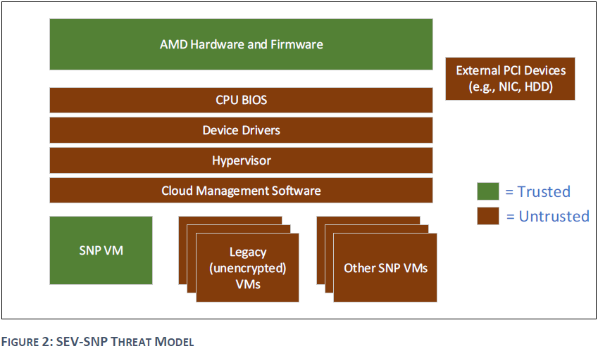

SEV-SNP 的特性能抵御比之前的 SEV 技术更多的威胁。SEV 和 SEV-ES 的威胁模型中，HV 是“良性但易受攻击”的，虽然不是绝对安全，但认为它是善意的，即 HV 没有主动尝试破坏 SEV VM，但它本身可能存在可利用的漏洞。SEV 和 SEV-ES 作用在于帮助限制某些 HV 漏洞暴露或提升利用难度。而 SEV-SNP 解决额外的攻击向量和对 VM 安全的潜在威胁。下表总结了几种 SEV 技术已解决和未解决的威胁。

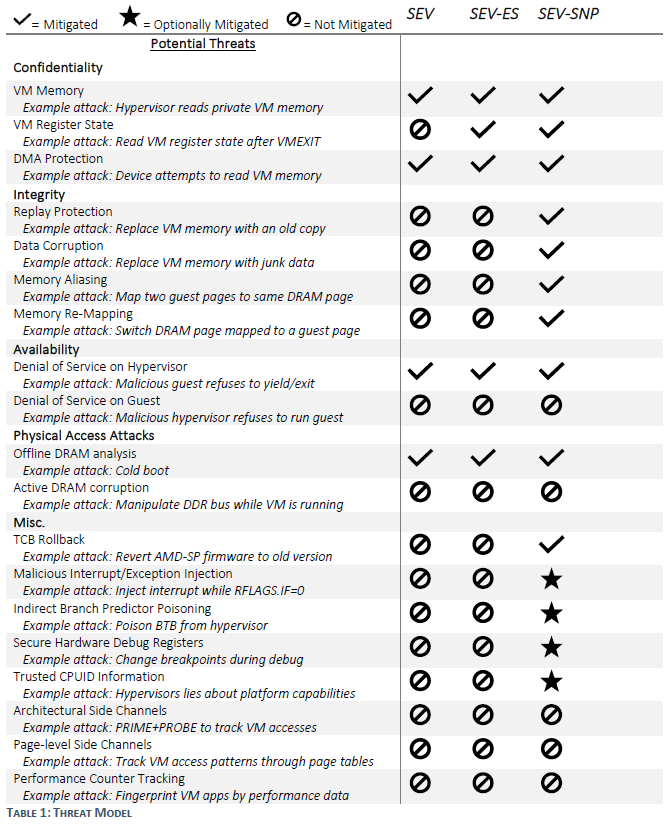

**机密性** 机密性由基于硬件的内存加密保证，SEV-ES 添加了对 VM 寄存器状态的机密性保护。

**完整性** SEV-SNP 可以抵御包括数据重放、损坏、内存重映射和基于别名的攻击。

**可用性** 对 HV 而言的可用性保护是指 HV 可以在需要时获得控制权，或在未经 VM 同意情况下终止它，这是针对恶意的 VM。但是 SEV 无法提供对 VM 的可用性保证，因为恶意的 HV 可以选择不运行 VM。

**物理访问攻击** SEV 可以抵御某些物理访问攻击，如 DRAM 冷启动攻击，而在线 DRAM 完整性攻击，如在 VM 运行时攻击 DDR 总线已经超出了 SEV 的防御范围。

**其他** 针对安全 VM 还有其他几种潜在的攻击，SEV-SNP 解决了其中的部分问题。如 SEV-SNP 通过加密方法验证 AMD-SP 固件和其他可信组件是否符合 VM 安全策略，以此抵御 TCB 回滚攻击。SEV-SNP 提供了可选的限制中断和异常注入到 VM 的能力、针对某些侧信道攻击的分支目标缓冲区保护等。

有一些攻击不再 SEV 考虑的范围：对 CPU 结构的架构侧信道攻击（可以通过修改软件实现防御）指纹攻击（通过监控访问模式、性能计数器等信息确定 VM 正在运行的代码）。

## 完整性保护

### 完整性威胁

上面主要提到四种完整性威胁：重放攻击、数据损坏、内存别名和内存重映射。防御这些威胁需要不同的安全属性，如下表。重放和数据损坏需要攻击者能够写 VM 内存，SEV-SNP 通过强制只有内存页所有者可以写解决这个问题，通过反向映射表（Reverse Map Table, RMP）实现。

内存别名攻击是指 HV 恶意地同时将两个不同的 Guest 内存页映射到同一物理页，而 Guest 要的是其物理空间（GPA）中的不同页映射到不同内存，否则可能导致数据损坏。解决这一威胁需要确保内存的每个物理页只能映射到一个 Guest 页，也是通过 RMP 实现。

内存重映射是指 HV 恶意地将一个 Guest 页重映射到多个物理页。解决此威胁需要确保每个 Guest 页一次仅映射到一页物理内存，并且除了 AMD-SNP 等可信实体外，无法更改映射。SEV-SNP 通过页面验证机制解决，它依赖于 RMP 机制和 VM 代码的组合管理 Guest 内存和系统内存之间的单射关系。

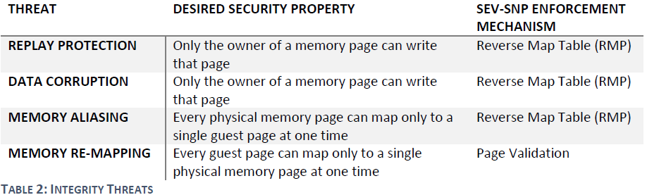

### 反向映射表 RMP

SEV-SNP 的很多完整性保证是通过一个新结构反向映射表（RMP）完成的。RMP 是一个跨系统共享的单一数据结构，每个 4K 页对应一个条目。RMP 的目标很简单：跟踪每个页的所有者。页可以由 HV、VM 或  AMD-SP 所有，对内存进行访问控制，只有页所有者才能写入。RMP 和标准页表结合使用执行内存限制和页访问权限。

RMP 由系统物理地址索引，在 CPU 和 IOMMU 页表遍历结束时检查。在非虚拟机模式，虚拟地址通过页表转换为物理地址，然后使用物理地址索引 RMP 条目，检查该页是否是 HV 拥有的页，是则创建对应 TLB 条目，否则会触发 page fault 并拒绝访问。运行在 SEV-SNP 虚拟机中时，RMP 检查过程稍微复杂一些。GVA 经过 VM 页表转换成 GPA，再经 NPT 转换成 SPA。使用 SPA 索引 RMP 条目，条目应包含指示该页是否是 Guest 拥有的页、分配给特定 Guest 和映射到特定 GPA 的信息。也就是说，TMP 条目中包含 SPA 映射到的 GPA，然后硬件验证该 GPA 与当前页表遍历的 GPA 是否匹配，如果检查失败会触发异常并拒绝访问。

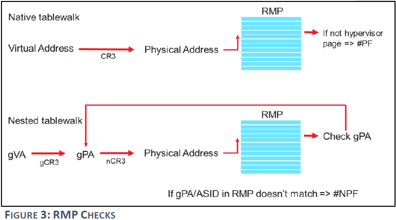

并不是所有内存访问都需要 RMP 检查，特别是 HV 或 非 SEV-SNP Guest 的读取访问不需要检查，因为数据机密性已经由 AES 内存加密保证。而任何模式下的写访问都需要 RMP 检查，而且对 SEV-SNP 中的私有内存页的读写访问都需要 RMP 检查。写访问除了写内存地址还包括页表遍历中 A/D 标志位更新。RMP 检查的结果会缓存在 CPU TLB 和相关结构中。

RMP 用于执行对内存的访问控制，所以它不能被软件直接写入。AMD 使用新的 CPU 指令开启 RMP 条目操作，允许 HV 将页分配给特定 Guest、回收页面等。硬件会自动执行 TLB 失效以确保所有处理器都看到最新的 RMP 条目信息。

### 页面验证

每个 RMP 条目都包含映射特定页的 GPA，确保每个 SPA 一次只能被映射到一个 GPA，而单个 GPA 映射到多个 SPA 也不满足 SEV-SNP 完整性保证。虽然 NPT 确保每个 GPA 值映射到一个 SPA，但 HV 可以修改 NPT。SEV-SNP 完整性要求对 NPT 的操作不能破坏所需的完整性，并通过验证的概念解决。

每个 RMP 条目都有一个验证位，在为 Guest 新建 RMP 条目时，该位会被 CPU 置零。分配给 Guest 但验证位为零的页不能被 HV 或作为私有页面使用。Guest 需要通过 PVALIDATE 置零设置验证位之后才能使用该页，只有 Guest 才能使用 PVALIDATE，并且每个 Guest 只能验证自己的内存。

为 Guest 添加新内存页需要两步：首先，HV 使用 RMPUPDATE 置零将页分配给 Guest，页面会转换为 Guest-Invalid 状态；然后，Guest 使用 PVALIDATE 指令验证页面，将其转换为 Guest-Valid 状态，可以正常使用。

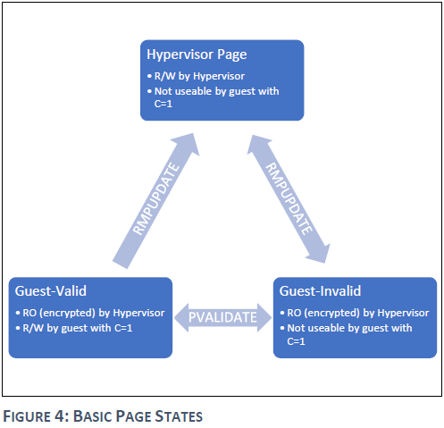

为了满足 SEV-SNP 的完整性要求，Guest 不能多次验证同一 GPA 对应的内存。这可以通过在 VM 启动时验证所有内存然后拒绝验证内存实现，或者 Guest 跟踪它已验证的内存位置，并拒绝两次验证相同的内存位置。Guest 正确验证其内存后，就保证了 GPA 和 SPA 之间的单射关系。每个 GPA 仅验证一次，RMP 通过构造确保每个 SPA 只能映射到一个 GPA。

正确完成页面验证就可以阻止如下图的重映射攻击。首先，GPA A 映射到 SPA X，Guest 执行 PVALIDATE 验证，RMP 中 SPA X 对应的条目验证位置位。如果 HV 尝试将 A 映射到不同的 SPA Y，首先为 SPA Y 创建一个 RMP 条目，尝试使用 RMPUPDATE 映射到 GPA A。然后修改 NPT 将 GPA A 映射到 Y。然而，当 Guest 访问 Y 时，会收到 \#VC 异常，因为 SPA Y 对应的 RMP 条目的 验证位为零，由于 Guest 已经验证过 GPA A，再接收到验证错误后就可以终止或采取其他措施保护自己。

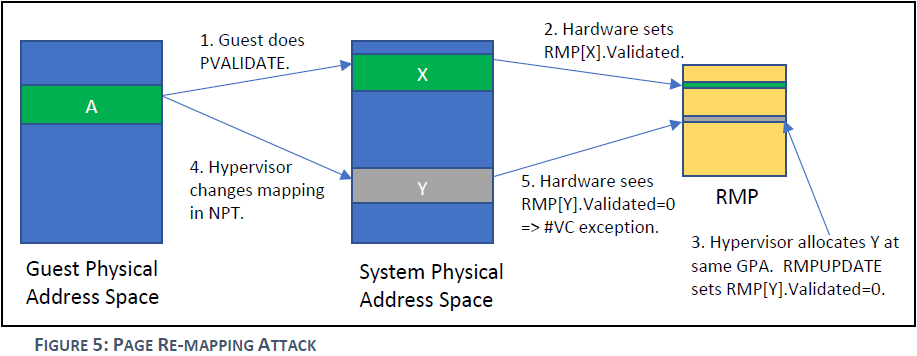

### 页状态

SEV-SNP 中的 RMP 跟踪每个内存页的状态，以此决定内存的用处、允许谁读写、页面之后可以转换到什么状态。例如，HV 状态的页可以由 HV 读写，或者由 VM 访问共享页。处于 Guest-Valid 状态的页可以由 VM 读取，而不能被 HV 写入。

三种基本状态，HV、Guest-Valid 和 Guest-Invalid，SEV-SNP 定义了八个主要的页面状态，如下表。RMPUPDATE、PVALIDATE 和 AMD-SP API 都可以使状态发生转换。

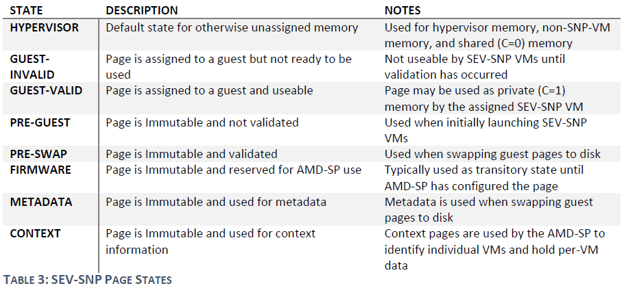

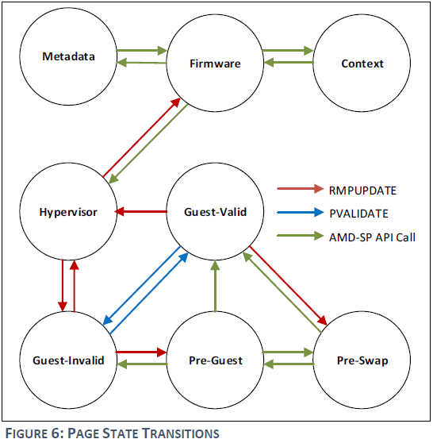

SEV-SNP 也在 AMD-SP 中实现了 VM 管理 API。HV 调用接口协助 VM 生命周期和页管理。处于安全目的，在发出必要的 API 调用之前，AMD-SP 会将要操作的页都置于特殊状态，即不可变状态。处于不可变状态的页无法被任何软件（HV 或 Guest）写入，也不能由 AMD-SP 以外的任何实体修改其 RMP 条目。当 AMD-SP 在不可变状态完成操作后，会将页面转换为特定 API 调用定义的状态。

例如，元数据页是一类不可变页，这些页只能由 AMD-SP 写入，用于保存于被换出到磁盘的 Guest 页相关的元数据条目。当页被换到磁盘时，AMD-SP 会创建一个包含身份验证标签（来自 AES-GCM）的元数据条目，以及来自该页 RMP 条目数据。HV 无法写入元数据页，因此可以保证信息完整性。当页被换回内存时，AMD-SP 验证内容未改变，同时确保页面进入 GPA 地址空间的位置与之前相同。元数据也本身也可以以类似的方式交换到磁盘，也可以把整个 Guest 保存到磁盘。

## 可选安全增强

### 虚拟机特权级

虚拟机特权级（Virtual Machine Privilege Level, VMPL）是 SEV-SNP 中的一个可选特性，它允许 Guest 将其地址空间划分为四个特权级，可以在 VM 内部提供硬件隔离的抽象层以进行额外的安全控制，以及协助管理与 HV 的通信。

VMPL0 最高，VMPL3 最低，启用此功能后，VM 的每个 vCPU 都会分配一个 VMPL。Guest 私有内存页的 RMP 条目也会增加与 VMPL 对应的页面权限。具体来说，每个 Guest 页可以标记为可读、可写、管理员可执行和用户可执行。默认情况下，Guest 首次验证页面时，VMPL0 被授予对页的所有权限，而其他 VMPL 没有权限，Guest 可以使用 RMPADJUST 指令修改 VMPL 权限。该指令允许给定的 VMPL 修改低特权的权限。例如，VMPL0 可以向 VMPL1 授予对页的读和写，但不能执行。VMPL 主要用于设置额外的页权限检查，与其他 x86 安全特性正交。

RMP 页权限检查在页表遍历结束后进行 RMP 查找时进行，要设置 Guest 页可写，必须在 Guest 管理的页表、HV 管理的 NPT 和 RMP 表中都标记为可写。

VMPL 在某些方面类似于嵌套虚拟化，Guest 包含自己的管理层，以高 VMPL 允许，控制其他页的权限。使用案例可以是安全 HV 的安全虚拟化，在云环境中，底层 HV 不可信，在 SEV-SNP Guest 中的 VMPL0 运行 安全 HV，控制页权限等。

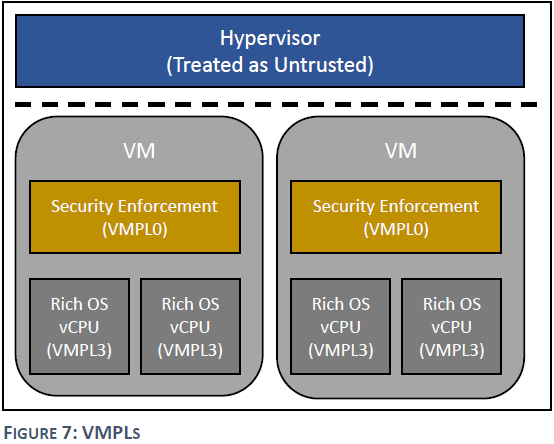

VMPL 在一些附加场景以及抽象层中很有用，比如将 APIC 模拟移到 Guest 的可信域中，VMPL0 执行可信的 APIC 模拟，其他 Guest 运行在较低的 VMPL 中。VMPL0 还可用作 Guest 与 HV 通信的中介，在之前的 SEV 和 SEV-ES 中，Guest OS 需要了解硬件机制，配合设置页表 C-bit、处理 \#VC 异常等，这里都可以选择委托给 VMPL0。

在这种使用模型中，VMPL0 可以使用称为虚拟顶部内存（Virtual Top of Memory, vTOM）的水印来配置另一个 vCPU 中的 Guest 内存是私有还是共享的。低于 vTOM 的内存视为私有，高于的视为共享，这种方式避免了使用 C-bit 标记的需要，简化了 Guest OS。 

此外，VMPL0 还可用于处理另一个 vCPU 发生的 \#VC 异常。可以配置 SEV-SNP VM 当一个 vCPU 执行被拦截的指令时，该 vCPU 退出并调用 VMPL0，VMPL0 可以直接从原始 vCPU 的加密保存域查看拦截信息，执行必要的 hyper-call，代表原始 vCPU 模拟指令。

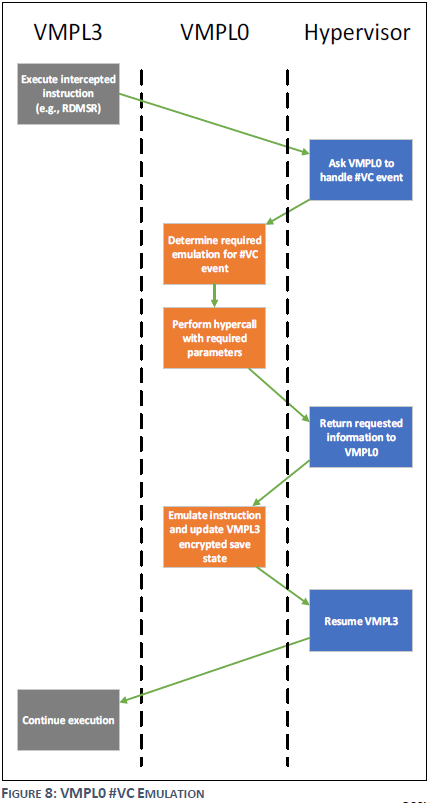

虽然性能不如适配 SEV 的 Guest，但这可以让 VMPL0 作为遗留 Guest 和 SEV 的中间层，使得 SEV-SNP 有可能保护旧的不容易升级的负载。

### 中断/异常保护

尽管几乎所有的 Guest OS 都支持中断和异常处理，但是有些 OS 可能存在基于裸机的中断和异常行为的假设，而恶意的 HV 可以通过违反这些假设影响 OS 的运行。为此，SEV-SNP 添加了两个可选模式以支持 VM 和 HV 之间中断和异常的严格接口。第一种模式称为受限注入，禁用虚拟机中断队列并禁用部分中断注入接口，HV 只允许注入一个新定义的异常向量 \#HV。受限注入假设 VM 和 HV 将以半虚拟化的方式通信，如共享内存中的事件队列，\#HV 异常可以作为 Guest 扫描事件队列的信号。第二种称为交替注入，允许标准虚拟中断队列和注入接口，但这些只能由 Guest 自身控制。在 VMCB 的保存域（VMSA）中添加字段允许中断队列和时间注入。这些字段只能由有权访问 Guest VMSA 数据的人操作，如 VMPL0，在交替注入模式下，所有与中断相关的安全敏感状态都保存到 VMSA 中，不会被恶意 HV 操纵。

两种模式相结合可以是 VMPL0 执行中断处理和 APIC 模拟。允许 VMPL0 的 vCPU 在受限注入模式下允许，使用半虚拟化接口和 \#HV 异常与 HV 通信。而运行其他 VMPL（Guest OS）的 vCPU 在交替注入模式下允许，VMPL0 可以安全地向 Guest OS 注入事件和虚拟中断。

### 可信平台信息

平台的特性和功能通过 CPUID 指令获取，而 HV 会捕获模拟 CPUID，恶意 HV 可以干扰指令结果进行 DoS 攻击。不正确的 CPUID 信息可能会导致安全问题。

为了简化 Guest 要执行的检查，SEV-SNP 提供了通过 AMD-SP 过滤 CPUID 的可选功能，AMD-SP 会验证 HV 报告的 CPUID 结果中平台特性和安全敏感信息是否正确。可以选择即时过滤，即收到信息后要求 AMD-SP 验证，或者在 VM 启动期间创建一个特殊的 CPUID 页，用于保存由 AMD-SP 预先审查的 CPUID 信息，安全且快速。

### TCB 版本

SEV-SNP 架构中，有几个可升级的固件组件，包括 AMD-SP API、CPU 微码补丁等。这些组件构成了架构的 TCB。如果这些组件出现漏洞，Guest 所有者需要保证 VM 在修补后的固件上运行。

之前的 SEV 和 SEV-ES 依赖于自我报告的 AMD-SP 版本号实现 TCB 版本控制。Guest 所有者可以指定 AMD-SP 固件的最低版本。在 SEV-SNP 中，使用加密增强此检查。所有 TCB 组件的版本号与称为芯片背书密钥的融合秘密相结合，用于创建版本化芯片背书密钥（Versioned Chip Endorsement Key, VCEK）。VCEK 是 ECDSA 私钥，每个 AMD 芯片唯一，运行特定的 TCB 版本。VCEK 的构造使用加密散列函数，因此无法伪造，VCEK 可用于签署证明报告。

### VM 启动和验证

SEV-SNP 从初始未加密映像开始，包含 Guest 启动代码等内容，不应包含任何秘密数据。启动过程中，HV 要求 AMD-SP 在 Guest 中装在初始页面。AMD-SP 以加密方式度量这些页计算启动摘要，以及与这些页相关的元数据，即页所在 GPA 及页类型，确保启动摘要涵盖初始 Guest 内存布局和内容。

在 SEV-SNP 中，启动过程结束后，Guest 所有者可以提供签名的身份块（Identiry Block, IDB）与 VM 关联，包含唯一标识 VM 的字段和预期的启动摘要。IDB 只能与匹配启动摘要的 VM 关联。SEV 和 SEV-ES 仅支持 Guest 启动期间认证，而 SEV-SNP 中 Guest 可以随时通过来自 AMD-SP 的受保护路径请求证明报告。VM 启动过程中，AMD-SP 创建了一组密钥，Guest 可以使用这些密钥与 AMD-SP 通信，Guest 使用这个路径请求证明和加密密钥等。

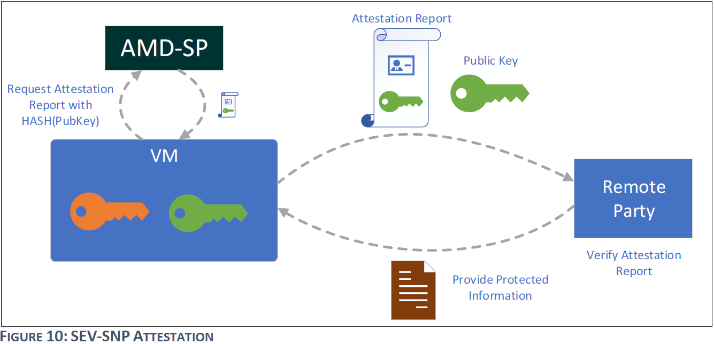

证明报告包含 IDB 信息、系统信息和由 Guest 提供的任意数据块，由 AMD-SP 使用 VCEK 签名。第三方（如 Guest 所有者）可以通过报告验证某些数据来自某个 VM，还可验证平台和 TCB 版本的真实性。除了远程证明外，SEV-SNP 还支持生成 Guest 密钥的使用模型，VM 直接从 AMD-SP 请求密钥用于加密。

### VM 迁移

VM 迁移，尤其是实时迁移，是现在云计算的标准功能。SEV 都支持 VM 迁移，而 SEV-SNP 增强了与迁移相关的灵活性。在 SEV 和 SEV-ES 中，迁移由 Guest 所有者提供的策略决定，此策略指示 VM 是否可迁移、可迁移到什么系统。AMD-SNP 负责执行策略和迁移之前对目标计算机的身份验证。而在 SEV-SNP 中，由迁移代理（Migration Agent, MA）执行迁移，它本身是 SEV-SNP VM，与主 VM 在同一物理系统上运行。启动 VM 时，可以选择将其与已运行的 MA 关联，由于 MA 是 TCB 的一部分，以此有关 VM 的 MA 绑定信息也在证明报告中。每个 VM 只能与一个 MA 关联。

MA 负责确定 VM 可以迁移到那些系统，它可以试试复杂的迁移策略。MA 本身不可迁移，每个物理机运行一个单独的 MA 实例。VM 迁移时，源 MA 验证目标 MA 并建立安全网络连接，传输 Guest 信息。由于 MA 的灵活性，不需要源和目标机器同时运行，VM 暂停时，其状态可以导出到其 MA，MA 可以选择实时迁移、保留或长期存储。

### 侧信道

侧信道攻击利用 CPU 内部结构泄露信息，AMD 添加了一些硬件特性以抵御某些攻击，如 Spectre V2。Spectre V2 利用间接分支预测器（BTB）影响其他软件的分支预测，AMD 增加了对 BTB 结构软件控制的支持，在 SEV-SNP 中，允许 Guest 独立于 HV 选择自己的推测执行策略。恶意的 HV 可能对 Guest 发起类似 Spectre 攻击，SEV-SNP 提供了附加保护，CPU 硬件防止 VM 推测性地使用其他实体加载的 BTB 条目。超线程也是另一个侧信道研究的重点，VM 可以选择仅在禁用 SMT 的系统上运行。

SEV-SNP 无法防范所有可能的侧信道攻击，如 Prime+Probe，攻击主要针对软件算法，软件执行路径会根据秘密数据改变缓存或 TLB 访问模式。
