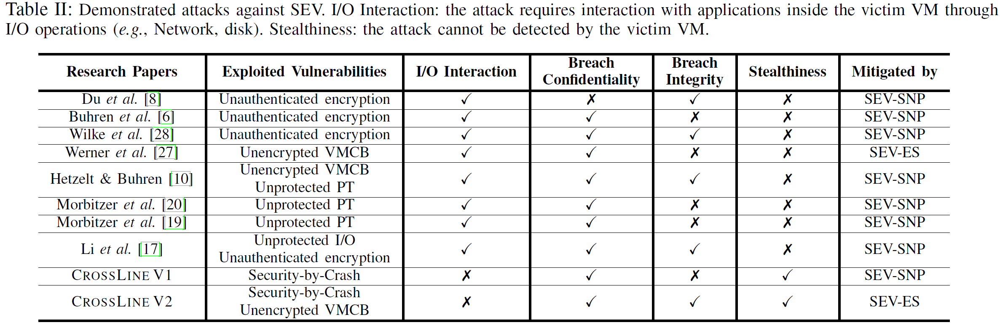

# AMD SEV Attacks

根据 CrossLine 和 CipherLeaks 的相关工作总结针对 AMD SEV 的安全研究和攻击。

### Unencrypted VMCB

SEV-ES 之前，VMCB 未加密。恶意 HV 可以读写 VMCB，导致泄露 guest 状态[^1]、应用程序指纹[^2]、ROP 攻击[^1] 和注入攻击[^2]等。SEV-ES 限制了绝大多数的攻击，应用程序指纹还可能成功（通过记录寄存器值识别应用程序，有点类似于 CipherLeaks）。

### Unauthenticated Encryption

SME 设计的一个缺陷是缺少内存加密认证[^3]，恶意 HV 可以修改密文而不触发 guest 中的错误。

另一个问题是 SME 使用 ECB AES，128 位内存块在加密之前会与一个与 sPA 相关的 tweak 函数异或，再解密得到密文。这种方法会被选择明文攻击，逆向 tweak 函数获取 sPA 与其结果的映射关系[^4]。如果两个内存块有相同的密文，攻击者就可以把它们的明文关联起来。攻击者通过强制受害者 VM 加密选择的铭文块（HTTP 请求），即可进行选择明文攻击：攻击者先识别所选明文的相应密文，然后用它（应用相应的 tweak 函数后）替换受害者虚拟机的关键指令[^4]。

AMD EPYC 3xx1 系列处理器使用 AES XEX 模式，在加密前后与明文和密文异或两次。但是 tweak 函数的熵只有 32 位，暴力破解存在可能。攻击者攻破 tweak 函数后可以在 8MB 明密文对的帮助下将一些任意的 2-byte 指令插入到加密内存[^5]。在 Zen2 架构中已修复。

### Unprotected nPT

Hetzelt[^1]演示了SEV 上的地址转换重定向攻击[^6]，并讨论了在 nPT 中重映射 guest 页以进行重放攻击。SEVered[^7][^8] 通过操纵 nPT 违反内存加密的机密性，攻击者首先发送一些网络请求，然后修改 guest 响应数据对应的 nPT 映射，将其指向想要泄露的内存页，guest 响应请求时就泄露了秘密信息。SEV-SNP 通过限制未授权的 nPT 重映射解决了这个问题。

### Unprotected I/O

SEV 和 SEV-ES 依赖于 guest 内部 Software I/O Translation Lookaside Buffer, SWIOTLB 共享内存执行 I/O 操作。HV 可以修改 I/O 流量，帮助构造使用受害者 VEK 的加密/解密 oracle[^9]。SEV-SNP 通过对 HV 的写权限限制缓解了这种攻击。

### ASID Abuse

SEV 使用 ASID 索引内存加密密钥、实现 TLB 和缓存隔离，并依赖于 security-by-crash 的原则，即错误的 ASID 会导致 VM 崩溃从而保护完整性和机密性。而 ASID 的管理依然交给不可信的 HV，CrossLine[^10]攻击利用此缺陷通过 nPT 遍历提取 guest 内存块甚至执行任意指令。SEV-SNP 引入的 RMP 通过限制 HV 修改 nPT 映射成功阻止此类攻击。

### Side-Channel Attacks

体系结构侧信道如缓存侧信道、性能计数器跟踪或 TLB 侧信道是云环境中常见的攻击。SEV 增加了一些攻击的难度，如 Flush+Reload，使用 ASID 标记缓存行，避免非所有者使用。SEV 仍受 page fault 侧信道攻击威胁。

CipherLeaks[^11]利用密文侧信道实现从 HV 推断 guest 执行状态甚至恢复明文。

### 参考文献

[^1]:Felicitas Hetzelt and Robert Buhren. Security analysis of encrypted virtual machines. VEE 2017.
[^2]:Jan Werner, Joshua Mason, Manos Antonakakis, Michalis Polychronakis,  and Fabian Monrose. The severest of them all: Inference attacks against secure virtual enclaves. Asia CCS 2019.
[^3]:Robert Buhren, Shay Gueron, Jan Nordholz, Jean-Pierre Seifert, and Julian Vetter. Fault attacks on encrypted general purpose compute platforms. CODASPY 2017.
[^4]: Zhao-Hui Du, Zhiwei Ying, Zhenke Ma, Yufei Mai, Phoebe Wang, Jesse Liu, and Jesse Fang. Secure encrypted virtualization is unsecure. arXiv preprint arXiv:1712.05090, 2017.
[^5]:Luca Wilke, Jan Wichelmann, Mathias Morbitzer, and Thomas Eisenbarth. Sevurity: No security without integrity–breaking integrity-free memory encryption with minimal assumptions. S&P 2020.
[^6]:Daehee Jang, Hojoon Lee, Minsu Kim, Daehyeok Kim, Daegyeong Kim, and Brent Byunghoon Kang. Atra: Address translation redirection attack against hardware-based external monitors. CCS 2014.
[^7]:Mathias Morbitzer, Manuel Huber, Julian Horsch, and Sascha Wessel. SEVered: Subverting AMD’s virtual machine encryption. EuroSec@EuroSys 2018.

[^8]:Mathias Morbitzer, Manuel Huber, and Julian Horsch. Extracting secrets from encrypted virtual machines. CODASPY 2019.

[^9]:Mengyuan Li, Yinqian Zhang, Zhiqiang Lin, and Yan Solihin. Exploiting unprotected i/o operations in amd’s secure encrypted virtualization.  USENIX 2019.
[^10]:Mengyuan Li, Yinqian Zhang, and Zhiqiang Lin. CROSSLINE: Breaking”security-by-crash”basedme mory isolation in amd sev. CCS 2021.

[^11]:Mengyuan Li, Yinqian Zhang, and Huibo Wang. CIPHERLEASK: Breaking Constant-time Cryptography on AMD SEV via the Ciphertext Side Channel. USENIX 2021.

