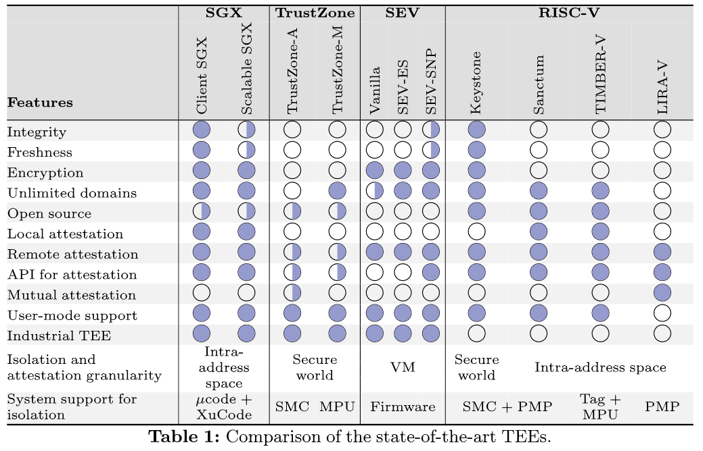
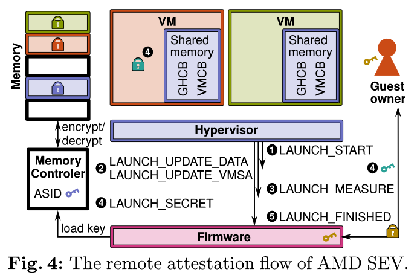
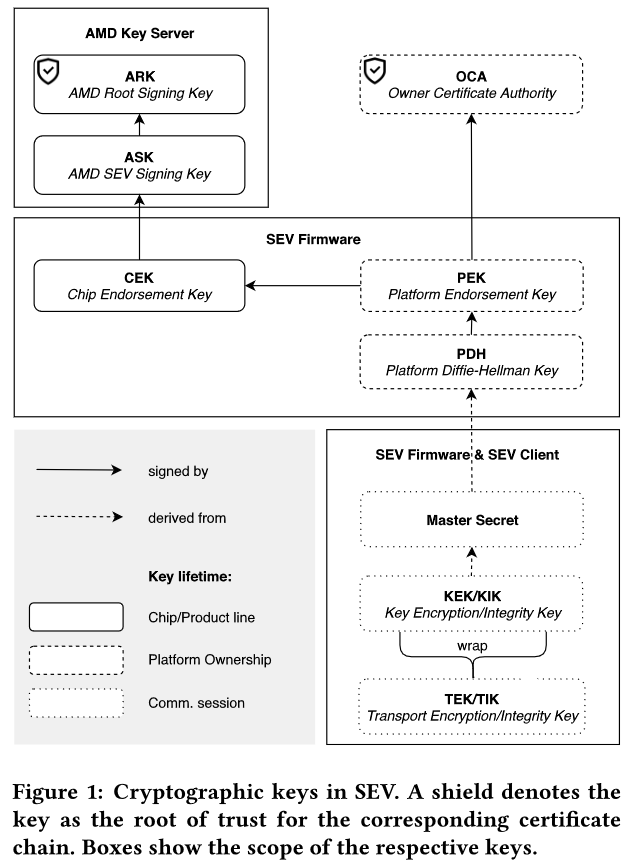
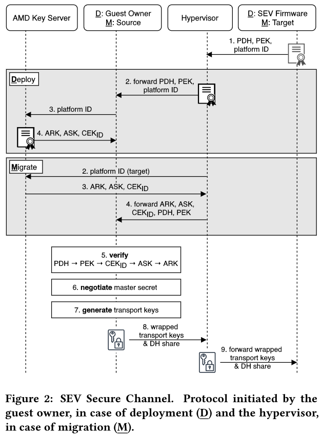
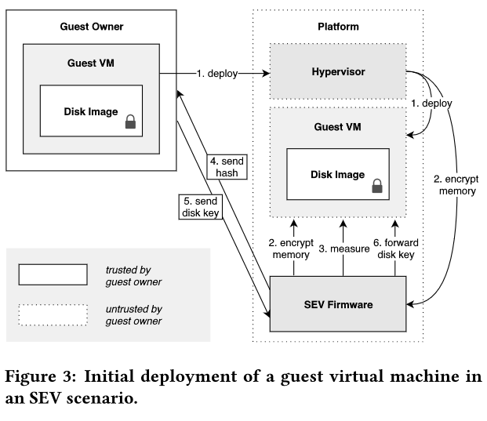
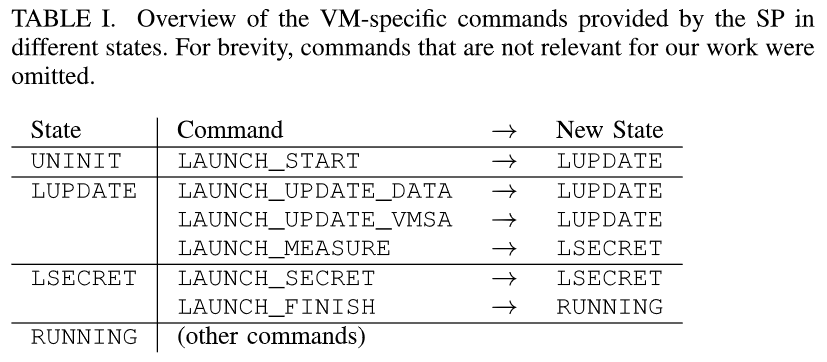
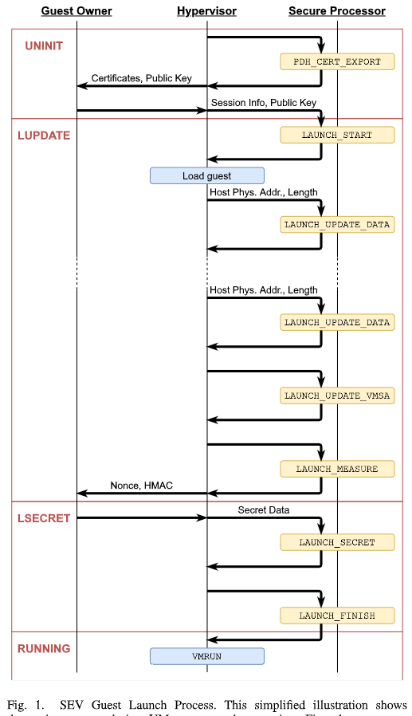

# AMD SEV Attestation Mechanism

> 根据几篇论文整理 AMD SEV 的认证过程。

# Attestation Mechanisms for Trusted Execution Environments Demystified

[pdf](Attestation%20Mechanisms%20for%20Trusted%20Execution%20Environments%20Demystified.pdf)

## Attestation

### 本地认证

TEE 可以通过本地认证向同一系统上的其他 TEE 证明其身份。接收本地认证请求的目标环境通过身份验证评估证明是否真实，通常是基于对称加密方案的消息验证码 MAC。这个机制要求在 TEE 之间建立安全的通信通道。Intel SGX 的远程认证就利用本地认证通过安全信道在另一个可信环境中签署证明。

### 远程认证

远程认证允许在不同设备之间建立信任，并提供密码学证明，证明执行的软件是真实且未经篡改的。使用 IETF 提出的属于描述远程认证和相关架构。依赖方希望在验证方的帮助下与证明者建立可信关系。证明者提供系统状态，通过收集一组可信度声明来指示设备上运行的硬件和软件栈。声明是由证明环境（如 TEE）收集的断言信息，一个例子是 TEE 中允许代码的度量（密码学哈希值）。TEE 还创建了识别可信计算基的附加声明（TCB 是需要可信的硬件和软件数量），验证方能以此评估平台真实性。声明使用密码学签名形成证据，稍后由验证方观测和接收（或拒绝）。一旦证明者被证明是真实的，依赖方就可以安全地与其互动，传输机密数据或委托计算。

远程认证有三种主要方法：基于软件、基于硬件和软硬件混合。软件方法不依赖于特定硬件，适用于低成本案例。硬件方法依赖于可信根，通常是一个或多个保存在硬件中的密码学值，以确保声明是可信的。通常，可信根可由防篡改硬件实现，如可信平台模块 TPM，是一种物理不可克隆功能 PUF，通过使用制造时产生独特硬件标记来防止假冒。或者融合正在独占地暴漏给可信环境的芯片（如 CPU）中的硬件秘密。混合方法结合了硬件设备和软件实现，试图利用双方的优势。远程认证机制因其精心控制的环境和生成代码度量的能力而在 TEE 中使用。

可信应用可能需要更强的信任保证，确保安全通道两端都得到证明，也就是相互证明协议。

## Issuing attestations using TEEs

下表对比了 TEE 的一系列基本特性和远程认证能力。

软件和硬件组件的认证需要一个安全地发布证据的环境。通常由无法篡改的软件或硬件机制承担这一角色。这些环境依赖于一致性软件的代码度量，并将该声明与由可信根派生的密码学值结合。

下图展示了 TEE 开发者部署可信应用通常遵守的工作流。最初，开发者编译和度量应用，然后它被传输到一个不可信的系统的 TEE 中执行。一旦可信应用被加载并需要接收敏感数据，它就与验证方建立可信信道。TEE 要向可信应用公开证据来协助此交易，可信应用添加了关键材料来从 TEE 引导安全信道，防止攻击者窃听。验证方检查证据，维护参考值列表以识别可信应用实例。如果认为是可信的，验证者可进行数据交换。

### AMD SEV

AMD SEV 允许将虚拟化环境与 hypervisor 隔离。SEV 使用嵌入式的硬件 AES 引擎，使用多个密钥实现透明内存加密。使用 ARM Cortex-v5 处理器作为安全协处理器，用于生成保存在 CPU 中的加密材料。每个 VM 和 hypervisor 都被分配一个特定的密钥，由 ASID 标记，防止跨 TEE 攻击。该标签将代码和数据的使用限制到仅相同 ASID 的所有者，并防止处理器内部未经授权的使用。处理器外部的代码和数据由 128 位的 AES 加密保护。

SEV 的远程认证协议被证明是不安全的，受回滚攻击。

SEV 使用的可信根称为芯片背书密钥 CEK，是融合在处理器芯片中的秘密信息，由 AMD 为其认证机制发行。SEV 的三个版本可能会从未加密状态启动 VM。为此，必须使用远程认证来提供机密数据。AMD-SP 会基于对 VM 内容的度量生成声明。此外，SEV-SNP 还会度量与内存页相关的元数据，确保摘要还考虑 guest 内存的初始布局。SEV 和 SEV-ES 仅在 guest OS 启动期间支持远程认证，而 SEV-SNP 支持更灵活的模型，后者引导私有通信密钥，使 guest 可以随时请求证据并获得用于数据封装的加密材料。

SEV 的远程认证过程发生在 VM 启动时，如下图。首先，证明者（hypervisor）执行 LAUNCH_START 命令，使用验证者（guest 所有者）的公钥在固件中创建 guest 上下文。证明者将 VM 加载到内存中，执行 LAUNCH_UPDATE_DATA/LAUNCH_UPDATE_VMSA 命令来加密内存并计算声明。VM 被加载时，验证者调用 LAUNCH_MEASURE 命令，生成加密 VM 的证据。SEV 固件向验证者提供 VM 状态的证据，以证明其出于预期状态。验证者检查证据以确定 VM 是否受到干扰。最后，敏感数据，通过 LAUNCH_SECRET 命令提供，之后证明者执行 LAUNCH_FINISHED 命令指示可以执行 VM。

# Insecure Until Proven Updated: Analyzing AMD SEV’s Remote Attestation

[pdf](%5BCCS%20%202019%5D%20Insecure%20Until%20Proven%20Updated%20Analyzing%20AMD%20SEV's%20Remote%20Attestation.pdf)

为使云租户能验证其 VM 的正确部署，SEV 引入了远程认证协议。本文分析了 AMD EPYC Naple CPU 上的 SEV 远程认证协议，证明可能提取对远程认证协议的安全至关重要的关键 CPU 特定密钥。

基于提取的密钥，提出了允许恶意云提供商规避 SEV 保护机制攻击。虽然 AMD 解决了潜在的固件问题，但是仍允许安装旧版固件。

## Background

通过远程认证，SEV 固件向 guest 所有者提供 SEV 平台的真实性证明，并显式地认证 VM 完整性。下面几节介绍 SEV 密钥和远程认证机制。

### SEV: Cryptographic Keys

SEV 提供密码学证明远程平台是支持 SEV 的 AMD 平台，以及部署了具有 SEV 保护的 guest。为此，SEV 固件管理了如下图的几个密钥。

**固件标识** 初始化后，SEV 固件生成 ECDSA 平台背书密钥 PEK。固件使用 PEK 签名平台 DH 密钥 PDH，PDH 用于与远程方协商共享秘密，如在 guest 所有者和 SEV 平台间构建安全信道。

**平台所有权** 所有权信息通过云提供商的 CA（所有者认证机构 OCA）签名 PEK 来提供。SEV 固件会生成 PEK 的证书签名请求 CSR，允许云提供商签名 PEK。签名后的 PEK 又重新导入到 SEV 固件中。

**平台真实性** 为向 guest 所有者提供平台的可靠性保证，PEK 还需要由 CEK 签名。CEK 是由 CPU 特定的一次性硬件中的秘密信息派生的 ECDSA 密钥。为证明 CEK 的真实性，它是由 SEV 签名密钥 ASK 签名，而 ASK 由 AMD 根密钥 ARK 签名。CEK 是每个平台独有的，SEV API 制定了检索与平台i相关的唯一标识的命令。CEK 私钥必须是机密的，签名后的 CEK 和 ASK 以及 ARK 都可以使用 SEV 固件提供的平台 ID 从 AMD 获取。CEK 在 SEV 信任模型起核心作用。

**机密通信** SEV 假设不可信的 hypervisor，需要确保两种情况下的机密通信：VM 初次部署时，guest 所有者和 SEV 固件之间；迁移时，源和目标平台的 SEV 固件之间。

为此，客户端和 SEV 固件之间使用 DH 协议建立共享主密钥。这里的客户端是 guest 所有者或迁移时其他 SEV 固件。使用密钥派生函数和主密钥，生成密钥加密密钥 KEK 和密钥完整性密钥 KIK，用于保护传输密钥，即传输加密密钥 TEK 和传输完整性密钥 TIK。传输密钥由 KEK 加密，并使用 KIK 生成 MAC。这个过程称为密钥包装。传输密钥是由客户端选择的，而 KEK 和 KIK 是从主密钥派生的。

传输密钥确保 SEV 固件与外部实体之间交换数据的完整性和机密性。

### SEV: Establish Secure Channel

为建立安全通道，客户端和 SEV 固件都遵循下图描述的步骤。由于 SEV API 只能通过 hypervisor 访问，安全信道必须保证通信的真实性、完整性和一致性。

第一步，hypervisor 检索 PDH 和 PEK 证书以及目标平台的唯一平台 ID。迁移情况下由 hyperviosr，部署情况下由 guest 所有者，使用平台 iD，从 AMD 密钥服务器获取 CEK_ID 证书以及 ASK 和 ARK。客户端可通过验证证书链来验证目标平台，同时验证 PEK 是否有 OCA 签名。验证过的 PDH 将用于协商主密钥。主密钥仅在客户端和目标之间，而 hypervisor 不知道，使用主密钥派生 KEK。最后，客户端生成 TEK，并使用 KEK 和 KIK 包装。最后，包装的密钥和 DH 共享密钥会传输到目标。

客户端和目标 SEV 固件都拥有经过验证、加密和完整性保护的通信传输密钥。

### SEV: Guest Deployment

本节概述了在支持 SEV 的云系统中部署 guest VM 的步骤。

部署之前，平台拥有者需要初始化 SEV 平台。初始化过程中，SEV 固件会派生上上节描述的平台特定密钥。此外，固件通过签名构建信任链：PDH -> PEK -> CEK -> ASK -> ARK。还可以建立第二个证书链：PDH -> PEK -> OCA。这些链允许客户端验证一个给定的 PDH。这些步骤之后，SEV 固件转换到已初始化状态。

在平台上部署任何 guest VM 之前，guest 所有者会对远程 SEV 平台进行身份验证，与远程 SEV 平台建立安全通道，通过证书链验证，确保远程系统是真实的 AMD SEV 系统。

现在 guest 所有者可以准备由云提供商执行的 guest VM。初始的 guest VM 未加密地发送给 hypervisor，不包含机密数据。为确保 guest 所有者数据的机密性，初始 guest 镜像通常包含额外的加密磁盘镜像。在这种情况下，加密密钥会通过建立的安全信道提供。除 VM 镜像本身外，guest 所有者必须提供策略，以确定对云提供商可以在 guest VM 进行操作的限制。包括云梯公司能够将 guest VM 迁移到另一个平台或目标 SEV 固件必须实现的最小 SEV API 版本。

初始化部署过程如下图。第一步，guest 所有者将 VM 和加密磁盘镜像部署到云提供商。第二步，hypervisor 启动 guest 并调用 SEV 固件加密内存。然后，SEV 固件计算初始 VM 内存明文的哈希，哈希值与 SEV API 版本和 guest 策略通过安全信道传输到 guest 所有者。所有者通过哈希确保 VM 部署时未被修改。最后，guest 所有者通过安全信道向 VM 提供磁盘加密密钥，VM 可以解密磁盘。之后，guest VM 全面运行，并受 SEV 保护。

# undeSErVed trust: Exploiting Permutation-Agnostic Remote Attestation

[pdf]([WOOT%202021]%20undeSErVed%20trust%20Exploiting%20Permutation-Agnostic%20Remote%20Attestation.pdf)

Zen 1 和 Zen 2 架构的认证机制存在缺陷，可以在不影响认证结果的情况下操作加载的代码。攻击者可利用这一弱点在启动时注入任意代码，从而控制整个虚拟机执行，且不会被虚拟机所有者察觉。攻击原语允许攻击者对引导加载程序和操作系统进行大量修改。

## SEV(-ES) Guest Launch Process

本节描述了启动 SEV VM 的典型流程，包括加密初始代码镜像，向 guest 所有者证明其完整性，以及在不泄露给 hypervisor 的前提下加载秘密数据。

### Prerequisites

运行 SEV VM 设计三方：guest 所有者、hypervisor 和 AMD-SP。所有者希望启动 SEV 安全的 VM。Hypervisor 通常由云提供商控制。为提供 SEV 功能，hypervisor 需要与 AMD-SP 提供的 API 交互。

启动过程的目标是使 hypervisor 向 guest 所有者证明初始内容使可信的。此外，使 guest 所有者能够以安全的方式向 VM 发送秘密。整个过程如下图。

对与每个 VM，AMD-SP 维护一个 guest 上下文 GCTX，包括一个句柄、VM 加密密钥 VEK、启动摘要 LD 和当前状态。启动摘要包含在启动度量阶段加载的 VM 内存的哈希值。状态确定哪些 API 可用。

下表展示了上下文状态、可用命令以及执行后的状态转换，省略了迁移相关的状态和命令。

在发出任何的特定于 VM 的命令之前，hypervisor 发出 PDH_CERT_EXPORT 命令启动 ECDH 密钥交换，AMD-SP 导出 ECDH 公钥和一些证书。后者是 PKI 的一部分，最终植根于硬编码到 AMD-SP 中的密钥。然后，hypervisor 将此数据发送给 guest 所有者。

### UNINIT state

新 VM 假定 UNINIT 为初始状态。为了开始启动过程，guest 所有者验证 hypervisor 发送的 ECDH 密钥的真实性。然后使用自己的 ECDH 密钥对导出传输加密密钥 TEK、传输完整性密钥 TIK 和其他用于传输安全的密钥。然后将这些数据与命令 POLICY 的配置对象一起发送到 hypervisor。

从 guest 所有者接收数据后，hypervisor 调用 LAUNCH_START 命令，完成 guest 所有者和 AMD-SP 之间的 ECDH 握手。AMD-SP 可以派生共享密钥，并用它解包和验证接受的数据。然后，它使用接收到的 guest 策略初始化 GCTX 并生成新的 VEK。

### LUPDATE state

在 LUPDATE 状态，有三个主要命令：LAUNCH_UPDATE_DATA，LAUNCH_UPDATE_VMSA 和 LAUNCH_MEASURE。

LAUNCH_UPDATE_DATA 命令允许 hypervisor 指定一个 guest 句柄、一个 16-byte 对齐的 HPA 和 16-byte 倍数的长度。AMD-SP 会使用句柄对应的 VEK 加密指定的地址范围。此外，GCTX 的启动摘要字段会使用加密数据的明文更新。LAUNCH_UPDATE_DATA 的目的就是加密并度量 VM 内容，使得 hypervisor 不能修改它。加密初始内容是强制的，因为虚拟机最初假定所有的内存访问都是加密的，只能在加密的情况下执行初始代码。

LAUNCH_UPDATE_VMSA 仅适用于 SEV-ES，工作原理与 LAUNCH_UPDATE_DATA 类似，不同之处在于它只能加载 4096 个字节，因为它用于加密 VMSA。此外，它还初始化 VMCB。只调用一次，同时也会更新启动摘要。

LAUNCH_MEASURE 用于生成启动度量并将 VM 转换到 LSECRET 状态。度量包括一个 128 位随机数和一个 256 位 HMAC 度量值。

然后，hypervisor 将启动度量发送给 guest 所有者，为了证明它的初始内容没有改变。假定 guest 所有者和 hypervisor/云服务提供商协商了 VM 的初始内容，如指定 UEFI 版本。guest 所有者可以计算 HMAC 并比较所有信息。

成功检查启动度量后，guest 所有者可以确保初始内存内容符合要求。启动时，虚拟机将任何内存视为加密的，因此 hypervisor 不太可能通过篡改内存实现对 VM 代码和数据的任何有意义的操作。唯一的可能是使用指定的 LAUNCH_UPDATE_* 命令，但这样会更新启动摘要，从而改变 HMAC。

### LSECRET state

VM 进入 LSECRET 状态后，有两个可用命令：LAUNCH_SECRET 和 LAUNCH_FINISH。LAUNCH_SECRET 命令允许使用 VM 的 VEK 加密数据。与之前的命令相反，传输给此命令的数据已使用 TEK 加密，并使用 TIK 的 HMAC 保护完整性。这两个密钥只有 AMD-SP 和 guest 所有者知道。如果完整性检查失败，命令会终止。guest 所有者可使用此机制安全地将机密数据（如磁盘加密密钥）发送到虚拟机。hypervisor 作为代理，可以拒绝将数据传输到 AMD-SP，但不能操纵数据。

最后，LAUNCH_FINISH 命令将 VM 转换到 RUNNING 状态，表示虚拟机已准备好启动。之后这两条命令会被禁用。