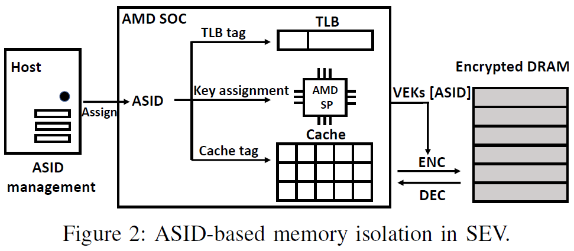
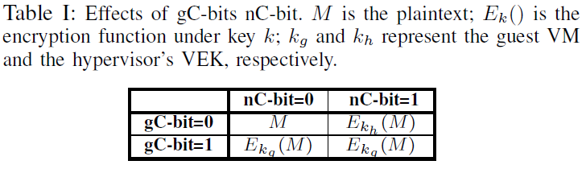

# ASID-based Isolation in SEV

> 来自 CrossLine 论文中 Demystifying ASID-based Isolation 部分

ASID 最初被用来标记 TLB 条目以减少 guest 与 host 切换时不必要的 TLB 刷新。SEV 复用 ASID 作为 VEK 索引，缓存行标签也用 ASID 扩展实现隔离。ASID 成为 SEV 处理器控制软件对内存、缓存和 TLB 访问的标识符。

然而，与 AMD-V 类似，SEV 允许 HV 拥有对 ASID 的完整管理权限，可能带来安全问题，如恶意的 HV 可能会滥用此功能以破坏基于 ASID 的隔离。对此，AMD 采取 security-by-crash 并假设如果 guest 使用了错误的 ASID，指令的执行可能导致故障。

## 基于 ASID 的隔离

如何使用 ASID 进行内存、缓存和 TLB 隔离。

### 内存隔离

AMD-SP 使用 ASID 索引 VEK 用于后续加解密。ASID 是一个整数，存放在 CPU 内部的寄存器中，guest 软件无法获取。Guest 通过修改 gPT 中的 gC-bit 决定是否加密内存页，而 HV 可以修改 nPT 中的 nC-bit。AMD-SP 根据两个标志位的值进行的操作如下表。

根据 SME，guest 的代码和页表都是私有的，由 guest 的 VEK 加密，但是 nPT 却由 HV 完全控制。

### TLB 隔离

ASID 最开始引入就是为了在 guest 和 HV 切换时避免 TLB 刷新，通过用 ASID 扩展每个 TLB 标签，硬件只需要刷新标有当前 ASID 的 TLB条目。是否开启 SEV 的 VM 的 ASID 不同。

- Non-SEV VM：每个 VCPU 可以有不同的 ASID，在每个 VMRUN 之前动态分配。在使用 VMRUN 恢复 VCPU 之前，HV 检查 VCPU 是否要在于之前相同的 CPU 核上执行。如果是，则 ASID 不变，否则从 ASID 池中选择另一个 ASID 分配给 VCPU。
- SEV VM：出于加密的需要，SEV VM 的所有 VCPU 应该共用同一 ASID，且理论上应该在整个 VM 的生命周期保持不变。

### 缓存隔离

在支持 SEV 的平台上，缓存行用 ASID 标记，指示数据属于哪个 VM，防止数据被其所有者以外的实体滥用。数据加载进缓存时，AMD-SP 会根据当前的 ASID 自动用对应的 VEK 解密数据，并将 ASID 值存到缓存标签。当缓存行被逐出或刷新时，AMD-SP 使用标签中的 ASID 确定将其写回之前使用哪个 VEK 加密。缓存标签也扩展到包括 C-bit，如果两个虚拟内存页没有相同的 ASID 和 C-bit，就无法保持相同物理地址的缓存一致性。

## ASID 管理

### ASID 生命周期

 HV 为所有 VM 保留了一个全 ASID 池，并为 SEV VM 保留了一个单独的 SEV-ASID 池。全 ASID 池的大小由 CPUID `0x8000000a[EBX]` 决定，SEV-ASID 池大小由 CPUID `0x8000001f[ECX]`。ASID 0 留给 host 或 HV，不允许分配给 VCPU（无论是否有 SEV）。

在 SEV 平台上，HV 使用 ACTIVATE（激活）命令通知 AMD-SP 给定的 guest 绑定了一个 ASID，使用 DEACTIVATE（停用）取消分配给 guest 的 ASID。如果 SEV-ASID 池中没有可用的 ASID，HV 可能会将现有的 ASID 重新分配给另一个 VM。

处理器运行在 guest 模式时，VM 的 ASID 存储在软件不可见的寄存器中；当处理器切换到 host 模式时，寄存器设置为 0，即 HV 的 ASID。VMEXIT 时，VM 的 ASID 会存到 VMCB 中；VMRUN 后，处理器从 VMCB 恢复 ASID。VMCB 状态缓存允许处理器缓存一些 guest 寄存器值以提升性能，VMCB 的物理地址用来执行 VMCB 状态缓存的访问控制。然而，HV 控制 VMCB 的 clean 字段可以强制处理器丢弃指定的缓存值，如 bit-2 表示重新加载 ASID。某些 VMCB 字段严格不缓存，每次都会从 VMCB 中重新加载。

### ASID 限制

#### 启动时限制

在支持 SEV 的处理器上，HV 无法在启动阶段将 SEV-ASID 池中当前活动的 ASID 绑定到 SEV VM 上。然而，攻击可以停用受害 VM，使用相同的 ASID 激活攻击者 VM。硬件要求 HV 在停用 ASID 之后和重新重新启用它之前执行 WBINVD 指令和 DF_FLUSH 指令。WBINVD 会刷新所有修改过的缓存行并使所有缓存行无效，DF_FLUSH 会刷新所有 CPU 核内部的数据写入缓冲区。如果不执行这两条指令，会由 AMD-SP 返回 WBINVD_REQUIRED 和 DFFLUSH_REQUIRED 错误，VM 启动过程将被终止。

这个限制对缓存隔离至关重要，否则受害者 VM 的剩余缓存数据可以被后续攻击者 VM 读取，特别是攻击者使用 WBINVD 指令将缓存数据刷新到内存，属于受害者 VM 的缓存行将使用攻击者 VM 的 VEK 加密并写入内存，攻击者可以读取这些数据。

#### 运行时限制

VM 启动后，HV 可以在 VMEXIT 时通过修改 VMCB 的 ASID 字段来修改 ASID，在恢复时生效。这意味着有可能两个 SEV VM 同时拥有相同的 ASID，而 ASID 错误的那个很快就会崩溃。

VMCB 还包含字段 090h 指示 VM 是否为 SEV VM 。因此，可以先启动具有相同 ASID 的 SEV VM 和非 SEV VM，然后在非 SEV VM 的 VMEXIT 期间，通过设置 VMCB 相应位将其更改为 SEV VM。硬件会根据 VMCB 值确定要恢复的 VM 是否是 SEV VM 以及与其相关联的 ASID。硬件不会将这些信息存储到安全内存区并用于验证。AMD-SP 执行的唯一额外验证是 SEV VM 的 ASID 必须在有效范围内。因此，即使 VM 以非 SEV VM 启动，也可以有效地（即使是暂时地）让它成为与另一个 SEV VM 有相同 ASID 的 SEV VM。

### Security-by-Crash

HV 可以自由修改 SEV VM 和非 SEV VM 的 ASID，HV 不可信的情况下就会出现安全问题。但是 AMD 认为当 SEV VM 以与它本身不同的 ASID 恢复时，其后续执行会导致不可预测的结果，最终导致 VM 崩溃。

具体而言，HV 直接修改 VMCB 的 ASID 字段，并设置 clean 字段告知硬件绕过 VMCB 状态缓存，然后以 VMRUN 恢复执行。VM 恢复后，如果 VMCB 的 RFLAGS.IF 位置位，会访问中断描述符寄存器 IDTR 指定的虚拟地址（要处理中断）；否则，从 NRIP（the next sequential instruction pointer）取指执行，而两种情况下的虚拟地址转换都会出现问题。

首先，ASID 改变，所有上次执行剩余的 TLB 条目都无效。而且，页表遍历不太可能成功，因为它自己的页表是用自己的 ASID 索引的 VEK 加密的。顶层页目录表将被解密成无意义的数据，对此页面页表项的引用将触发由 guest OS 处理的异常。而在处理异常过程中，任何引用都将使用错误的 VEK 解密，从而导致了使 VM 崩溃的 triple fault（三振出局）。

## 总结

SEV 的基于 security-by-crash 的内存隔离机制要点如下：

- 基于 ASID 的访问控制，ASID 是唯一用于控制对虚拟内存、缓存和 TLB 访问的标识符。
- ASID 由 HV 管理，在 VMEXIT 期间，HV 可以将任何的 ASID 分配给 VM。硬件的唯一限制是 ASID 必须落入与 VM 的 SEV 类型相符的范围内。
- 安全是由 VM 崩溃保证的，如果 VM 的 ASID 变化，安全性仅依赖于 VM 执行期间触发的故障。该故障可能是在取指或页表遍历期间使用不正确的 VEK 解密内存造成的。
- 缓存和 TLB 条目由 HV 刷新，HV 控制是否以及何时刷新与特定 ASID 关联的 TLB 和缓存条目。在 ASID 激活期间，硬件仅做有限的约束。资源滥用存在可能。