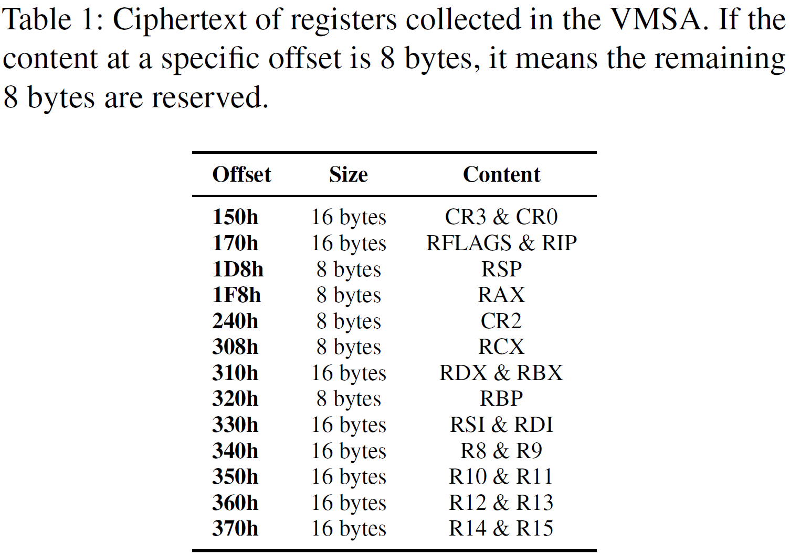
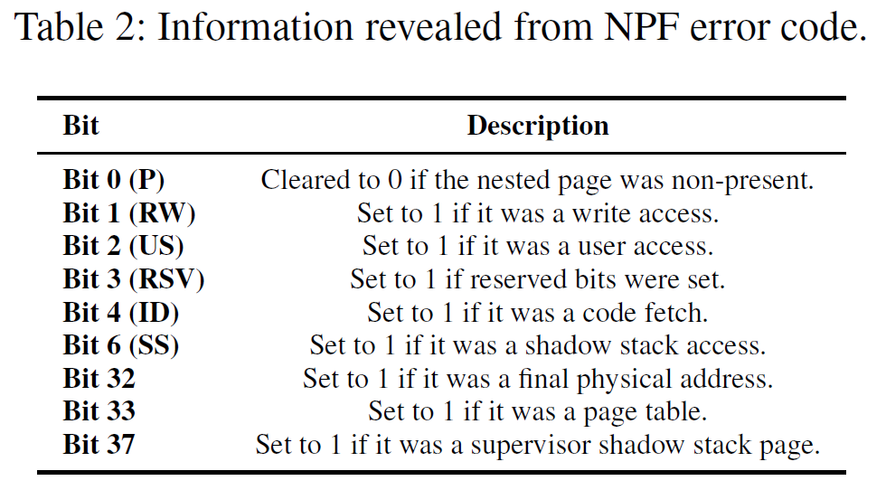
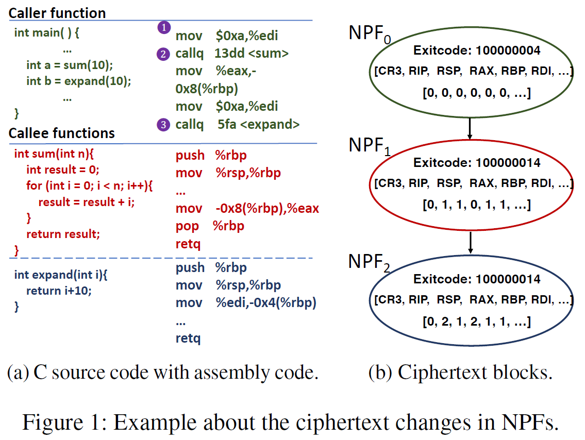
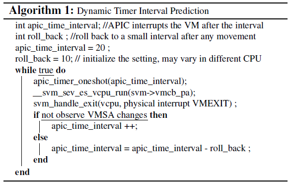
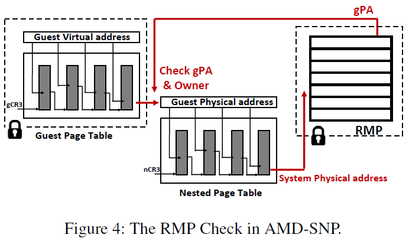

# CIPHERLEAKS: Breaking Constant-time Cryptography on AMD SEV via the Ciphertext Side Channel

[pdf](./[USENIX%202021]%20CIPHERLEAKS%20Beaking%20Constant-time%20Cryptography%20on%20AMD%20SEV%20via%20the%20Ciphertext%20Side%20Channel.pdf)

本文研究在 SEV-ES 和 SEV-SNP 上都存在的漏洞，称为密文侧信道，允许特权攻击者推断 guest 执行状态或恢复特定明文。提出 CipherLeaks 攻击，利用密文侧信道窃取 RSA 和 ECDSA 常数时间实现的私钥。

## Introduction

本文提出了 SEV 包括 SEV-ES 和 SEV-SNP 上的新侧信道，称为密文侧信道，HV 监控 guest 内存上密文块的更改并泄露秘密信息。成因有二：SEV 加密引擎使用 XEX 模式，每个 16-byte 内存块独立加密，每个物理地址上明文到密文一一对应；HV 可以读加密后的密文，在 guest 执行时监控密文变化。

CipherLeaks 攻击在 VMEXIT 时利用密文侧信道监控 guest VMSA，与之前的值进行比对，可知哪些寄存器值变化，从而推断 guest 执行状态；通过查找在 VM 启动期间手机的明密文对字典，能够恢复某些寄存器值。利用这两个攻击原语可以从被认为免疫侧信道攻击的 RSA 和 ECDSA 常数时间实现中窃取私钥。

## Background

### SEV

开放虚拟机固件（Open Virtual Machine Firmware, OVMF）、用于 x86 VM 的 UEFI 和 QEMU、设备模拟其是启用 SEV VM 的两个关键组件。

SEV 内存加密，以 128 位内存块为基本单位，最初使用 XOR-and-Encrypted, XE 模式，后来改为 XEX 模式。使用基于物理地址的调整函数 T 避免攻击者直接推断出明文。最初的 XE 模式加密为 $c = ENC_{VEK}(m\oplus T(sPA))$，当调整函数向量 $t_is$ 确定是，攻击者很容易逆向 XE。然后改为 XEX $c=ENC_{VEK}(m\oplus T(sPA))\oplus T(sPA)$，又被证明 $t_is$ 的熵只有 32 位，可以暴力破解。最后在 Zen2 中将熵改为 128 位，修复了这些错误。然而，在 guest 生命周期内，同一物理地址上的相同密文始终有相同的密文。

在 SEV VM 的 Pre-EFI 初始化阶段，使用 IOIO 端口而不是 DMA。因为 DMA 涉及 guest 私有内存和共享缓冲区之间的数据复制，难以在 PEFI 阶段完成。IOIO_PROT 是 NAE 事件，需要将寄存器状态暴露给 HV。

### 密码学侧信道攻击

计时攻击；体系结构侧信道攻击，使用缓存、TLB、分支目标缓冲区以及 CPU 内部加载/存储缓冲区等。

常数时间密码学实现用于缓解计时攻击，减少或消除依赖于数据的计时信息，让执行时间独立于秘密信息。

常数时间实现的三个规则：控制流不依赖于秘密信息；访问内存地址不依赖于秘密信息；注入 除法和取模之类的可变时间指令的输入不能依赖于秘密信息。

### APIC

AMD 处理器提供了高级可编程中断控制器 APIC 供软件触发中断。每个 CPU 核对应一个 APIC，支持多个中断源，包括 APIC 时钟、性能监控计数器、I/O 中断等。SGX-Step 使用 APIC 单步执行 SGX 安全区程序，构造了一个用户空间 APIC 中断处理器截获 APIC 时钟中断。在 ERESUME 之前设置 one-shot APIC 时钟，倒计时使安全区中每条指令执行后触发中断。还没有对 APIC 时钟对 SEV VM 进行单步执行的。

## The CipherLeaks Attack

### 密文侧信道

受害者 VM 运行在 SEV-SNP 平台的恶意 HV 上，假设 SEV 能保护内存完整性。攻击目标是从受害者 VM 窃取秘密信息，而不是 DoS 或推测执行攻击。

SEV 的内存加密引擎使用 128 位 XEX 模式 AES 加密，16-byte 对齐的内存块使用相同的密钥独立加密。同一物理地址的相同明文总是加密产生相同的密文，且HV 可以读加密后的内存数据。攻击者通过监控密文变化就可以推断相应明文的变化，乍一看没有危害，但如果应用到特定的内存区域，就可以用来推断受害者 VM 的执行。

CipherLeaks 是利用密文侧信道对 VMSA 密文进行推断的一类攻击。

SEV-ES 之后将 VMCB 分为控制域和状态保存域 VMSA，寄存器状态存在 VMSA 中。VMCB 中有 VMSA 指针，指向 VMSA 区域（一个 4K 页），使用 VEK 加密。VMEXIT 之前会计算 VMSA 哈希并存放到受保护内存区域，在 VMRUN 时进行完整性校验。SEV-SNP 更是直接使用 RMP 权限检查阻止 HV 修改 VMSA 在内的 guest 内存区域。

AE VMEXIT 时，寄存器值都存在 VMSA 并使用 VEK 加密，VMSA 页的物理地址由 HV 指定且在 guest 整个生命周期内不变。HV 可以监控 VMSA 中的特定偏移，以此推断对应 16-byte 明文的修改。VMSA 中部分寄存器的偏移如下表。



一些 16-byte 内存块存储两个 8-byte 的寄存器值，如 CR3 和 CR0 都在 0x150，而 CR0 通常不变，此处密文变化很可能是 CR3 变化，推断受害者 VM 内部发生上下文切换。还有一些内存块只存储一个 8-byte 寄存器值，如 RAX 和 RCX，另外 8 字节保留为 0，对于这些寄存器可以构造出明文和密文的一一对应关系。

下面介绍 CipherLeaks 的两种攻击原语。

### 推断执行状态

推断加密 VM 的执行状态的步骤如下：

1. $t_0$ 时刻，HV 清除 nPT 所有存在标志位 P-bit，受害者 VM 的下一次访存会触发 NPF VMEXIT。
2. VMEXIT 期间，HV 读取并记录受害者 VMSA、时间戳和 EXITCODE。VMRUN 之前，HV 需要将报错的 P-bit 复位，VM 可以继续执行。可以选择清除 P-bit 触发更多 VMEIXT。这类似于受控信道攻击。
3. HV 收集一系列的密文块和时间戳，通过比较 CR3&CR0 字段，可以将每次观测与受害者 VM 内的一个进程关联。因此，收集属于相同进程的密文块修改可以推断其执行状态。

NPF 错误代码通过 VMCB 的 EXITINFO1 字段传给 HV，从中可以获取一些信息，如下表。

> 论文中写的是 EXITINFO2，显然是不对的。
>
> AMD 手册 15.25.6，#NPF 中，EXITINFO1 存的是错误码，而 EXITINFO2 存的是错误地址（CrossLine 攻击利用的是 EXIRINFO2）。



密文本身没有意义，但是它的改变有用。使用向量表示密文值的变化，每一维对应一个寄存器，值发生变化时就 +1。基于上述收集到的信息，HV 可以通过训练分析应用程序。

 此攻击原语的一个例子是定位受害者中目标函数的物理地址，如下图左。目标是两条 callq 指令。假设 HV 预先了解 guest 中允许的应用程序代码，在 callq 指令之前监控应用，清除 nPT P-bit。处理 NPF 时，HV 收集寄存器信息和 NPF 错误代码。如下图右，HV 收集到一系列信息，第一个 callq 指令涉及包含 sum 函数的新指令页，就会触发 NPF。与之前的值比较，观测到密文的 RIP、RSP、RBP 和 RDI 变化而 CR3 和 RAX 不变。当 sum 返回时，返回值存在 RAX 中，下一个 callq 处触发的 NPF 会观测到 RAX 变化，RIP 也会变。通过这种方式，HV 可以定位函数物理地址并跟踪目标应用程序的控制流。具体而言，NPF1 揭示了 sum 函数的物理地址，而 NPF2 揭示了 expand 函数的物理地址。



### 恢复明文

密文侧信道还可以恢复一些密文块的明文。攻击者首先要为目标寄存器构建明密文对字典，然后在执行敏感应用程序时根据字典恢复寄存器的明文值。

NAE 事件中，guest 通过 GHCB 与 HV 交换寄存器值，此时 HV 可以收集存储在 GHCB 中的寄存器状态的明密文对。不同的寄存器在 VMSA 中的偏移不同，物理地址也就不同，因此要为每个寄存器分别构建明密文对字典。

两种方法收集，不同在于寄存器值传递的方向。

对于 HV 要返回模拟后的寄存器值给 guest 的 NAE，HV 在 VMRUN 之前清除触发 NAE 的指令页的 P-bit。在 VC handler 使用 iret 返回到原始指令页后，会触发 NPF，HV 可以获取相应寄存器的密文。下图左展示了使用 ioread 收集 RAX 明密文对的过程，HV 在模拟时记录 RAX 明文，在处理 NPF 时记录密文。

对于 guest 要暴露寄存器值给 HV 的 NAE，HV 周期性地清除 VC handler 代码对应的 P-bit，NPF 时记录 VMSA 所有寄存器的密文。在之后的 NAE 中，一些寄存器值会被 guest 写入到 GHCB，对应的密文可以在上次 VC handler 触发的 NPF 找到。下图右展示了使用 iowrite 收集 RAX 明密文对的过程，HV 在处理 VC handler 触发的 NPF 时得到 RAX 密文，然后再 NAE 时记录明文。


攻击者使用 NAE 收集 VMSA 中特定寄存器的明密文对字典，下面介绍一种利用 IOIO_PROT（错误码 0x7b）NAE 事件收集 RAX 寄存器明文为 0-127 时对应的密文。

在 Pre-EFI 阶段，guest 需要通过 IO 端口 0x70 和 0x71 访问存储有关非易失性 BIOS 设置（CMOS）和实时时钟（RTC）信息的内存区域。OVMF 代码通过在 guest VM 初始化期间加载 PlatformPei PEI 模块时调用 DebugDumpCmos 函数确保 CMOS/RTC 的正确性。DebugDumpCmos 通过将 CMOS/RTC 的偏移量写入端口 0x70，然后从端口 0x71 读取一字节数据检查，在 PEI 阶段枚举了 0-0x7f 的偏移量以访问信息。调用 iowrite 时，VC handler 在调用 VMGEXIT 之前将 RAX 值复制到 GHCB；对于 ioread，VC handler 在 VMGEXIT 之后从 GHCB 复制 RAX。

攻击者还可以在 SEV VM 的启动阶段收集其他的明密文对。在 HV 中监控 SEV-ES VM 启动阶段所有有寄存器状态交互的 NAE 事件。不同的 OVMF 的版本和配置效果可能不同。

## Case Studies

CipherLeaks 攻击案例：已知明文值 0-31 对应的密文可以破解 OpenSSL RSA 常数时间实现；已知明文值 0 和 1 的密文可以破解 ECDSA 签名常数时间实现。

### 破解常数时间 RSA

RSA 非对称加密 $m = c^d\mod n$ ，CipherLeasks 要做的就是窃取私钥 $d$。

攻击目标是 RSA 的模幂运算，OpenSSL 使用定长滑动窗口的方法实现，具体目标是函数中的 while 循环，代码如下。它迭代计算 5 位窗口的幂，每次处理 5 位，2048 位私钥要处理约 410 次。

```c
while (bits > 0) {
    bn_power5(tmp.d, tmp.d, powerbuf, np, n0, top,
             bn_get_bits5(p->d, bits -= 5));
}
```

攻击者通过以下步骤窃取 2048 位私钥：

1. 推断目标函数的地址：首先推断执行状态的方法获取目标函数的物理地址，gPAt0 和 gPAt1 分别表示 bn\_power5 和 bn\_get\_bits5 的 gPA。

2. 监控 NPF：清除两个目标物理页的 P-bit，交替地捕获 gPAt0 和 gPAt1 触发的 NPF。

3. 提取私钥：bn\_get\_bits5 部分代码如下，每次迭代获取 5 位私钥，存在 RAX 中，然后返回。HV 清除 gPAt0 的 P-bit，返回到 bn_power5 是会触发 NPF。HV 可以在处理时记录 VMSA 中的 RAX 密文，其中有 5 位私钥，可能的明文范围就是 0-31。HV 通过启动阶段收集的明密文对就可以从密文推断明文，这样就可以经过几百次迭代恢复整个的私钥。

   ```assembly
   .globl bn_get_bits5
   	...
   	cmova %r11, %r10
   	cmova %eax, %ecx
   	movzw (%r10, $num, 2) %eax
   	shrl %cl, %eax
   	and \$31, %eax
   	ret
   	...
   ```

### 破解常数时间 ECDSA

ECDSA 椭圆曲线签名，随机生成 256 位的 k，$r =(k\times G)_x\mod n，s=k^{-1}(h(m)+rd_a)\mod n$，其中 G 是曲线上素数阶的几点，n 是点 G 的乘法阶，$d_a$ 是私钥，$h(m)$ 是消息 m 的散列，$(r,s)$ 构成签名。已知 k，可以计算私钥 $d_a = r^{-1}\times((ks)-h(m))\mod n$。对 ECDSA 的侧信道攻击目的就是窃取 k。

攻击比特币中使用的 secp256k1 曲线。OpenSSL 调用 ECDSA_do_sign 生成签名，先调用 ecdsa_sign_setup 生成 256 位的 k，然后调用 ec_scalar_mul_ladder 计算 r，无视 BN_FLG_CONSTTIME 标志，代码如下。BN_is_bit_set 用于获取 k 的第 i 位。

```c
for (i = cardinality_bits - 1; i >= 0; i--) {
	kbit = BN_is_bit_set (k, i) ^ pbit;
	EC_POINT_CSWAP (kbit, r, s, group_top, Z_is_one);
	// Perform a single step of the Montgomery ladder
	if (! ec_point_ladder_step (group, r, s, p, ctx)){
		ERR_raise(ERR_LIB_EC，EC_R_LADDER_STEP_FAILURE );
		goto err;
	}
	// pbit logic merges this cswap with that of the next iteration
	pbit ^= kbit
}
```

攻击者窃取 k 的流程为：

1. 推断函数物理地址：首先使用推断执行状态的方法获取目标函数物理地址，gPAt0 和 gPAt1 分别为 ec_scalar_mul_ladder 和 BN_is_bit_set 的 gPA。
2. 监控 NPF：清除两个物理页的 P-bit，交替触发 gPAt0 和 gPAt1 的 NPF。
3. 获取 k 的值：BN_is_bit_set 函数的返回值，即 k 的第 i 位，存储在 RAX 中。HV 处理 gPAt0 的 NPF（返回到 ec_scalar_mul_ladder）可以获取 RAX 的密文。

### 评估

每个 VCPU 都有自己的 VMSA，攻击者需要分别收集。

要定位目标函数的物理地址，攻击者要先在另一个 VM 上训练密文修改的模式。攻击者调用 OpenSSL API 重复 RSA 加密和 ECDSA 签名，收集 NPF 序列、相关的  VMSA 密文修改以及目标函数的物理地址。实验测试，密文更改的模式是非常稳定的，特别是在没有多个分支的函数中。简单的字符串比较就可以满足模式匹配的需要。

攻击阶段，攻击者不知道目标程序何时启动，所以必须将每个新的 CR3 密文作为目标加密代码的开始，清除所有 P-bt，监控密文更改模式。如果观察到预期的模式，就可以继续从 VM 中窃取秘密。

上面两个案例，经测试，可以达到恢复私钥 d 和随机数 k 的 100% 准确率，平均获取私钥的时间是 0.40490s，平均窃取 k 的时间为 0.10226s。

## Countermeasures

下面讨论针对 CipherLeaks 可能的对抗措施。

### 软件缓解

两类方法，阻止收集明密文对字典和修改目标函数阻止利用。

阻止收集字典，可能的方案是移除不必要的 IOIO_PROT，然而攻击者可以找其他的 NAE 时间。而且在 ECDSA 的攻击中，只需要两个明密文对就可以窃取随机数 k。

阻止利用，如果要修改目标函数，可能需要整个软件栈。有以下三种可能的方案：

- 如果 RAX 的值只用到低位，那么可以在高位添加随机数，每次的密文都不相同。
- 返回值通过内存（堆栈）或其他寄存器传递。
- 使用 inline 函数或使被调用函数都在同一物理页，函数返回就不会触发 NPF。

这三种方案能成功都依赖于 HV 不能推断函数调用的内部状态，然而并不是这样。

### 函数内部状态拦截

HV 使用一种基于 APIC 的方法单步执行函数以拦截函数内部状态。类似于 SGX-step，将 APIC 处理代码集成到 KVM VMEXIT handler 中。VMRUN 的执行时间不是常量，所以不能像 SGX-step 使用静态间隔。具体步骤如下：

1. 首先使用前面的方法推断函数物理地址 gPTt。

2. 动态确定 APIC 计时器间隔：遵循“0 步比多步好”的原则，单步或拦截目标函数执行的一小部分。从一个小的间隔开始，尽可能多地单步。检查 VMSA 字段是否改变，改变则执行了指令。

   

3. 收集目标函数内部状态：HV 可以在使用 WBINVD 指令（刷新 VMSA 缓存写回内存）之后收集目标函数内部状态。对于已知的二进制代码，将密文更改和汇编相对照可以确定已经执行到哪。

### 硬件对抗措施

密文侧信道的根源是内存加密方式。内存加密设计存在困境：如果将多个密文块链接在一起，如 CBC 模式加密，可以解决明密文一一对应的问题，但是明文中一位的修改就会导致大量密文块的更改。而如果在每个块引入 freshness（Intel SGX CTR 模式加密），但需要大量内存存储 counter。不过这种思路可以用来保护选定的内存区域，如 VMSA。

或者防止 HV 读取 guest 内存，这可能可以通过 RMP 实现，限制读取功能，但在 SEV-SNP 上尚不支持。

## Applicability to SEV-SNP

SEV-SNP 引入了反向映射表 RMP 提供内存完整性保护。每次 NPT 遍历完成后会进行 RMP 检查，包括所有权和 gPA 检查，防御了 nPT 重映射和加密后内存的修改。



### SEV-SNP 上的 CipherLeaks

CipherLeaks 的两个关键要求：

- 在 VM 整个生命周期中，相同地址的明密文对映射不变，SEV-SNP 仍采用 XEX 加密方式，满足要求。
- HV 可以读密文，SEV-SNP 仅限制写访问，因此 HV 还可以读 guest 内存，包括 VMSA。
