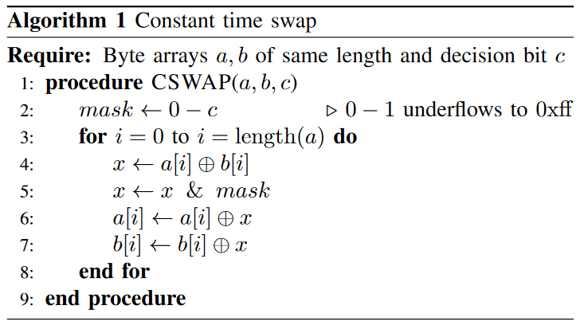
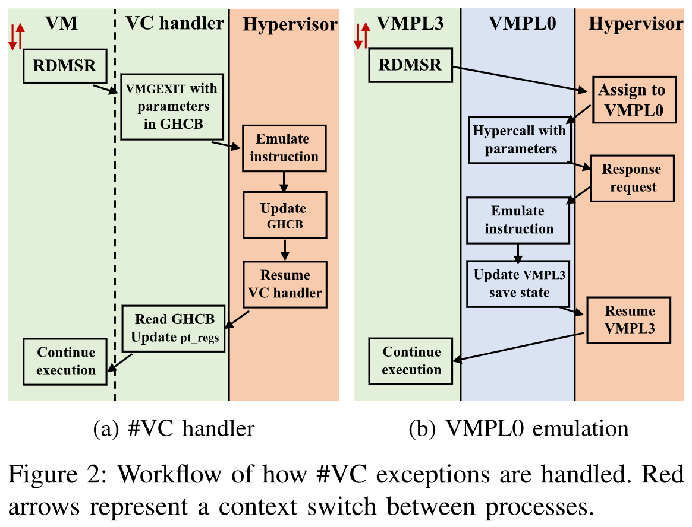
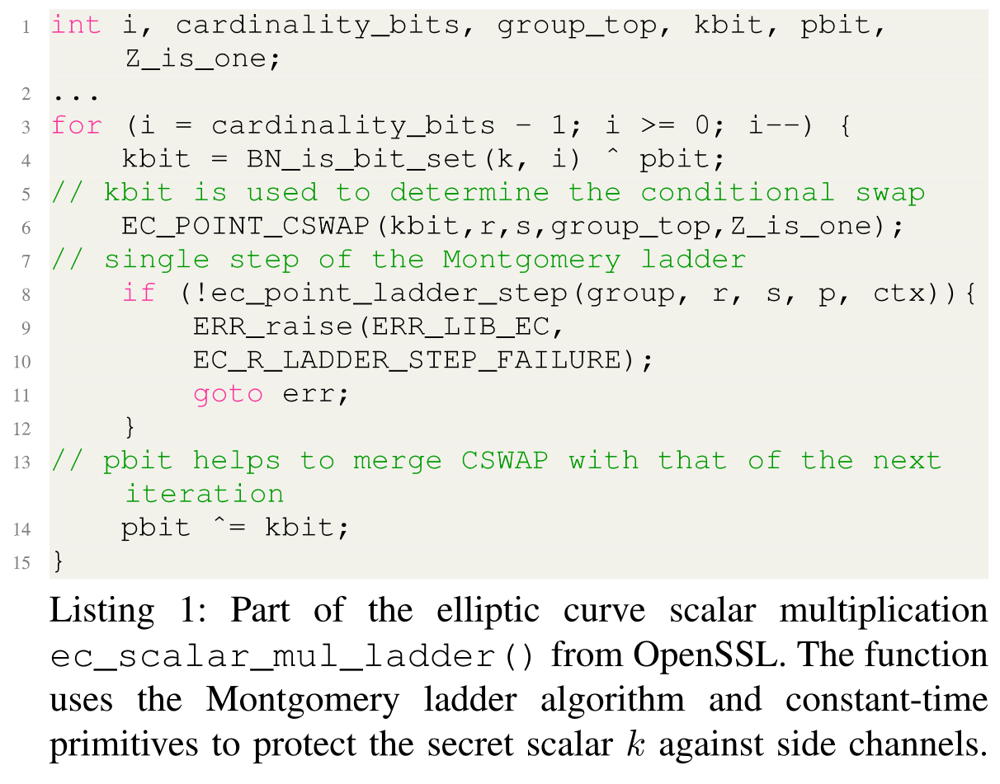
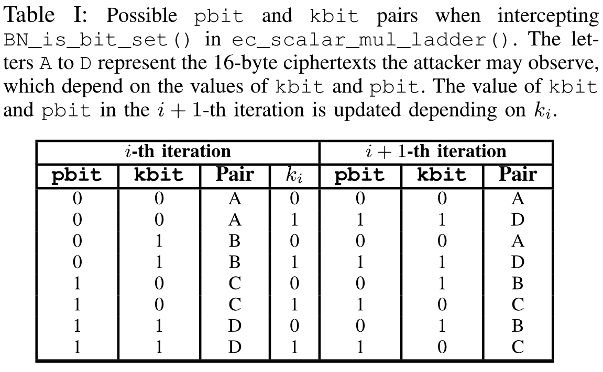

# A Systematic Look at Ciphertext Side Channels on AMD SEV-SNP

[pdf](%5BS%26P%202022%5D%20A%20Systematic%20Look%20at%20Ciphertext%20Side%20Channels%20on%20AMD%20SEV-SNP.pdf)

CipherLeaks 攻击仅针对 VMSA 页，但通用的密文侧信道攻击可能会利用任何内存页面的密文泄露。而 AMD 现有的 CipherLeaks 攻击对抗措施，在 VMSA 页中引入随机数的固件补丁是不够的。AMD SEV 内存加密中泄露的根本原因是使用无状态但未经身份验证的加密模式以及对加密内存的无限制读取。本文还提出了一套针对密文侧信道的软件对策，包括 OS 内核和密码库补丁。

## Introduction

CipherLeaks 是唯一仍适用于 SEV-SNP 的基于软件的攻击，恶意的 hypervisor 可通过监控 guest VMSA 实现窃取密钥。具体而言，SEV 使用的 XEX 加密模式，在 VM 的生命周期中，每个物理地址上，相同的 128 位明文块都被加密为相同的密文块。guest 陷入时，hypervisor 可以读访问 VMSA，监控记录密文的变化。

AMD 通过在 VMSA 加密中引入随机值来缓解 CipherLeaks，明密文的映射关系被打破。而其他 VM 内存的加密仍使用原来的 XEX 加密模式。

本文试图回答这个问题：**攻击中可以访问加密内存密文时，加密实现仍然安全吗？**

本文将密文侧信道攻击广泛分为两类：字典攻击和碰撞攻击。加密活动期间，这两类攻击可用于一般的内存区域，导致密钥泄露。

本文贡献：

- 系统研究了受 SEV 保护的虚拟机的整个内存中的密文侧信道。
- 端到端攻击，OpenSSL 中的 ECDSA 实现。
- 讨论硬件和软件对抗措施，内核补丁。

## A Generic Ciphertext Side Channel

首先定义了一个通用攻击者模型，并展示了两个原语，允许攻击者推断内存内容和应用运行时行为。

### Threat Model

攻击者对系统具有软件和物理访问权限。机密 VM 通过加密内存，使用基于地址的 tweak function 内存加密方案，密文依赖于加密密钥、明文和当前物理地址。以 SEV-SNP 为目标，攻击者无法实施重映射攻击和对加密内存的写访问，但攻击者能通过软件读取密文。

### Attack Primitives

**字典攻击** 秘密相关变量具有较小的、可预测的值范围和固定的内存地址时，适用字典攻击。攻击者可为此变量构造明密文对字典，类似 CipherLeaks 中对 VMSA 中寄存器指的明密文对映射。

而字典攻击可以针对任意的内存位置和变量类型。例如可以使用栈变量或上下文切换时保存的寄存器恢复 ECDSA 密钥。字典攻击受加密块可能明文数量的限制，攻击者观察密文时无法分辨明文的哪一部分变化。如果目标变量与经常变化的其他变量共享加密块，则可能的明文数量太大，无法构建映射。

**碰撞攻击** 碰撞攻击将秘密相关代码执行转化为内存写入。在依赖于秘密的分支中，攻击者利用目标算法根据秘密特定值执行特定的代码区域。通过观察各个代码块的访问模式，可了解秘密。通常的对策是常数时间代码，即代码总是表现出相同的控制流和内存访问。这通常是通过将依赖于秘密的分支决策转换为固定表达式实现的，固定表达式计算给定操作的所有可能结果，使用掩码选择想要的。一个例子是恒定时间交换算法 CSWAP，如下图。CSWAP 接收两个变量 a 和 b 以及秘密的决策位 C，如果 C 置位，则交换 a 和 b 的值，否则保持不变。这段代码总是以相同的顺序执行相同数量的指令并且总是访问相同的内存地址，从而抵抗微架构侧信道攻击。

而如果攻击者能够观察到 a 或 b 的值是否改变，也就可以知道 c 的值。碰撞攻击就是利用密文块是确定性的这一事实，但不同于字典攻击，不是学习密文到实际明文值的映射，而是检查某些密文是否重复或更改。如果攻击者知道执行了内存写入（通过控制流侧信道），但是没有看到密文更改，也就知道了写入的值与之前内存中的值相同。在已知执行程序的情况下，可以利用这点推断更多信息。

## Leakage Due to Context Switch

利用字典攻击提取 SEV-SNP VM 中的寄存器值。虽然 AMD 通过固件保护了 VMSA 区域，但是寄存器状态写入到内存并不只发生在 VM 到 hypervisor 的上下文切换。当从用户态切换到内核态时，内核会将寄存器值入栈，并将其复制到当前线程 task_struct 以便通过 pt_regs 结构访问寄存器值。而每个线程的 task_struct 地址是固定的，攻击者就可以通过在 VM 中重复触发中断并观察生成的密文来构建寄存器字典。可通过 NPF 间接触发 VM 内部的用户态内核态切换，并构建的寄存器字典攻击 OpenSSL 中的 ECDSA 常数时间实现。

### Leaking Register Values via Context Switches

**强制 VM 内的上下文切换** SEV-SNP 限制了 hypervisor 向 VM 注入中断和异常的能力。因此，下面将展示恶意的 hypervisor 如何通过强制虚拟机在某个执行点暂停直到触发自然的内部上下文切换来绕过限制，且内部切换可以被 hypervisor 检测到。

首先，hypervisor 使用 page fault 受控信道将目标应用中断在特定执行点。而 NPF 本身不会导致 VM 内部切换，只会立即陷入。为此，hypervisor 等待一小段时间，然后在不处理 NPF 的情况下恢复虚拟机，受害者应用无法恢复执行。在短时间的等待之后，guest OS 将执行时间驱动的内部上下文切换，也就会更新内存中的受害者应用寄存器值 pt_regs。

即使内部的上下文切换超出了 hypervisor 控制，但是 SEV 采用的 guest 和 host 之间的交互机制可以作为上下文切换完成的指示器。具体而言，可以观测到 guest 频繁读写 hypervisor 管理的 APIC 寄存器，如 IA32_X2APIC_TMR1 用于调度和计时。RDMSR 和 WRMSR 访问都会导致 VM 内部的 #VC 异常，需要与 hypervisor 共享寄存器。VM 内的 VC handler 在将所需的寄存器值放到 GHCB 中后执行 VMGEXIT。而 VC handler 是在内核态，因此，VMGEXIT 也可以指示用户内核切换。Hypervisor 只要等待 VMGEXIT 及其错误码。

SEV-SNP 引入了另一个选项，采用更安全的 guest 和 host 通信机制，将 APIC 仿真移到 guest 的信任域中。VM 内使用 VMPL 提供额外的硬件隔离抽象等。然而，hypervisor 还是可以通过 VMPL0 发出的 hypercall 感知完成的上下文切换。

**在 VMGEXIT 后定位 pt_regs** 攻击者在到达 VMGEXIT 后，可以再用 page fault 受控信道，清除所有存在标志位，并恢复 VM 执行。VM 内的 VC handler 会将指令模拟的结果从 GHCB 复制到 pt_regs。

### Attacking Constant-time ECDSA

本节将演示如何使用上下文切换来攻击 OpenSSL 中的常数时间 ECDSA 实现。攻击者可以通过检查目标应用的 pt_regs 结构中的密文变化来推断 ECDSA 算法中的随机数 k，并用它来恢复密钥。

要攻击的 ECDSA 算法如下，主要是针对 ec_scalar_mul_ladder 函数中的 BN_is_bit_set 函数。

**识别指令页** 需要确定代码位置，以便在适当的执行点拦截 guest。将 page fault 受控信道与性能计数器相结合，来构造细粒度的指令页地址识别攻击。退役指令计数器，可以配置为仅计算虚拟机中的退役指令，从而获取两个 page fault 之间执行的指令数量。攻击者可以简单地为已知二进制文件中的代码路径构造一个退役指令计数器模板。

### End-to-end Attack Against Nginx

攻击 Nginx 服务器的步骤如下：

1. 攻击者向 nginx 发送 https 请求以触发目标代码路径。
2. 定位目标函数：发送请求之后，攻击者清除存在标志位，结合退役指令计数器定位关键函数的 ec_scalar_mul_ladder gPA0 和 BN_is_bit_set gPA1。
3. 定位 pt_regs：攻击者在 gPA0 触发的 NPF 处暂停 VM 一小段时间，然后使用之前提到的方法定位当前线程的 pt_regs 地址 gPA3。
4. 单步循环迭代：攻击者迭代清除 gPA1 的存在标志位，在每次 gPA1 的 NPF 之后，清除 gPA0 的存在标志位，当 gPA1 要返回到 gPA0 时就会触发 NPF。然后攻击者在 gPA0 暂停 VM 一段时间，恢复 VM 而不处理 NPF，循环地清除存在标志位，直到遇到 VMGEXIT。
5. VMGEXIT 后，攻击者记录 pt_regs 中的 RAX 密文值，也就是 gPA1 的返回值。pt_regs 中与 RAX 相邻的是 R8，在 for 循环中不会变化。因此攻击者可以重复步骤 4，收集一系列密文。因为 RAX 只有两个可能的值 0 和 1，这样就可以恢复随机数 k 的值。

## Exploiting Memory Accesses in User Space

上节介绍了攻击者可以利用 VM 内的上下文切换泄露进程的寄存器值。本节将注意力转向由受害者应用的内存访问直接引起的泄露。OpenSSL ECDSA 代码还易受到针对堆栈变量的字典攻击，并展示了针对 ECDSA 实现的冲突攻击示例。

### Breaking Constant-time ECDSA via Dictionary Attack

ec_scalar_mul_ladder 使用本地变量 kbit 控制循环中的 EC_POINT_CSWAP 条件交换。ki 表示随机数 k 的第 i 位，循环开始时，pbit 存储 ki-1，、BN_is_bit_set 获取 ki，kbit 保存 ki-1 异或 ki-2。循环末尾 pbit 更新为 ki。

目标放在 pbit 保存的 16-byte 内存块，根据观测，pbit 所在内存块还包含其他变量。在此场景中，pbit、kbit 和 cardinality_bits 共享同一个 16-byte 内存块，而 cardinality_bits 在循环过程中不变，因此密文值仅取决于 pbit 和 kbit。

每次循环末尾，pbit 存储了 ki。如果攻击者可以推断每次循环的 pbit 值，就可以恢复 k。令 gPA0 表示栈上 pbit 所在页，gPA1 表示 BN_is_bit_set。攻击者使用 page fault 受控信道结合退役指令计数器定位页。

当攻击者处理 gPA1 的 NPF 时，记录 gPA0 的密文，此时 pbit 还是上一轮循环的值。在第 i 次循环，攻击者可以观测到四种可能的 pbit 和 kbit 对。而在循环末尾，pbit 和 kbit 都会根据 ki 更新。因此，当攻击者处理 i+1 轮的 gPA1 NPF 时，有 8 种可能。

然后分析 gPA0 出的密文，定位 pbit 所在 16-byte 的页内偏移，然后推断本轮循环的 pbit 值。如下表，第一轮循环，kbit 和 pbit 都被初始化为 1，即密文 D。如果第 n 和第 n+1 轮循环密文相同，则密文应该是 A 或 C。如果接下来的循环中不再出现 A、C、D 以外的密文，那么 n 和 n+1 轮应该是 C。否则是 A。

攻击步骤：

1. 定位两个目标地址：攻击者首先需要定位目标栈页 gPA0 和目标函数页 gPA1。
2. 介入 for 循环：攻击者循环地清除 for 循环的 NPT 存在标志位。具体而言，在 gPA1 的 NPF 中清除 gPA0 的存在标志位，然后再在 gPA0 的 NPF 中清除 gPA1 的标志位。由此，攻击者就可以跟踪 for 循环的内部状态。
3. 记录 gPA0 的密文：在给定的循环结构中，每次循环中有 5 次 gPA0 和 gPA1 的 NPF。对于 256-bit 的随机数 k，攻击者需要处理 1280 次 NPF。由于 pbit 和 kbit 在算法的不同运行之间有变化，所以攻击者要记录整个栈页的密文。
4. 推断 k 的值：攻击者根据偏移和之前的策略恢复 k 的值。

### Breaking Constant-time ECDSA via Collision Attack

之前的攻击案例都通过猜测和记录明密文映射来使用字典攻击原语。下面展示攻击者如何通过监控秘密相关变量密文的冲突攻击常数时间 EdDSA。EdDSA 以批处理的方式处理秘密，不太容易受到字典攻击。

攻击步骤：

1. 攻击者使用 ssh 连接到服务器，请求使用 EdDSA 密钥。
2. 攻击者使用 page fault 受控信道和退役指令计数器推断目标函数的地址。
3. 攻击者使用 page fault 受控信道介入 swap 操作的执行。
4. 攻击者通过 NPF 侧信道跟踪 swap 操作的写访问模式，获取缓冲区地址。攻击者保存每次循环中的缓冲区快照。
5. 根据调用 swap 操作前后的缓冲区快照，攻击者可以快速判断决定位 b 的值。根据 b 的值可以反推出秘密标量 k 的值。

## Countermeasures

### Architectural Countermeasures

两种硬件方法，都引入高开销。

首先，可以更改 SEV 加密模式位概率加密，加密中包含随机数或增量计数器，每次内存写入时刷新，随机化每次写入的密文。然而，需要额外的内存空间，如 SGX 需要大量内存存储计数器和完整性树。导致大量内存空间和延迟开销。

另一种方法是防止攻击者读取虚拟机物理内存。SEV-SNP 通过 RMP 检查防止写入访问，而更频繁的读取访问和额外的 RMP 检索都会带来开销。 VM 内部的一次读访问，需要对 4 级 gPT 和 1 个数据页进行检查，而每个 gPT 又对应 4 级 nPT 检查。

### Software Countermeasures

基于寄存器值对密文侧信道免疫的假设，应用通过几种方式缓解密文侧信道：

- 将秘密相关的变量在它们的生命周期中尽量存在寄存器而不是内存中。
- 字典攻击和冲突攻击都依赖于对固定物理内存地址的重复写入，因此限制内存地址重用可以防止攻击者推断。
- 基于软件的概率加密，每次将数据写入内存时向秘密数据添加随机数。

使用内核补丁保护上下文切换期间的寄存器值，保护 pt_regs 结构，两种方法，一种是在每个寄存器旁插入一个随机数，另一种是随机化每个上下文切换的堆栈位置。