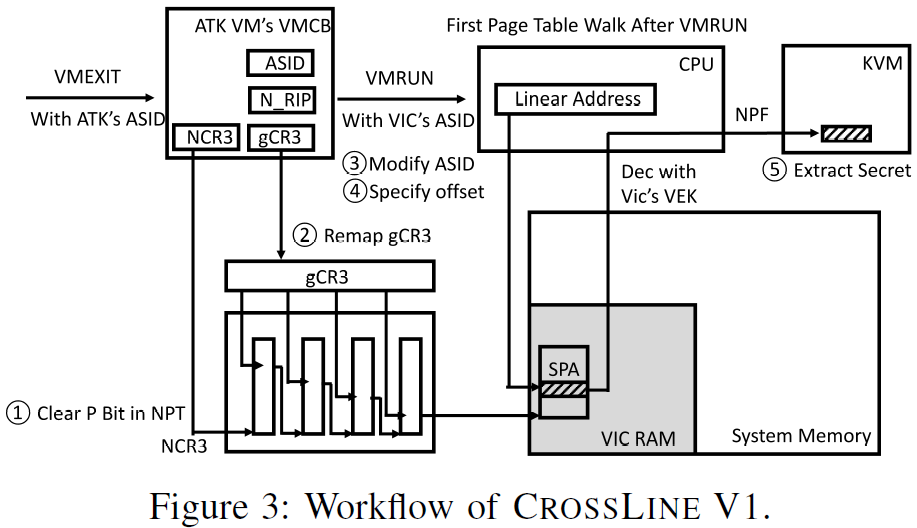
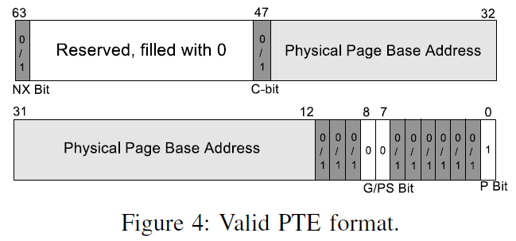
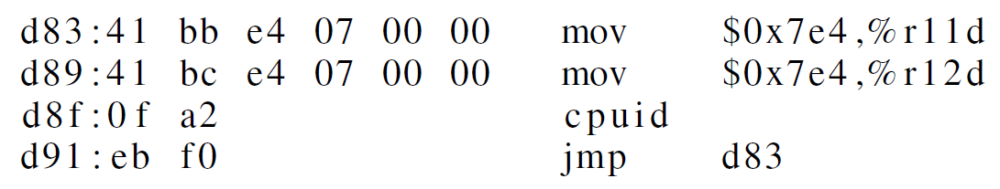

# CROSSLINE: Breaking "Security-by-Crash" based Memory Isolation in AMD SEV

[pdf](./[[CCS%202021]%20CROSSLINE%20Breaking%20Security-by-Crash%20based%20Memory%20Isolation%20in%20AMD%20SEV.pdf])

文章首次揭示了 AMD 如何*不适当地*使用 ASID 控制 VM 访问加密内存页、缓存行和 TLB 条目。提出 CrossLine 攻击，攻击者启动攻击者 VM 并修改 ASID 冒充受害者 VM。两个变体：V1 可以解密受害者的页表或页表项格式的内存块；V2 通过执行受害虚拟机的指令构造加密和解密的 oracle。可以在 SEV 和 SEV-ES 上成功实施攻击。

> [cryptography - What is a cryptographic oracle? - Information Security Stack Exchange](https://security.stackexchange.com/questions/10617/what-is-a-cryptographic-oracle)
>
> In cryptography, an oracle is any system which can give some extra information on a system, which otherwise would not be available.

## Introduction

AMD SEV 假设 HV 不可信，导致很多攻击利用设计缺陷成功可以破坏 SEV 内存加密提供的机密性或完整性，包括未加密 VMCB、未认证内存加密、不安全的 ECB 模式加密、未保护的 NPT 和 未保护的 I/O 操作等。

> 之后会根据这篇论文和 CipherLeaks 中的相关工作总结 SEV 相关的攻击。

本文关注 SEV 中基于 ASID 的内存隔离和访问控制。启动时，每个 SEV VM 会被分配一个唯一的 ASID，用于缓存行和 TLB 的标记，同时 AMD-SP 根据 VM 的 ASID 索引 VEK。然而，ASID 的分配由 HV 完全控制。SEV 遵循 security-by-crash 的设计原则：如果 VM 使用不正确的 ASID 或密钥，第一次取指时使用错误的密钥解密，会导致垃圾数据被执行，很可能导致故障。

要研究 security-by-crash 原则的有效性，首先研究 SEV 处理器如何使用 ASID 实现隔离、HV 如何管理 ASID、HV 如何而在运行时修改 VM 的 ASID 以及为什么修改 ASID 后 VM 会崩溃。基于以上的探索，提出 CrossLine 攻击。

与之前的攻击不同的是：CrossLine 不依赖 SEV 的内存完整性缺陷（之前所有已知的 SEV 攻击的共同先决条件），不适用于 SEV-SNP 不是因为内存完整性，而是 RMP 的作用；不与受害 VM 直接交互，可进行隐蔽攻击。

## Background

SME、AMD-V（nPT、nTLB）、SEV

## Demystifying ASID-based Isolation

这部分详细内容放在 [ASID-based Isolation in SEV](./asid-based_isolation.md) 中。

SEV 的基于 security-by-crash 的内存隔离机制要点如下：

- 基于 ASID 的访问控制，ASID 是唯一用于控制对虚拟内存、缓存和 TLB 访问的标识符。
- ASID 由 HV 管理，在 VMEXIT 期间，HV 可以将任何的 ASID 分配给 VM。硬件的唯一限制是 ASID 必须落入与 VM 的 SEV 类型相符的范围内。
- 安全是由 VM 崩溃保证的，如果 VM 的 ASID 变化，安全性仅依赖于 VM 执行期间触发的故障。该故障可能是在取指或页表遍历期间使用不正确的 VEK 解密内存造成的。
- 缓存和 TLB 条目由 HV 刷新，HV 控制是否以及何时刷新与特定 ASID 关联的 TLB 和缓存条目。在 ASID 激活期间，硬件仅做有限的约束。资源滥用存在可能。

## CROSSLINE Attacks

CrossLine 攻击的目的是提取由受害者 VEK 加密的内存，无需了解受害者 VM 内核版本、允许的应用等信息。

CrossLine 的基本流程：

1. 攻击者控制 HV 启动一个精心构造的攻击者 VM；
2. HV 在 VMEXIT 时修改攻击者 VM 的 ASID 与受害者相同；
3. HV 通过修改 VMCB 或 nPT 为攻击者 VM 准备所需执行环境；
4. 攻击者 VM 在 VMRUN 之后恢复执行，在崩溃之前有一段短暂的执行（momentary execution）。在这段暂时执行中， 攻击者 VM 的内存访问会使用受害者的 VEK 解密。

虽然攻击者 VM 很快会崩溃，但是这段时间足够它冒充受害者 VM 从而破坏机密性和完整性。攻击对受害者的唯一要求就是它已经创建且目标内存页已经加密，而攻击过程中受害者是否运行并不重要。

### V1：通过页表遍历提取加密内存

CrossLine V1 在暂时执行期间使用 nPT 遍历解密受 SEV 保护的受害者 VM 内存。令受害者 ASID 为1，攻击者 ASID 为 2。sPFN0 表示目标内存页的系统物理页帧号，使用受害者的 VEK 加密。sPA0 表示 sPFN0 上一个 8-byte 对齐的内存块，攻击者想读的目标内存。V1 流程如下图。

HV 处理攻击者 VM 的 VMEXIT 时，执行以下步骤：

1. 修改攻击者 VM 的 nPT，清除所有页表项的存在标志位。这使得攻击者 VM 恢复执行后的任何内存访问都会触发 nested page fault（没有从 gPA 到 sPA 的映射）。
2. 修改 nPT 将攻击者 VM 当前进程的 gCR3 重映射到 sPFN0，并将存在位置位。
3. 修改攻击者 VM 的 VMCB 中的 ASID 字段为受害者 ASID。（本例中从 2 改到 1）
4. 修改 VMCB 中的 NRIP 指定要解密的页偏移。V1 利用顶层页目录表遍历每次解密 8-byte，控制 NRIP 的 47-39 位选择，如果偏移量小于 0x800，则将 NRIP 设置在 0x0-0x7fffffffffff 之间，是用户空间的规范虚拟地址，偏移量大于等于 0x800，NRIP 就要设置在 0xffff800000000000-0xffffffffffffffff 之间，即内核虚拟地址空间。
5. VMRUN 攻击者 VM 恢复执行，首先就要从内存取指。此时的访存和地址转换是用 ASID=1（受害者 VM 的 ASID）进行的。地址转换从 gCR3 开始（在 nPT 中已经被映射到 sPFN0），sPFN0 中的偏移由指令虚拟地址的 47-39 位指定的 8-byte 内存块被处理器当作页目录表项加载。只要内存块符合 PTE 格式，就可以提取数据并作为故障地址通知给攻击者（编码在 VMCB 的 EXITINFO2 字段中）。

#### 转储 gPT

V1 最直接的后果就是转储受害者整个 gPT，在 SEV VM 中 gPT 页无视 PTE 的 C-bit 始终加密。

攻击者首先要定位受害者 gPT 的地址（由 gCR3 指定，SEV 应该可以直接读 VMCB？），它可以使用 page fault 侧信道监控受害者 VM 的页访问序列定位 gCR3。VMEXIT 时，攻击者清除所有 nPT 表项的存在标志位、清空 nTLB 和 PWC。VMRUN 之后，受害者 VM 立即执行页表遍历，第一个访问的页就是页目录表，即 gCR3 的值。

解密 8-byte 内存块，需要启动攻击者 VM、使其运行到 VMEXIT、修改 ASID、清除所有 nPTE 的存在标志位，整个过程包括停用 ASID、重启 VM、清除标志位约需 2 秒。攻击者可以执行 VMCB 倒带攻击加速解密过程，通过 nested page fault 解密一个 8-byte 块后直接重复攻击步骤，将攻击者 VM 的 VMCB 回退到之前状态并改变 NRIP 进行下一轮攻击。加速后解密一个 4K 的页只需要 40ms 左右。

#### 任意读内存

攻击者也可以提取受害者普通内存。如果数据块为 0x00000f12345678e7f，则通过 page fault 提取的数据为 0x712345678；数据块为 0x00000abcdef12001，提取的数据为 0xabcdef12。但是 V1 仅将加密数据显示在嵌入在 PTE 中的页帧号，因此仅适用于符合 PTE 格式的 8-byte 内存块，具体格式如下图。

存在标志位必须为 1（这样才能触发 nested page fault），第 48-62 位必须全为 0（高位保留），第 7-8 位均为 0（页大小和全局标志位，这两位只有在末级页表中可以是 1。如果 V1 在顶级页目录表触发 page fault，就必须为 0；可以配置 nPT 使前三层页表遍历都成功，在末级页表触发 page fault，这样这两位也可以是 1）。

获取任意内存内容的速度与转储页表相同，如果目标块不符合 PTE 格式，就会触发 triple fault，攻击者可以执行 VMCB 倒带攻击在下一轮攻击中找另外的内存块。 

### V2：执行受害者 VM 的加密指令

CrossLine V2 证明，满足某些条件时，攻击者 VM 可能暂时执行一些受害者 VM 内存中加密的指令，V2 功能更强大，而且它的唯一先决条件是 V1 的结果。

与 V1 类似，令受害者 ASID 为 1，攻击者 ASID 为 2。假设攻击者 VM 要执行受害者加密内存中的一条指令 `movl $2020, %r15d`，目标指令的虚拟地址为 gVA0，对应的页表 gCR30。攻击者策略就是遵循 CrossLine 的常见步骤，操纵攻击者 VM 的 nPT，使其成功完成几次 nPT 遍历，执行指令。具体而言，V2 步骤如下：

1. 准备 nPT：清除所有的存在标志位，为了取指成功，需要准备 5 个 gPA 到 sPA 的映射，包括 gPT 四级页表的 gPFN 和指令所在页。
2. 设置 NRIP：将 NRIP 设置为 gVA0，同时清除 VMCB 中 RFLAGS 寄存器的中断标志位，这样攻击者 VM 直接执行 NRIP 指定的指令。
3. 修改 ASID：修改攻击者 VM 的 ASID，将 VMCB 标记为写过，使用 VMRUN 执行。在下次 VMEXIT 时看到 r15 的值变为 $2020，表示执行成功。

实验表明，V2 允许攻击者 VM 执行受害者 VM 的一些指令，可以利用这一能力构造加密和解密 oracle。

#### 构造解密 Oracle

解密 oracle 使得攻击者可以解密任意由受害者 VEK 加密的内存块。CrossLine V2 中，攻击者 VM 执行受害者的一条指令就可以解密目标内存。

首先要定位受害者 VM 中的目标指令，格式为 `mov (%reg1), %reg2`，将 reg1 指定的虚拟地址处的 8-byte 内存块加载到 reg2，大多数的内存加载指令都符合这一格式。攻击者使用 V1 扫描受害者 VM 物理内存，以找到包含这样 3-byte 指令的可读内存块。或者受害者 VM 的内存版本已知，攻击者扫描内存映像的二进制文件定位指令，然后使用 V1 读取 gPT 获取其运行时位置。

令指令虚拟地址为 gVA0，对应 sPA0 和 gCR30；要解密的目标地址为 gVA1 和 sPA1。VMEXIT 时，攻击者准备 nPT（包括 gCR30 的一个映射、gVA0 的四个映射、gVA1 的四个映射）、配置 VMCB（包括 NRIP、ASID 和 reg1 的值），最后恢复攻击者 VM。

在这一个 VMEXIT 中，攻击者可以从 reg2 获取 sPA1 的值。然后可以立即执行下一轮内存解密，sPFN 可以在末级 nPT 修改，页偏移由 reg1 控制。

使用解密 oracle 解密一个 4K 内存，单个攻击者 VM 平均解密时间为 113.6ms，比 V1 慢，但是不限内存块格式。

#### 构造加密 Oracle

加密 oracle 使得攻击者可以将用受害者 VEK 加密的内存改为攻击者指定的值，构造方式与解密 oracle 类似。主要区别在于目标指令格式不同 `mov %reg1, (%reg2)`，将 reg1 中的 8-byte 数据存放到由 reg2 指定的地址处。利用加密 oracle 可以强制受害者 VM 执行任意指令、修改敏感数据或更改控制流。

测量更新 4K 页花费的时间，平均加密加密时间为 104.8ms。

#### 定位解密/加密指令

以一个 openssh 服务器为例，攻击者在 HV 或 host OS 中监控网络包，从未加密的 client_hello 和 server_hello 中找到 openssh 服务器版本信息，确认版本后就可以获取二进制文件搜索加密/解密指令。

提取 sshd 进程的 gCR3，在上面提到的观测 server_hello 消息时，攻击者立刻清除受害者 VM 的所有 PTE 的存在标志位。下一个由 sshd 进程发起的内存访问会触发 nested page fault，VMEXIT 后 HV 就得到了 gCR3。

攻击者利用 V1 转储 sshd 进程部分页表，首先转储 gCR3 指向的顶级页目录表所在页，然后找到该页中偏移最小的有效 PTE，以此转储二级页目录表页，重复直到转储了四级页表的最低范围。攻击者获得了 openssh 二进制文件虚拟基址对应的物理地址。

根据 openssh 二进制文件的代码段内存布局，计算其中的解密/加密指令物理地址。攻击者截获 ssh 握手消息后，平均需要 504.74ms 找到两条指令。

### 隐蔽性和鲁棒性

攻击者 VM 和受害者 VM 是两个单独的 VM，有不同的 nPT 和 VMCB。对攻击者 VM 状态的修改不会被受害者观测到，受害者也无法感知到攻击者的存在。攻击者可以通过将攻击者 VM 倒带的方式消除攻击行为带来的影响（在没有 PTE 格式的情况下触发 nested page fault 或执行非法指令），提高攻击的鲁棒性：即使没有正确定位加密/解密指令，V2 也不会影响受害者 VM 的执行，攻击者可以进行多次尝试直到成功。

## Applicability to SEV-ES

为了在 VMEXIT 时保护 VMCB 数据，SEV-ES 将一部分 VMCB 加密，HV 无法在 VMEXIT 是任意读取修改 VCPU 状态。引入新的结构 Guest Hypervisor Control Block, GHCB，guest 可以控制通过 GHCB 共享哪些信息。

SEV-ES 将 VMCB 分为两部分，控制域和状态保存域（VMSA）。控制域不加密，由 HV 控制，包括 HV 拦截位、SEV 和 SEV-ES 的控制位、TLB 控制、VMCB 清除位、NRIP、GHCB 的 gPA、nCR3 和 VMCB 状态保存指针。VMSA 加密且受完整性保护，包括 guest 的寄存器值。VMCB 中 090h 字段的 1-2 位用于标志是否位 SEV-ES VM。VMCB 状态保存指针存放 VMSA 的 sPA。VMSA 的完整性校验值存储在受保护的 DRAM 中，任何软件都无法访问它，包括 HV。VMRUN 时，处理器对 VMSA 进行完整性校验，如果校验失败，VM 将终止。校验值无法由 HV 指定，推测可能是通过 VMSA 的 sPA 索引。SEV-ES 和 SEV VM 的 ASID 池是分离的。

### CrossLine V1 on SEV-ES

CrossLine 在 SEV-ES 上的主要挑战是如何绕过 VMSA 的完整性检查。攻击者 VM 无法修改 VMSA 中的寄存器值，包括 RIP、gCR3 和未公开在 GHCB 中的通用寄存器。

通过在 VMEXIT 时暂停受害者的 VCPU 并修改攻击者的 VMSA 指针指向受害者 VMSA，攻击者可以在 SEV-ES 上执行 V1，实现相同的效果。攻击分为以下步骤：

1. 准备 nPT：在攻击者 VMEXIT 期间，HV 清除 nPT 的所有存在标志位。
2. 操纵攻击者 VMCB：修改 ASID，通过设置 VMCB 控制域中的 TLB 刷新字段通知硬件刷新 CPU 的所有 TLB 条目。最后将 VMCB 状态保存指针指向受害者 VMSA。
3. 恢复攻击者 VM：攻击者使用受害者 ASID，受害者的 VMSA 就可以被正确解密，完整性检查也能通过。恢复后，攻击者 VM 从 VMSA 中 RIP（NRIP？）或 IDTR 指定的地址取指。因为没有 TLB 条目，处理器进行页表遍历时会触发 nested page fault，错误地址是受害者 VM 的 gCR3 值。
4. 重映射 gCR3：处理 NPF VMEXIT 时，HV 将在 nPT 中将 gCR3 重映射到要解密的受害者 VM 内存页。相关 nPT 表项的存在标志位要置位避免其他 NPF。VMCB 控制域中的 EXITINTINFO 字段要清空确保攻击者 VM 能完成页表遍历。恢复攻击者 VM 后，触发的 NPF 会揭示 8-byte 对齐的内存块内容。
5. 复用 VMSA：HV 重复步骤 4，将 gCR3 重映射到下一个要解密的受害者 VM 内存页，下一个 NPF 会揭示相应的内存块。攻击能够成功在于攻击者 VM 并未成功进行取指，在第一次页表遍历（第一个 gPA 的 nPT 遍历）时陷入。因此，VMSA 未被更新，也未创建 TLB 条目。在重映射 gCR3 的过程中，HV 可以使之前生成的 TLB 条目失效。从攻击者 VM 视角来看，步骤 4 并未改变其状态，攻击可以重复进行。
6. 处理 triple fault：在步骤 4 或 5 中，如果目标内存块不符合 PTE 格式，会触发 triple fault VMEXIT。攻击者可以继续解密下一个页，但是 VMSA 中的 RIP 会更新为 handler，因此从 triple fault 恢复会导致解密目标页的不同偏移，不过攻击还能继续。

执行 V1 后，受害者 VMSA 仍然可用，只有存储错误地址的 CR2 值发生变化。

攻击者无法通过修改 RIP 控制解密内存块的页内偏移。攻击者可能恢复受害者 VM 执行以达到不同的 RIP，需要 512 个 RIP 才能覆盖所有内存。一个策略是在 NPF 触发的 AE 时暂停受害者 VM，而当 NAE 或中断触发的 AE 时，下一条指令就是对应的 handler，地址固定。要区分 NPF 触发的 AE 和中断触发的 AE，攻击者虽然不能直接读 RFLAGS.IF（指示有待处理的中断），但是可以检查 VMCB 控制域中的虚拟中断控制字段的第 8 位。两个连续 NPF 触发的 AE 很可能是同一个 RIP，可以在几次 AE 之后再暂停虚拟机。要触发更多 NPF，可以定期清除受害 VM nPT 的存在标志位。

评估攻击者找到所有 512 个偏移量的时间，攻击可以在任何级别的页表上进行，同一 RIP 的 47-39、38-30、29-21、20-12 都可以作为页偏移，每个 RIP 有 1-4 个可供使用的偏移。解密一个 8-byte 内存块就需要 2ms，比在 SEV 中慢很多，因为中间涉及 VMSA 校验。

### CrossLine V2 on SEV-ES

在 SEV-ES 上实施 V2 非常困难，因为 RIP 不可控，无法执行任意指令。构造加密/解密 oracle 还需要操纵特定寄存器值，这在 SEV-ES 上都不可行。

### 隐蔽性

攻击者需要复用受害者的 VMSA，虽然攻击过程中将受害者暂停，但是攻击仅修改了 CR2，受害者无法记录原始 CR2 用于后续比较。（但是暂停了 VM 难道受害者感知不到？）

## Discussion

### 新变体：复用受害者 TLB 条目

可以破坏基于 ASID 的 TLB 隔离。受害者 VM 是 SEV VM，ASID 为 1，攻击者 VM 是非 SEV VM，ASID 为 16。两个 VM 都只有一个 VCPU，由 HV 设置运行在同一 CPU 逻辑核上。假设受害者执行以下的代码片段：

更新两个寄存器值后执行 CPUID 触发 VMEXIT。根据 CrossLine 攻击的基本流程，攻击者启动攻击者 VM，在其 VMEXIT 时修改 ASID，将 NRIP 设置为以上代码片段地址，修改 VMCB 使其成为 SEV VM，恢复执行。不修改攻击者 VM 的 nPT，如果攻击者 VM 进行页表遍历，会触发 NPF。

攻击者 VM 执行以上代码，在触发 triple fault 之前会触发 CPUID VMEXIT。未发生 NPF，证明未发生页表遍历。同时在 CPUID VMEXIT 时发现 r11d 和 r12d 的值都成功改为 0x7e4，即几条指令由攻击者 VM 执行。这是因为攻击者 VM 可以利用受害者 VM 遗留的 TLB 条目进行地址转换。

AMD 对 VM 的 TLB 隔离存在缺陷，ASID 作为访问控制的唯一标识符，可以由 HV 伪造，同时 VM 上下文切换期间的 TLB 刷新由 HV 自行决定，可能会被故意忽略。

### 在 SEV-SNP 上的可行性

为解决 SEV 上的内存完整性缺陷，AMD使用反向映射表 RMP 提供内存完整性保护。RMP 使用 sPFN 索引，每个 sPFN 有一个 RMP 条目，存储物理页状态（HV、guest-invalid、guest-valid）和所有权（VM 的 ASID 和相应的 gPA）信息。物理页的所有权通过 PVALIDATE 指令建立，只能由 guest 执行，保证每个 guest 物理页只映射到一个系统物理页。构造时，RMP 只允许每个系统物理页有一个经过验证的所有者。

每次 nPT 遍历后会执行 RMP 检查，对比页面所有者 ASID 和当前 ASID，并将 RMP 条目中记录的 gPA 与当前 nPT 遍历的 gPA 比较。如果检测到不匹配，会触发 NPF。

#### SEV-SNP 上的 V1

在 SEV-SNP 上的 V1 步骤与在 SEV-ES 上相同，步骤 1-4 可以正常工作。VMSA 也被 RMP 保护，加载 VMSA 也会触发 RMP 检查，而攻击者使用受害者 ASID，可以通过检查。然而，步骤 5 中的 NPF 不会包含页内容，而是因 RMP 检查导致的 NPF，因为在 nPT 遍历时使用的 gPA 与 RMP 中的 gPA 不同。（也就是说，RMP 之后 HV 仍可以修改 nPT 表项标志位，而不可以修改映射关系）

V2 无法在 SEV-ES 上工作，也就不适用于 SEV-SNP。

### Intel MKTME

与 AMD SEV 类似，Intel TME 和 MKTME 也提供内存加密。TME 与 SME 类似，在直接数据路径和外部存储其总线之间放置一个内存加密引擎，在 XTS 模式下使用 128 位 AES 加密对进出 SoC 的数据进行加密。MKTME 在此基础上增加了多密钥支持。在虚拟化场景下，MKTME 与 SEV 类似，不同的是，每个 VM 可以使用多个密钥，允许使用相同密钥进行跨 VM 共享。加密密钥的选择又软件控制，在 PTE 高位指定密钥 id，在虚拟化场景中，必须新人 HV，需要它管理加密密钥。恶意的 HV 可以直接读取加密的 guest 内存，即 HV 包含在 MKTME 的 TCB 中，限制了实际应用。

> Intel TDX 基于 VMX、MKTME 和 TDX 模块为 VM（这里叫做 Trust Domain）提供机密性和完整性保护。

### 与推测执行攻击的关系

CrossLine 不是推测执行攻击。Meltdown、Spectre、L1TF、MDS  等推测执行攻击利用瞬态执行的指令通过侧信道提取秘密内存数据。当处理器等待分支目标计算、异常检测、加载/存储地址的消歧时，指令会推测地执行。但是在 CrossLine V1 的设置中，不需要执行任何指令，因为一旦 CPU 从内存取指，就会发生异常。而另外两个变体具有执行体系结构可见效果的指令。

CrossLine 不依赖于微架构的侧信道，而是将受害者数据显示为页帧号，HV 在 NPF 的处理过程中直接获取数据。

