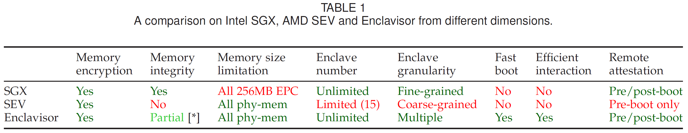
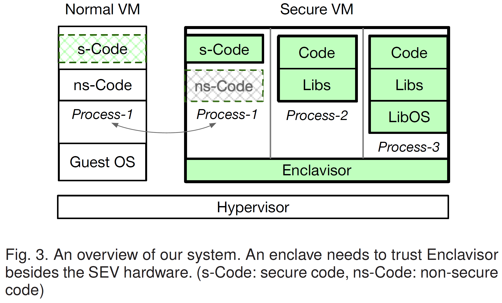
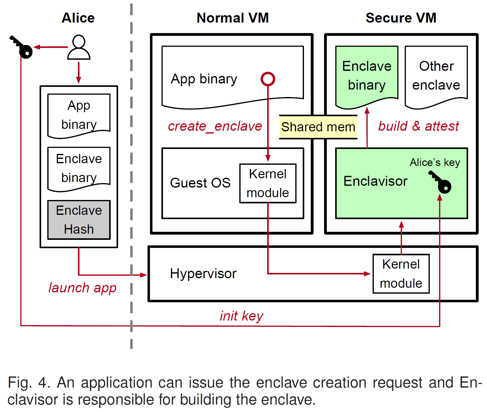
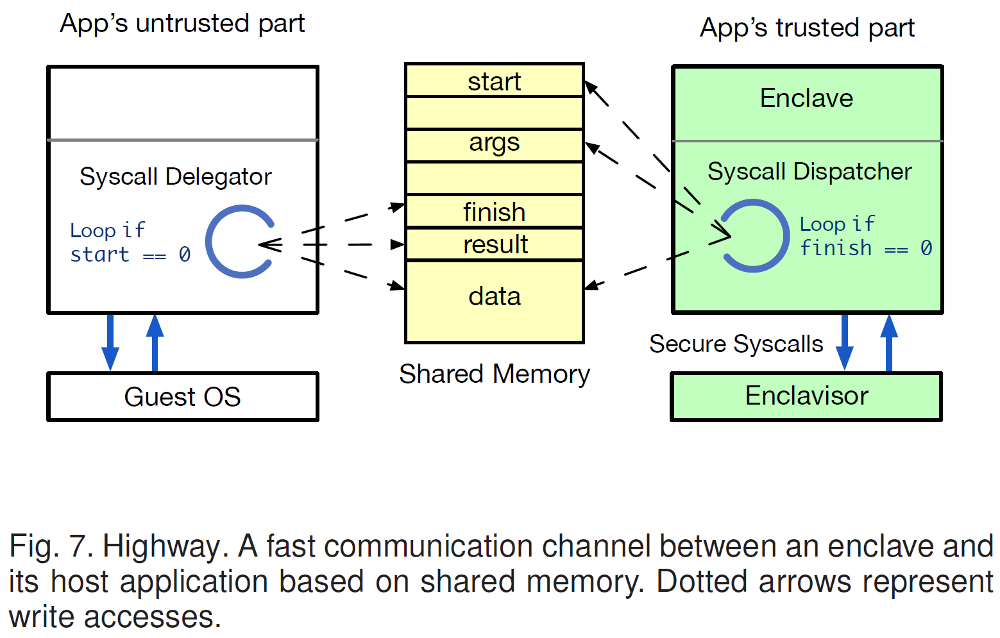
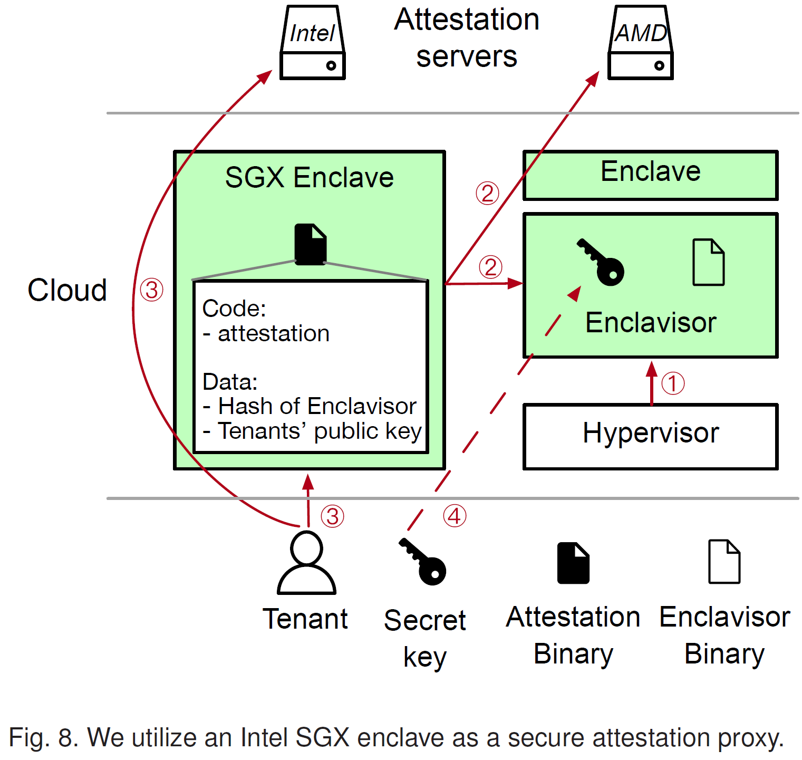

# Enclavisor: A Hardware-software Co-design for Enclaves on Untrusted Cloud

[pdf](./[TC%202020]%20Enclavisor%20A%20Hardware-Software%20Co-Design%20for%20Enclaves%20on%20Untrusted%20Cloud.pdf)

现有的硬件定义 enclave 不够灵活高效。Intel SGX 和 AMD SEV 都存在问题。本文将 enclave 机制的一部分逻辑放在轻量软件层 Enclavisor，软硬件协同设计，实现安全性、性能和灵活性的平衡。基于 AMD SEV，Enclavisor 在 SEV VM 的 guest 内核模式。支持高效启动、多 enclave 粒度和启动后远程验证。

Enclavisor 运行在 guest 内核模式，管理在 guest 用户模式下运行的 enclave 实例。Enclavisor 负责 enclave 的生命周期管理，包括创建、证明、调度、删除、交互等。Enclavisor 可以满足云负载的以下需求：

- 高安全保障：SEV 提供机密性，软件解决方案和硬件增强功能，缓解 SEV 上缺乏内存完整性缺陷。
- 大内存支持：依赖 SEV 不限制内存。
- 高性能：通过 fork 创建 enclave 实例（其实就是进程），以实现 serverless 和 FaaS 的快速启动，还支持类似 FlexSC 的快速交互。
- 灵活的远程证明：两阶段证明，利用 Intel SGX 作为代理节点支持 Enclavisor 的启动后远程证明（SEV 不支持，但多用户的长期服务需要）。

## Motivation and Background

分析 Intel SGX 和 AMD SEV 的缺陷，在 AMD SEV 上实现 Enclavisor 有哪些挑战。

### Intel SGX's Limitations

SGX 难以满足云计算的基本需求：

- 缺乏缺乏多处理器支持
- 易受侧信道攻击
- 最重要的需求：
  - 大内存
  - 高性能

EPC 限制引起的完整性检查和内存交换会导致较大的性能损失。SGX 应用加载和启动都很慢，远程证明还会进一步增加启动延迟。

SGX 无法支持大 EPC，主要是因为 SGX 使用基于计数器的加密保护机密性和 Bonsai Merkle Tree（BMT）确保完整性。每个 64-byte 安全内存块要维护 8-byte 哈希和计数器，在每次 EPC 访问时都要检查哈希。每个内存块的内存作为一个 4 级 Merkle 哈希树的叶子节点。128MB 的 EPC 只有 96MB 能用于存储数据。增大 EPC 会导致哈希树大小和深度的增加，也会带来更低的缓存局部性和更高的内存带宽损失，进而导致更高地内存延迟访问。

SGX enclave 难以支持快速启动，启动延迟主要来源于 enclave 构建指令。所有内存页要一个个加入到 enclave，还需要计算哈希用于远程证明。在这过程中还会触发 EPC 换页。

此外，SGX 不支持系统调用，enclave 之间的无法共享内存，enclave 之间的消息传递需要至少两次内存复制和加解密操作。而将所有服务放在一个 enclave 中又不符合安全性原则。

### AMD SEV's Limitations

虽然 SEV 不限制内存，但是用它保护云应用程序仍存在限制。

SEV 的隔离粒度是 VM，如果只需要保护一小段代码，需要部署整个 guest OS，VM 启动时间也长。

SEV 仅支持同时运行 15 个安全 enclave。（现在支持很多个，由 `CPUID 8000_001F[ECX]` 指定 `0x1FD`）

SEV VM 只能在启动阶段证明，多个互相不信任的租户无法安全地共享 VM。

SEV 不确保内存完整性。（SEV-SNP 提供了完整性）

## Design

Enclavisor 可信，guest OS 和 HV 不可信，enclave 之间不信任。

### 系统概述

Enclavisor 将应用程序和 guest OS 分到不同的隔离执行缓解，为安全程序提供细粒度隔离，将 guest OS 移除 TCB。在安全 VM 中提供相互隔离的执行缓解作为应用程序的 enclave。

Enclavisor 运行在 guest ring 0，负责构建和管理 enclave。

- 通过页表管理 encalve 内存，在 enclave 之间强制执行内存隔离。
- 在安全 VM 中调度 enclave。
- 只作为安全硬件的灵活扩展以支持不同的 enclave，并未实现 POSIX 系统调用。

逻辑上，enclave 属于 host 应用程序，只是在一个安全环境执行，且大多数 enclave 的系统调用都被路由到 host 应用程序运行的 guest OS。

SEV 远程证明只能在启动时进行一次，不支持多租户共享，Enclavisor 的思路是利用 Intel SGX enclave 作为安全委托在 Encalvisor 和不同租户之间建立可信的通信信道。

SEV 不确保内存完整性，恶意的 HV 可以发起重放攻击或修改 NPT 窃取机密。解决方案是剥夺 HV 对安全内存的写入能力，减少对 NPT 映射的影响。

