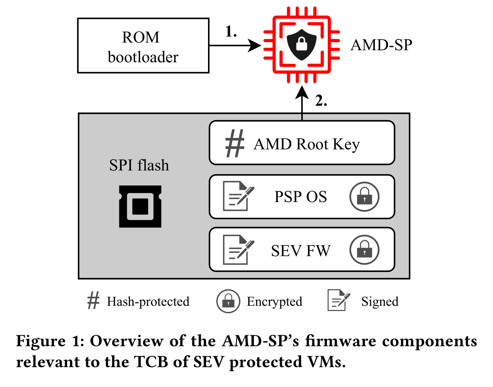
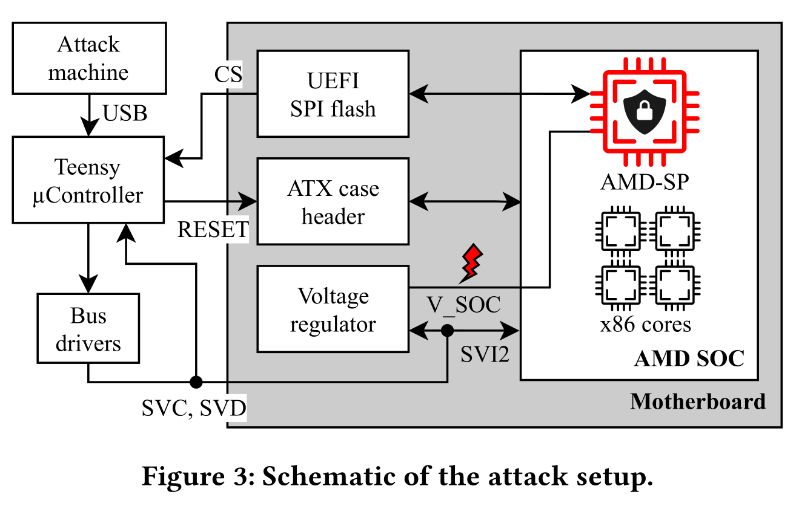
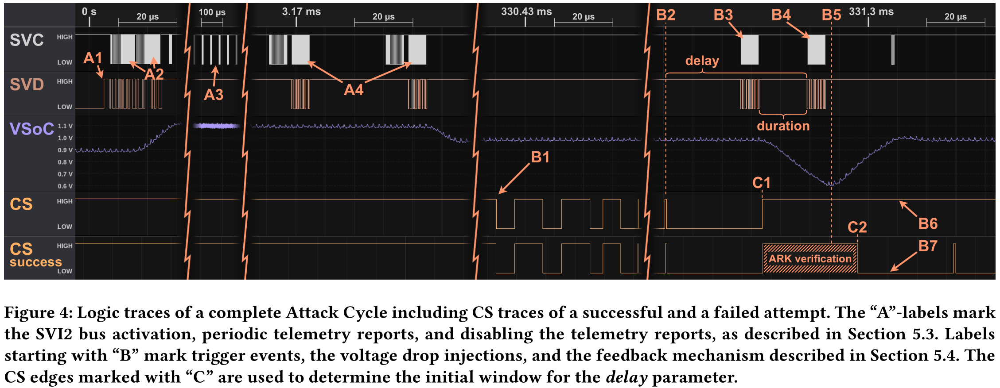

# On Glitch to Rule Them All: Fault Injection Attacks Against AMD's Secure Encrypted Virtualization

[pdf]([CCS%202021]%20One%20Glitch%20to%20Rule%20Them%20All%20Fault%20Injection%20Attacks%20Against%20AMD‘s%20Secure%20Encrypted%20Virtualization.pdf)

AMD SEV 将安全敏感操作放到 AMD-SP 上，本文介绍了通过针对 AMD-SP 来攻击 SEV VM 的方式，一种电压故障攻击，攻击者可以在 AMD-SP 上执行 payload。攻击者可以部署自定义 SEV 固件，可以解密 VM 内存、提取 CPU 认证密钥，从而伪造认证报告。同时逆向了 SEV-SNP 引入的 Versioned Chip Endorsement Key, VCEK 机制，它将认证密钥与 TCB 组件固件版本绑定，攻击者可以导出 VCEK。

## Introduction

之前的研究[^1][^2][^3] 证明 AMD-SP 是 SEV 的 Single Point of Failure 单点故障，但仅限于特定的 CPU 类型。

故障攻击 fault attacks 不依赖于软件问题，而是迫使正常代码进入非预期状态，VoltPillager[^4] 对 Intel SGX 进行攻击。

鉴于 AMD-SP 在 SEV 中的重要地位，针对 AMD-SP 的攻击可能会绕过所有安全保证。本文要研究的就是对 AMD-SP 的故障注入攻击对 SEV 有何影响。

首先分析了 SEV 对针对 AMD-SP 物理攻击的敏感性，通过控制 SoC 电压，导致 AMD-SP ROM bootloader 执行错误，从而完全控制可信根。在此能力上，可以提取 SEV 相关秘密信息，如芯片认证密钥 CEK，可用于装载不需要物理访问权限的软件攻击。SEV-SNP 引入的 VCEK 机制将 TCB 版本与 CEK 绑定，攻击者可以提取 VCEK 种子，从而为所有可能的固件版本生成有效的 VCEK。

初始化阶段确定 CPU 相关的故障参数，如降压的长度和深度，之后就可以实施全自动攻击。在所有架构的 EPYC 上都能成功。

攻击通过欺骗 AMD-SP ROM bootloader 接受攻击者控制的公钥来在 AMD-SP 上执行任意代码。AMD-SP 使用公钥验证固件组件真实性。基于此能力，攻击者可以泄露影响 SEV 系统的密钥或部署自定义的 SEV 固件。

## Related Work

针对 CPU 安全敏感操作的电压故障攻击受到广泛的关注，之前的攻击主要集中在小型嵌入式系统和 SoC。近期报道了一些针对 Intel 桌面和服务器 CPU 的电压故障攻击，使用稳压器的接口导致供电故障。通过基于软件的电压调节接口注入故障，可以破坏 SGX 的完整性，甚至可以提取 enclave 中的密钥。

与本文工作最相关的是[^4]，Chen 等人展示了第一个针对 SGX enclave 的物理攻击，称为 VoltPillager。提高了基于软件的故障攻击的事件精度，利用直接访问稳压器注入故障。

对 SEV 的攻击都依赖于写 guest 的加密内存、访问 guest 通用寄存器或修改 gPA 到 sPA 映射。SEV-ES 和 SEV-SNP 缓解了这些攻击。[^5] 则从另一个方向研究，通过修改 cpuid 指令的结果，攻击者欺骗 guest 不启用 SEV。SEV-SNP 引入可信 CPUID 功能。[^2] 分析了 SEV 的远程认证机制，揭示了 AMD-SP 固件的安全问题，使攻击者能够自定义 SEV 固件并提取远程认证使用的密钥。但只在 Zen 1 上有效。

## Backgroud

SEV 提供的运行时保护和远程认证都需要 hypervisor 使用 AMD-SP 固件提供的接口。

### AMD-SP 启动过程

在[^2]中分析了 EPYC ZEN1 上的 AMD-SP 启动过程。首先从一个不可更新的 ROM bootloader 执行，从一个可修改的 SPI flash 加载并验证 RSA 公钥。公钥负责验证后续从 SPI flash 加载文件的完整性，而公钥本身使用存在 bootloader 中的哈希验证。公钥其实就是 AMD Root Key, ARK。

然后进入下一个启动阶段，启动 SPI flash 上的 PSP OS 和 SEV 固件，都是用 ROM bootloader 加载的公钥验证。而在 Zen3 中，PSP OS 和 SEV 固件都加密，且使用 PSP OS 中的公钥验证。

### 电压故障注入

集成电路需要在特定条件下运行，受电源电压、时钟稳定性、温度和电磁场等影响。供压线上的故障，可能导致 CMOS 产生计算错误，位反转、指令损坏、跳过指令等错误。而在执行加密算法期间触发这些错误就可能泄露密钥或铭文信息。也可能绕过安全检查，获得代码执行等。

## Attack Scenario

攻击者有物理权限，或能访问云服务提供商的维护接口。基于这样的能力，展示以下的两种方法访问 SEV 保护的 VM 数据。

SEV API 提供调试功能，允许加密或解密 VM 内存。正常情况下需要在初始部署时显式地开启。而攻击者可以覆盖策略强制开启调试功能，替换 SEV 固件。或者可以把目标 VM 迁移到另一个系统，然后使用调试 API 解密内存。

攻击者还可以提取 CPU 特定的认证密钥，签名任意的 SEV 认证报告，欺骗 VM 所有者接受一个恶意的迁移代理 MA。而 MA 也是 TCB 的一部分，可以访问 VM 的离线加密密钥 OEK，从而解密内存。

而以上两个场景都需要获取 AMD-SP 上的代码执行，本文中是通过电压故障注入实现的。

AMD-SP 从附带的 SPI flash 加载 RSA 公钥 ARK，用于验证后续加载的固件。攻击者控制固件就可以控制后续的验证。

首先分析了 AMD EPYC CPU 启动过程中的 SPI 总线上的流量，以了解 AMD-SP 的 ARK 验证流程。然后利用 CPU 外部的稳压器控制输入电压，对 AMD-SP 注入电压故障使其接受攻击者自定义的公钥 ARK。

## Glitch Attack

下图为故障攻击设置，使用一个微控制器 Teensy 作为所有通讯底层硬件和运行时间关键逻辑，负责监控主板 SPI 总线的 chip select（CS）线，以识别执行故障注入的精确时间以及是否成功。连接到 SVI2 总线，对稳压器编程控制电压。

下图描述了完整的攻击流程。在 ARK 验证期间注入故障，分以下几步，循环运行，直至检测到成功的故障，对于每个目标 CPU，都需要先确定静态参数：delay（压降精确时间）和 duration（压降深度）。

- A1：Teensy 检测到 SVI2 总线活跃，启动攻击逻辑。
- A2-A4：为避免 SVI2 包冲突，注入两个命令禁止遥测报告并设置默认电压。
- B1-B2：使用为目标 CPU 确定的 CS 脉冲数和延迟精确地触发压降。
- B3-B5：通过注入两个命令触发降压，最低电压由 duration 决定。
- B6-B7：进一步观测 SPI 流量，判断是否成功。

每次失败都使用 ATX 重置线重置 AMD SoC，攻击周期为 3.14 秒，每小时 1100 次以上的尝试。攻击速率受到 ATX 重置线的限制，间隔为 3 秒。

首先构建了一个 payload，用于提取所有目标 CPU 的 ROM bootloader 和 SRAM 内容。修改 SP 固件，忽略 guest 对调试解密的策略，使得攻击者可以使用自己的密钥前面任何 SEV 固件。

固件解密，Zen3 上的 PSP OS 和 SEV 固件被加密了，使用 AES-CBC 模式解密，相关信息如初始化向量 IV 和组件密钥 cK 都在 SPI 组件报头中，cK 又被用 SPI 上的一个密钥 iKEK 加密，而 iKEK 又被一个根密钥 rK 加密，rK 保存在加密引擎的不可读区域。通过故障注入，可以将 Zen3 的固件解密，进一步分析 VCEK 密钥派生过程。

## CEK & VCEK Derivation

上述攻击提取的固件实现了 SEV 背书密钥和相关密钥的派生。CEK 和 VCEK 是 SEV 安全的基础，二者都由烧录到 AMD SoC 内部的秘密值派生，每个 SoC 都有一个唯一的 256-bit id，用于检测 CEK 和 VCEK 的证书。

CEK 由 32-byte 的秘密生成。使用 NIST 密钥派生函数 KDF 的计数器模式，使用 HMAC-SHA256 将其扩展为 56-byte 伪随机数。KDF 输入是一个空白上下文，标签为 SEV 芯片倍数密钥，以及作为密钥的 SHA256 秘密摘要。然后转换为 ECDSA 密钥。

AMD SoC 的 id 从与 CEK 相同的秘密值，秘密值作为私钥，id 是公钥。

VCEK 生成，使用 48-byte 的秘密值，修改此秘密也会修改 TCN 的版本字符串。TCB 由 8 个不同的单字节安全版本号，使用 SHA384 将这些版本号与秘密信息合并。

ID 和 CEK 的派生都由 SEV 固件实现，它们共享的秘密值由 ROM bootloader 导出，在 CCP 的可读缓冲区中将秘密传递给 PSP OS。SEV 固件通过 PSP OS 的 syscall 访问密钥，SEV 固件也负责派生 VCEK。

通过以上的故障攻击，攻击者不仅可以执行任意 PSP OS 固件，还可以任意选择 SVN。

## Discussion

### Attack Evaluation

对于覆盖调试策略的攻击，攻击者替换并签署自定义 SEV 固件，可以使用 SEV 的调试 API 解密 VM 内存。第二种攻击场景，攻击者提取任意支持 SEV CPU 的授权密钥，用于伪造证明报告，允许攻击者将受害 VM 迁移到恶意迁移代理所在主机，恶意 MA 使用离线加密密钥 OEK 解密内存。

两种攻击方案都对 SEV VM 构成威胁，可以由内部攻击者执行，只需要便宜易得的硬件。

### Implications for the SEV Ecosystem

第一种场景需要有对目标 VM 允许的机器的物理权限。而第二种场景，只需要提取任意支持 SEV CPU 的 CEK，就可以伪造有效的认证报告。认证报告在 SEV 信任模型中起核心作用，为 VM 所有者提供保证，现有的报告签名不足以证明其来自于真实的 AMD 平台。

### Potential Mitigations

两种策略缓解攻击，阻止代码执行，阻止提取密钥。

本文利用电压故障注入实现代码执行，要阻止，可以检测恶意的压降或故障，关闭系统防止进一步破坏，或者防止故障执行，如引入冗余。这些方法都需要改变硬件或软件设计。

阻止提取密钥，VCEK 中可能不应该包含密钥，而是包含 TCB 组件的哈希。

## Conclusion

攻击突出了 SEV 对物理攻击保护的不足。AMD-SP 会被欺骗执行攻击者控制的额代码，注入自定义固件。故障攻击还能提取 CEK，可以装载仅软件的攻击，伪造认证报告，冒充 VM 迁移的有效目标，以此访问 VM 数据。密钥提取可以在与目标 VM 无关的 AMD CPU 上执行，如攻击者自己买的 AMD EPYC CPU。SEV-SNP 的 VCEK 方案无法阻止此类攻击。因此，SEV 无法充分保护内部攻击者的云环境机密数据。 

[^1]: https://media.ccc.de/v/36c3-10942-uncover_understand_own_-_regaining_control_over_your_amd_cpu
[^2]: Robert Buhren, Christian Werling, and Jean-Pierre Seifert. Insecure Until Proven Updated Analyzing AMD SEV's Remote Attestation. CCS 2019.
[^3]: [CVE - CVE-2019-9836 (mitre.org)](http://cve.mitre.org/cgi-bin/cvename.cgi?name=CVE-2019-9836)
[^4]: Zitai Chen, Georgios Vasilakis, Kit Murdock, Edward Dean, David Oswald, and Flavio D. Garcia. VoltPillager: Hardware-based fault injection attacks against Intel SGX Enclaves using the SVID voltage scaling interface. USENIX 2021.
[^5]: Martin Radev and Mathias Morbitzer. Exploiting Interfaces of Secure Encrypted Virtual Machines. ROOT 2020.
