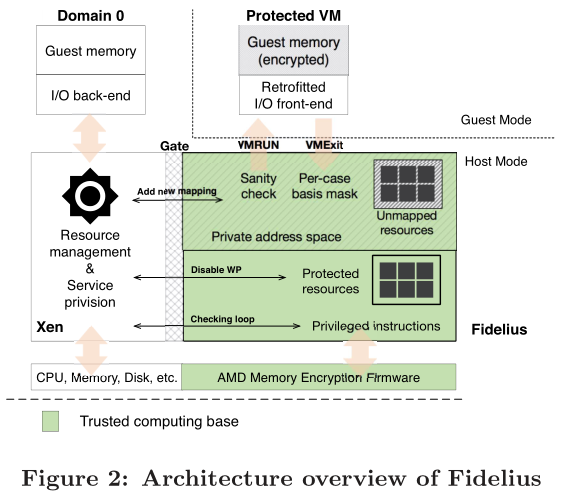
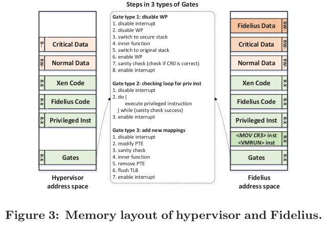
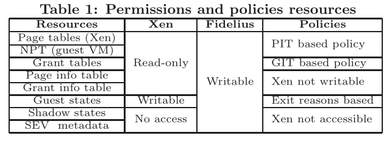
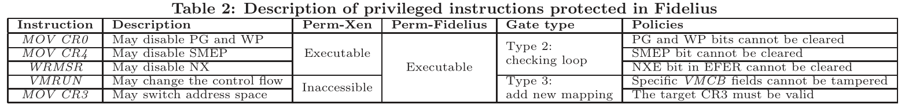

# Comprehensive VM Protection Against Untrusted Hypervisor Through Retrofitted AMD Memory Encryption

[pdf]([HPCA%202018]%20Comprehensive%20VM%20Protection%20Against%20Untrusted%20Hypervisor%20Through%20Retrofitted%20AMD%20Memory%20Encryption.pdf)

面对不可信的 hypervisor，SEV 存在一系列安全问题。本文提出 Fidelius 是基于软件的 SEV 功能扩展，解决安全问题，同时保证性能效率。Fidelius 将关键资源管理与服务提供分开，撤销不可信 hypervisor 访问特定资源的权限，同时复用 SEV API 提供完整的 VM 生命周期保护。

## Introduction

恶意的 hypervisor 可以绕过 SEV 的保护操纵某些关键资源。SEV 还缺乏保护 VM 的功能，如无法提供加密的 I/O、无法为两个合作的 VM 提供安全的不暴露给 hypervisor 的共享内存。

Fidelius 将关键资源管理与服务提供分开，剥夺 hypervisor 对特定资源操作的权限。引入隔离上下文运用策略管理资源，隔离由不可绕过的内存保护机制保证。出于性能考虑，Fidelius 将隔离上下文放到 hypervisor 的相同特权级。提供三种门实现轻量级上下文切换。

为保持兼容性且补充 SEV 缺少的功能，Fidelius 复用 SEV API，以实现完整的 VM 生命周期保护。改造对 SEV SEND 和 RECEIVE API 的使用，以便能够从加密的内核映像启动。为保护 I/O，Fidelius 为 guest 提供了两组半虚拟化接口，可以实现基于硬件的加密加速的快速 I/O 数据编解码。最后，扩展了 hypercall 接口以验证虚拟机之间的共享上下文。

本文贡献：

- 利用 AMD SEV 进行 VM 保护的全面安全分析和讨论。
- Fidelius，将关键资源管理与服务提供使用同级保护分开，同时复用 SEV API 实现 VM 生命周期保护。
- 在 Xen 上实现的原型以及策略执行，机器安全性和性能评估。

## Backgroud and Motivation

SEV VM 启动时，SEV 固件会初始化 SoC 中的 guest SEV 上下文，并将句柄返回给 hypervisor。每个句柄对应一个 SEV 上下文，包括 VM 加密密钥 VEK。当 guest 被调度时，hypervisor 执行 ACTIVATE 指令，参数为句柄和 ASID，处理器会将相应的 VEK 装载到内存控制器。

ASID 和句柄都由 hypervisor 管理，不受 SEV 保护。SEV 不允许在加密的 guest 内存上执行 DMA。Xen 中内存共享由授权表机制实现，而授权表由 hypervisor 维护，对授权表的滥用会破坏 VM 共享内存的机密性和完整性。

## Overview

将资源管理和服务提供分开，撤销 hypervisor 访问特定资源的权限。不完全限制 hypervisor 访问关键资源，而是通过策略执行分离资源访问。Fidelius 作为可信上下文控制 guest 和 host 模式的切换。对于组织紧凑且 hypervisor 经常访问的资源（如 VMCB），VM Exit 时，Fidelius 复制资源，隐藏机密字段后将控制流转移给 hypervisor。对于稀疏组织的资源（如页表），在 hypervisor 中映射为只读，对它们的修改需要可信上下文参与。而对于与服务提供无关的其他资源（如 SEV 元数据），不会映射到 hypervisor 的地址空间。

Fidelius 和 hypervisor 放在同一特权级，通过不可绕过的内存隔离机制保持分离。通过将页表映射为只读，并在 hypervisor 代码中删除所有相关的特权指令，撤销 hypervisor 映射内存的能力。需要 Fidelius 参与页表操作，并使用基于页面信息表的策略执行来验证更新。

重用 SEV API，提供完整的 VM 生命周期保护。支持使用 AES 指令集或重用 SEV API 启用基于硬件的 I/O 加解密。

Hypervisor 被剥夺访问关键资源的权限，通过三种方法：shadowing（VMCB 和寄存器）、写保护（页映射结构和授权表）和自维护（SEV 元数据和特定指令）。访问这些资源需要通过三种门（禁用写保护、检查循环和添加新映射），实施相应策略。

Fidelius 旨在保护不可信 host 下的 VM 隐私和完整性。

## Fidelius Design

### Non-bypassable Memory Isolation

从特权 hypervisor 撤销访问关键资源的权限的关键前提是创建一个独立的上下文，Fidelius 将此隔离的上下文放在与 hypervisor 同特权级。

Fidelius 对页表页实施写保护，每次更新内存映射都将转发到 Fidelius 的处理程序，并实施预定义策略。Xen 和 Fidelius 的内存布局如下。

下表详细说明了 Xen 和 Fidelius 中映射不同资源的权限，以及 hypervisor 访问它们时的强制策略。关键数据包括 hypervisor 的页表页、受保护的 guest VM NPT、授权表、PIT 和 GIT，在 Xen 中都映射为只读。

另一个重点是禁止 hypervisor 执行特定特权指令以截获控制流、切换上下文甚至禁用保护机制。对于可能禁用保护机制的指令，通过二进制扫描确保这些指令仅存在于 Fidelius 代码段中。对于劫持控制流或切换上下文的指令（如 VMRUN 或 mov CR3），Fidelius 从 Xen 的地址空间取消映射，并在执行之前重新映射为可执行。

当 hypervisor 需要正常更新页表、修改受保护资源或执行特权指令时，首先要切换到 Fidelius 上下文。一般的方法是修改 CR3，但是开销较大。第二种方法是在上下文转换时添加预先分配的地址空间，并在切换回来时撤销，此方法只涉及对页表页的一次写入。用于未映射的特权指令和资源。第三种方法用于更普遍的清空，不引入额外地址空间，在过渡期间修改地址空间映射权限，只需清除 CR0 的 WP 位。

### Resource Management

对于 guest 运行时状态，使用 shadowing 的方式保护，根据 exit reason 屏蔽原始上下文。

对于内存映射数据，将 hypervisor 地址空间内的 NPT 映射为只读，通过禁用写保护门更新 NPT。维护共享内存信息的授权表也映射为只读。

SEV 元数据，包括 guest VM 的 ASID、SEV 固件返回的句柄以及加密元数据。

## Policy Enforcement

基于 exit reason、信息表的策略。