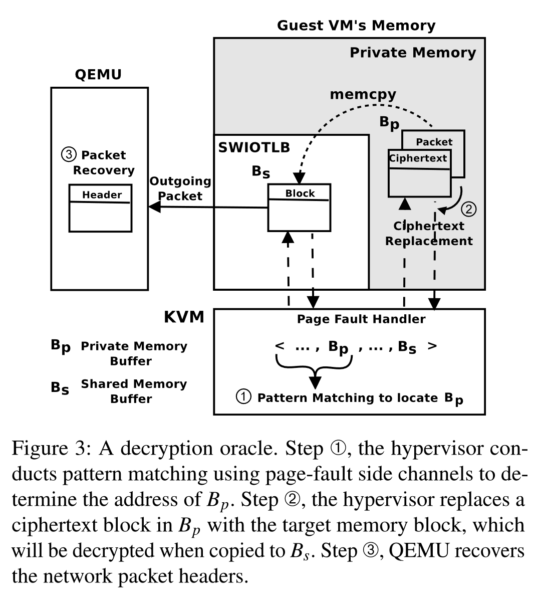
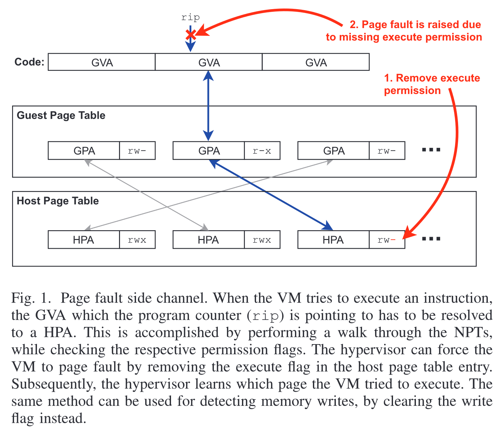

# Page Fault Controlled Channel in SEV

> 结合几篇论文总结 SEV 平台上的 nested page fault 受控信道。

# Exploiting Unprotected I/O Operations in AMD’s Secure Encrypted Virtualization

[pdf]([USENIX%202019]%20Exploiting%20Unprotected%20IO%20Operations%20In%20AMD's%20Secure%20Encrypted%20Virtualization.pdf)

### Decryption Oracles

利用 SEV 中的 DMA 操作构造解密 oracle，分三步：模式匹配、密文替换和包恢复。

以 ssh 为例，远程的 guest 所有者 ssh 客户端发送的数据包会通过 DMA 传输到 guest 和 hypervisor 的共享缓冲区。由 guest 将其复制到私有的加密内存页，之后交给 guest 网络栈处理，最终将数据交给 ssh 服务端。服务端处理后会发送 ack 包，而 ack 包会复制到内核空间，添加相关的报头，复制到共享缓冲区。而在最后的这次复制过程中，会将由 VEK 加密的内存解密。下面就利用这一过程构造解密 oracle，每个 guest 生成的网络包都可以被用作解密 oracle。

#### Pattern Matching Using Fine-gained Page-fault Side Channels

令私有缓冲区 Bp 的 gPA 为 Ppriv，共享缓冲区 Bs 的 gPA 为 Pshare。攻击的主要挑战就是找到 Ppriv，攻击者需要执行 page fault 侧信道分析。

在 AMD 平台上，控制 hypervisor 的攻击者可以利用 page fault 侧信道跟踪 SEV VM 的执行。Hypervisor 通过操纵 NPT 使 gPA 到 hPA 的转换陷入。出错的 gPA 会保存在 VMCB EXITINFO2 字段，错误代码保存在 EXITINFO1 字段。这两个字段可用于侧信道分析。

使用细粒度的侧信道，攻击者可以监控 guest 接收 ssh 数据包时的内存访问序列。当 ssh 数据包传递给 SEV VM 时，攻击者立即启动监控过程，清除所有 guest 内存的 nPTE 的存在标志位。每次 guest 访问一个内存页都会触发一个 page fault，攻击者就能获取错误地址 Pi。陷入时可以通过选择是否将存在标志位重新置位来控制选择是否仅收集对页的第一次访问。当 ack 包复制到 Bs 后就可以停止监控。这样攻击者就收集了一个错误地址序列 <P1, P2, ..., Pm>。

在 guest 内部，sshd 发包时，加密数据会复制到网络栈的各个缓冲区中，添加报头。最终的网络数据包存在 sk_buff 中，内核将数据传输给设备驱动，也就是 Bp。

Ppriv 和 sk_buff 地址 Psk 应该在错误地址序列中。攻击者可以结合页内偏移、PFN、错误码和 Bp 和 sk_buff 之间的 page fault 次数创建签名，以定位 Ppriv。

# CIPHERLEAKS: Breaking Constant-time Cryptography on AMD SEV via the Ciphertext Side Channel

[pdf](%5BUSENIX%202021%5D%20CIPHERLEAKS%20Beaking%20Constant-time%20Cryptography%20on%20AMD%20SEV%20via%20the%20Ciphertext%20Side%20Channel.pdf)

## Execution State Inference

使用密文侧信道推断 guest 内进程执行状态，帮助定位目标函数地址并进程正在执行的函数。

推断加密 VM 的执行状态步骤如下：

1. t0 时刻，hypervisor 清除 NPT 中所有存在标志位，受害者 VM 的 下一次内存访问会触发 nested page fault 陷入。
2. 陷入期间，hypervisor 读取并记录受害者 VM 的 VMSA、时间戳和陷入错误码。
3. hypervisor 收集一系列的密文块和时间戳，通过比较 CR3&CR0 字段，将每次观测关联到受害者 VM 内的进程。因此，收集相同进程的密文块修改可以推断其状态。

使用向量表示密文的变化，每一维对应一个寄存器，每次密文值变化时就 +1。

通过上述收集到的信息，hypervisor 可以通过训练来分析 guest 中的应用。

# [A Systematic Look at Ciphertext Side Channels on AMD SEV-SNP](./ciphertext_side_channel.md)

# SEVurity: No Security Without Integrity Breaking Integrity-Free Memory Encryption with Minimal Assumptions

[pdf](%5BS%26P%202020%5D%20SEVurity%20No%20Security%20Without%20Integrity%20Breaking%20Integrity-Free%20Memory%20Encryption%20with%20Minimal%20Assumptions.pdf)

文章提出在不依赖对 I/O 的控制，重用现有密文构建高速加密 oracle，实现任意代码注入。同时逆向了 AMD 的 XEX 加密模式，并首次展示针对此模式的攻击。

## Cipher Block Moving Attack

逆向了加密模式后，可以计算任意物理地址的 tweak 值。恶意的 hypervisor 可以利用 tweak 值和已知明文实现放置包含连续受控字节的 16-byte 块。

只需使用虚拟机中已存在的明文，就可以实现注入任意数据和代码。

### Attacker Model

攻击者控制 hypervisor，可以操控 NPT，修改 VM 内存。攻击者可以通过未加密的引导分区等方式获取部分 guest 内核二进制文件。虚拟机开启 SEV-ES，初始映像无法被篡改，VMCB 受保护。不要求 VM 通过网络通信或磁盘 I/O。

### Tracking Guest Execution

为了使虚拟机能够提供在已知状态下执行 hypervisor 提供的代码，需要跟踪并暂停其执行。通过 page fault 侧信道来实现。攻击者控制 hypervisor，也就控制了 NPT，因此可以将相关的虚拟机页标记为不可写或不可执行。如果虚拟机要发起一个内存写或执行指令，就会触发 page fault，调用 hypervisor 中的中断处理程序。page fault 异常信息中包含错误 gPA，再通过修改标志位恢复虚拟机执行。

攻击需要计算 tweak 值，依赖于 hPA，因此需要推断源 gPA 和目的 gPA。要向 VM 注入代码，需要找到在 guest 中映射为可执行的 gPA。虽然无法直接查看 VM 内的页表，但是可以通过 page fault 侧信道监控不可执行导致的陷入。

Guest 内核是代码注入攻击的合适目标，因为它运行在最高特权级，且加载到连续的 gPA。内核加载的基址会通过 KASLR 进行随机化。本文提出了两种找到 KASLR 保护下的 guest 内核的方法。Linux 内核分两步启动，先加载一个小的 bootloader 到固定的 gPA，负责加载实际的内核并执行 KASLR。第一种方法，使用密文块移动攻击修改 bootloader 代码，使其不会执行 KASLR。第二种方法，监控 VM 启动过程期间自然发生的 page fault，利用内核被加载到连续的 gPA，并且在内核加载到随机地址之前的内存访问是确定的。也就可以识别加载内核相关的内存访问，从而获取内核 gPA。

