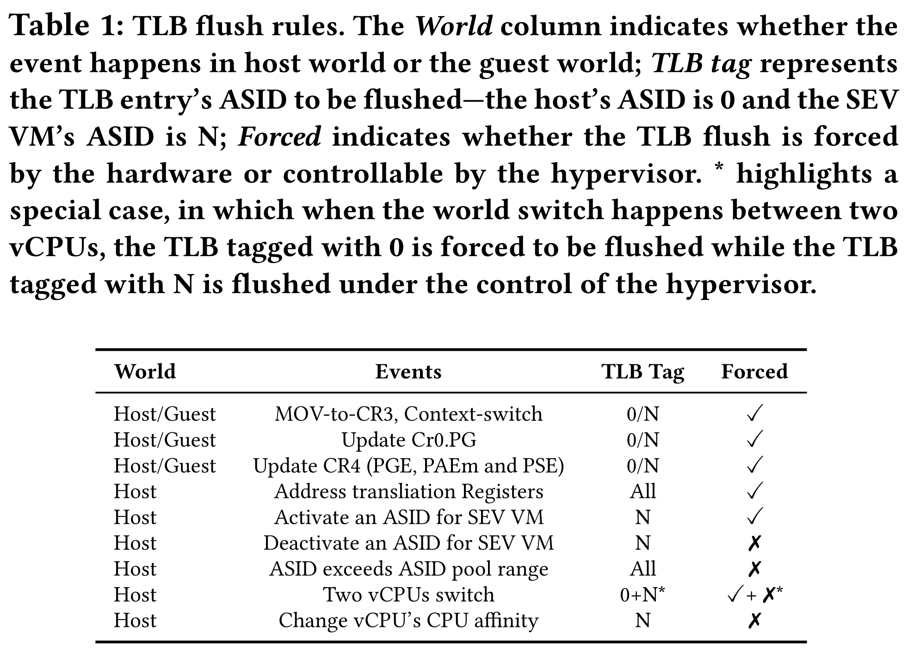
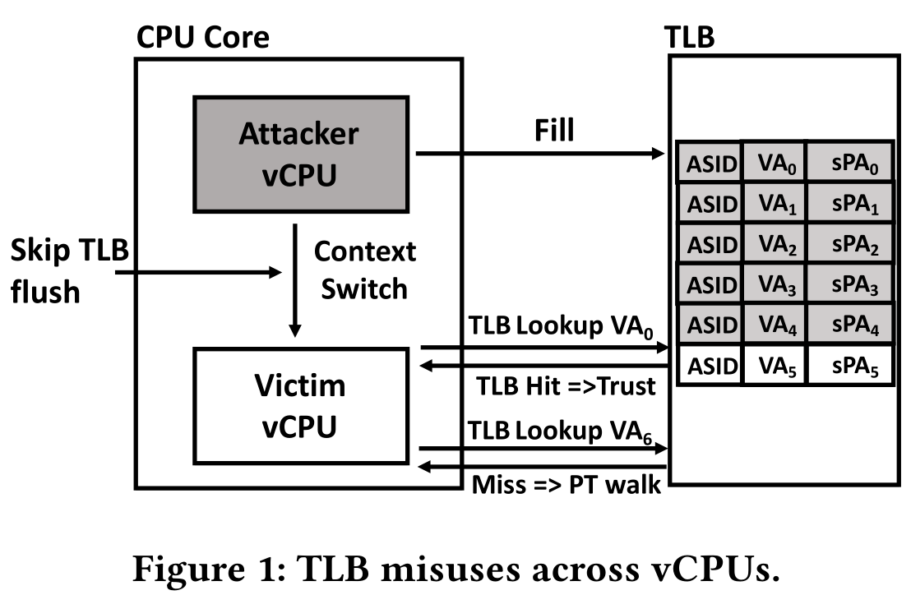
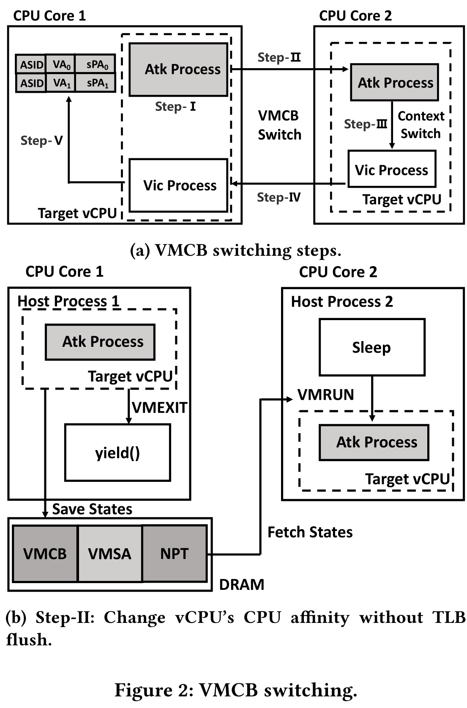
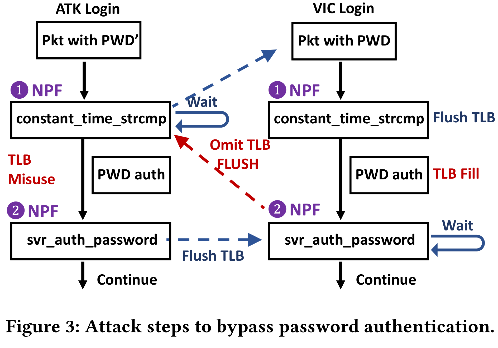

# TLB Poisoning Attacks on AMD Secure Encrypted Virtualization

首次探讨 SEV 处理器上 TLB 管理的安全问题，并演示了针对 SEV VM 的新型 TLB 投毒攻击。首先揭示 SEV 如何在 AMD-V 之上扩展 TLB 实现，并展示了 SEV 威胁模型下的 TLB 管理不再安全，hypervisor 可以在 SEV VM 的两个进程之间的 TLB 条目中投毒，从而破坏 SEV VM 完整性和机密性。文章描述了 TLB 投毒攻击的两个变体，以及两个可以在 SEV 和 SEV-ES 上成功实施的端到端攻击。

## Introduction

简述 SEV 发展历程 SEV -> SEV-ES -> SEV-SNP，以往的攻击。

本文介绍了针对 SEV 的 TLB 投毒攻击，控制了 hypervisor 的攻击者可以向同一 SEV VM 中的两个进程共享的 TLB 条目投毒。根本原因是 hypervisor 可以控制 TLB 刷新。具体来说，TLB 由 ASID 标签，以减少切换时的刷新。而 CPU 硬件难以确定是要刷新整个 TLB 还是只刷新特定 ASID 的 TLB，这就要由 hypervisor 控制。通过设置 VMCB 中的 TLB 控制字段控制，在 VMRUN 之后生效。攻击者可以故意跳过刷新，受害 SEV VM 中的受害进程就会使用同一 VM 的其他进程注入的 TLB 条目。

两种攻击场景：目标 SEV VM 中运行非特权的攻击者进程，配合 hypervisor 投毒；没有 VM 内进程的协助，攻击者仍可以利用面向网络的进程的 TLB 误用，与目标进程共享虚拟地址空间，绕过身份验证。文章在 SEV-ES 服务器上演示了对应两种场景的两种针对 SSH 服务器的端到端攻击。

文章贡献：

- 解释了 AMD SEV 的 TLB 管理机制，指出 TLB 隔离中的一个严重缺陷。
- 提出针对 SEV 的新型攻击：TLB 投毒，首次演示了 TLB 投毒攻击。
- 演示了两个端到端 TLB 投毒攻击。

## Understanding and Demystifying SEV's TLB Isolation Mechanisms

### TLB Management for Non-SEV VMs

ASID 作为 TLB 条目的一部分，用于减少 VM 切换开销，ASID 0 保留给 hypervisor，其他的给 VM 使用。ASID 池由 CPUID 0x8000000a[EBX] 指定。

对于 non-SEV VM，hypervisor 负责维护每个逻辑核上 ASID 的唯一性和 freshness。每个逻辑核上，hypervisor 将每个逻辑核最近使用的 ASID 保存到 svm_cpu_data 结构体。每次 VMRUN 一个 non-SEV VM 的 vCPU，hypervisor 通过比较 VMCB 的 ASID 和逻辑核最近使用的 ASID 来检查 vCPU 的 CPU 亲和性是否变化。如果不匹配，说明 vCPU 在此次 VM Exit 之前未在此逻辑核运行，或者多个 vCPU 共享一个逻辑核，hypervisor 会为此 vCPU 分配一个增量且未使用的 ASID，确保不复用 TLB 条目。否则（ASID 相同），就不需要 TLB 刷新，vCPU 保留 ASID 复用 TLB 条目。

hypervisor 负责在某些条件下刷新 TLB，例如，当逻辑核最近使用的 ASID 到达最大范围时，需要刷新全部 TLB。刷新的方式就是设置 VMCB 的 TLB_CONTROL 字段的 bit 39-32：

- TLB_CONTROL_DO_NOTHING 00h
- TLB_CONTROL_FLUSH_ALL_ASID 01h：刷新整个 TLB
- TLB_CONTROL_FLUSH_ASID 03h：刷新 VMCB 中 ASID 对应的 TLB 条目
- TLB_CONTROL_FLUSH_ASID_LOCAL 07h：刷新当前 guest VM 的非全局 TLB 条目

VMRUN 之后，硬件会检查字段中的某些位执行对应的操作。hypervisor 通知硬件刷新并维护 TLB 隔离。硬件在观测到上下文切换或 MOV-to-CR3 时也会自动刷新带有当前 ASID 标签的 TLB。

### Demystifying SEV's TLB Management

SEV 下的 TLB 管理不同，SEV VM 的 ASID 在其生命周期中保持不变，同一 SEV VM 的 vCPU 有相同的 ASID。TLB 刷新仍由 hypervisor 控制。KVM 记录每个 vCPU 最后驻留的核，并为每个逻辑核记录每个 ASID 最后运行的 vCPU 的 VMCB。当通过 VMRUN 恢复 vCPU 时，将 VMCB 中的TLB 控制字段设置为 TLB_CONTROL_FLUSH_ASID，当且仅当此 vCPU 之前不在此逻辑核上运行或此逻辑核上使用相同 ASID 运行的最后一个 VMCB 不是当前 VMCB。此操作为同一 SEV VM 的 vCPU 之前提供隔离。如果 hypervisor 不设置 TLB 控制字段，则不会刷新 TLB 条目。

```c
void pre_sev_run(struct vcpu_svm *svm, int cpu)
{
	struct svm_cpu_data *sd = per_cpu(svm_data, cpu);
	int asid = sev_get_asid(svm->vcpu.kvm);

	/* Assign the asid allocated with this SEV guest */
	svm->asid = asid;

	/*
	 * Flush guest TLB:
	 *
	 * 1) when different VMCB for the same ASID is to be run on the same host CPU.
	 * 2) or this VMCB was executed on different host CPU in previous VMRUNs.
	 */
	if (sd->sev_vmcbs[asid] == svm->vmcb &&
	    svm->vcpu.arch.last_vmentry_cpu == cpu)
		return;

	sd->sev_vmcbs[asid] = svm->vmcb;
	svm->vmcb->control.tlb_ctl = TLB_CONTROL_FLUSH_ASID;
	vmcb_mark_dirty(svm->vmcb, VMCB_ASID);
}
```

AMD 手册中介绍 ASID 是 TLB 标签的一部分，但是没有说明标签还包含什么。构造了几个实验来探索 TLB 标签的结构。具体来说，同驻逻辑核上的 vCPU 的 TLB 条目是否会相互影响，以及不同 VM 模式（non-SEV、SEV 或 SEV-ES）的 TLB 条目是否会相互影响。对于前者，将两个 vCPU 的 ASID 设置为同一物理核上两个逻辑核的 ASID。探索后者，则配置一个 non-SE VM 和一个 SEV/SEV-ES VM 在同一逻辑核，然后设置两个 VM 的 ASID 相同。两个实验都跳过了 TLB 刷新，以检查是否会观测到 TLB 中毒。

最后发现，ASID、逻辑核 ID 和 VM 模式都是 TLB 标签的一部分。即 TLB 提供了不同 ASID 之间、不同逻辑核之间以及不同 VM 模式之间的隔离。而且还推测，gPT 的 C-bit 和 nPT 的 C-bit 都是 TLB 标签的一部分。因为如果地址转换是走 TLB 而绕过页表遍历，仍需要知道 C-bit 来决定将哪个 ASID 发给 AMD-SP 选择加密密钥。

### TLB Flush Rules for SEV VMs

总结了 SEV/SEV-ES VM 中的硬件强制和 hypervisor 协调的 TLB 刷新。后者可以被恶意 hypervisor 跳过，是 TLB 投毒攻击的根本原因。



## Attack Primitives

威胁模型和三种攻击原语：vCPU 间的 TLB 误用；同一 vCPU 的 TLB 误用；hypervisor 与攻击者控制的受害者 VM 内部进程之间的隐蔽信道。

### Threat Model

攻击者控制 hypervisor，受害者 VM 启用 SEV-ES 和 ASLR。受害者 VM 中运行一个攻击者控制的非特权进程，没有访问内核和 procfs 敏感信息的权限，也不需要网络通信能力。这一假设还可被削弱。受害者进程可以是受害者 VM 中除攻击者进程之外的任何进程，假设攻击者可以通过其他手段（如 CrossLine）了解受害者 VM 的虚拟地址范围。

### TLB Misuse across vCPUs

受害者 VM 有多个 vCPU 时，攻击者进程和受害者进程可以运行在不同 vCPU，分别称之为攻击者 vCPU 和受害者 vCPU。攻击者通过跳过 vCPU 切换时的 TLB 刷新实现 TLB 条目误用。通过下面的两个例子展示如何利用此方法破坏受害者进程的机密性和完整性。

通过 TLB 投毒，攻击者进程可以篡改受害者进程执行流。

1. 受害者在执行 VA0 处的指令之前被挂起，这可以通过修改 nPT 触发 NPF 实现，此指令的内容与攻击无关。
2. hypervisor 将攻击者 vCPU 调度到相同的逻辑核上，将 VMCB 中的 TLB 控制字段设置为 TLB_CONTROL_FLUSH_ASID，刷新 SEV VM ASID 关联的 TLB 条目。
3. 攻击者进程执行同在 VA0 上的指令序列 `mov $0x2021, %rax; CPUID`，CPUID 会触发 VM Exit，攻击者 vCPU 暂停，受害者 vCPU 被调度执行且不刷新 TLB。
4. 受害者进程执行 VA0 处的指令，会复用 TLB 条目执行相同的指令序列，在 CPUID 触发 VM Exit 中，如果 hypervisor 在 GHCB 中观测到了 RAX 值为 2021，也就说明受害者成功被欺骗执行了相同的指令。



攻击者还可以直接读受害者进程的内存空间。

1. 攻击者进程使用 mmap 系统调用映射一个数据页，地址为 VA0。
2. 受害者 vCPU 被调度执行，访问 VA0（通过取指或访存），会填充一个 TLB 条目。
3. 受害者被打断，攻击者 vCPU 在同一逻辑核上执行，hypervisor 设置不刷新 TLB。
4. 攻击者执行，复用 TLB 条目访问 VA0，就可以访问到受害者 VA0 对应的内存内容，破坏机密性。

### TLB Misuse within the Same vCPU

受害者 VM 只有一个 vCPU，攻击者进程和受害者进程共享 vCPU。此时的 TLB 误用没那么直接。因为 guest 内部进行上下文切换时，硬件会自动刷新 vCPU ASID 对应的 TLB 条目，不可被 hypervisor 跳过，也就无法直接复用共享 vCPU 的进程的 TLB 条目。为此，提出了一个新的 VMCB 切换方法，来绕过内部上下文切换时的硬件强制 TLB 刷新。

绕过的关键就是将攻击者的 TLB 保留在一个 CPU 核，然后将 vCPU 迁移到另一个核。内部上下文切换在第二个核上执行，只会刷新第二个核上的 TLB。hypervisor 将第一个核隔离，阻止其他进程将之前的 TLB 条目逐出，保留攻击者进程 TLB。然后将 vCPU 迁移回来，受害者进程在第一个核上执行，复用 TLB 条目。

双重挑战：受害者 VM 内部改变 vCPU affinity 会导致 TLB 刷新；VM 外部改变 CPU affinity 很可能逐出想保留的 TLB 条目，传统的调度方法如 taskset 或 sched_setaffinity 不适用。

1. hypervisor 将运行在逻辑处理器 LC1 上的 hypervisor 进程 HP1 中的目标 vCPU 隔离，并阻止其他进程使用 LC1 及其同驻逻辑核。同时使用一个 idle HP2 保留另一个逻辑核 LC2.确保不相关的进程不会逐出想保留的 TLB 条目。
2. 攻击者进程执行 TLB 投毒后，hypervisor 将 vCPU 陷入到一个循环。同时，让 LC2 上的 idle HP2 使用 VMCB、VMSA 指针和 NPT 恢复攻击者 vCPU。攻击者进程在 LC2 上继续执行。
3. hypervisor 设置 VMCB 字段拦截 gCR3 写操作，并在 VMCB EXITINFO1 中获取 gCR3 值。
4. 当观测到从攻击者进程切换到受害者进程时，hypervisor 将 vCPU 切换会 LC1，方法与第二步类似。
5. 在 LC1 上恢复执行时，受害者进程会复用 LC1 上保留的 TLB 条目。

当然，也可以反过来，攻击者复用受害者 TLB 破坏机密性。



### CPUID-based Covert Channel

第三个原语是在 hypervisor 和攻击者控制的受害者 VM 内的攻击者进程之间传输数据。为此，构建了一个基于 CPUID 的隐蔽信道，不需要网络。攻击者控制的进程执行 CPUID 指令向 hypervisor 收发数据，即通过 RAX 传递数据。测试使用 RAX 的最大传输速度可达 1.854MB/s。

!!! question

    SEV-ES 下的 NAE 事件（如 CPUID）会先由 guest OS 中的 VC handler 处理，那岂不是很方便地就可以检测到 RAX 的值存在异常（不是正常 CPUID 的索引）。

## TLB Poisoning with Assisting Processes

第一个变体，由受害者 VM 内运行的非特权攻击者进程协助。为简化攻击，假设受害者 VM 禁用 ASLR，或攻击者进程了解受害者进程的虚拟地址空间，实际攻击中，可以通过 CrossLine 等破解 ASLR。

下面展示一个攻击者通过 TLB 投毒控制特权受害者进程的执行。针对 OpenSSH 并绕过其口令验证。

OpenSSH 进程管理：sshd 守护进程 Pd 在开机时启动，监听端口。当接收到连接时，Pd 创建子进程 Pc，Pc 创建一个非特权进程 Pn 处理网络传输，而自己作为 root 权限的监控进程。当用户成功验证时，Pn 终止，创建对应用户的 Pu 进程。此 TLB 投毒攻击的特权子进程 Pc。

攻击者先初始化一个到目标 VM 的 SSH 连接，然后通过设置 VMCB 中的标志位监控 gCR3 变化。当 SEV-ES VM 接受攻击者的 SSH 包时，会观测到上下文切换，新的进程就是目标 Pc。

针对 Pc 的 TLB 投毒攻击分以下几步：

1. 定位共享库：攻击者进程协助定位共享库的 gPA，此处为用于口令验证的函数地址。攻击者进程调用这个函数，hypervisor 通过触发 NPF 获取 gPA。
2. 跟踪受害者执行：hypervisor 通过 NPF 跟踪受害者执行流程，如果观测到目标 gPA，就让受害者陷入在 NPF handler 中。而此时攻击者需要进行 TLB 投毒。
3. 假设攻击者知晓 Pc 中 gPA 对应的虚拟地址 gVA，攻击者使用 mmap，将 gVA 映射到一个新的指令页。直接把受害者的指令页复制过来，然后替换目标函数的一些指令，使其返回验证通过。
4. 攻击者进程访问 gVA 进行 TLB 投毒后，在同一核上恢复 Pc，Pc 之前是暂停在 NPF，攻击者不处理 NPF 直接恢复，使受害者复用 TLB 条目执行攻击者进程构造的目标函数，返回验证通过。

重复测试 20 次，都成功绕过了口令验证。

## TLB Poisoning without Assisting Processes

在没有 VM 内攻击者进程协助的情况下也可以实施 TLB 投毒。理由是：当进程共享相似的虚拟地址空间时，很可能产生 TLB 误用。

fork 创建的子进程有很大可能共享相似的虚拟地址区域，大部分虚拟地址空间布局是重叠的。即使开启 ASLR，父进程和所有子进程的随机化是相同的。

OpenSSH 和 OpenBSD 会改变子进程的内存空间。而其他网络进程如 Dropbear SSH 和 Nginx 没有。这里就以 Dropbear SSH 为例，假设知道 Dropbear server 的二进制文件以及用户名。

考虑两个 SSH 连接，一个是攻击者的，对应由守护程序创建的子进程 Patk，另一个是合法用户的，Pvic。攻击目标是复用 Pvic TLB 条目绕过口令验证。

```c
void svr_auth_password(int valid_user) {
    char * passwdcrypt = NULL;
    // store the crypt from /etc/passwd
    char * testcrypt = NULL;
    // store the crypt generated from the password sent
    ...
    // ** Execution Point 1 (NPF)
    if (constant_time_strcmp(testcrypt , passwdcrypt) == 0)
    {
        // successful authentication
        // ** Execution Point 2 (NPF)
        send_msg_userauth_success ();
    } ...
}
```

关键还是利用 NPF 确定执行关键点，在执行到比较口令哈希的 `constant_time_strcmp` 处用 NPF 打断 Patk 并暂停，然后在 Pvic 执行到此处时，刷新 TLB并继续执行到此函数返回，还是用 NPF 打断 Pvic。此时恢复执行 Patk，进入比较函数执行，就会复用 Pvic 此前执行时留下的 TLB，通过口令验证。



## Discussion and Countermeasures

AMD 在 VMCB 中添加了 TLB_ID 和 PCPU_ID 字段，作为 TLB 标签标识 vCPU 和 TLB 条目的所有权。hypervisor 不能故意跳过 TLB 刷新。

与之前的攻击对比，TLB 投毒攻击并不是利用此前的 SEV 缺陷，RMP 提供的完整性保护无法阻止 TLB 投毒攻击。

硬件上可以通过微码更新强制 TLB 刷新。软件如网络服务器可以使用 exec 确保每个连接有一个全新的地址空间。