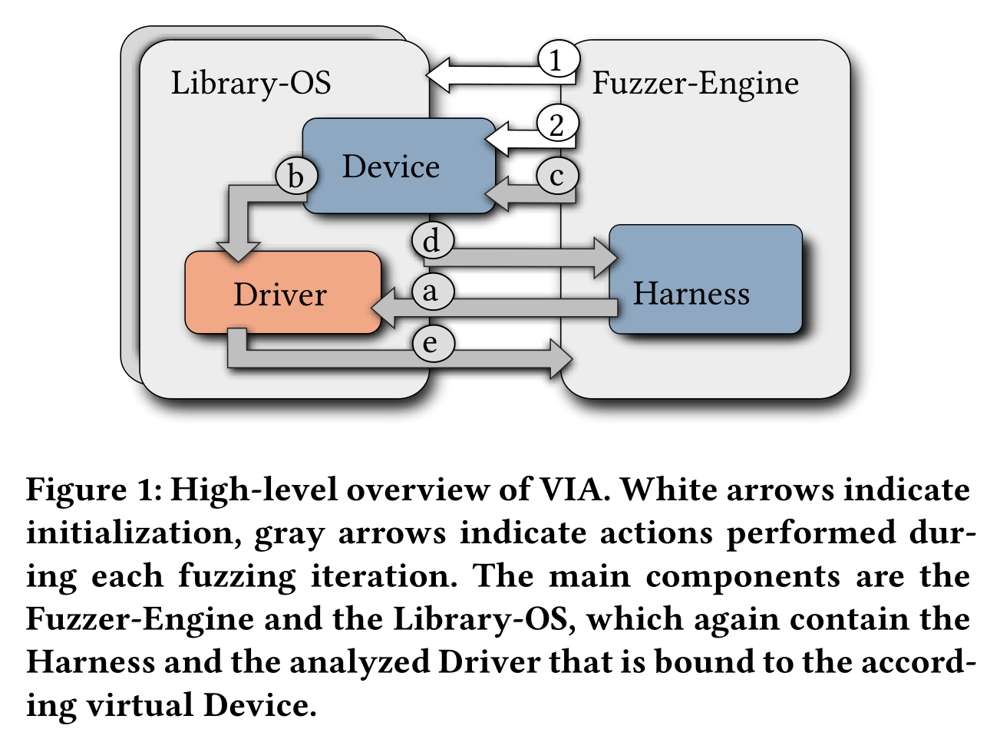
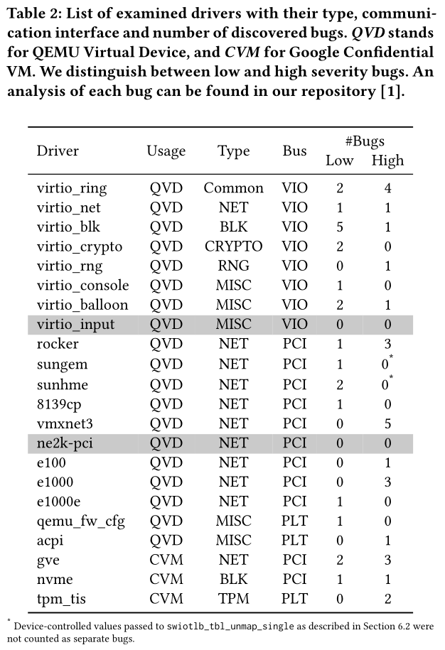
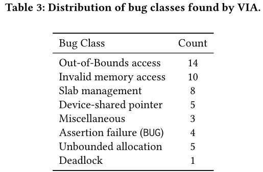
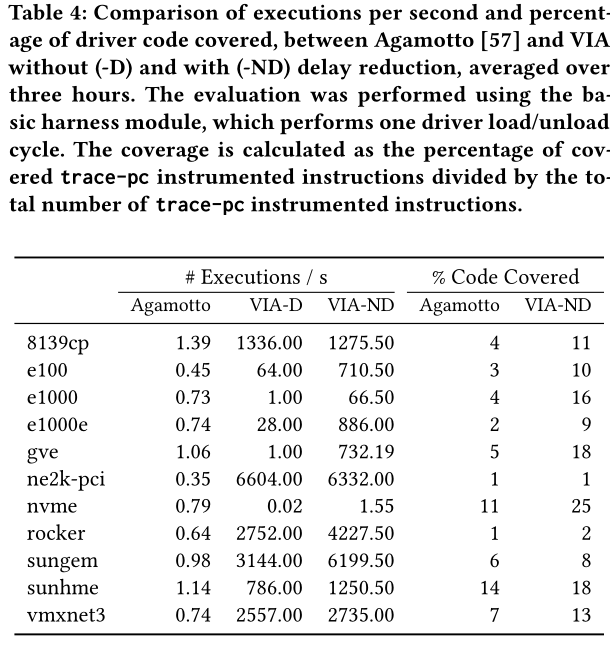

# VIA: Analyzing Device Interfaces of Protected Virtual Machines

[pdf]([ACSAC%202021]%20VIA%20Analyzing%20Device%20Interfaces%20of%20Protected%20Virtual%20Machines.pdf)

AMD SEV 和 Intel TDX 通过内存加密和完整性保护确保虚拟机免受高特权级系统软件的攻击。本文对虚拟设备接口进行分析，讨论了针对受保护 VM 的一系列攻击向量。开发了自动分析工具 VIA，以检测通过虚拟设备接口接收的输入的不恰当 santization（检查、清理和过滤）。VIA 有三方面改进：支持虚拟化相关总线、支持高效 DMA 和性能。VIA 基于 Linux 内核和 libfuzzer，对驱动和设备之间的 MMIO、PIO 和 DMA 进行 fuzzing。与现有方法相比，提升性能。发现了 Linux 驱动程序的多个漏洞。同时演示了基于发现的漏洞的三种示例攻击，恶意的 hypervisor 能够在 SEV-ES VM 中破坏内存、获取代码执行，理论上适用于 SEV-SNP 和 TDX。

## Introduction

之前研究集中于 SEV 设计的安全缺陷，很少有分析新型威胁模型下虚拟机软件。具体来说，HV 不可信后，guest 驱动与 HV 控制的设备通信存在安全风险。与针对 host 的外设攻击相比，验证对受保护 VM 更关键，因为恶意 HV 对虚拟机具有细粒度控制，如可以在任意时间点拦截 VM 执行，监视各种反馈信道以推断 VM 执行状态。

驱动存在大量对 HV 所控制输入的不充分验证，本文设计了 VIA 从庞大的代码库中快速识别缺失的输入验证。现有的设备接口动态分析工具需要专用硬件或设备实现，且只针对有限的驱动功能子集。现有的独立于设备的方法针对 USB 和 PCI 接口的有限子集，没有一种独立于设备的方法针对复杂的设备驱动程序的 DMA 接口。VIA 支持 VirtIO、Platform 和 PCI 设备接口，包括 DMA。

!!! info

    Platform device 相关内容详见 [platform_device](../../linux_kernel/../linux_kernel/platform_device.md)

除了有限的总线支持，之前的方法还需要启动完整的 VM，频繁的切换和中断注入都会引入延迟。VIA 将 fuzzing 和 Linux 内核移到用户空间程序中，消除对完整 VM 设置的需求。通过对 Linux 内核环境优化进一步提高吞吐量，减少驱动程序代码冗余延迟。为将 fuzzing 数据注入到虚拟设备接口，VIA 采用了进程间 I/O 拦截，避免了开销较高的 VM Exit 或 page fault 方法。VIA 还结合了目标驱动状态信息，通过针对性地中断注入有效地指导分析。

使用 VIA 分析了 22 个设备驱动，找到 50 个缺少输入验证的例子，提交了多个虚拟设备驱动接口的 patch。为了强调缺失验证的严重性，详细介绍了三个恶意 HV 在 VM 中执行任意代码或破坏受保护内存的例子。同时将 VIA 与最先进的 PCI 设备 fuzzer Agamotto 比较。VIA 平均提升了吞吐量 2706 倍，驱动代码覆盖率提升了 2.26 倍。

本文贡献：

- 分析虚拟设备接口层的攻击向量。
- 将找到的漏洞分类，描述了三个代码执行和破坏内存的 PoC。
- 实现了动态分析工具 VIA，检测对 HV 控制的数据的缺失验证。VIA 利用一个用户空间 fuzzer，改进的总线支持和性能。三个优化：进程内 I/O 拦截、降低延迟、针对性中断注入。

## Background

### Device Virtualization

设备虚拟化由 HV 提供，VM 通过遍历已知的总线地址，读 HV 提供的标识符和配置信息，然后初始化相关的设备驱动。设备驱动通过 MMIO 或 PIO 对设备进行编程。

MMIO 和 PIO 用于发送命令并接收设备配置信息，而大型消息的通信通过 DMA 完成。驱动负责分配物理内存并将地址提供给设备，当设备决定向 VM 提供数据时，将其复制到 DMA buffer，然后通过中断通知驱动数据可用。

TDX 或 SEV VM 使用虚拟设备需要修改 guest OS，因为 HV 无法读取 guest 私有内存。内核初始化阶段，guest 调整 DMA 和 MMIO API，使用共享内存进行通信。虚拟设备和驱动共享频繁访问的通信结构，如描述符和环形队列。使用 swiotlb 分配和管理大型连续共享内存。当驱动使用 streaming DMA API 映射缓冲区且没有一致性要求（如 dma_map_single）时，内部实现会返回 swiotlb 中一段缓冲区的物理地址。驱动使用 DMA API 同步内存时（如 dma_unmap_single），swiotlb 将共享内存复制到驱动的对应私有缓冲区中。

## Threat Model

恶意攻击者控制 HV 并试图危害受保护的 VM，恶意攻击者可能通过系统漏洞获取 HV 权限或可能是恶意的管理员。HV 无能直接读取或修改 VM 状态，因为 VM 的内存和寄存器值已被加密。VM 运行最新的 Linux。

HV 通过提供虚拟设备来管理 VM 对硬件设备的访问。虚拟设备可以基于 VirtIO 或自定义接口（guest OS 必须支持）。HV 可以在 VM 启动期间配置任意设备，并在 VM 的生命周期内连接或分离任意可热插拔设备。

恶意 HV 控制虚拟设备，能修改与 VM 与设备共享的任何数据结构，如描述符缓冲区或环形队列。HV 可以拦截 MMIO 和 PIO 操作，并为 MMIO 和 IN 指令提供任何值。HV 还能拦截和修改真实硬件设备和 VM 驱动之间的任何通信。例如，HV 可以修改通过 DMA 接口发送到 VM 的网络数据包内容。另外，HV 还能向 VM 注入中断，这是虚拟设备向 guest OS 发生通知所必需的。

## Design

VIA 是第一个检测虚拟设备提供给 Linux 设备驱动的数据的验证缺失的方法。针对 VirIO、PCI 和平台接口，扩展了硬件接口分析范围。此外，还解决了性能问题。

动态分析框架包含一个反馈驱动、进程内的用户空间 fuzzer，用于突变从虚拟设备发送给设备驱动的数据。

VIA 提供不同复杂度的设备模拟将随机数据转发到设备驱动的 HV 接口。驱动作为共享库加载到提供 Linux 内核环境的用户空间程序中。VIA 扩展并修改了 Linux 内核环境以支持分析。通过降低延迟、针对性中断注入和进程内 I/O 拦截来显著提升 fuzzing 吞吐量。VIA 扩展了 fuzzer 的输入生成机制，以支持分析并避免驱动程序中的死锁。

### 系统概述

下图为系统结构概述，主要由两个组件 fuzzer 和 LibOS 组成。fuzzer 引擎用于设置、监控和控制测试执行，进行代码覆盖率反馈，并提供目标驱动程序所需的突变数据。此外，提供一个 harness（用于弥合 fuzzer 期望的输入和应用程序实际输入之间的差距，将来自 fuzzer 输入传送到 fuzzing 目标，使目标可以像正常交互一样处理输入）用于驱动模拟设备和驱动程序之间的交互。LibOS 包含 Linux 内核代码以及为驱动提供突变数据的 PCI、VirtIO 和平台设备的软件实现。

首先，fuzzer 引擎启动一个或多个 LibOS 示例，然后根据所选设备类型配置每个实例的软件设备。

每次 fuzzing 迭代中，fuzzer 执行由 harness 提供的指令。Harness 通过标准 Linux 系统调用接口与 LibOS 交互，其作用是发出一组系统调用，以初始化驱动、触发驱动与设备之间的交互以及取消初始化驱动。当驱动从设备请求数据时，设备将转发来自 fuzzer 的突变数据或根据其内部仿真逻辑处理请求。为了快速解锁，当驱动程序线程等待资源时，LibOS 会通知 harness，然后 harness 可以选择触发中断以解锁。每次执行结束后，驱动程序生成的覆盖率会转发到 fuzzer，以指导未来的突变。

### 设备模拟

VIA 模拟虚拟设备以便与设备驱动的 HV 接口通信。Fuzzer 根据分析人员提供的配置文件配置设备。根据设备类型，使用不同方法模拟设备：直通和仿真。

两种方法均基于配置文件执行设备专门初始化，配置将驱动与设备相匹配的标识符。平台设备通过名称匹配，PCI 和 VirtIO 设备通过供应商和设备 ID 匹配。VIA 在此阶段配置设备资源，即中断以及由设备提供给驱动的 MMIO 和 PIO 区域。

VIA 对 PCI 和平台设备使用直通，初始配置后，模拟设备仅将突变数据转发到驱动，而忽略从驱动到设备的数据。中断由 harness 触发。

仿真模式允许 VIA 针对更高层级的驱动代码。遵循接口规范，如 VirtIO 标准，以便在驱动和设备之间建立通信信道。仿真设备处理从驱动到设备的数据，并根据设备内部状态自动触发中断。VIA 可以在直通和仿真模式下模拟 VirtIO 设备，直通针对 VirtIO 驱动栈的底层，如 virtio-ring 或 virtio-mmio，而仿真可以达到更高级代码，包括 virtio-net 和 virtio-blk。VIA 提供同一的 VirtIO 设备 stub 以支持任意的 VirtIO 驱动。

### 针对性中断注入

大多数驱动和设备的交互是通过执行驱动中的中断处理程序启动的。因此，harness 注入中断以触发模拟设备和驱动之间的交互。然而，随机注入中断会降低性能和覆盖率稳定性。VIA 提供回调函数来精确地在驱动程序的执行线程等待来自设备的数据进入阻塞状态时注入中断来解决此问题。

### 降低延迟

在初始化和外设输入处理阶段，驱动的执行会延长，这是因为驱动假定与其交互的时真实硬件设备。通过对驱动代码的手动分析，发现这些延迟对于基于软件的设备实现来说大多是多余的。因此，VIA 修改了常见的内核家口函数，以通用方式消除延迟，不影响驱动性能。在这种延迟期间，处理器不一定是空闲的，Linux 内核可能会调度其他负载。

### I/O 拦截

为了将数据注入到硬件接口，需要拦截驱动和设备的通信。MMIO 和 PIO 区域是通过定义的内核接口访问的，VIA 扩展包含该接口的函数，以便在 fuzzing 迭代期间注入测试数据。

对于 DMA，需要区分一致性和流式 DMA。后者会在与设备交互前后同步一次；因此，整个 DMA 缓冲区在 CPU 同步点由 fuzzer 填充。而一致性 DMA 不需要 guest CPU 的显式同步就可以连续访问。因此，每次访问都应该提供新的值。但是内核不提供 hook 此类访问的接口。VIA 利用地址检测器插桩以截获对一致性 DMA 内存的访问。

...

### 输入生成

每个 fuzzer 生成的输入都被视为从设备到驱动的内存传输的序列化序列。每次驱动向设备请求数据时，VIA 都会从测试输入中消耗相应数量的字节。如果生成的输入用尽，则使用伪随机数据扩展，确保驱动接收到不同的值，避免无限循环和死锁。

### 避免假阳性

为避免在漏洞发现过程中出现误报，VIA 修改了 Linux 内核环境。模仿 Linux swiotlb 实现功能，VIA 跟踪映射的 DMA 内存区域，并在取消映射操作之前检查这些区域是否已映射。否则可能损坏虚拟机内存。

此外，降低延迟可能导致检测到无法利用的漏洞，但 HV 可以细粒度地控制 VM 的执行和计时器。因此，HV 可以调整 VM 内的调度和延迟，以帮助利用错误。

### 扩展 VIA

VIA 的模块化设计允许对各种不同设备驱动进行自动分析。虽然侧重于 PCI、VirtIO 和平台设备，但易于扩展为支持其他设备类型。

## Evaluation

使用 VIA 分析了 22 中设备驱动，找到了 50 个新漏洞。

性能分析，与最先进的基于 VM 的方法比较。每秒执行数量提升几千倍，覆盖率提升 2.26 倍。

## Related Work

### 硬件接口分析

主要集中于 USB 接口分析，对 PCI 和其他硬件总线的支持优先。通用方法为符号执行或需要专用硬件。

- Syzkaller-USB：修改 Linux 内核，通过系统调用注入 USB 数据。
- USBFuzz、Spenneberg：避免修改目标 OS，使用虚拟设备转发输入
- Agamotto：使用虚拟 PCI 设备实现类似方法

性能都不够，平均每次执行都要几秒。且不能直接用于 DMA 接口，缺乏对 VirtIO 和平台设备等的支持。

- Symdrive、POTUS、DDT：利用 SE 的符号执行，系统地探索驱动状态。
- SADA：静态方法检测与轻量级符号执行相结合。

### 无虚拟化的内核 fuzzing

使用 LKL 提供的用户空间内核环境，使用 fork 快速重置状态。缺乏对目标文件系统实现和硬件接口分析的支持。

## Conclusion

VIA 是第一个在安全虚拟机的恶意 HV 威胁模型下的驱动程序动态分析框架。基于 libfuzzer 和 LKL 的覆盖率驱动进程内用户空间 fuzzer，提升吞吐量。应用于 Linux 上的 22 个驱动，覆盖多种设备类型，发现 50 个新漏洞。