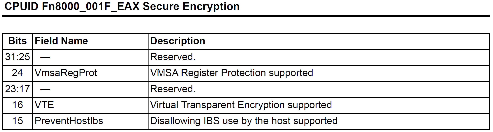
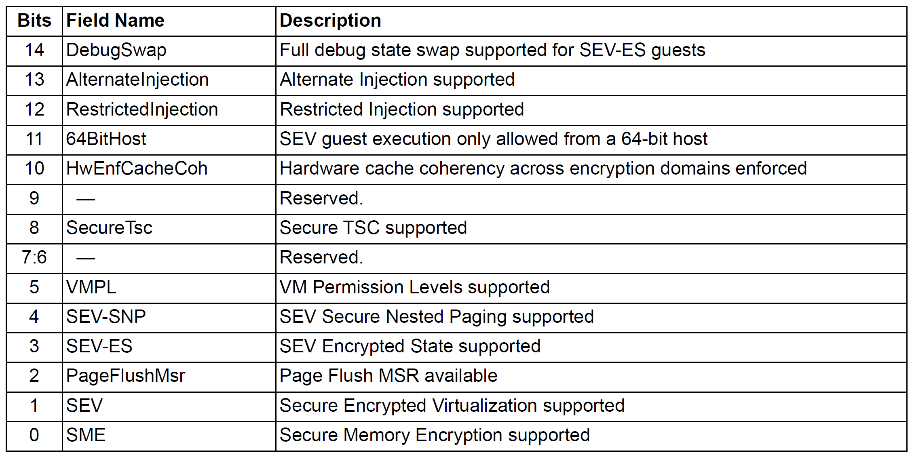
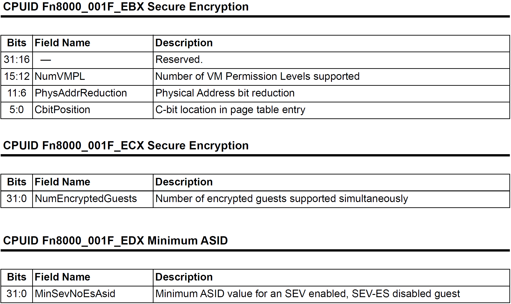
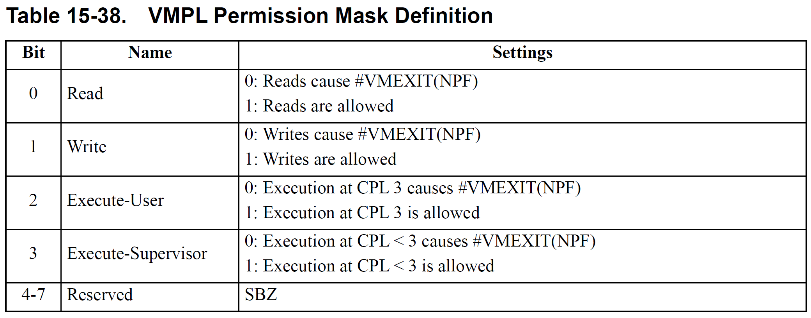

# Virtual Machine Privilege Levels

## 特性支持和启用

### 平台支持

CPUID Fn8000_001F[EAX] bit-4 表示支持 SEV-SNP，bit-5 表示支持 VMPL。

CPUID Fn8000_001F[EBX] bit-[15:12] 表示可用 VMPL 数量。

CPUID Fn8000_001Fh Encrypted Memory Capabilities

### 启用特性

System Configuration Register, SYSCFG MSR C001_0010h 

bit-25 VMPLEn 置位表示开启 VMPL 特性，需要在将 bit-24 SecureNestedPagingEn 置位即开启 SEV-SNP 之前设置 VMPLEn。一旦 SEV-SNP 开启，VMPLEn 无法更改（实际上是整个 SYSCFG MSR 都无法更改）。

VM 启用 SEV-SNP 需要在虚拟机创建时设置 VMSA 中的偏移 3B0h 的 SEV_FEATURES 字段 bit-0。

## APM 15.36.7 VMPLs

Guest VM 通常有多个 vCPU，SEV-SNP 允许 vCPU 运行在不同的 VMPL。在一个 vCPU 中，不同的 VMPL 由唯一的 VMSA 表示，并期望以互斥的方式允许。分配给 VMSA 的 VMPL 由 VMSA 中的 VMPL 字段表示。

VMPL 从 0 开始，VMPL0 是最高特权级。VMPL 字段允许 guest 划分其地址空间，实现特定于 vCPU 的页粒度访问控制。

处理器基于 RMP 表项中的 VMPL 权限掩码限制 guest 内存访问。每个 RMP 表项包含一组权限掩码，每个掩码对应一个 VMPL 等级。访存时，处理器会检查页面的当前 VMPL 权限掩码，以确定是否允许访问。

当 guest 访问违反 VMPL 权限检查，会导致 NPF。

当 hypervisor 使用 RMPUPDATE 将页分配给 guest 时，会为 VMPL0 启用全部权限，并禁用其他所有 VMPL 的权限。VM 可以使用 RMPADJUST 指令将修改数字上更高的 VMPL 的权限。如 VMPL0 vCPU 可以使用 RMPADJUST 将页设置为只读写但不可执行。然而，VMPL0 vCPU 不能更改其自身和 VMPL0 的权限。

另外，RMPADJUST 不能用于授予比当前 VMPL 的权限更大的权限。如 VMPL1 没有写权限，要授予 VMPL2 写权限，会失败。

## APM 15.36.9 Reflect #VC

VMSA 中的 SEV_FEATURES bit-2 ReflectVC 允许将导致 #VC 异常的事件转为 AE，此时 guest VM 会终止，返回 VMEXIT_VC，而 #VC 的错误信息会保存到 VMSA 中的相关字段。

Reflect #VC 特性允许 vCPU 在非初始化的 VMPL 上处理 #VC 事件。如 guest 的一个 vCPU 有两个不同的 VMSA，一个是 VMPL，另一个启用了 ReflectVC 并定义为 VMPL3。当运行在 VMPL3 上的 vCPU 遇到 #VC 条件时，相关信息将保存到 VMSA，并将控制权返回到 hypervisor。之后 hypervisor 可以选择在 VMPL0 上运行 vCPU，该 vCPU 可读取 VMPL3 VMSA 中的退出信息，根据需要与 hypervisor 交互，并将适当的响应数据写回到 VMPL3 VMSA 中，并指示 hypervisor 在 VMPL3 上恢复 vCPU 的执行。

!!! question

    这里提到 VMPL0 的 vCPU 可以读取 VMPL3 VMSA 中的信息，但没说用什么方式。

## APM 15.36.16 Interrupt Injection Restrictions

交替注入模式可用于多 VMPL 架构，高特权级 VMSA 通过访问加密的 VMSA 直接向低特权级 VMSA 注入事件和中断。