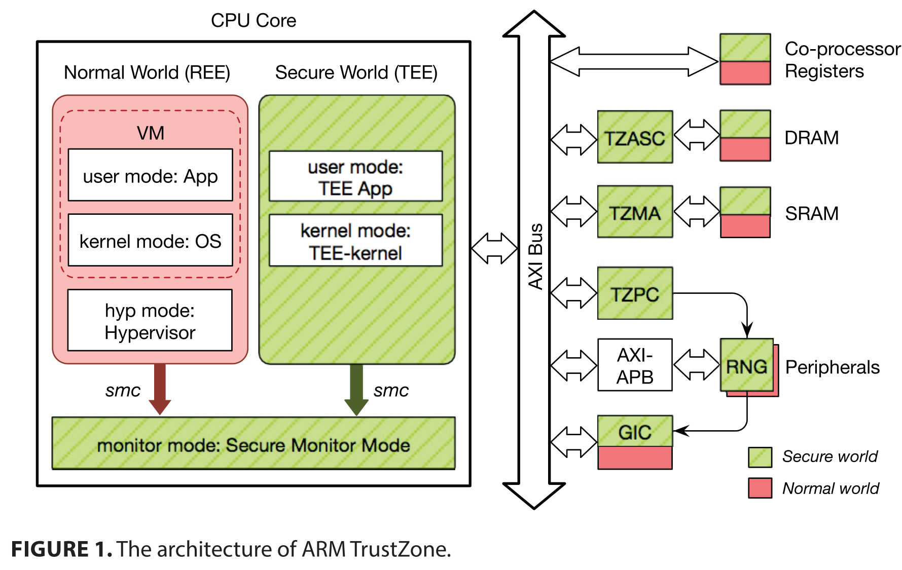
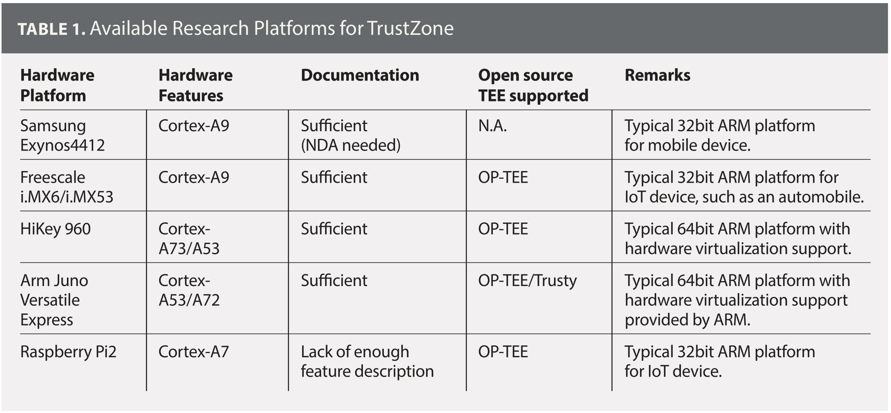

# Research on ARM TrustZone

[pdf]([Mobile%20Platforms%202018]%20Research%20on%20ARM%20TrustZone.pdf)

ARM TrustZone 

TrustZone 将处理器分为 secure world 和 normal world，两边都有自己的用户和内核空间、cache、内存和其他资源。Normal word 无法访问 secure world 资源，而后者可以访问所有资源，基于此，normal world 运行普通的 OS，称为 Rich Execution Environment, REE，而 secure world 运行小型的安全内核。World 之间的切换受一个底层的 secure monitor 严格控制，通过特殊指令 secure monitor call, smc 进行切换。

- 内存划分：将内存划为 normal 和 secure 两部分，支持动态分区。
- 外设划分：将设备和中断划分给两个 world，同样可以动态配置。
- 安全启动：启动时，处理器进入 secure world，从内存加载 TEE 镜像，验签后加载执行。

## TrustZone 研究

- App-Layer：数据保护
  - 最典型的用法就是提供一些固定的功能，生物特征验证、一次性秘密、加密函数、安全存储等。
  - Normal world app 通过 API 调用这些功能。
  - 不能把自定义的逻辑放到 secure world。
  - Trusted Language Runtime：将 .NET 运行时中的部分逻辑放到 TEE。
  - 把 app 划分为 normal 和 secure 两部分，数据驱动的代码划分可能增加攻击面。
  - TrustShadow：直接把 app 放到 TEE，把 syscall 重定向到 REE kernel。
- Framework-Layer：UI 保护
  - 输入和显示设备都可以划分给 TEE，从而保护用户输入和输出的隐私和完整性。
  - Trust-UI：TEE App, TA 可以不经 REE 直接与用户交互。
  - VeriUI：用户仅与运行在 TEE 中的浏览器交互，发送到服务器。
  - TruZ-Droid：拆分 HTTP 和 SSL 协议，减小 TCB。
  - SchrodinText：保护输出，将文本渲染和显示解耦，REE 渲染而不访问文本数据。
  - AdAttester：保护按钮，防止广告欺诈，为广告显示和点击生成证明发给服务器。
  - VButton：支持任何按下操作的证明
- OS-Layer：kernel 保护
  - SPROBES：保护 REE kernel 完整性，对 REE kernel 插桩，TEE 中运行 monitor。
  - TZ-RKP：删除 REE kernel 中的所有特权指令，将功能放在 TEE 中。
  - PrivateZone：在 TEE 中控制 MMU，允许开发者在 normal world 创建自己的隔离环境 PrEE。
- Hardware-Layer：外设保护
  - 在 TEE 中禁用麦克风等设备，通过受保护的 UI 由本地用户设置策略或通过 TEE 与远程服务器建立安全连接通信。
  - 与 GPS 等传感器结合，保护从传感器读取的值。传感器验证和封装，将可信传感器暴露与移动应用和云服务中。
  - fTPM 使用 TEE 实现 TPM 2.0 接口，使手机通过纯软件支持 TPM，比硬件 TPM 芯片性能更好。
- Other Platform：IoT、Drone、Cloud
  - 还有其他智能设备，如监控摄像头、可穿戴设备等，这些设备都使用了大量的传感器，其中相机和麦克风等这种收集的敏感信息需要保护。
  - Ditio 在 TEE 中记录传感器活动日志，可用于合规审查。
  - PROTC 利用无人机上的 TEE 保护外设，在 TEE 中部署 monitor 确保只有验证后的应用才能访问某些外设。
  - ARM 服务器中，多个 VM 只能共用一个 TEE。vTZ 通过虚拟化 TrustZone 为每个 VM 提供一个 TEE。

## Challenges

### TEE 漏洞

TEE 自身存在缺陷，TEE OS 和 TA 都有漏洞。攻击者获取存储在 TEE 安全存储中的数据，甚至利用 TEE 攻击 REE。

加固 TEE：更强的隔离、找漏洞、形式化验证。

强化隔离，解决最小化 TEE 攻击面的问题，验证 REE 发来的请求，一个 app 只允许与一个特定 TA 通信，这样即使 TA 有漏洞，也很难触发，因为只能接受来自一个合法 app 的请求。

另一个 TEE 安全的考量是更新过程，攻击者可能在更新 TEE 镜像时向其中插入恶意逻辑，因此需要验证验证性。同时还要防御降级攻击。

侧信道和物理攻击也会威胁 TEE 中的数据，Sentry 和 CaSE 提出使用 SoC 的内部存储，如内部 SRAM 或 L2 Cache 而不是内存来存储私钥等秘密信息。当数据大于 SoC 内部存储时，通过加密和完整性验证换出到不可信的内存。

### 生态系统：开放还是安全

TEE 生态系统并未开放，所有 TA 都由供应商控制并预装在设备上。

一些 TEE 产品提供 TA 管理，MyTAM 允许 app 请求下载一个自定义 TA 然后部署到 TEE，手机在安装前会验证签名。然而这使 TEE 攻击面变大。

远程认证，制造商在 TEE 内部嵌入私钥，公钥由供应商管理。ARM 建立了开发信任协议（Open Trust Protocol, OTrP）联盟，构建基于证书授权的信任架构，简化 TA 的认证过程。

每个装备了 TEE 的设备都会生成一个设备密钥对和唯一的设备 id，存储在 TEE 安全存储中。设备公钥和 id 上传到后端服务器用于之后的设备认证。

## Platforms for Researching

几乎所有 ARM 应用处理器都支持 TrustZone，但大多数都不能用来研究，因为缺少文档和固件支持，或者受限于安全启动。

https://www.kernel.org/doc/html/latest/staging/tee.html