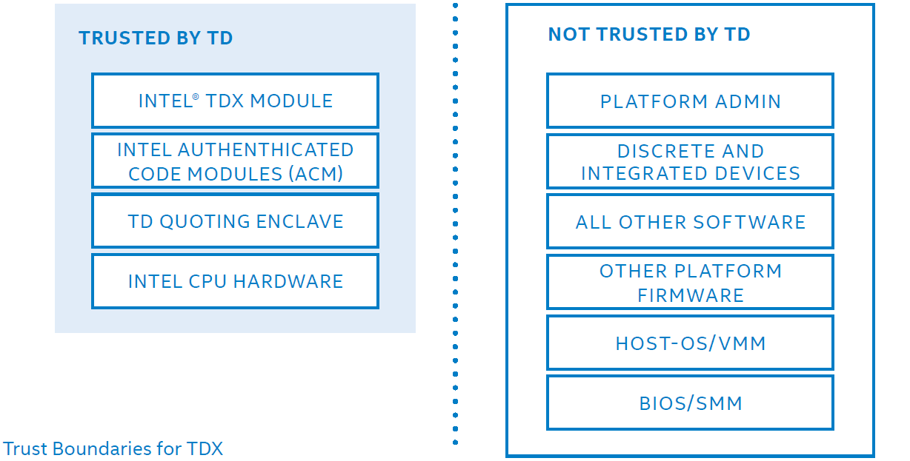
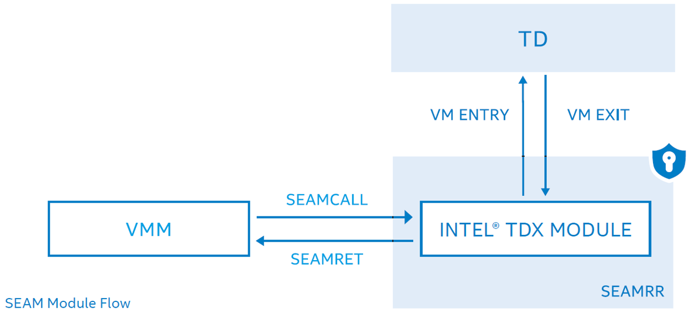
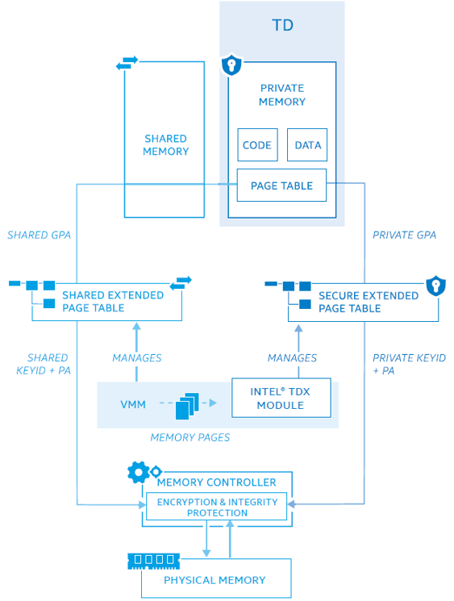
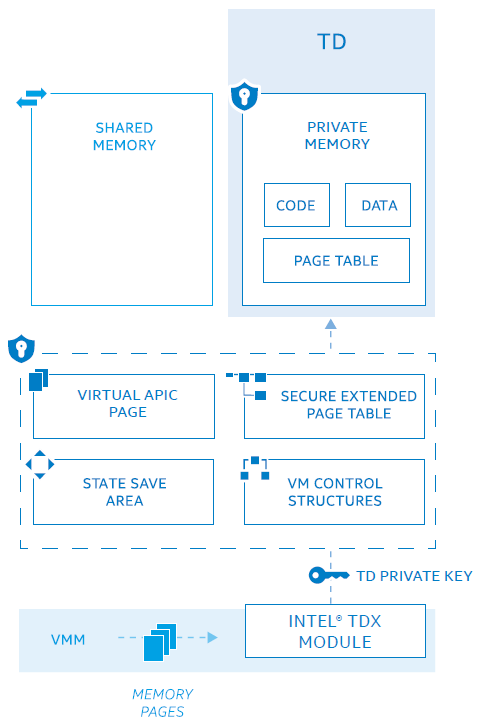
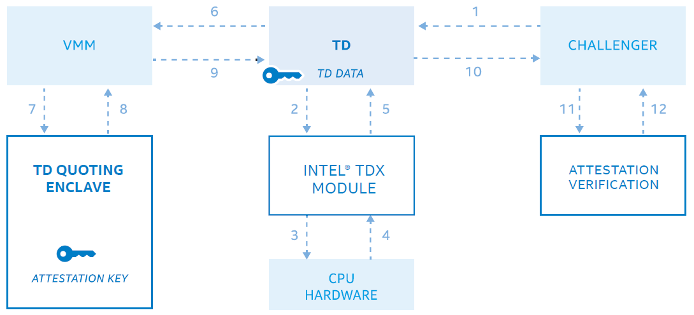
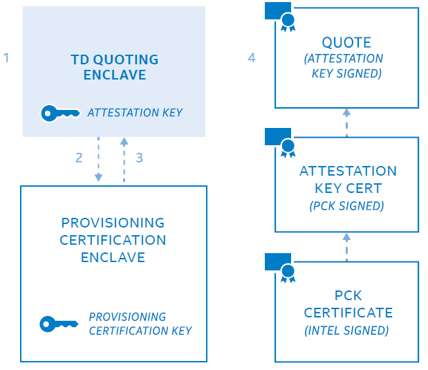

# Intel Trust Domain Extensions

[pdf](./tdx-whitepaper-final9-17.pdf)

Intel TDX 引入新的架构元素来部署称为信任域（Trust Doamin, TD）的硬件隔离虚拟机。Intel TDX 旨在将 VM 与 VMM 和平台上其他非 TD 软件隔离，增强了数据安全控制和知识产权保护，同时帮助云服务提供商管理资源和平台完整性。

## 概述

Intel TDX 方案由 VMX 指令集扩展、多密钥全内存加密（Multi-Key, Total Memory-Encryption, MKTME）和 CPU 认证的软件模块组合构建。

> 后面要看一下 MKTME 的资料。

主要 TD 提供以下功能：

- 内存和 CPU 状态机密性和完整性，保护敏感知识产权和工作负载数据免受大多数软硬件攻击。为工作负载提供工具，将云平台固件、软件、设备和运营商都排除在 TCB 之外，并使用此工具促进对 CPU 指令、安全性、调试和其他技术的安全访问。
- 远程认证使服务的所有者和使用者能在提供数据之前确认负载运行在 Intel TDX 平台的 TD 内部，以数字方式确定依赖的 TCB 版本。

Intel TDX 可以防御几种形式的内存物理访问攻击，如离线、DRAM 分析（如冷启动）和 DRAM 接口的主动攻击，包括捕获、修改、重定位、拼接和别名内存。不当与通过物理攻击进行的内存重放。VMM 仍然是平台的资源管理者，Intel TDX 无法保护来自 VMM 的 DoS 攻击。

Intel 引入安全仲裁模式（Secure-Arbitration Mode, SEAM）执行 Intel 提供的、经过数字签名但未加密的安全服务模块。Intel TDX 模块位于由 SEAM-range 寄存器（SEAMRR）指定的保留内存空间中，CPU 仅允许访问 SEAM 模式的软件访问这段内容，其他所有软件和 DMA 都无法访问。SEAM 对其他受保护的区域如 SMM 和 SGX 保护的内存没有访问权限。

SEAM 内存区域用具有临时 128 位密钥的 AES 和基于 SHA-3 的校验码提供机密性和完整性保护。使用 SEAM 加载程序（SEAMLDR）验证 TDX 模块签名并将加载到 SEAM 内存，SEAMLDR 由 Intel TXT 认证。模块的度量和安全版本号都由 SEAMLDR 保存到硬件度量寄存器，然后加载到 SEAM 内存以相应 VMM 调用 SEAMLDR 来加载模块（不具有持久性）。

VMM 可以使用 SEAMCALL 指令将 CPU 置于 SEAM-VMX-root 模式后调用 TDX 模块，模块提供了创建、删除和调度 TD 执行的接口，充当可信媒介，帮助 TD 实施安全策略、操作和必要的缓解措施。创建 TD 时，由 VMM 为 TD 代码、数据和相关元数据（VMCS 和 TD 的状态保存区）分配内存页。

Intel TDX 模块有助于确保 TD 的执行控制不允许 VMM 或其他不可信实体拦截 TD 对其资源的访问，如控制寄存器、MSR、PMU、TSC 等。TDX 模块为 TD 实施安全策略，如在切换 TD 时使用间接分支预测屏障，防止 TD 的分支预测受先前执行 TD 的影响。

如果 TD 要使用调试和性能监控功能，需要在创建时授权，否职责会被禁用，这些属性会包含在 TD 的验证报告中。Intel TDX 允许 VMM 限制提供给 TD 的功能，而 TDX 可以限制 VMM 隐藏或允许 TD 使用功能的能力。如果 VMM 允许 TD 使用某个功能，TDX 会防止 VMM 在 TD 访问时修改 CPUID、功能 MSR 和控制寄存器等指令提供的信息。因此 TD 能够可靠地使用这些硬件指令，无需修改 OS。

Intel TDX 要控制 TD 的执行，让特定的指令（如 IN/OUT、HLT、RD/WRMSR 等）执行时触发虚拟化异常（\#VE），由 TD OS 以安全的方式为软件模拟这些指令。在 SEAM-VMX-non-root 模式执行的某些指令或事件会触发 VM Exit 进入 SEAM-VMX-root 模式。TD 可以使用 TDCALL指令触发 VM Exit 到模块调用服务。陷入后模块将 CPU 寄存器状态保存到为该 TD 分配的状态保存区域，在将控制给 VMM 之前清理寄存器值，防止状态泄露，恢复到 TD 时再从保存区域恢复状态。

SEAMREPORT 指令可以帮助创建证据结构（报告），以使用 MAC 以加密形式绑定到硬件平台，报告结构有助于后续生成远程证明引用。SEAMRET 指令将执行控制权返回到 VMM。

Intel TDX 为 TD 提供了以下功能：

- 内存机密性和完整性
- 地址转换完整性
- CPU 状态机密性和完整性
- 安全中断和异常传递
- 远程认证

### 内存机密性和完整性

#### 加密

Intel TDX 使用 MKTME 引擎加密内存，对每个缓存行使用基于 SHA-3 的 28 位 MAC 以及 AES-XTS 128 位加密。MAC 中有一位是所有权标签（TD-bit），与每个缓存行相关联，以识别此行是否与分配给 TD 的内存页相关联。SHA-3 的 256 位被截断位 28 位用于存储和验证。

MKTME 的每个密钥都对应一个 KeyID，TDX 模块可以使用 PCONFIG 指令将每个 ID 对应的 CPU 生成、唯一且临时的密钥编程到 MKTME 中，无法被软件或 SoC 外部接口访问。

#### KeyID 共享

MKTME 支持两组 KeyID：私有和共享，PCONFIG 仅允许从 SEAM 模式（即通过 TDX 模块）调用使用密钥对私有 KeyID 编程。

创建 TD 时，TDX 模块要给每个 TD 分配一个唯一的私有 KeyID。CPU 禁止 TDX 模块和 TD 以外的软件使用私有 KeyID 访存。在 SEAM 模式之外尝试通过软件访问私有 KeyID 会触发 page fault，设备使用私有 KeyID 进行 DMA 也会被中断。

#### 使用私有 KeyID 内存加密

与内存行关联的 TD-bit 用于检测使用共享 KeyID 读取私有 KeyID 加密内存以获取密文的软件或设备，对此，MKTME 返回一个固定模式以防止密文分析。

由 MAC 提供的完整性保护确保 TD 读私有内存是获取上次写入的数据。如果违反了内存完整性，TD 对损坏内存的后续访问会导致 MAC 验证失败，会导致 TD 终止，但不会影响其他 TD 或平台软件。TD 私有内存上的密码学机密性和完整性可以防御部分物理攻击，如冷启动和简单的损坏攻击，但无法检测和保护更复杂的攻击，如物理方式的重放内存。

### 地址转换完整性

TD 要访问两类内存，即私有和共享内存。TDX 使用唯一的临时密钥提供机密性和完整性保护。共享内存则用于与外部通信，执行网络访问、存储服务、调用 HV 服务等 I/O 操作。

GPA 的最高位作为共享标志位用来指定是否将此 GPA 映射到私有内存。TD 把它的所有私有代码和数据都用私有 GPA 映射到私有内存。分配给 TD 的私有密钥为私有内存访问提供加密和完整性保护。而所有共享内存访问都使用 HV 管理的共享密钥。

TDX 为 TD 实现了两个 EPT，一个安全 EPT 用于私有 GPA 到 PA 的转换，一个共享 EPT 提供共享 EPT 到 PA 的转换。

TDX 为 VMM 提供安全 EPT 管理功能，用以添加或删除映射，并实施安全策略保证内存布局完整性。构建安全 EPT 内存使用每个 TD 唯一的密钥进行加密和完整性保护。

CPU 禁止 TD 将页表和代码放在共享内存中，从共享内存的 fetch 和页表访问会触发 page fault。

TDX 模块维护物理地址元数据表（Physical Address Metadata Table, PAMT），保证映射到一个 TD 的安全 EPT 中的页不会映射到其他 TD 的安全 EPT。PAMT 还用于保证一个物理页只对应安全 EPT 中的一个 GPA，并向 VMM 提供向安全 EPT 中添加 4k、2M 或 1G 转换的功能。模块会跟踪 PAMT 中的页大小和页类型，为了跟踪安全 EPT 操作的正确性以及页面从安全 EPT 删除时刷新 TLB 条目。PAMT 确保分配给 TD 的所有内存在首次访问之前都初始化为已知状态。

地址转换的结果会缓存到 TLB，TLB 通过关联标签识别 TD。安全 EPT 支持大页转换。

### CPU 状态机密性和完整性

创建 TD 时，TDX 模块需要 VMM 为 VMCS、TD 状态保存区分配内存。模块使用页分配跟踪器保证这些页不被同时分配给其他 TD，然后使用分配给 TD 的密钥初始化和配置这些结构，为 TD CPU 状态提供加密机密性和完整性保护。

### 安全中断和异常传递

使用 VMX-APIC 虚拟化和虚拟中断架构向 TD 发送中断和异常，APIC 虚拟化提供 APIC 寄存器的 CPU 模拟，跟踪虚拟 APIC 状态，提供虚拟中断。CPU 在 VMX-non-root 模式完成以上操作，而无需从 TD 退出，然后将中断传到 TD，避免修改 TD OS。CPU 使用虚拟 APIC 页和 TD 的 VMCS 字段跟踪虚拟 APIC 的状态，这些在创建 TD 时会使用 TD 私有密钥初始化。

VMX 后置中断处理架构允许 VMM 或设备通过 CPU 硬件响应通知中断处理的后置中断描述符将虚拟中断直接传递给 TD。后置中断描述符中的虚拟中断通过 APIC 传给 TD，阻止异常向量作为虚拟终端传递给 TD。

TD 中断虚拟化架构可以在不违反 TD 假设（如中断优先级和屏蔽）的情况下将中断传递到 TD。VMX 禁止将异常注入到 TD，TDX 模块向 VMM 提供了将虚拟的、不可屏蔽的中断传递到 TD 而不违反 x86 NMI 架构的功能。

> 中断虚拟化

### 远程证明

远程证明可以帮助远程提供商（依赖方）确认软件在 TD 内部、真正的 Intel TDX 系统和给定的安全级别（TCB 版本）上运行。认证结果包括：

- 与 TD 自身相关的数据：由 TD 中软件在请求认证时提供，可能包括与依赖方通信的公钥。
- TDX 模块提供的 TD 度量：创建 TD 时，TDX 模块初始化 TD 的度量寄存器，VMM 请求模块为 TD 分配页，然后模块将扩展 TD 度量寄存器，添加 TD 初始页的度量值以及关联的元数据。还会为 TD 提供一组运行时可扩展度量寄存器，会通过 TD 中的代码度量运行时额外代码和数据。认证的包括这些所有度量寄存器。
- TDX 模块提供的其他未度量状态的详细信息： 如 TD 属性、所有者身份等不会度量，但是会包含在认证结果中。
- CPU 硬件提供的 TDX TCB 元素的安全版本号：TDX TCB 中的每个元素都分配了一个 SVN，如果 TCB 的所有组件的 SVN 大于或等于阈值，则认为 TCB 是最新的。对于硬件，这些 SVN 统称为 CPU SVN，包括 SEAMLDR SVN 和 TDX 模块的 SVN。

Intel TDX 使用了基于 ECDSA 的非对称认证密钥来表示 TDX-TCB 版本，以便使用以上的信息签名断言（引用）。TDX 要确保如果平台通过更新解决漏洞，依赖方可以验证是否安装更新。更新平台认证以反映更新的过程称为 TCB 恢复。将创建一个新的认证密钥以反映平台认证的更新。新的 TCB 会反映在更换认证密钥后的认证中。

TDX 可以利用 SGX 的 TD 引用安全区（TD-quoting enclave）生成远程认证。CPU 提供一条新指令SEAMREPORT，仅可由 TDX 模块调用，创建一个证据结构，以加密形式绑定到平台硬件，供 TD 引用安全区使用。

SEAMREPORT 将 TD 软件提供的证明信息、TD 度量值以及 TDX 模块提供的附加信息作为输入，生成包含 TCB SVN 在内的报告结构，使用 MAC 进行完整性保护。CPU 提供 EVERIFYREPORT 指令供安全区使用以验证 MAC，确保报告结构是在它执行的相同平台上创建的。

TD 引用安全区使用非对称认证密钥生成引用，流程如下图。TD 收到平台外部的证明请求；TD 向 TDX 模块请求报告，其中包括认证信息和 TD 提供的数据；TDX 调用 SEAMREPORT 指令；CPU 生成报告结构，包括 TD 提供的数据、度量值以及所有 TDX TCB 中元素的 SVN；报告结构交给 TD；TD 请求 VMM 将报告转换为远程认证（引用）；TD 引用安全区使用 EVERIFYREPORT 验证报告 MAC，并使用 TD 的非对称认证密钥签名报告，转换为引用；引用最终返回给外部请求者；请求者使用验证服务进行引用验证。

Intel 构建了一个通用认证基础设施，基于 Intel SGX 数据中心认证源于（Data Center Attestation Primitives, DCAP），帮助认证 TD 引用安全区，证书链基于 Intel 颁发的证书。这个架构基于 Intel 提供的供应认证安全区（Provisioning Certification Enclave, PCE），它作为本地 TD 引用安全区的本地 CA。TD 引用安全区使用首选方法和算法生成自己的认证密钥；然后向 PCE 提供认证公钥；PCE 对请求进行身份验证并发布类似证书的结构，用于标识 TD 引用安全区和认证密钥，然后将此结构用设备和特定 TCB 的签名密钥签名，称为供应认证密钥（PCK）。Intel 为所有平台中的 PCK 发布证书和证书撤销列表，产生从 Intel CA 到引用的完整签名链。

## 总结

Intel TDX 引入新的架构元素以部署称为 TD 的硬件隔离 VM。

- SEAM 模式，其上运行 Intel 提供并签名的安全服务模块，TDX 模块。
- GPA 的最高位作为共享标志位帮助 TD 管理内存。
- 使用安全 EPT 进行私有 GPA 转换，提供地址转换完整性并防止 TD 从共享内存获取代码。使用 TD 私有密钥对私有内存进行加密和完整性保护。
- PAMT 跟踪页分配、页初始化和 TLB 一致性。
- MKTME 引擎使用 AES-128-XTS 提供内存加密，使用 28 位 MAC 和 TD 所有权位提供完整性。
- 远程认证提供 TD 在真正的 Intel TDX 平台上运行和 TCB 版本的证据。
