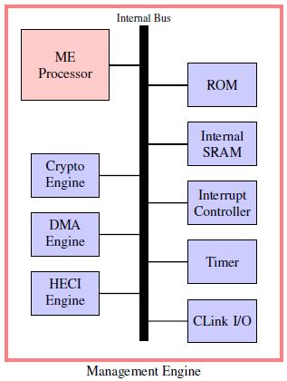
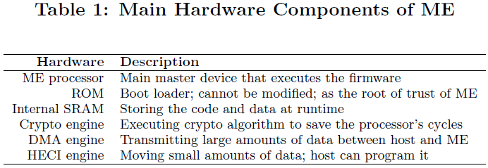
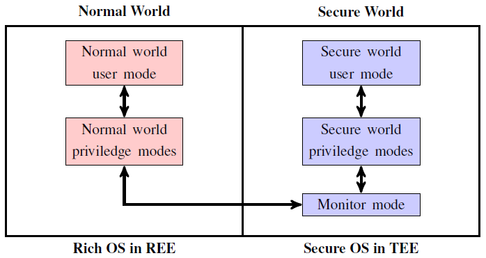
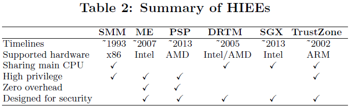

# SoK: Hardware-assisted Isolated Execution Environments for Security

[pdf](./[[HASP%202016]%20SoK%20A%20Study%20of%20Using%20Hardwareassisted%20Isolated%20Execution%20Environments%20for%20Security%20HASP.pdf])

硬件辅助隔离执行环境（Hardware-assisted Isolated Execution Environment, HIEE）被广泛用于构建有效且高效的防御工具。各个厂商推出了多种 HIEE，Intel ME、ARM TrustZone、Intel SGX 等。本文对现有（2016）的 HIEE 进行分析和比较，并探索其防御和攻击使用场景。

隔离代码执行是实现安全性的方法之一。使用虚拟化创建的隔离环境存在局限性：TCB 较大、HV 或固件 Rootkit、性能开销。而隔离执行概念为在被攻击的系统中运行防御工具提供了可信执行环境。HIEE 将  HV 排除在 TCB 之外，减少了切换的性能开销。

六种 HIEE：SMM、DRTM、Intel ME、AMD PSP、ARM TrustZone、Intel SGX。从防御和进攻的角度讨论 HIEE 的安全使用场景。

***注意要区分 HIEE 和 TEE，TEE 并不一定是硬件实现的（虚拟化），HIEE 也不一定是 TEE（SMM）。***

## HIEEs

### System Management Mode, SMM

SMM 是 x86 处理器的一种执行模式，它提供了硬件隔离执行环境，用于实现平台特定的系统控制功能，如电源管理。由 BIOS 初始化。通过将 CPU 的系统管理中断引脚置位触发，支持硬件端口写入和消息信号中断等方式。CPU 将其状态保存到称为系统管理 RAM（SMRAM）的特定内存区域。然后自动执行存储在 SMRAM 中的 SMI 处理程序。SMRAM 不能被其他模式访问。SMI 处理程序由 BIOS 加载到 SMRAM，可以不受限制地访问物理内存，可以运行特权指令（通常被称为 ring -2）。RSM 指令强制 CPU 退出 SMM 恢复到之前的执行模式。

### Intel Management Engine

Intel ME 是集成在 Intel 处理器中的嵌入式处理器，最早在 2007 年提出，当时的主要功能是支持 Intel 主动管理技术（Active Management Technology, AMT），AMT 是第一个运行在 ME 中的应用。后来 Intel 开始使用 ME 作为 TEE 执行安全敏感应用。ME 架构如下图。

ME 的代码和数据存在内部 SRAM 中，同时还会使用系统内存（当作磁盘使用，将内存页从 SRAM 换出到 DRAM），使用的 DRAM 由 BIOS 保留，专供 ME 使用，OS 无法访问。ME 处理器无法访问系统内存，因此要使用 DMA 和 HECI 引擎进行数据传输。

ME 固件存储在 ROM 和 SPI 闪存中，ROM 在 ME 内部，在制造阶段烧录，无法修改。ROM 存储 boot loader 并充当可信根。而固件主体存在 SPI 闪存中，包括自定义 OS 和应用。闪存分多个区域，根据 ME 中实现的应用，闪存固件位于不同的主板。闪存由 OEM 锁定防止恶意修改。然而已经有研究证明可以绕过锁定机制将代码注入到 ME 中。

### AMD Embedded Processor

AMD 平台也有类似的技术，AMD 安全处理器，也叫平台安全处理器（PSP）。AMD SP 是 ARM 处理器，使用 ARM TrustZone 和基于软件的 TEE 支持运行第三方可信程序。AMD SP 可以实现从 BIOS 到 TEE 的安全启动。可信第三方应用可以通过标准 API 使用 TEE。另一个例子是系统管理单元（System Management Unit, SMU），是北桥的组件，负责启动和运行期间的各种系统和电源管理任务。AMD 将北桥集成到 CPU 中，SMU 处理器也是集成到 CPU 内部的嵌入式处理器。

### Dynamic Root of Trust for Measurement, DRTM

可信计算组织（Trust Computing Group, TCG）在 2005 年的 TPM 1.2 规范中引入了动态度量可信根（也称为 late launch 延迟启动？），作为静态可信根的替代品。SRTM 在系统启动时度量，而 DRTM 支持在任何时间点度量。为此，Intel 推出了可信执行技术（Trusted eXecution Technology, TXT），提供了加载执行系统软件（OS 或 HV）的可信方式。使用 SENTER 指令控制安全环境，提供最新加载的动态可信根。TXT 可以被视为 HIEE 来运行安全敏感任务。AMD 平台则是包含在 SVM 中，使用 SKINIT 指令进入安全环境。而 TXT 和 SVM 都会在延期启动操作中引入大量开销。

### Intel Software Guard Extensions

SGX 是集成到 Intel 处理器的指令和内存访问机制。允许i用用实例化受保护的容器，即安全区，可用作 TEE，可以在不信任 BIOS、固件、HV 和 OS 的情况下提供机密性和完整性。

### ARM TrustZone

ARM TrustZone 提供了两个环境（世界）。安全世界（TEE）和普通世界（Rich Execution Environment, REE）。TrustZone 为 CPU、内存和外设在内的硬件提供了安全扩展。

每个处理器模式都有自己的内存访问区域和权限，REE 不能访问 TEE，而 TEE 可以访问 REE。CPU 通过安全配置寄存器（Secure Configuration Register, SCR）的 NS 标志位判断是在 TEE 还是 REE，SCR 只能在 TEE 中修改。TrustZone 使用在 TEE 中运行的监控模式作为世界切换的网关。REE 可以调用安全监控调用（SMC）指令进入监控模式并修改 NS 标志位进入 TEE。

TrustZone 使用内存管理单元机制支持 TEE 和 REE 的虚拟内存空间。两个世界相同的虚拟地址被映射到不同的物理区域。有两种硬件中断 IRQ 和 FIQ，TEE 可以捕获两种，而 REE 只能捕获一个。

## 使用场景

从防御和攻击两个角度讨论使用场景。

- 系统自省：基于 SMM、TrustZone、DRTM 提供完整性保护。
- 内存取证：利用 HIEE 获取 REE 内存并分析。
- 透明恶意软件分析：利用 HIEE 增加调试的透明度。
- 执行敏感负载：构建 TEE，保证机密性和完整性。
- Rootkit 和键盘记录：HIEE 的高特权级和隐蔽性也可用作攻击，Rootkit 等。

## 针对 HIEEs 的攻击

- SMM 攻击：内存回收、缓存投毒、UEFI 引导脚本、BIOS 特定版本的漏洞。
- ME 攻击：绕过硬件保护机制实施 Rootkit，恶意代码注入、hook 固件函数。
- DRTM 攻击：动态可信根的一种实现是 Intel TXT，利用 SMM 或 VT-d 错误配置等方式绕过 Intel TXT。
- SGX 攻击：缓存计时攻击、软件侧信道攻击、性能计数器。
- TrustZone 攻击：绕过隔离机制，用户应用在 TEE 执行任意代码。

## 讨论

使用 HIEE 实现安全性的一个挑战是确保可信的切换路径，基于 HIEE 的系统假定攻击者具有 ring 0 权限，攻击者可以拦截从 REE 到 TEE 的切换路径，并提供假的切换路径来欺骗用户（欺骗攻击），攻击者还可以禁用切换。Intel ME 和 AMD PSP 独立于主 CPU 允许，因此没有切换过程。而其他 HIEE 共享 CPU，需要确保切换到可信环境。

使用 HIEE 实现安全性的方法很大程度上取决于硬件供应商，要假设硬件供应商是值得信赖的，并提供的硬件功能无缺陷。然而没有明确的方法验证假设，硬件供应商不公布实现细节。需要考虑如何可靠地评估硬件安全技术的可信度。
