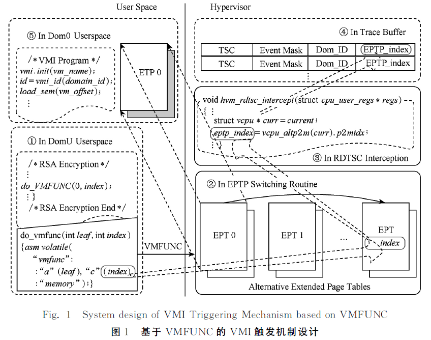
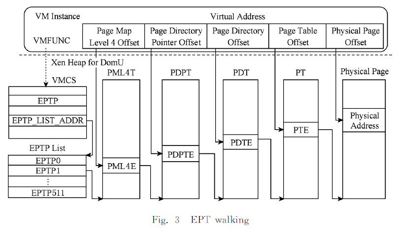
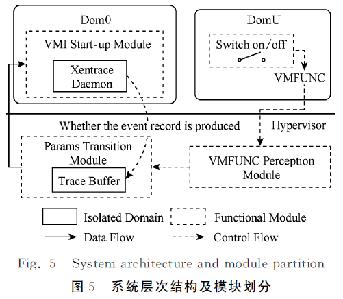

# 基于 VMFUNC 的 VMI 触发机制[^1]

虚拟机自省从外部监控虚拟机内部运行状态，现有的 VMI 存在资源消耗高、运行时间长，为了保证信息移植，虚拟机需要暂停。开销主要是缺乏灵活的跨特权级调用，通常硬件机制仅支持从用户态到内核态的调用 syscall 以及从虚拟机到 Hypervisor 的调用 hypercall。虚拟机要将某些信息传送到 Hypervisor，必须调用 hypercall 或使用 VMREAD 和 VMWRITE 等特殊指令读写 VMCS 字段。而这必将引入频繁的 VM Exits，产生巨大性能开销。

Intel VM-Function 系列指令允许用户在多个地址空间之间跨多个层级的安全、有效和灵活的跨特权级调用。VMFUNC 功能集成在 Intel 的 Haswell 及其后的微体系结构中，使虚拟机能够在 non-root 模式下使用 Hypervisor 的功能。VMFUNC 被设计为通用接口，以支持由不同索引指定的多个功能。当前的 Intel 处理器仅实现了一个名为 EPTP switching 功能，即客户虚拟机能够切换其扩展页表指针，使用一套新的 EPT 页表，且不触发任何 VM Exits。

### 基于 VMFUNC 的 VMI 触发机制

本文借助 CPU 硬件特性 VM-Function 以及 RDTSC 指令模拟，避免 Hypercall 的频繁使用，将调用时产生的 VM Exit 开销降至最低。利用 VMFUNC 的 0 号功能为目标虚拟机（target virtual machine, TVM）切换备用扩展页表，维持了内存的一致性，避免 VMI 程序运行时对虚拟机执行的中断，同时实现了监控的透明化。使用按需触发的理念，通过重载 VMFUNC 指令和 Xentrace 的功能，Hypervisor 向 Dom0 注入虚拟中断，VMI 程序的按需启动实现高效的触发与信息传递机制，最大程序避免 VMI 程序常驻 Dom0 导致的资源消耗。总体设计如下图。

为了向 Hypervisor 传递 TVM 的自省请求，使用 VMFUNC 所切换的 EPTP 索引作为传递信息的载体来通知 Hypervisor。具体来说，当 TVM 在用户态执行 VMFUNC 后，EPTP 值发生变化，Hypervisor 能够在 RDTSC 模拟指令代码中感知 EPTP 索引的变化，进而判断是否开启针对 TVM 的 VMI 程序。在执行 VMI 时，TVM 的原有页表可以被用作 VMI 程序的监控对象。TVM 上的应用程序可在 EPTP switching 之后的新 EPT 上无缝地继续执行，而页表切换只需 $10^{-7}$ 秒级的时间开销，极大降低 VMI 程序对虚拟机运行时的影响。

#### VMFUNC 指令利用

使用 VMFUNC 的 0 号功能 EPTP switching 之前，Hypervisor 需要为 TVM 创建备用的 EPT 页表。通过创建过个相同的 EPT 确保虚拟机内存访问的一致性。VMFUNC 指令以 EAX 作为功能号。每个 EPTP 指向一个四级页目录表，Xen 架构中的 VMFUNC 寻址和 GPA 到 HPA 转换过程（EPT walking）过程如下。

当 TVM 中的应用执行 VMFUNC 指令时，将执行 EPTP 切换例程，新的 EPTP 将被加载到 VMCS 的 EPTP 字段。Hypervisor 通过传入的新 EPTP 值计算当前 EPTP 索引值。通过 ECX 的不同值来区分用户正常的 VMFUNC 请求与 VMI 请求。

利用另一个 CPU 高级硬件特性 #VE（virtual exception），Hypervisor 不必涉及处理 TVM 的内部策略，从而降低 Hypervisor 的复杂性。也可为 TVM 分配更多的 CPU 周期，避免花费过多时间来处理由 EPT violation 导致的 VM Exit。

#### RDTSC 指令模拟

为了保证实时性，本文设计了基于 RDTSC 模拟的 VMFUNC 感知机制。利用 RDTSC 模拟开销极少的特点，同时考虑到 RDTSC 请求的频繁性，将检测 VMFUNC 是否执行的功能插入到 RDTSC 截获与模拟模块中，实现 VMFUNC 的透明感知，并且不引入额外开销。

目前大多数处理器虚拟化功能均提供 RDTSC 和 RDTSCP 指令的条件捕获与模拟，还允许控制虚拟机执行期间读取的 TSC 值，并且在 VMCS 中规定额外的偏移字段。将修改 VMCS 标志位控制 RDTSC 捕获的操作封装成 TVM 的系统调用，就可以控制整个 VMI 触发机制的启动停止。

将 VMFUNC 的使用与 RDTSC 截获结合，利用 RDTSC 的高频使用，保证监控的实时性。开销与 TVM 正常使用 RDTSC 开销一致。

#### VMI 触发

通过重载 Xentrae，重用其事件记录机制和消息传递机制，设计了一个能迅速将 TVM 的 VMI 检测需求连同 VMI 程序所需参数一并传递到 Dom0 的机制。该机制具备通用性，不增加过多代码，对系统性能影响极小，最大程度维护了系统的安全性和可移植性。

Xentrace 是 Xen 自带的一个工具，可以辅助进行测试、调优、底层细节分析。Xen 在关键位置有很多跟踪点，允许开发人员查看系统内部发生的情况。启用跟踪点后，Xen 会将跟踪信息写入每个 CPU 对应的缓冲区，然后在 Dom0 中的 Daemon 程序定期读取。

### VMI-as-a-Service

VMI-as-a-Service 的架构如下图。

三个模块，VMFUNC 感知模块、参数传递模块和 VMI 启动模块。

- VMFUNC 感知模块负责感知 TVM 执行 VMFUNC 的 EPTP switching 和 VMCS 中 EPTP 字段的改变。三个功能：读取和保存当前的 EPTP、RDTSC 截获与模拟、计算 EPTP 与 EPT index 的映射（大于 10 的 -10 就行）并写入到 VMCS。
- 参数传递模块负责将感知模块所获得的参数记录在缓存区，并通知 Dom0 中的 VMI 启动模块读取缓存区。两个功能：通过重载 Xentrace 相关函数接受 VMI 调用参数；在Dom0 协助调用基于 LibVMI 的自省程序，传入 Dom id、EPTP index 作为启动 VMI 的参数。
- VMI 启动模块主要是接受 VMI 调用参数并启动位于 Dom0 的 VMI 程序。

### 参考文献

[^1]:刘维杰,王丽娜,谈诚,徐来.基于VMFUNC的虚拟机自省触发机制[J].计算机研究与发展,2017,54(10):2310-2320.

