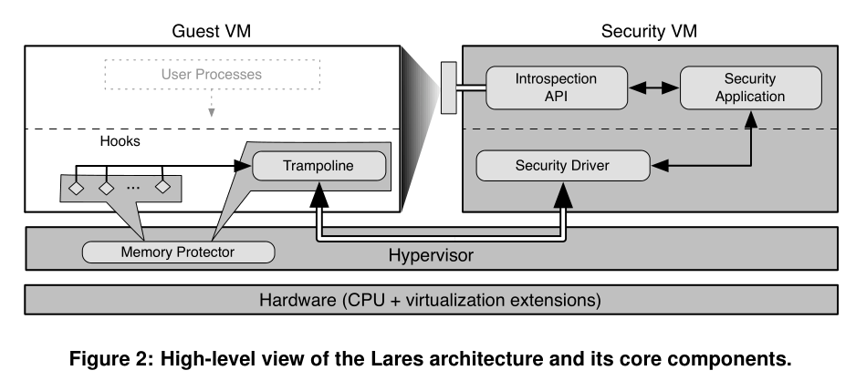
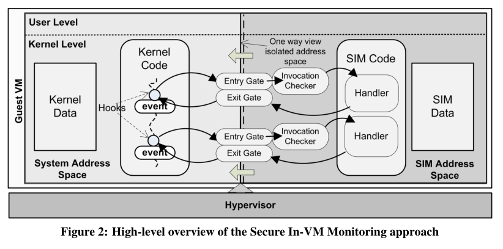
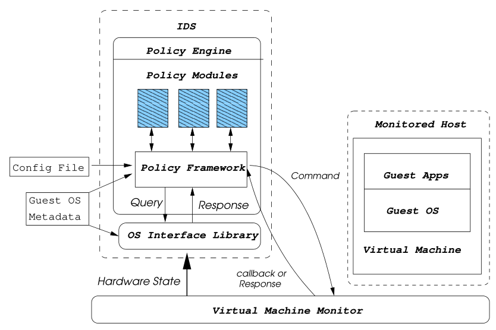

# Virtual Machine Introspection

虚拟机自省是从目标虚拟机外部（Hypervisor 或特权虚拟机中）监控目标虚拟机的运行状态和活动。最初提出是作为 hypervisor 级别的入侵检测系统，结合了基于网络和基于主机的 IDS 的优点。具有隔离性、自省性和干预性，实现安全系统与恶意软件的分离。

但是在从 hypervisor 层监控获得的只是二进制数据，没有高级语义信息，这个问题被称为“语义鸿沟”。底层数据恢复高层语义信息的过程称为语义重构，语义重构所需的软件或硬件知识称为语义知识。按照语义知识获取的位置和方式，可以分为 in-VM、out-of-VM 等方法。

- in-VM 规避了语义鸿沟问题，使用虚拟机内部的 agent 从内部监控 Guest OS，并将信息传递给 hypervisor，再做进一步的安全分析。这种自省继承了基于主机监控的弱点，agent 暴露在恶意软件的攻击之下，缺乏透明性。相关工作有 Lares、SIM 等。

  Lares 架构：

  

  SIM 架构：

  

- out-of-VM，即在完全在虚拟机外部进行监控，需要进行语义重构以弥合语义鸿沟。根据语义知识的来源又主要分为两类：
  - 软件结构知识，从 OS 源码、内核符号表等出获取。相关工作有 Livewire、XenAccess、LibVMI 等，主要思路其实就是读取内存然后根据符号表等先验知识分析内存。
  
    Livewire 架构：
  
    
  
    LibVMI 架构：
  
    
  
  - 硬件架构知识，寄存器值、硬件事件等。根据虚拟机修改 CR3 时触发 VM Exit 陷入 hypervisor 可以检测到进程创建或切换，通过强制触发 VM Exit 监控系统调用。
  
- hybrid，多种技术的混合，强制陷入、数据重定向/影子内存、进程移植、函数调用注入等技术。

现有成型的方案很少，如 [kvm-vmi](https://github.com/KVM-VMI/kvm-vmi) 项目也是在 LibVMI 的基础上，通过修改 KVM 和 QEMU 提供对虚拟机的内存读取，然后结合内核符号表等语义知识，或使用 Volatility 等内存取证框架做深入分析。

要想做到监控虚拟机的指令执行序列，可能需要对 KVM 做修改。

