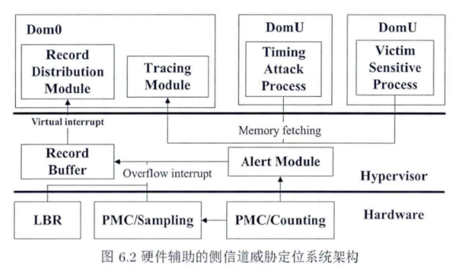

# 基于 VMI 的跨虚拟机侧信道威胁定位[^1]

隐蔽信道通过在两个进程之间建立一个非法通信信道和通过定时调制发送信息，违反了底层系统的安全策略。Chen 等人提出 CC-Hunter[^2] ，能够成功检测不同类型的隐蔽时间信道在不同带宽下的消息模式，从而对隐蔽信道进行定位。Zhang 等人提出 Cloudradar[^3] ，通过结合两种基于行为的检测方法：利用基于签名的检测来确定当前受保护的虚拟机所执行的加密应用；使用基于异常的监视定位和识别基于缓存的侧信道攻击中典型的异常缓存行为。Cloudradar 在检测率上有显著提升，但依然只能用于检测毫秒级基于缓存的侧信道攻击。

云环境跨虚拟机侧信道威胁定位方法匮乏、现有威胁定位技术不精确等挑战，设计了基于硬件特性和虚拟机自省的系统来实时检测和定位云中存在的跨虚拟机侧信道攻击。

动态跟踪共享的处理器硬件行为模式来检测侧信道的存在，计算特定共享硬件上侧信道的可能性。通过软件支持的 VMI，给出测信道威胁的精确位置。

### VMI

VMI 技术可以通过 Hypervisor 来监控虚拟机内部行为。

VMI 利用 VMM 的隔离性、自省性和干预性。隔离性意味着运行在目标虚拟机中的软件不能修改或干预运行在 VMM 或者独立 VM 中的软件。自省性，VMM 能获取 VM 的一切状态：CPU 及寄存器状态、内存、I/O 设备状态等。只需对 VMM 进行小的改动，就可以检测到 VM 中的代码是否试图修改一个特定的寄存器。

理论上，VMI 的实现不应该是以牺牲隔离性为前提实现的，早期的实现由于虚拟机平台没有相关接口的缘故放弃了这一要求，允许虚拟机与监控软件直接进行对接的做法。而坚持隔离性会导致从虚拟机获取的内存二进制数据存在语义鸿沟无法分析的难题。有学者提出基于硬件资源使用状况的虚拟机自省技术，允许 VMM 更好地管理系统资源，也解决了部分地址翻译问题。一些基于 VMM 的服务使用关于在其上运行的操作系统的软件抽象的显式信息来弥补语义鸿沟。部分研究基于软件结构知识还原保证在不失隔离性的情况下还原底层数据，如利用 Linux 内核中的 task\_struct 来还原进程列表。LibVMI 时其中较成熟的方案，开始利用 LibXC 读取内存以支持 Xen，之后加入了 KVM 支持，本质就是基于虚拟化平台相关接口的封装加上了一定的语义还原功能。

综述[^4] 依据面临语义鸿沟问题时是否采用规避策略，分为依赖 VM 自省技术和独立自省技术。在云环境下对客户的透明性需求和硬件虚拟化的趋势下，独立型自省技术更符合要求，根据进行语义重构所需的语义知识的不同，分为基于软件架构知识和基于硬件架构知识的 VMI 技术。前者透明性好，并且所获取内存信息的方位几乎没有限制，缺点是鲁棒性不理想；后者的透明性一样良好，硬件知识的迭代周期长，可移植性好，鲁棒性强，但是可获取的信息量较小。

采用硬件特性与特权域软件如 LibVMI 结合的虚拟机自省方案具备各种自省技术的优点，能够快速定位虚拟机的威胁。

### 基于虚拟机自省的侧信道威胁定位

以 Xen 为例，假设 Hypervisor 可靠，阐述客户机 DomU 用户层侧信道攻击检测与定位方案的整体架构。关注对受害虚拟机或隐蔽信道中通信双方的攻击点的定位。受害 VM 被攻击时，通常是处于运行秘密软件或程序的情况下，在加解密过程中，受攻击的点一般在于控制流大量的直接分支跳转中，这些攻击点均可被处理器的硬件特性 LBR 记录下来。

在 Hypervisor 中设定性能计数器的溢出阈值，使得 DomU 在执行到可疑操作后开启定位流程。然后将 LBR 中获取的分支跳转信息直接发送虚拟中断通知 Dom0 的报警模块，然后将 LBR 信息、虚拟机 ID、时间戳 TSC 连同 CR3 寄存器中存放的页表基址记录到内存缓存区中。然后经由 VM-entry，恢复 DomU 的执行。Dom0 取得记录数据后，首先按虚拟机 ID 对数据进行分离重组，借助 VMI 技术获取 DomU 进程描述结构体中的虚拟内存空间信息，定位共享链接库的映射基址。然后将 LBR 记录的跳转指令地址转换成在对应链接库中的偏移，在内存分析模块中进行逐条比对，从而定位到具体的威胁进程。整个过程不需要修改 DomU 的内核、编译器，也不需要 DomU 主动配合传递数据，对所监控的虚拟机完全透明。整体架构如下图。

本方案可以检测到攻击者，但不能很好地定位攻击者程序。因为存在攻击往往意味着攻击者已经可以控制虚拟机，而攻击者虚拟机的所有用户空间均是恶意的。本系统的目标在于通过检测攻击，获取攻击的特征，定位攻击目标，以辅助攻击溯源。在攻击发生后，可以将受害者虚拟机迁出所在的物理平台从而避免攻击的二次发生。

#### 硬件事件辅助定位

CPU 中集成了一系列辅助调试的硬件支持。

- 性能监控单元（Performance Monitoring Units, PMU）可以对与程序性能密集相关的性能事件计数
- 分支记录器（Last Branch Record, LBR）是一组能记录 CPU 上最近 16/32 条跳转指令源地址和目的地址的循环寄存器栈，LBR 具有基于分支指令类型过滤的机制。

PMU 中包含重要的计数器 HPC（Hardware Performance Counter），它的基本工作模式之一是基于中断的模式。当给定事件的发生超过预定义的阈值或经过了预定义的时间量就会产生中断，因此可以实现基于事件和基于时间的硬件采样。已经有研究人员利用硬件性能计数器来检测安全漏洞，计数器可以揭示程序的执行特性，进一步反应程序的安全状态。性能计数器检测对程序的性能开销可以忽略不计，本系统使用 PMU 进行侧信道攻击检测，使用分支预测寄存器 LBR 进行威胁的进一步定位。

Cache 侧信道攻击的行为往往与正常的内存密集型应用十分类似，因此很难仅使用硬件性能计数器来进行区分。本系统的定位框架存在两个技术挑战：透明性，不要求客户修改其应用；精确性，精确定位不可信虚拟机的异常缓存或内存使用模式。使用性能计数器，结合分支记录 LBR 来实现。首先使用基于特征的检测技术检测受保护虚拟机的敏感应用程序。这些特征明显，不会产生漏报。其次，将检测出的可疑程序的 LBR 信息报告发给位于特权域的定位分析模块。LBR 能够给出地址级别的精确信息，所以结合虚拟机自省技术和内存分析，即可精确定位到发出这些可疑操作的进程。若该进程不属于正常的内存访问，则可认为属于利用缓存或内存进行的侧信道攻击。攻击检测与定位方法能获取精准的事件发生地址，可以排除由异常检测技术带来的误报。

由于性能计数器和 LBR 没有溢出中断机制，直接读取会导致读取的值与攻击实际发生时不同，引入 PMU 中断机制。使用 Linux 的 Perf 工具和开源库 Libpfm。Perf 支持技术和采样模式，HPC 达到预定阈值时会触发溢出非屏蔽中断。计数模式下监视事件（如 Cache miss）的数量，设 $T_{NMI}$ 为采样模式下 NMI 溢出的阈值。

不同硬件时间特征不同，对于内存测信道，检测隐蔽信道的第一步是识别硬件资源争用背后的事件。对缓存侧信道事件来说，需要进行 Cache 振荡模式检测。所谓振荡模式是指为了传输 1 或 0，间谍程序彼此之间交替地创建足够数量的 Cache miss 事件，使得间谍程序可以根据平均访问时间来解密发送的比特。基于缓存的隐蔽信道依赖时间的等待时间来执行调制，这导致木马和间谍环境之间的冲突振荡模式。振荡可以被认为是事件序列中周期性的特性，通过测量事件序列自相关性可以检测到这样的事件。阈值 $T_{NMI}$ 可通过检测 CPU 事件中的 LLC/L1-loads/stores/load-miss/store-miss 来设置。对于内存总线冲突的隐蔽信道来说，通信双方均为攻击者，定位时可寻找虚拟机中定期频繁发生 lock 事件。本章使用关联分析检测算法来检测是否存在循环突发模式的事件序列。

#### 定位信息收集

Hypervisor 监控虚拟机时，需要解决两个问题：

1. 如何区分不同虚拟机的事件。在虚拟化中，VCPU 是解决虚拟机时分复用的重要数据结构，它被分配给每个虚拟机 Dom，作为操作虚拟机当前物理 CPU 的实例。CPU 调度机制使得不同时刻的 VCPU 对应的CPU 是时刻变化的，所以当前 CPU 中类似 LBR 的硬件信息的内容不一定就是当前虚拟机产生的。
2. 当前 Hypervisor 没有提供 LBR 等特殊寄存器的模拟机制，现有基于硬件辅助的攻击检测方法不能直接运用在虚拟化环境。Hypervisor 如何使用真实的硬件信息并将其解释为可用于检测攻击的特征是需要解决的问题。

LBR 中记录的 地址信息非常密集，引入 LBR 作为定位的核心记录模块，如果不停地记录所有跳转，产生信息体量大、冗余度高，影响检测性能。由于攻击者在劫持控制流后要做出进一步恶意的操作和破坏，必将进行关键的系统函数调用。因此此处只记录所关心的跳转信息，保持较高检测有效性同时降低开销。

Intel 提供 64 为的 MBR_LBR_SELECT 寄存器用于设置分支跳转类型过滤，设置过滤用户态的指令。而之前已经设置了性能计数器达到阈值就触发中断，也就跳转到内核态，这样在 LBR 中最多增加 1 条分支记录（跳转到中断处理程序）。

本系统通过将 Hypervisor 进行轻量级扩展来来实现信息分发与传递。

1. 利用处理器中可用的硬件性能计数器收集微体系结构特征
2. 利用现有的虚拟化框架非侵入性地交互以监视 VM 的侧信道攻击事件，尽可能地减少性能损失

### 参考文献

[^1]:刘维杰. 云计算环境下跨虚拟机侧信道的攻击、检测与防御[D].武汉大学,2018.
[^2]:Jie Chen, Guru Venkataramani. CC-Hunter: Uncovering Covert Timing Channels on Shared Processor Hardware. MICRO 2014.
[^3]:Tianwei Zhang, Yinqian Zhang, Ruby B. Lee. CloudRadar: A Real-Time Side-Channel Attack Detection System in Clouds. RAID 2016.

[^4]:李保珲,徐克付,张鹏,郭莉,胡玥,方滨兴.虚拟机自省技术研究与应用进展.软件学报,2016.

