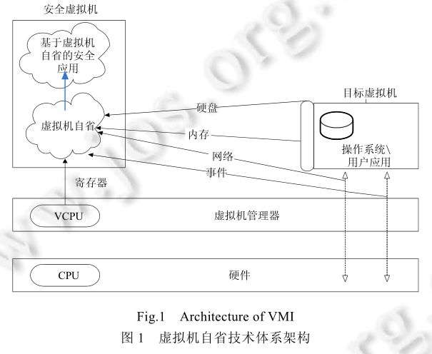
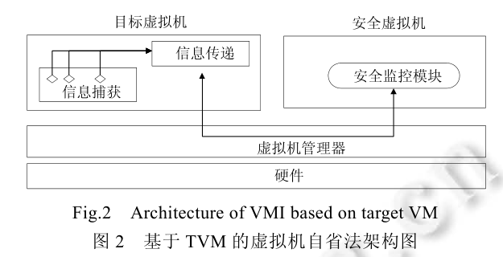
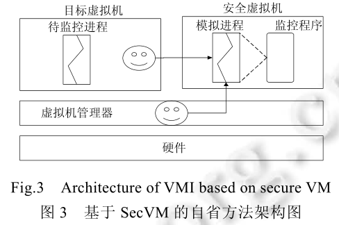
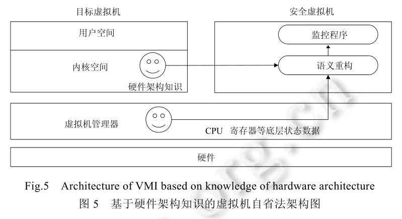
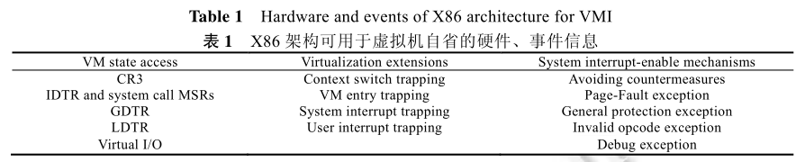
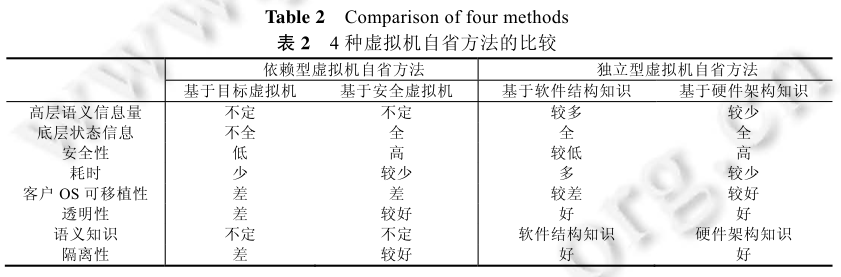
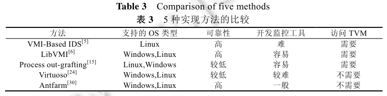

# 虚拟机自省技术研究与应用进展[^1]

 

**Virtual Machine Introspection, VMI**

### 虚拟机自省技术分析

通过在目标虚拟机（target virtual machine, TVM）外部获取 TVM 底层状态（CPU 寄存器、I/O控制器寄存器、内存、大容量存储设备以及虚拟 BIOS 等），可以在安全虚拟机（SecVM）中有效地监控或干预其内部运行状态。

2003 年由 Garginkel[^2] 首次提出，在恶意软件分析、内核完整性检测及云计算安全等领域发挥作用。VMI 具有隔离性、自省性和干预性，实现安全软件与恶意软件的分离。

现有的实现：vmsafe、Volatility、LibVMI

但在 TVM 外部获取的底层状态数据是以二进制形式呈现的，与高层信息存在语义鸿沟，由二进制形式的底层状态数据转换为高层信息的过程即为语义重构,在将底层状态数据转换为相应高层语义信息时所借助的软硬件知识为语义知识。下面从语义重构方式、面临问题及相应解决方案等方面对 VMI 技术进行分类总结和比较。

语义重构有 3 个核心要素，即底层状态数据、高层语义信息及语义知识。语义知识是桥梁，决定了语义重构的方式和过程，主要分为软件和硬件知识。软件结构知识主要包括 OS 和其他软件中的数据结构和元素存储地址方面的知识，对应的底层状态数据一般以特定数据结构存储在内存、硬盘等设备中；硬件架构知识主要包括硬件寄存器等设备的功能标志，底层状态数据一般从空间较小的寄存器等设备上获取，且设备功能较为固定。

一些研究工作可以借助 TVM 或 SecVM 上已有的语义重构工具，规避语义鸿沟问题，成为依赖型 VMI；另一类规则需要设计独立的语义重构工具，成为独立型 VMI。根据依赖对象的不同，依赖型 VMI 还可分为基于 TVM 或 基于 SecVM 的 VMI；独立型 VMI 根据借助语义知识的不同可分为基于一个键或基于软件的 VMI。

#### 基于目标虚拟机的依赖型 VMI

基于 TVM 的 VMI，首先由位于 TVM 内部的数据捕获模块获取高层语义信息，由数据传递模块将信息传递到 SecVM 中，完成自省、监控工作。借助 TVM 完成二进制数据捕获和语义重构工作，有以下特征：

- 监控模块可以直接对接收到的数据进行分析，无需关心语义重构过程，耗时少、效率高
- 需要借助 TVM，不支持分析处于停止状态的虚拟机
- 需要修改客户虚拟机，不具有透明性，限制了使用范围

关键问题是如何设计好的数据捕获工具。常用方法是向 TVM 中有意义的系统执行点插入挂钩函数，将控制流导向安全工具。Lares[^3] 和SIM[^4]将钩子函数和信息传递代码植入 TVM 中，挂钩函数被触发后会将控制流转移到安全工具以执行安全监控。X-TIER[^5] 将信息获取功能以内核模块的形式注入到 TVM 中，通过访问 TVM OS 中的数据结构等获取虚拟机状态信息，最后以 hypercall 的形式将获取的信息实时传递给 VMM。与上述方法不同，[^6] 将 SecVM 内监控进程的系统调用重定向到 TVM 的伪进程，然后由伪进程代理执行，也达到收集 TVM 状态信息的目的。SYRINGE[^7] 将注入上下文植入到 TVM 的伪进程中，当执行到注入上下文时，会捕获高层语义信息并通过函数调用注入的方式将数据传递给位于 SecVM 中的监控软件。

由于数据获取和传递程序为 TVM 中，其自身易受 TVM 中恶意软件的直接攻击，因此需要确保信息获取和传递代码的安全。Lares[^3] 提出了内存写保护的方法，SIM[^4] 则利用处理器的临时硬件内存保护和硬件虚拟化机制设计了受控的地址空间，保证插入代码的安全。[^6] 基于内存虚拟化技术保护伪进程中嵌入代码的安全性。SYRINGE[^7] 基于 Localized shepherding 技术监控数据获取代码的控制流完整性。[^8] 首先在 TVM 中随机选取一个处于运行态的进程，向其中植入并执行待保护代码，恶意软件就无法获知待保护代码的位置，无法实施攻击。

#### 基于安全虚拟机的依赖型 VMI

基于 SecVM 的 VMI 需要在 SecVM 中允许与 TVM 中待监控进程相同的模拟进程，同时将 TVM 中待监控进程的相关底层状态数据实时移入 SecVM 中，以确保 SecVM 中已有的检测工具（strace、ltrace等）对模拟进程的分析结果可以同步反应带监控进程的运行状态。有以下特征：

- 检测工具位于 SecVM 中，可以免受 TVM 中恶意软件的攻击，安全性较高且具有良好的透明性
- 无法对 TVM 的整个状态进行监控，而只能监控某一指定进程
- 要求 SecVM 与 TVM 的操作系统及安全工具相同，可移植性受到限制

首要问题是如何将 TVM 的哪些数据移植到 SecVM。[^9] 中，为了让 SecVM 中的 ltrace 及 gdb 等工具发挥作用，鉴于此类监控工具主要监控用户态代码的执行，只需要对用户态代码需要访问的数据进行移植，如用户态的进程上下文（如寄存器内容）、内存等内容，不考虑内核态代码等数据。为减小数据迁移的时间开销，采用内存数据映射而不是数据拷贝的方式。

另一个关键问题是如何同步模拟进程与待监控进程，[^9] 借助 Intel 处理器的硬件虚拟化机制在用户态时执行数据迁移，并采用系统调用重定向及页错误转发等技术保证模拟进程的运行环境、执行状态等与待检测进程相同，实现同步。

#### 基于软件结构知识的独立 VMI

基于软件结构知识的独立 VMI，通过在 TVM 外部提取底层状态数据，借助软件结构知识重构出高层语义信息，关键是由软件结构知识获取两类信息：计算机组织、存储待重构数据元素的方式（如数组、链表、树等）；待重构数据元素的三元组信息（类型、起始地址、偏移量）。要分为两个阶段，学习阶段负责获取语义知识，主要包括人工数据结构标签、源代码分析、动态学习三种方法[^10] ;搜索阶段包括线性扫描或递归遍历，两个阶段交替循环执行，直至重构完成数据结构中的每个数据元素。该方法可以获取进程列表及已加载的内核模块等信息。比如根据 Linux 内核中用 task\_struct 的双向链表存储进程信息，链表头地址由 *System.map* 文件中 init\_task 符号标识，读取内存后可以根据这一软件知识恢复进程信息。本方法有以下特征：

- 在 TVM 外完成底层状态数据获取及语义重构等工作，有较好的透明性
- 可以获取的高层语义信息的方位较大，包括进程列表、已加载内核模块及开启的 socket 和文件信息
- 一般基于特定的软件结构知识设计，软件结构变化需要进行相应修改，可移植性差
- 攻击者通过改变软件结构方式，可以使自省程序失效，即易受攻击、鲁棒性不高

搜索阶段一般是从具有存储地址标识符的数据元素出发，沿着指针或引用的方向寻找下一数据元素，直至所有待重构数据分析完成。指针和引用在分析过程中有重要作用，但没内核中存在大量的 void 指针、union、动态数组等不易被识别的指针类型，加之搜索具有递归特性，容易造成错误的积累和传播。因此正确分辨指针类型是该方法需要解决的首要问题，解决方案有 KOP[^11]、used-as 方法[^12]、MAS[^13]等。

第二个问题是自省程序的输入参数应与软件结构知识相匹配，如不同内核版本的 init_task 值可能不同，此类造成 VMI 失效的问题就是输入参数问题。针对此问题，[^14] 基于开源内存分析软件 Volatility 提供的操作系统分析结构，开发了实时的内存数据结构监控系统。[^15] 在虚拟机启动之前先基于对硬盘数据的自省结果识别操作系统版本号，定位操作系统内核文件，由微软公共符号服务器获取正确的操作系统数据结构定义信息。

另外，自省程序本身的控制逻辑也应与软件结构知识相对应，如内核对打开端口的管理结构是以哈希表的形式组织到一起，此类造成 VMI 失效的问题为控制逻辑问题。应对这类问题需要大量人工参与，如何自动生成自省代码、减少人工干预是一个重要课题。 Virtuoso[^16] 将待检测程序如 ps、netstat，在虚拟机内执行多次，只抽取和运算有关的指令并生成指令路径；然后采用动态分片法抽取生成自省代码所需路径片段；最终将路径片段融合、转译为可以在虚拟机外执行语义重构的代码。针对 virtuoso 不能完全自动化的缺点，VMST[^17] 利用内核重定向技术将数据访问重定向到目标操作系统的内存中生成自省程序，主要原理是：程序在不同机器上运行的代码通常相同，在机器 A 上运行代码并使用机器 B 上的数据，就可以得到自省程序。但两个工作性能消耗较大，[^18] 提出将执行和训练记忆解耦，性能有较大提高。

#### 基于硬件架构知识的独立 VMI

TVM 和 VMM 分别运行在非特权态和特权态，当 TVM 访问敏感资源时会陷入 VMM 中，VMM 就介入了客户虚拟机与硬件资源之间的交互过程，可获取 CPU 寄存器等设备中的相关底层状态数据。基于硬件架构知识的独立 VMI，VMM 通过在 TVM 外获取特定硬件设备的状态数据，然后借助硬件架构知识，推理出高层语义信息。基于硬件架构知识的独立自省可以重构进程[^19] 、系统调用[^20]等相关信息。比如 VMM 捕获 TVM 对 CR3 寄存器的写入来监测进程切换。本方法具有以下特征：

- 在 TVM 外完成底层状态数据获取及语义重构等工作，有良好的透明性
- 硬件架构知识变动较少，该方法对客户机操作系统的可移植性较好
- 恶意软件较难更改客户操作系统的硬件架构，安全性较强
- 可用的硬件架构知识及其可用的硬件资源有限，与基于软件知识的方法相比，可获取高层语义信息较少

主要问题是可利用的硬件架构知识及基于其可获取的高层语义信息有限。[^21] 从 x86 架构固有特性等方面总结了部分可用于该方法的事件和硬件信息，并给出它们和软件结构知识相结合以扩展其自省能力的方法。下表列出了可用的陷入事件和硬件信息，虚拟机状态信息列是指可以访问直接访问且对 VMI 有支撑意义的设备信息，虚拟化扩展信息列是指可以利用的 TVM 与 Hypervisor 之间的交互事件，系统中断使能列可以用来迫使无法自动陷入的事件陷入 Hypervisor。

系统调用被广泛用于推断、观察和理解进程行为，从 TVM 外部获取系统调用信息，对于行为监控具有重要意义。但是 x86 架构不支持系统调用自动陷入 VMM，因此如何使其陷入 VMM 是该方法面临的另一个问题。针对此问题的一般思路是利用产生异常的方式创造自动陷入 VMM 的条件，实现系统调用的主动捕获。[^22][^23] 提出基于 x86 架构的快速系统调用进行（fast system call entry）创造陷入条件的方法，以 Ether[^22] 为例，先将 SYSENTER\_EIP\_MSR 寄存器设为不合法的数值，并将正确数值存储到 Ether 的内存中，迫使系统调用发生时出现页错误而陷入 Hypervisor 中。Nitro[^24] 的陷入方法分为基于中断的系统调用陷入、基于 SYSCALL 的系统调用陷入、基于 SYSENTER 的系统调用陷入 3 类，[^25] 的思路与 Nitro 类似，利用通用保护、UD 异常等，使 VMM 截获无法自动陷入的指令，然后利用有关 VCPU 的异常陷入信息上下文进行识别。

从安全性、可移植性、所用语义知识等多方面对以上四种方法进行比较分析。

选取可以覆盖四类自省方式的五种已有实现方法，从支持操作系统类型、可靠性等维度进行对比分析。

上表的分析结果再次证明不存在一种实现方式可以同时满足所有的设计需求，应根据 TVM 的入侵容忍程序、性能、可移植性、可靠性以及一致性等方面的不同需求设计 VMI 的实现方式。总结在选取实现方式时应注意的两个方面：

- 受其自身特性的限制，特定 VMI 实现方式存在不能满足某种应用需求的可能，应根据应用场景以及安全需求的不同，综合考虑高层语义信息、底层状态资源以及语义知识等因素，恰当选择语义重构的某一种方法或者组合使用。
- 组合使用时考虑各重构方法之间的相互关系：某种方式的优点不会弥补另外一种方式的缺点；某方式的缺点可能会较好地兼容其他方式的优点。

### 虚拟机自省技术的应用进展

VMI 技术就有隔离性以及可干预性，基于其重构出的高层语义信息可以进行多方面的安全应用研究。

#### 内核完整性检测

VMI 可以有效监控 TVM 内部的事件及运行状态，基于其获取的高层语义信息可以有效检测 TVM 的内核完整性是否遭受破坏。TVM 的部分内核状态在运行期间始终不变，检测其是否发生改变即可对判断内核完整性是否遭受破坏，还可以根据 TVM 发生的事件和输入输出信息，判断事件对虚拟机状态的影响，通过依据变化及时调整测量方法以适应待检测状态的不断变化。还有工作利用 VMI 技术生成外部语义视图，与 TVM 内产生的视图进行比较，可较好地识别恶意隐藏进程。

#### 内核完整性保护

将对 TVM 内核的攻击分为两类：篡改内核代码、内核函数指针和跳转指令等更改控制流；篡改内核动态数据，两者都可以破坏内核数据的完整性。内核数据在位置、内容以及数量等方面具有动态性，且与部分驱动程序同处于位置较为固定的内核内存空间，攻击者可以较为容易地发现并篡改内核中的关键数据。将整个 TVM 内核的地址空间划分为不同区域，根据各区域内数据敏感性的不同，设置不同的访问控制策略，VMM 截获向敏感区域写数据事件后，判断是否符合安全策略。控制流完整性要求代码执行路径正确并完整，常用的方法时限制只有经过验证的代码才可以运行。TVM 内核中的钩子函数和指针是易受攻击的对象，也是控制流完整性保护的重要方面。

#### 基于 VMI 的恶意代码行为分析

VMI 技术可以从虚拟机外分析恶意代码，获取恶意代码的行为，如进程创建、系统调用及文件操作等，越来越多的研究工作围绕基于 VMI 的恶意代码行为分析展开。防止恶意代码感知到检测软件的存在是基于 VMI 分析的重要一环。当恶意代码通过寄存器调试标志位来判断是否被调试时，VMM 截获对寄存器的访问从而返回无调试存在的结果。

#### 基于 VMI 的入侵检测技术

入侵检测系统通过检测主机或网络信息，如内部状态、事件以及 I/O 活动等来判断是否存在入侵行为。基于 VMI 的入侵检测系统可整合来自网络和主机的信息用于入侵检测。

#### 基于 VMI 的数字取证

VMI 在运行时检测安全事件的发证，而取证内存分析是在安全事件发生之后，获取物理内存镜像执行离线分析，VMI 可以有效地弥补静态取证分析的不足。

#### 最新的应用进展

云计算的发展，对云中虚拟机的监控、取证等功能需求。云服务提供商基于 VMI 技术监控 TVM、数据保护。

### 展望

VMI 技术假设 VMM 和 TVM 自身的完整性不受破坏，但其实很难满足要求。后续工作可以关注以下方面的研究：

- 提高 VMM 的安全性
- 从语法和语义两方面提升基于软件结构知识的 VMI 方法的安全性和鲁棒性

在云计算环境中，亟待深入研究的 VMI 技术实用性问题：

- 降低 VMI 资源消耗、时间开销
- 增强对不同客户操作系统的可移植性
- 研究虚拟机状态的一致性保障方法

依赖型 VMI 在性能上有一定优势，但 VMI 相比传统安全应用的优势恰恰来源于对受保护系统的透明性，要更注重 VMI 技术透明性方面的研究：

- 研究免语义重构的 VMI 方法，习惯性思路是将二进制信息重构为高层语义信息，然后实时监控，能否不经语义重构直接对特定的二进制状态分析，这样可以保证性能损耗较低。主要有两个问题：如何在二进制状态数据中自动发现可以用于分类的良好特征；如何设计适应状态数据分类的算法。
- 注重研究基于硬件架构知识的 VMI 及其应用，性能有优势，透明性也突出，但是研究缺乏，价值未得到充分挖掘。

###  参考文献

[^1]:李保珲,徐克付,张鹏,郭莉,胡玥,方滨兴.虚拟机自省技术研究与应用进展.软件学报,2016,27(6):1384−1401. http://www.jos.org.cn/1000-9825/5006.htm

[^2]:Tal Garfinkel, Mendel Rosenblum. A Virtual Machine Introspection Based Architecture for Intrusion Detection. NDSS 2003.
[^3]:Payne BD, Carbone M, Sharif M, Lee W. Lares: An architecture for secure active monitoring using virtualization. S&P 2008.
[^4]:Sharif M, Lee W, Cui W, Lanzi A. Secure in-VM monitoring using hardware virtualization. CCS 2009.
[^5]:Vogl S, Kilic F, Schneider C, Eckert C. X-TIER: Kernel module injection. NSS 2013.
[^6]:Wu R, Chen P, Liu P, Mao B. System call redirection: A practical approach to meeting real-world virtual machine introspection needs. DSN 2014.
[^7]:Carbone M, Conover M, Montague B, Lee W. Secure and robust monitoring of virtual machines through guest-assisted introspection. RAID 2012.
[^8]:Gu ZS, Deng Z, Xu DY, Jiang XX. Process implanting: A new active introspection framework for virtualization. SRDS 2011.
[^9]:Srinivasan D, Wang Z, Jiang X, Xu DY. Process out-grafting: An efficient “out-of-VM” approach for fine-grained process execution monitoring. CCS 2011.
[^10]:Jain B, Baig MB, Zhang DL, Porter DE, Sion R. SOK: Introspections on trust and the semantic gap. S&P 2014.
[^11]:Carbone M, Cui WD, Lu L, Lee W, Peinado M, Jiang XX. Mapping kernel objects to enable systematic integrity checking. CCS 2009.
[^12]:Schnerder C, Pfoh J, Echert C. Bridging the semantic gap through static code analysis. EuroSec 2012.
[^13]:Cui WD, Peinado M, Xu ZL, Chan E. Tracking rootkit footprints with a practical memory analysis system. USENIX 2012.
[^14]:Hizver J, Chiueh T. Real-Time deep virtual machine introspection and its applications. VEE 2014.
[^15]:Roberts A, McClatchey R, Liaquat S, Edwards N, Wray M. POSTER: Introducing pathogen: A real-time virtual machine introspection framework. CCS 2013.
[^16]:Dolan-Gavitt B, Leek T, Zhivich M, Giffin J, Lee W. Virtuoso: Narrowing the semantic gap in virtual machine introspection. S&P 2011.
[^17]:Fu FC, Lin ZQ. Space traveling across VM: Automatically bridging the semantic gap in virtual machine introspection via online kernel data redirection. S&P 2012.
[^18]:Saberi A, Fu Y, Lin Z. Hybrid-Bridge: Efficiently bridging the semantic gap in virtual machine introspection via decoupled execution and training memorization. NDSS 2014.
[^19]:Jones ST, Arpaci-Susseau AC, Arpaci-Dusseau RH. Antfarm: Tracking processes in a virtual machine environment. USENIX ATC 2006.
[^20]:Rhee J, Riley R, Xu DY, Jiang XX. Kernel malware analysis with un-tampered and temporal views of dynamic kernel memory. RAID 2010.
[^21]:Pfoh J, Schneider C, Eckert C. Exploiting the x86 architecture to derive virtual machine state information. SecureWare 2010.
[^22]:Dinaburg A, Royal P, Sharif M, Lee W. Ether: Malware analysis via hardware virtualization extensions. CCS 2008.
[^23]:Martignoni L, Fattori A, Paleari R, Cavallaro L. Live and trustworthy forensic analysis of commodity production systems. RAID 2010.
[^24]:Pfoh J, Schneider C, Eckert C. Nitro: Hardware-Based system call tracing for virtual machines.

[^25]:Xiong HQ, Liu ZY. The architectural based interception and identification of system call instruction within VMM.