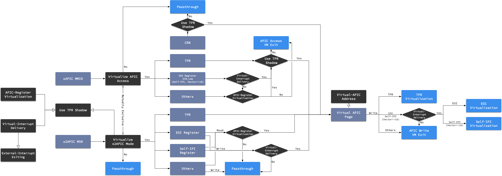

# APICv

[Intel SDM Volume 3 Chapter 28: APIC Virtualization and Virtual Interrupts]()

[Discuss On X86 APIC Virtualization · kernelgo](https://kernelgo.org/x86_apicv.html)

[Intel SDM Chapter 29: APIC Virtualizaton & Virtual Interrupts | tcbbd的博客](https://tcbbd.moe/ref-and-spec/intel-sdm/sdm-vmx-ch29/)

## APIC Basic

x86 下可以通过 3 种方式访问 CPU 的 LAPIC 寄存器：

1. APIC 工作在 xAPIC 模式下，使用 MMIO 方式访问基地址位 IA32_APIC_BASE MSR 的 4K 页。
2. APIC 工作在 x2APIC 模式下，使用 RDMSR 和 WRMSR 访问。
3. 64-bit 模式下，可以通过 MOV CR8 指令访问 APIC 的 TPR 寄存器。

而虚拟化场景下也要支持以上的 3 种访问模式，就需要提供 APIC 虚拟化相关支持，也就是以下的内容。

## VMCS VM-Execution Controls

VMCS 中有中断和 APIC 虚拟化相关的控制位，启用这些特性后，处理器会模拟对 APIC 的大多数访问，跟踪 vAPIC 状态并交付中断——这些都在 non-root 模式下进行，不触发 VM Exit。处理器根据 VMM 指定的 virtual-APIC page 跟踪 vAPIC 状态。

- *Virtual-interrupt delivery*：启用对挂起虚拟中断的评估和交付，支持模拟写入控制中断优先级的 APIC 寄存器（MMIO 或 MSR）。
- *Use TPR shadow*：启用通过 CR8 模拟对 APIC 任务优先级寄存器 TPR 的访问（MMIO 或 MSR）。
- *Virtualize APIC accesses*：启用 MMIO 访问 APIC 的虚拟化，处理器访问 VMM 指定的 APIC-access page 时触发 VM Exit，或模拟访问。
- *Virtualize x2APIC mode*：启用基于 MSR 访问 APIC。
- *APIC-register virtualization*：对大多数 APIC 寄存器的读都重定向到 virtual-APIC page，而写操作会定向到 APCI-access page 触发 VM Exit。
- *Process posted Interrupts*：允许软件在数据结构中发送中断，并向另一个逻辑处理器发送通知，收到通知的目标处理器会将发送来的中断复制到 virtual-APIC page 做进一步处理。

## Virtual APIC State

APIC-access page 是让 vCPU 能通过 MMIO 的方式访问到 APIC 寄存器。

virtual-APIC page 是一个 4K 页，处理器用它虚拟化对 APIC 寄存器的某些访问并管理虚拟中断。其物理地址 virtual-APIC address 保存在 VMCS 中。

根据 VMCS 中 VM-Execution Controls 配置，处理器使用 virtual-APIC page 中的以下字段虚拟化对 APIC 寄存器的访问：

- Virtual task-priority register, VTPR：偏移 080H 的 32 位字段
- Virtual processor-priority register, VPPR：偏移 0A0H 的 32 位字段
- Virtual end-of-interrupt register, VEOI：偏移 0B0H 的 32 位字段
- Virtual interrupt-service register, VISR：256 位值，偏移 100H、110H、120H、130H、140H、150H、160H 和 170H 的 8 个非连续？32 位字段。VISR 的位 x 在偏移 `100H|((x & E0H) >> 1)` 的 `x & 1FH` 位置，处理器仅使用每个 16-byte 的低 4 字节
- Virtual interrupt-request register, VIRR：与 VISR 类似，只不过是 200H 起始
- Virtual interrupt-command register, VICR_LO/VICR_HI：偏移 300H/310H 的 32 位字段

VTPR、VPPR、VEOI、VISR、VIRR、VICR_LO、VICR_HI 等。VTPR 的虚拟化要开启 *use TPR shadow*，而其他字段要开启 *virtual-interrupt delivery*。

### TPR Virtualization

处理器针对以下操作执行 Task-Priority Register, TPR 虚拟化：

- MOV to CR8 指令的虚拟化
- 对 APIC-access page 080H 偏移写操作的虚拟化
- 对 ECX =808H，WRMSR 指令的虚拟化

```
IF “virtual-interrupt delivery” is 0
	THEN
    	IF VTPR[7:4] < TPR threshold (see Section 23.6.8)
    		THEN cause VM exit due to TPR below threshold;
		FI;
	ELSE
        perform PPR virtualization (see Section 28.1.3);
        evaluate pending virtual interrupts (see Section 28.2.1);
FI;
```

由 TPR 虚拟化触发的 VM Exit 类似 trap。

### PPR Virtualization

处理器针对以下操作执行 Processor-Priority Register, PPR 虚拟化：

- VM Entry
- TPR 虚拟化
- EOI 虚拟化

PPR 虚拟化使用 *guest interrupt status*（其中的 SVI）和 VTPR。

```
IF VTPR[7:4] ≥ SVI[7:4]
    THEN VPPR := VTPR & FFH;
    ELSE VPPR := SVI & F0H;
FI;
```

虚拟中断的传递也会修改 VPPR，但方式不同。

### EOI Virtualization

处理器针对以下操作执行 End-Of-Interrupt Register, EOI 虚拟化：

- 对 APIC-access page 0B0H 偏移写操作的虚拟化
- 对 ECX=80BH，WRMSR 指令的虚拟化

EOI 虚拟化只在 *virtual-interrupt delivery* 为 1 时出现。

EOI 虚拟化使用并更新 *guest interrupt status*（其中的 SVI）。

```
Vector := SVI;
VISR[Vector] := 0; (see Section 28.1.1 for definition of VISR)
IF any bits set in VISR
	THEN SVI := highest index of bit set in VISR
	ELSE SVI := 0;
FI;
perform PPR virtualiation (see Section 28.1.3);
IF EOI_exit_bitmap[Vector] = 1 (see Section 23.6.8 for definition of EOI_exit_bitmap)
	THEN cause EOI-induced VM exit with Vector as exit qualification;
	ELSE evaluate pending virtual interrupts; (see Section 28.2.1)
FI;
```

由 EOI 虚拟化触发的中断类似 trap。

### Self-IPI Virtualization

处理器针对以下操作执行 self-IPI 虚拟化：

- 对 APIC-access page 300H 偏移写操作的虚拟化
- 对 ECX=83FH，WRMSR 指令的虚拟化

self-IPI 虚拟化只在 *virtual-interrupt delivery* 为 1 时出现。

每个导致 self-IPI 虚拟化的操作都会提供 8 位的向量，self-IPI 虚拟化更新 *guest interrupt status*（其中的 RVI）。

```
VIRR[Vector] := 1; (see Section 28.1.1 for definition of VIRR)
RVI := max{RVI,Vector};
evaluate pending virtual interrupts; (see Section 28.2.1)
```

## Evaluation and Delivery of Virtual Interrupts

如果 *virtual-interrupt delivery* 为 1，non-root 模式的某些操作或 VM entry 会导致处理器评估和传递虚拟中断。

虚拟中断评估由某些更改 virtual-APIC page 状态的操作触发，评估会识别虚拟中断，识别后处理器就会在 non-root 模式下传递而不出发 VM Exit。

### Evaluation of Pending Virtual Interrupts

如果 *virtual-interrupt delivery* 为 1，逻辑处理器的某些操作会评估挂起的虚拟中断：

- VM Entry
- TPR 虚拟化
- EOI 虚拟化
- self-IPI 虚拟化
- posted-interrupt processing

其他操作即使修改了 RVI 和 VPPR 都不会导致评估。

评估操作使用 *guest interrupt status*（其中的 RVI）。

```
IF “interrupt-window exiting” is 0 AND
RVI[7:4] > VPPR[7:4] (see Section 28.1.1 for definition of VPPR)
	THEN recognize a pending virtual interrupt;
	ELSE
		do not recognize a pending virtual interrupt;
FI;
```

一旦识别出中断，就会在 non-root 模式下传递虚拟中断。传递之后，处理器会停止评估。

### Virtual-Interrupt Delivery

虚拟中断被识别后，在以下条件全部满足时，会在指令边界传递：

- RFLAGS.IF=1
- 没有 STI 阻塞
- 没有 MOV SS 或 POP SS 阻塞
- *interrupt-window exiting* 为 0

虚拟中断传递和由 *interrupt-window exiting* 置 1 导致的 VM Exit 优先级相同。因此，NMI 和更高优先级的事件会先于虚拟中断传递，虚拟中断传递的优先于外部中断和较低优先级的事件。

虚拟中断传递和外部中断一样，都会将逻辑处理器从一些非活动状态唤醒。具体而言，是使用 HLT 和 MWAIT 指令进入的状态，而不会唤醒出于关闭或 wait-for-SIPI 状态的处理器。

虚拟中断传递会更新 *guest interrupt status*（RVI 和 SVI），在 non-root 模式下传递事件，无需 VM Exit。

```
Vector := RVI;
VISR[Vector] := 1;
SVI := Vector;
VPPR := Vector & F0H;
VIRR[Vector] := 0;
IF any bits set in VIRR
	THEN RVI := highest index of bit set in VIRR
	ELSE RVI := 0;
FI;
deliver interrupt with Vector through IDT;
cease recognition of any pending virtual interrupt;
```

如果处理器在 enclave 模式，虚拟中断传递之前会触发 Asynchronous Enclave Exit。

## Virtualizing CR8-Based TPR Access

64 位模式下，软件可以通过 MOV CR8 访问 LAPIC 的 TPR，而这个访问可以虚拟化。

VMM 可以通过设置 *CR8-load exiting* 和 *CR8-store exiting* 标志位截获并虚拟化这些基于 CR8 的 APIC 访问。或者可以在不产生 VM Exit 的情况下虚拟化，将 *use TPR shadow* 置 1 后：

- MOV from CR8：将 VTPR 的 7-4 位加载到目的操作数的 3-0 位，并将 63-4 位清零。
- MOV to CR8：源操作数的 3-0 位存到 VTPR 的 7-4 位，清除 VTPR 的其余部分，然后执行 TPR 虚拟化。

## Virtualizing Memory-Mapped APIC Accesses

LAPIC 在 xAPIC 模式下，软件通过 MMIO 访问 LAPIC 寄存器。使用虚拟地址访问，物理地址由 IA32_APIC_BASE MSR 指定。本节介绍如何虚拟化这些访问。

VMM 确保对 LAPIC 的线性地址访存都会触发 VM Exit，以虚拟化对 MMIO APIC 的访问，可以通过分页或 EPT 实现，或将 *virtualize APIC accesses* 置为 1。

*virtual APIC accesses* 置位后，处理器对最终定位到 APIC-access page 的线性地址访存特殊处理，由 VMCS 中的 APIC-access address 字段指定。（是 hPA 而不是 gPA）（启用  EPT 后，对有资格获得 sub-page 写权限的映射到 APIC-access page 上的 gPA 的写访问，可能会被处理器可能按照 *virtual APIC accesses* 为 0 处理。因此不推荐将映射到 APIC-access page 上的 gPA 配置为有资格获得 sub-page 写权限。）

> 这里被注释绕晕了。。。之后要去看 27.2.4 EPT sub-page write permission 的部分。

通常，对 APIC-access page 的访问会触发 APIC-access VM Exit，从而告知 VMM。

而开启特定的控制位可以让处理器在不触发 VM Exit 的情况下虚拟化对 APIC-access page 的访问。通常，这些虚拟化会将对 APIC-access page 的访问重定向到对 virtual-APIC page 的访问。

> 注意：
>
> 本节讨论的都是对 APIC-access page 的线性访问，要求是使用线性地址发起访存，且访问的物理地址是线性地址转换得到的。
>
> APIC-access page 和 virtual-APIC page 区别在于：VMM 可以在 VM 的 vCPU 之间共享分页结构或 EPT 结构（共享分页结构引用相同的 APIC-access address），而每个 vCPU 提供都要有自己的 虚拟 APIC address。

接下来讲讨论处理器何时以及如何虚拟化对 APIC-access page 的读写访问。通常会对 APIC-access page 的写入重定向到 virtual-APIC page。

*virtualize APIC accesses* 置 1 可能影响对 APIC-access page 的非线性访问。

对 SGX 指令或 enclave 模式的处理器会特殊处理。

### Priority of APIC-Access VM Exits

以下几项指定了 APIC-access VM Exit 的相对于其他事件的优先级：

- 访存导致的 APIC-access VM Exit 优先级低于 page fault 或 EPT violation。
- 访存导致的 APIC-access VM Exit 发生在 EPT 访问标志位置位之后。
- 写访问导致的 APIC-access VM Exit 发生在 EPT 脏位置位之后。
- 对于其他所有事件，访存导致的 APIC-access VM Exit 与 page fault 或 EPT violation 具有相同的优先级。（适用于可能产生访问的其他事件，以及可能由同一操作产生的其他事件）。

### Virtualizing Reads from the APIC-access Page


## 总结



首先，对于MMIO方式的访问，可以通过*Virtualize APIC Access*令对APIC-Access Page的访问，产生**APIC Access** VM Exit，该功能是对MMIO访问进行进一步虚拟化的前提，它可以独立于*Use TPR Shadow*开启。

其次，*Use TPR Shadow* 是CR8、MMIO、MSR三种访问方式的虚拟化的总开关，必须开启才能将Guest的APIC访问重定向到Virtual APIC Page：

- 对CR8访问方式，*Use TPR Shadow* 直接控制其虚拟化
- 对xAPIC模式的MMIO访问，开启*Use TPR Shadow*才能令对部分或全部寄存器的访问重定向到Virtual APIC Page，否则只会产生**APIC Access** VM Exit
- 对x2APIC模式的MSR访问，*Virtualize x2APIC Mode* 控制其虚拟化，而启用该功能的前提是*Use TPR Shadow*已经启用
- 另外需要注意*Virtualize APIC Access*和*Virtualize x2APIC Mode*不能同时启用

开启*Use TPR Shadow*后仅仅是启用了对TPR寄存器的虚拟化，*APIC-Register Virtualization* 和*Virtual-Interrupt Delivery*提供了进一步的控制，这两个功能都必须在*Use TPR Shadow*启用后才能使用：

- 开启*APIC-Register Virtualization*就会虚拟化对所有APIC寄存器的读取
- 开启*Virtual-Interrupt Delivery*就会虚拟化对TPR、EOI Register、Self IPI (ICR_Low/Self-IPI Register)的写入
- 另外开启*Virtual-Interrupt Delivery*还要求*Pin-Based VM-Execution Controls.External-Interrupt Exiting*`[bit 0]` = 1

对xAPIC模式的虚拟化，我们可以认为相比x2APIC模式增加了以下规则：

- 开启*APIC-Register Virtualization*就会虚拟化对所有APIC寄存器的写入
- 开启*Virtual-Interrupt Delivery*就会虚拟化对TPR、EOI Register、ICR_Low的读取
