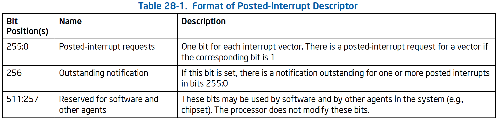

[toc]

# APICv

[Intel SDM Volume 3 Chapter 28: APIC Virtualization and Virtual Interrupts]()

## APIC Basic

x86 下可以通过 3 种方式访问 CPU 的 LAPIC 寄存器：

1. APIC 工作在 xAPIC 模式下，使用 MMIO 方式访问基地址位 IA32_APIC_BASE MSR 的 4K 页。
2. APIC 工作在 x2APIC 模式下，使用 RDMSR 和 WRMSR 访问。
3. 64-bit 模式下，可以通过 MOV CR8 指令访问 APIC 的 TPR 寄存器。

而虚拟化场景下也要支持以上的 3 种访问模式，就需要提供 APIC 虚拟化相关支持，也就是以下的内容。

## VMCS VM-Execution Controls

VMCS 中有中断和 APIC 虚拟化相关的控制位，启用这些特性后，处理器会模拟对 APIC 的大多数访问，跟踪 vAPIC 状态并交付中断——这些都在 non-root 模式下进行，不触发 VM Exit。处理器根据 VMM 指定的 virtual-APIC page 跟踪 vAPIC 状态。

- *Virtual-interrupt delivery*：启用对挂起虚拟中断的评估和交付，支持模拟写入控制中断优先级的 APIC 寄存器（MMIO 或 MSR）。
- *Use TPR shadow*：启用通过 CR8 模拟对 APIC 任务优先级寄存器 TPR 的访问（MMIO 或 MSR）。
- *Virtualize APIC accesses*：启用 MMIO 访问 APIC 的虚拟化，处理器访问 VMM 指定的 APIC-access page 时触发 VM Exit，或模拟访问。
- *Virtualize x2APIC mode*：启用基于 MSR 访问 APIC。
- *APIC-register virtualization*：对大多数 APIC 寄存器的读都重定向到 virtual-APIC page，而写操作会定向到 APCI-access page 触发 VM Exit。
- *Process posted Interrupts*：允许软件在数据结构中发送中断，并向另一个逻辑处理器发送通知，收到通知的目标处理器会将发送来的中断复制到 virtual-APIC page 做进一步处理。

## 28.1 Virtual APIC State

APIC-access page 是让 vCPU 能通过 MMIO 的方式访问到 APIC 寄存器。

virtual-APIC page 是一个 4K 页，处理器用它虚拟化对 APIC 寄存器的某些访问并管理虚拟中断。其物理地址 virtual-APIC address 保存在 VMCS 中。

### 28.1.1 Virtualized APIC Registers

根据 VMCS 中 VM-Execution Controls 配置，处理器使用 virtual-APIC page 中的以下字段虚拟化对 APIC 寄存器的访问：

- Virtual task-priority register, VTPR：偏移 080H 的 32 位字段
- Virtual processor-priority register, VPPR：偏移 0A0H 的 32 位字段
- Virtual end-of-interrupt register, VEOI：偏移 0B0H 的 32 位字段
- Virtual interrupt-service register, VISR：256 位值，偏移 100H、110H、120H、130H、140H、150H、160H 和 170H 的 8 个非连续？32 位字段。VISR 的位 x 在偏移 `100H|((x & E0H) >> 1)` 的 `x & 1FH` 位置，处理器仅使用每个 16-byte 的低 4 字节
- Virtual interrupt-request register, VIRR：与 VISR 类似，只不过是 200H 起始
- Virtual interrupt-command register, VICR_LO/VICR_HI：偏移 300H/310H 的 32 位字段

VTPR、VPPR、VEOI、VISR、VIRR、VICR_LO、VICR_HI 等。VTPR 的虚拟化要开启 *use TPR shadow*，而其他字段要开启 *virtual-interrupt delivery*。

### 28.1.2 TPR Virtualization

处理器针对以下操作执行 Task-Priority Register, TPR 虚拟化：

- MOV to CR8 指令的虚拟化
- 对 APIC-access page 080H 偏移写操作的虚拟化
- 对 ECX =808H，WRMSR 指令的虚拟化

```
IF “virtual-interrupt delivery” is 0
	THEN
    	IF VTPR[7:4] < TPR threshold (see Section 23.6.8)
    		THEN cause VM exit due to TPR below threshold;
		FI;
	ELSE
        perform PPR virtualization (see Section 28.1.3);
        evaluate pending virtual interrupts (see Section 28.2.1);
FI;
```

由 TPR 虚拟化触发的 VM Exit 类似 trap。

### 28.1.3 PPR Virtualization

处理器针对以下操作执行 Processor-Priority Register, PPR 虚拟化：

- VM Entry
- TPR 虚拟化
- EOI 虚拟化

PPR 虚拟化使用 *guest interrupt status*（其中的 SVI）和 VTPR。

```
IF VTPR[7:4] ≥ SVI[7:4]
    THEN VPPR := VTPR & FFH;
    ELSE VPPR := SVI & F0H;
FI;
```

虚拟中断的传递也会修改 VPPR，但方式不同。

### 28.1.4 EOI Virtualization

处理器针对以下操作执行 End-Of-Interrupt Register, EOI 虚拟化：

- 对 APIC-access page 0B0H 偏移写操作的虚拟化
- 对 ECX=80BH，WRMSR 指令的虚拟化

EOI 虚拟化只在 *virtual-interrupt delivery* 为 1 时出现。

EOI 虚拟化使用并更新 *guest interrupt status*（其中的 SVI）。

```
Vector := SVI;
VISR[Vector] := 0; (see Section 28.1.1 for definition of VISR)
IF any bits set in VISR
	THEN SVI := highest index of bit set in VISR
	ELSE SVI := 0;
FI;
perform PPR virtualiation (see Section 28.1.3);
IF EOI_exit_bitmap[Vector] = 1 (see Section 23.6.8 for definition of EOI_exit_bitmap)
	THEN cause EOI-induced VM exit with Vector as exit qualification;
	ELSE evaluate pending virtual interrupts; (see Section 28.2.1)
FI;
```

由 EOI 虚拟化触发的中断类似 trap。

### 28.1.5 Self-IPI Virtualization

处理器针对以下操作执行 self-IPI 虚拟化：

- 对 APIC-access page 300H 偏移写操作的虚拟化
- 对 ECX=83FH，WRMSR 指令的虚拟化

self-IPI 虚拟化只在 *virtual-interrupt delivery* 为 1 时出现。

每个导致 self-IPI 虚拟化的操作都会提供 8 位的向量，self-IPI 虚拟化更新 *guest interrupt status*（其中的 RVI）。

```
VIRR[Vector] := 1; (see Section 28.1.1 for definition of VIRR)
RVI := max{RVI,Vector};
evaluate pending virtual interrupts; (see Section 28.2.1)
```

## 28.2 Evaluation and Delivery of Virtual Interrupts

如果 *virtual-interrupt delivery* 为 1，non-root 模式的某些操作或 VM entry 会导致处理器评估和传递虚拟中断。

虚拟中断评估由某些更改 virtual-APIC page 状态的操作触发，评估会识别虚拟中断，识别后处理器就会在 non-root 模式下传递而不出发 VM Exit。

### 28.2.1 Evaluation of Pending Virtual Interrupts

如果 *virtual-interrupt delivery* 为 1，逻辑处理器的某些操作会评估挂起的虚拟中断：

- VM Entry
- TPR 虚拟化
- EOI 虚拟化
- self-IPI 虚拟化
- posted-interrupt processing

其他操作即使修改了 RVI 和 VPPR 都不会导致评估。

评估操作使用 *guest interrupt status*（其中的 RVI）。

```
IF “interrupt-window exiting” is 0 AND
RVI[7:4] > VPPR[7:4] (see Section 28.1.1 for definition of VPPR)
	THEN recognize a pending virtual interrupt;
	ELSE
		do not recognize a pending virtual interrupt;
FI;
```

一旦识别出中断，就会在 non-root 模式下传递虚拟中断。传递之后，处理器会停止评估。

### 28.2.2 Virtual-Interrupt Delivery

虚拟中断被识别后，在以下条件全部满足时，会在指令边界传递：

- RFLAGS.IF=1
- 没有 STI 阻塞
- 没有 MOV SS 或 POP SS 阻塞
- *interrupt-window exiting* 为 0

虚拟中断传递和由 *interrupt-window exiting* 置 1 导致的 VM Exit 优先级相同。因此，NMI 和更高优先级的事件会先于虚拟中断传递，虚拟中断传递的优先于外部中断和较低优先级的事件。

虚拟中断传递和外部中断一样，都会将逻辑处理器从一些非活动状态唤醒。具体而言，是使用 HLT 和 MWAIT 指令进入的状态，而不会唤醒出于关闭或 wait-for-SIPI 状态的处理器。

虚拟中断传递会更新 *guest interrupt status*（RVI 和 SVI），在 non-root 模式下传递事件，无需 VM Exit。

```
Vector := RVI;
VISR[Vector] := 1;
SVI := Vector;
VPPR := Vector & F0H;
VIRR[Vector] := 0;
IF any bits set in VIRR
	THEN RVI := highest index of bit set in VIRR
	ELSE RVI := 0;
FI;
deliver interrupt with Vector through IDT;
cease recognition of any pending virtual interrupt;
```

如果处理器在 enclave 模式，虚拟中断传递之前会触发 Asynchronous Enclave Exit。

## 28.3 Virtualizing CR8-Based TPR Access

64 位模式下，软件可以通过 MOV CR8 访问 LAPIC 的 TPR，而这个访问可以虚拟化。

VMM 可以通过设置 *CR8-load exiting* 和 *CR8-store exiting* 标志位截获并虚拟化这些基于 CR8 的 APIC 访问。或者可以在不产生 VM Exit 的情况下虚拟化，将 *use TPR shadow* 置 1 后：

- MOV from CR8：将 VTPR 的 7-4 位加载到目的操作数的 3-0 位，并将 63-4 位清零。
- MOV to CR8：源操作数的 3-0 位存到 VTPR 的 7-4 位，清除 VTPR 的其余部分，然后执行 TPR 虚拟化。

## 28.4 Virtualizing Memory-Mapped APIC Accesses

LAPIC 在 xAPIC 模式下，软件通过 MMIO 访问 LAPIC 寄存器。使用虚拟地址访问，物理地址由 IA32_APIC_BASE MSR 指定。本节介绍如何虚拟化这些访问。

VMM 确保对 LAPIC 的线性地址访存都会触发 VM Exit，以虚拟化对 MMIO APIC 的访问，可以通过分页或 EPT 实现，或将 *virtualize APIC accesses* 置为 1。

*virtual APIC accesses* 置位后，处理器对最终定位到 APIC-access page 的线性地址访存特殊处理，由 VMCS 中的 APIC-access address 字段指定。（是 hPA 而不是 gPA）（启用  EPT 后，对有资格获得 sub-page 写权限的映射到 APIC-access page 上的 gPA 的写访问，可能会被处理器可能按照 *virtual APIC accesses* 为 0 处理。因此不推荐将映射到 APIC-access page 上的 gPA 配置为有资格获得 sub-page 写权限。）

> 这里被注释绕晕了。。。之后要去看 27.2.4 EPT sub-page write permission 的部分。

通常，对 APIC-access page 的访问会触发 APIC-access VM Exit，从而告知 VMM。

而开启特定的控制位可以让处理器在不触发 VM Exit 的情况下虚拟化对 APIC-access page 的访问。通常，这些虚拟化会将对 APIC-access page 的访问重定向到对 virtual-APIC page 的访问。

> 注意：
>
> 本节讨论的都是对 APIC-access page 的线性访问，要求是使用线性地址发起访存，且访问的物理地址是线性地址转换得到的。
>
> APIC-access page 和 virtual-APIC page 区别在于：VMM 可以在 VM 的 vCPU 之间共享分页结构或 EPT 结构（共享分页结构引用相同的 APIC-access address），而每个 vCPU 提供都要有自己的 虚拟 APIC address。

接下来讲讨论处理器何时以及如何虚拟化对 APIC-access page 的读写访问。通常会对 APIC-access page 的写入重定向到 virtual-APIC page。

*virtualize APIC accesses* 置 1 可能影响对 APIC-access page 的非线性访问。

对 SGX 指令或 enclave 模式的处理器会特殊处理。

### 28.4.1 Priority of APIC-Access VM Exits

以下几项指定了 APIC-access VM Exit 的相对于其他事件的优先级：

- 访存导致的 APIC-access VM Exit 优先级低于 page fault 或 EPT violation。
- 访存导致的 APIC-access VM Exit 发生在 EPT 访问标志位置位之后。
- 写访问导致的 APIC-access VM Exit 发生在 EPT 脏位置位之后。
- 对于其他所有事件，访存导致的 APIC-access VM Exit 与 page fault 或 EPT violation 具有相同的优先级。（适用于可能产生访问的其他事件，以及可能由同一操作产生的其他事件）。

### 28.4.2 Virtualizing Reads from the APIC-access Page

以下任一为真，则对 APIC-access page 的读访问会触发 APIC-access VM Exit：

- *use TPR shadow* 为 0
- 访问是取指
- 访问大于 32-bit
- 访问是对处理器已经虚拟化的 APIC-access page 写入操作的一部分
- 访问不完全包括在自然对齐的 16-byte 区域的低 4-byte，即访问地址的 3-2 位为 0，对于访问最高字节的地址也是一样。

如果以上都为不满足，那么读访问是否被虚拟化取决于 *APIC-register virtualization*：

- 如果 *APIC-register virtualization* 和 *virtual-interrupt delivery* 都为 0，对页偏移 080H（TPR）的访问会被虚拟化，其他触发 APIC-access VM Exit。
- 如果 *APIC-register virtualization* 为 0，而 *virtual-interrupt delivery* 为 1，则对页偏移 080H（TPR）、0B0H（EOI）、300H（VICR_LO）会被虚拟化，其他会触发 APIC-access VM Exit。
- 如果 *APIC-register virtualization* 为 1，那么如果读取范围完全在以下的偏移范围内，将被虚拟化：
  - 020H–023H (local APIC ID);
  - 030H–033H (local APIC version);
  - 080H–083H (TPR);
  - 0B0H–0B3H (EOI);
  - 0D0H–0D3H (LDR);
  - 0E0H–0E3H (destination format);
  - 0F0H–0F3H (spurious-interrupt vector);
  - 100H–103H, 110H–113H, 120H–123H, 130H–133H, 140H–143H, 150H–153H, 160H–163H, or 170H–173H (ISR);
  - 180H–183H, 190H–193H, 1A0H–1A3H, 1B0H–1B3H, 1C0H–1C3H, 1D0H–1D3H, 1E0H–1E3H, or 1F0H–1F3H (TMR);
  - 200H–203H, 210H–213H, 220H–223H, 230H–233H, 240H–243H, 250H–253H, 260H–263H, or 270H–273H (IRR);
  - 280H–283H (error status);
  - 300H–303H or 310H–313H (ICR);
  - 320H–323H, 330H–333H, 340H–343H, 350H–353H, 360H–363H, or 370H–373H (LVT entries);
  - 380H–383H (initial count);
  - 3E0H–3E3H (divide configuration).
  - 其他所有情况都会触发 APIC-access VM Exit。

对 APIC-access page 的读访问的虚拟化会返回 virtual-APIC page 对应偏移的内容。

### 28.4.3 Virtualizing Writes to the APIC-Access Page

是否虚拟化对 APIC-access page 的写操作取决于 VMCS 标志位的设置和访问的页偏移。

与读操作不同，写操作存在副作用，因此对 APIC-access page 写操作的虚拟化需要根据特定的偏移模拟。

某些页偏移需要软件在写操作之后完成虚拟化，因此会触发 APIC-write VM Exit 调用 VMM。

#### 28.4.3.1 Determining Whether a Write Access is Virtualized

以下任一为真时，对 APIC-access page 的写访问会触发 APIC-access VM Exit：

- *use TPR shadow* 为 0
- 访问大于 32-bit
- 访问时处理器对 APIC-access page 写访问虚拟化的一部分（不同的偏移或不同的大小）
- 访问未完全包含自然对齐 16-byte 的低 4-byte，访问地址的 3-2 位为 0，访问高字节的地址也是一样。

如果以上都不为真，写操作是否虚拟化取决于 *APIC-register virtualization* 和 *virtual-interrupt delivery* 设置：

- 如果 *APIC-register virtualization* 和 *virtual-interrupt delivery* 都为 0，对页偏移 080H（TPR）的访问会被虚拟化，其他触发 APIC-access VM Exit。
- 如果 *APIC-register virtualization* 为 0，而 *virtual-interrupt delivery* 为 1，则对页偏移 080H（TPR）、0B0H（EOI）、300H（VICR_LO）会被虚拟化，其他会触发 APIC-access VM Exit。
- 如果 *APIC-register virtualization* 为 1，那么如果读取范围完全在以下的偏移范围内，将被虚拟化：
  - 020H–023H (local APIC ID);
  - 080H–083H (TPR);
  - 0B0H–0B3H (EOI);
  - 0D0H–0D3H (LDR);
  - 0E0H–0E3H (destination format);
  - 0F0H–0F3H (spurious-interrupt vector);
  - 280H–283H (error status);
  - 300H–303H or 310H–313H (ICR);
  - 320H–323H, 330H–333H, 340H–343H, 350H–353H, 360H–363H, or 370H–373H (LVT entries);
  - 380H–383H (initial count);
  - 3E0H–3E3H (divide configuration).
  - 其他所有情况都会触发 APIC-access VM Exit。

对 APIC-access page 写访问的虚拟化就是将数据写入到 virtual-APIC page 的对应偏移。处理器在访问操作完成后还会执行某些操作，即 APIC-write emulation。

#### 28.4.3.2 APIC-Write Emulation

处理器在虚拟化 APIC-access page 写访问后，在完成操作后会执行额外动作，作为访问的一部分，称为 APIC-write emulation。

APIC-write emulation 取决于页偏移：

- 080H（TPR），处理器会清除 VTPR 的 3-1 bytes，并触发 TPR 虚拟化。
- 0B0H（EOI），如果 *virtual-interrupt delivery* 为 1，则处理器会清除 VEOI 并触发 EOI 虚拟化，否则会触发 APIC-write VM Exit。
- 300H（ICR_LO），如果 *virtual-interrupt delivery* 为 1，则处理器检查 VICR_LO 的值是否以下所有为真：
  - 保留位（bit 31-20、17-16、13）和投递状态 bit-12 都为 0
  - bit 19-18（目的）为 1（self）
  - bit 15（trigger mode）为 0（edge）
  - bit 10-8（投递模式）为 000B（固定）
  - bit 7-4（向量号高 4 位）不是 0000B
  
  以上都为真，则处理器执行 self-IPI 虚拟化，使用 VICR_LO byte 0 的 8-bit 向量。
  
  如果 *virtual-interrupt delivery* 为 0，或以上任意不为真，则会触发 APIC-write VM Exit。

- 310H-313H（ICR_HI）,处理器会清除 VICR_HI 的 2-0 bytes，没有其他虚拟化或 VM Exit 发送。
- 其他的页偏移都会触发 APIC-write VM Exit。

APIC-write emulation 优先于 SMI、INIT 信号和低优先级事件。不会被 RFLAGS.IF=0 或通过 MOV SS、POP SS 或 STI 指令屏蔽。

如果在 APIC-access page 写访问之后，APIC-write emulation 之前发生故障，且故障不是 VM Exit 投递的，那么需要 APIC-write emulation 将发生在故障投递之后，故障处理之前。如果在写访问之后和 APIC-write emulation 之前发生 VM Exit，则 APIC-write emulation 不会发生。

#### 28.4.3.3 APIC-Write VM Exits

在某些情况下，必须调用 VMM 完成对 APIC-access page 的写访问虚拟化，此时 APIC-write emulation 就会触发 APIC-write VM Exit。Exit reason 为 APIC write，exit qualification 为导致 VM Exit 的写访问的页偏移。

!!! note

    后面三节介绍了特定指令注意事项、与页大小和 TLB 管理相关的问题以及不直接由线性地址导致的 APIC 访问，以后再看吧。

## 28.5 Virtualizing MSR-Based APIC Accesses

当 LAPIC 运行在 x2APIC 模式时，软件使用 MSR 访问 LAPIC 的寄存器，即 RDMSR 和 WRMSR 指令，ECX 作为 800H-8FFH 之间的值。本节会描述如何虚拟化这些访问。

VMM 可以通过设置 MSR 位图来虚拟化这些基于 MSR 的访问，使访问时触发 VM Exit，或者也可以不触发 VM Exit 而虚拟化某些基于 MSR 的 APIC 访问。当 *virtualize x2APIC mode* 为 1 时，访问 800H-8FFH 范围内的 MSR 会由特殊处理。

### RDMSR

RDMSR，取决于 *APIC-register virtualization*：

- 如果 *APIC-register virtualization* 为 0，则取决于 ECX 值
  - 如果 ECX 为 808H（TPR MSR），则会从 virtual-APIC page 的 080H 处读 VTPR 即其下的 4-byte 到 EDX:EAX。即使 LAPIC 不在 x2APIC 模式下也会发生这种情况（不会触发 general-protection fault）。
  - 对于 800H-8FFH 内的其他 ECX 值，指令正常执行。如果 LAPIC 在 x2APIC 模式下且 ECX 指示可读 APIC 寄存器，则 EDX 和 EAX 将加载寄存器值，否则会触发 GP fault。
- 如果 *APIC-register virtualization* 为 1，ECX 在 800H-8FFH 范围内，会将 

virtual-APIC page 中偏移量 X=(ECX&FFH)<<4 处的 8-byte 读取到 EDX:EAX，即使 LAPIC 不在 x2APIC 模式，也不会触发 GP fault。

### WRMSR

WRMSR，取决于 *virtual-interrupt delivery*。以下情况会特殊处理：

- ECX 为 808H（TPR MSR）
- ECX 为 80BH（EOI MSR）且 *virtual-interrupt delivery* 为 1
- ECX 为 83FH（self-IPI MSR）且 *virtual-interrupt delivery* 为 1

如果适用特殊处理，则不会因为 LAPIC 运行在 xAPIC 模式而触发 GP，但 WRMSR 会执行正常的保留位检查：

- ECX 为 808H 或 83FH，如果 EDX 或 EAX[31:8] 不为 0 会触发 GP fault
- ECX 为 80BH，如果 EDX 或 EAX 不为 0 会触发 GP fault

如果没有 fault，WRMSR 会将 EDX:EAX 值写到 virtual-APIC page 的偏移 X=(ECX&FFH)<<4 处，之后就取决于 ECX 值：

- ECX 为 808H，处理器执行 TPR 虚拟化
- ECX 为 80BH，处理器执行 EOI 虚拟化
- ECX 为 83FH，检查 EAX[7:4] 并：
  - 如果为非零，则执行 self-IPI 虚拟化，使用 EAX[7:0] 为向量号。
  - 如果为 0，则触发 APIC-write VM Exit，就好像对 APIC-access page 的 3F0H 做写访问。

如果特殊处理不适用，则指令正常运行。如果 LAPIC 处于 x2APIC 模式，且 ECX 指示可写寄存器，则 EDX:EAX 值写入寄存器，如果 LAPIC 不在 x2APIC 模式或寄存器不可写，会触发 GP fault。

## 28.6 Posted-Interrupt Processing

Posted-interrupt processing 是处理器处理 virual-APIC page 上 pending 的虚拟中断的特性。需要开启 *process posted interrupt* 标志位。

处理过程作为 posted-interrupt notification 向量的响应而执行。处理器会处理记录在 posted-interrupt descriptor 中的虚拟中断。posted-interrupt notification vector（下称 PINV）和 posted-interrupt descriptor（下称 PID）的地址都保存在 VMCS 中。

如果 *process posted-interrupt* 为 1，处理器会使用 64-byte 的 PID，格式如下。



PID 的使用不同于 VMCS 中指针引用的其他结构，对于那些数据结构，软件必须确保当没有逻辑处理器在 non-root 模式下引用它时，才能被修改。而此要求并不适用于 PID，然而，要求使用锁定的 read-modify-write 指令修改它。

如果 *external-interrupt exiting* 为 1，所有未屏蔽的外部中断都会触发 VM Exit。如果 *process posted interrupt* 也为 1，处理器会以如下方式处理外部中断：

1. LAPIC 确认后，会提供给处理器核一个中断向量，称为物理向量。
2. 如果物理向量等于 PINV，逻辑处理器继续下面的步骤。否则会触发由外部中断导致的 VM Exit，向量保存在 VM Exit 中断信息中。
3. 处理器清空 PID 中的 ON，原子操作。
4. 处理器向 LAPIC 中的 EOI 写入 0，会接触来自 LAPIC 的 PINV 中断。
5. 逻辑处理器执行为 PIR 和 VIRR 执行逻辑或，并清空 PIR。在读取并清空 PIR 过程中，其他代理均不可读写。
6. 逻辑处理器设置 RVI 为旧 RVI 和 PIR 置位索引中的最大值，如果 PIR 中没有置位，那么 RVI 不变。
7. 逻辑处理器评估挂起的虚拟中断，如 28.2.1。

逻辑处理器不间断地执行上述步骤，如果步骤 7 识别出虚拟中断，处理器可以立即投递中断。

步骤 1 到 7 在中断控制器向 CPU 投递未屏蔽外部中断时，会发生。考虑中断投递中的某些情况：

- 中断投递发生在 REP 前缀指令的迭代之间，以下几项将在 posted-interrupt processing 完成后和 guest 恢复执行之前表征处理器状态：
  - RIP 指向 REP 指令
  - RCX、RSI 和 RDI 更新以反映完成的迭代
  - RFLAGS.RF=1
- 处理器处于 active、HLT 或 MWAIT 状态时可能发生中断投递。如果处于 active 或 MWAIT，则在步骤 7 之后处于活动状态，而处于 HLT 会在步骤 7 之后恢复 HLT（如果识别到挂起的虚拟中断，逻辑处理器可以立即从 HLT 状态唤醒）。
- 处理器处于 enclave 模式时，如果在中断到达前处于 enclave，则在 步骤 1 到 7 之前会发生异步 enclave exit（AEX）。如果步骤 1 之前没有发生 AEX，并在步骤 2 发送 VM Exit，则在 VM Exit 投递之前发送 AEX。