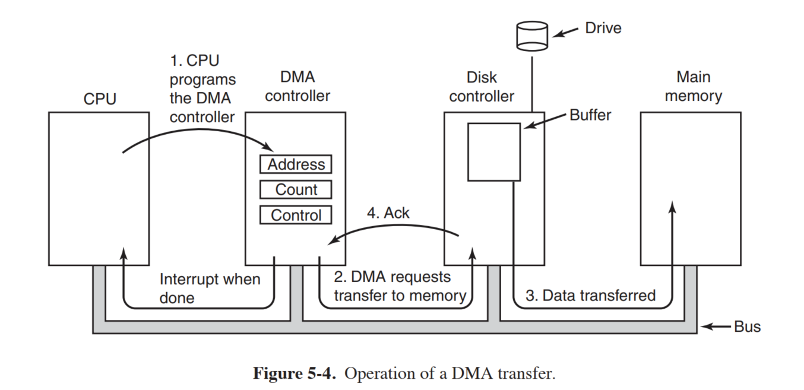
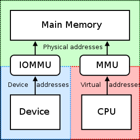
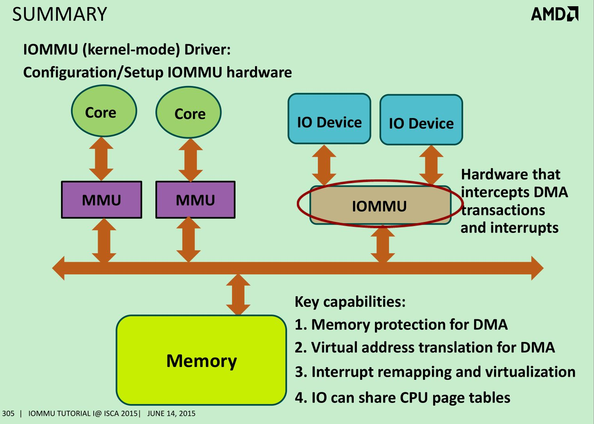
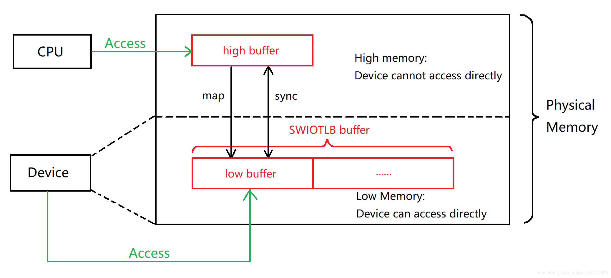
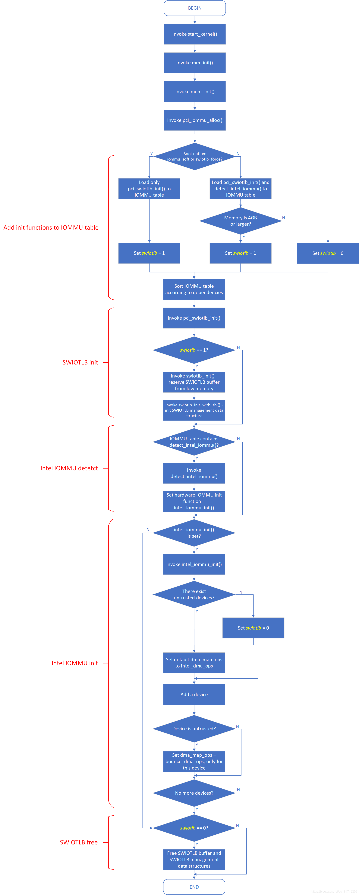

# DMA and IOMMU

[IOMMU(一)-简单介绍 - 知乎](https://zhuanlan.zhihu.com/p/336616452)

[Intel IOMMU Introduction · kernelgo](https://kernelgo.org/intel_iommu.html)

[14. Linux IOMMU Support — The Linux Kernel documentation](https://www.kernel.org/doc/html/latest/x86/intel-iommu.html)

[Linux x86-64 IOMMU 详解（一）—— IOMMU 简介](https://blog.csdn.net/qq_34719392/article/details/114834467)

[Linux x86-64 IOMMU 详解（五）—— Intel IOMMU 初始化流程](https://blog.csdn.net/qq_34719392/article/details/117563480)

DMA & IOMMU 要点：

- DMA 是为了不用 CPU 传输数据，CPU 告知 DMA 引擎起始地址和数据大小，DMA 引擎传输完成后中断通知 CPU。DMA 下设备可以访问整个物理地址空间，存在安全隐患。

  

- IOMMU 通过地址转换解决安全问题，可以实现用户态驱动和虚拟机设备直通。另外，可以将连续的虚拟地址映射到不连续的物理内存片段，在此之前设备访问的物理空间必须是连续的。

  

  

- IOMMU 的软件实现方式：SWIOTLB，其解决的问题就是无法寻址到内核分配的 DMA buffer 的设备也能进行 DMA 操作，其实就是通过用一段低地址空间与高地址空间做同步，使用 memcpy，效率较低。SWIOTLB 又称 bounce buffer，由两个操作构成：map 和 sync。

  - map 是指将一段高地址内存映射到低地址内存，以便设备能够访问到。
  - sync 是指高低两个 buffer 的数据需要同步，使用 memcpy。
  - 当操作系统内存不大于 4G 时，也就不需要 SWIOTLB；当内核启动参数同时启用了 SWIOTLB 和硬件 IOMMU 时，系统启动后，SWIOTLB 会被禁用，仅保留硬件 IOMMU。

  

- 硬件 IOMMU，即 [Intel VT-d](./vt-d.md) 和 AMD-Vi。启用 Intel IOMMU 配置

  - BIOS 开启 Intel VT/VT-d
  - 编译时 *.config* 中开启 `CONFIG_INTEL_IOMMU=y`
  - 内核启动参数 `iommu=force intel_iommu=on`

- 内核对 Intel IOMMU 初始化流程

  ```c
  start_kernel ->
    mm_init ->
      mem_init ->
        pci_iommu_alloc ->
          pci_swiotlb_detect_4gb
          pci_swiotlb_init ->
            swiotlb_init
          detect_intel_iommu
  ```

  - 在 `pci_iommu_alloc` 中遍历 iommu_table（此前已经将相关函数加载到表中）。每个 iommu_table entry 都有 `detect, early_init, late_init` 函数指针。
  - 先调用 `detect` 检测 IOMMU 的存在，然后调用 `early_init`。
  - 对于 SWIOTLB，`pci_swiotlb_detect_4gb` 会检测系统内存是否大于 4G。是则调用对应的 `early_init=pci_swiotlb_init`，这里有一个全局变量 `swiotlb`，仅当其为 1 时，才会调用真正的初始化函数 `swiotlb_init`。而前面有多个地方可以将其置 1，如 `detect` 函数。
  - 而对于 Intel IOMMU，只有 `detect=detect_intel_iommu` 函数，没有 `early_init`。虽然如此，其 `detect` 函数已设置 `x86_init.iommu.iommu.init=intel_iommu_init`，这才是真正的初始化函数。调用链如下。

  ```c
  start_kernel ->
    ...
    arch_call_rest_init ->
      rest_init ->
        kernel_init ->
          kernel_init_freeable ->
            do_basic_setup ->             
              do_initcalls ->              
                do_initcall_level ->
                  do_one_initcall ->
                    pci_iommu_init -> 
                      x86_init.iommu.iommu_init
                      other late_init fns
  ```

  - `intel_iommu_init` 函数完成 Intel IOMMU 所需数据结构的初始化工作，而在函数的最后，初始化工作完成后，将全局变量 `swiotlb` 置零。
  - 之后会执行 SWIOTLB 的 `late_init` 函数，会判断 `swiotlb`，如果为零，则释放之前 `early_init` 已分配的 buffer 和数据结构，SWIOTLB 不复存在，只剩下 Intel IOMMU。
  - 总结 Intel IOMMU 的初始化流程：将初始化函数加载到 iommu_table；初始化 SWIOTLB；初始化 Intel IOMMU；将 swiotlb 置零；释放 SWIOTLB 相关结构。

  !!! question

      Q: 上面的调用链，如何从 `do_basic_setup` 最后调用 `pci_iommu_init`？

      涉及 [Linux 的 initcall 机制](../linux_kernel/initcall.md)。

  

- QEMU 通过 VFIO 使用 IOMMU，见 [vfio](./vfio.md)