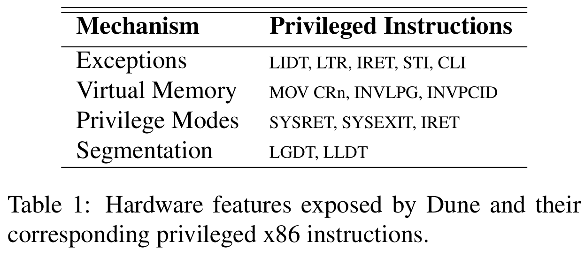
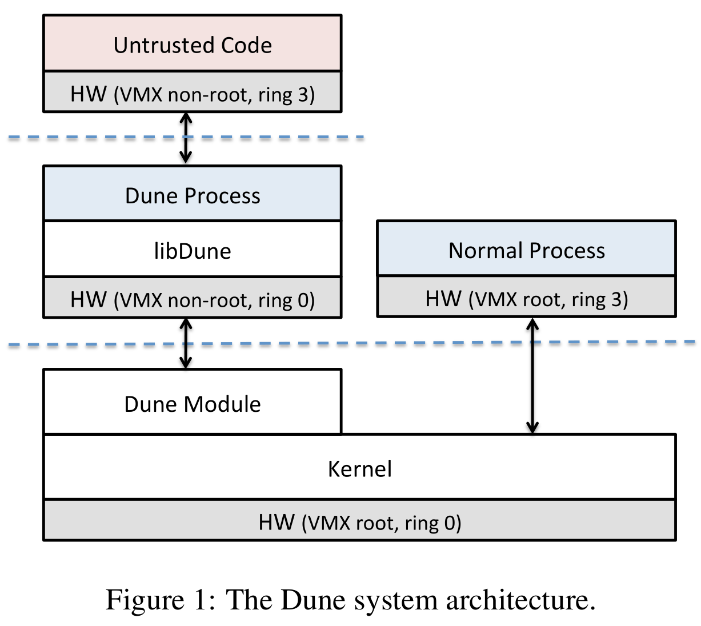
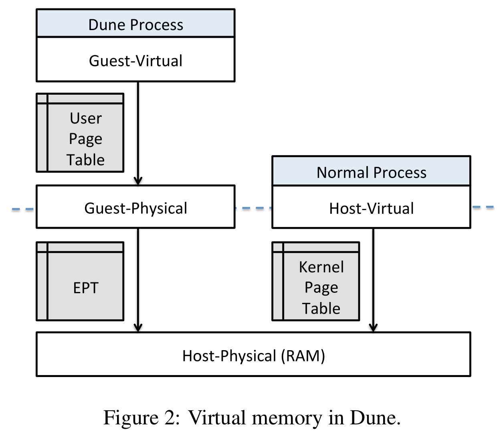
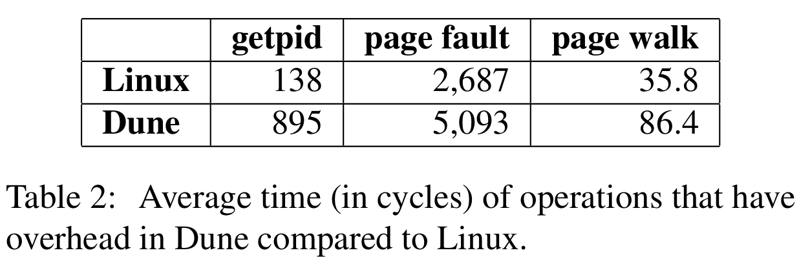
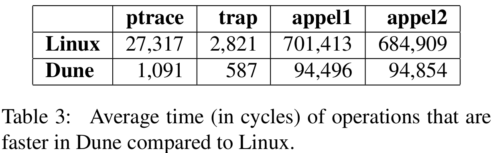

# Dune: Safe User-level Access to Privileged CPU Features

Dune 系统为应用程序提供直接但安全的硬件功能，同时为进程保留现有的操作系统接口。使用硬件虚拟化，提供进程抽象。包含一个初始化虚拟化硬件并与内核交互的内核模块，以及帮助应用程序管理特权硬件功能的用户层库。文章以三种应用为例：沙箱、特权分离和垃圾回收，Dune 可以简化其实现并提升性能。

## Introduction

如果用户程序能访问 kernel-only 硬件特性，可以实现更多功能或提升性能。而这往往需要修改内核，影响系统稳定性。另一种策略就是放到虚拟机中，专用的内核，但是将进程移到虚拟机中会存在很多问题，构造专用内核也并非易事。

本文提出一种用户程序使用内核硬件特性的新方法：使用虚拟化硬件提供进程而非 VM 抽象。Dune 提供一个内核模块，进程可以进入 Dune mode，通过虚拟化硬件，安全且快速地访问特权硬件特性，包括特权模式、虚拟内存寄存器、页表、中断、异常和系统调用向量。提供用户层库 libDune 供应用程序利用特性。

Dune 进程就是普通的 Linux 进程，唯一不同的是，使用 VMCALL 指令进行系统调用。其次，Dune 内核模块仅提供进程抽象，简单且快速，可以配置硬件不再保存和恢复那些 VM 需要的状态。

- 使用有硬件辅助虚拟化，安全且高效地向用户程序公开硬件特性，同时保留操作系统抽象。
- 具体评估了三个硬件特性：异常、分页和特权模式，展示用户程序如何从中获益。
- 构建和评估了三个用例：沙箱、特权分类和垃圾回收，演示 Dune 的端到端使用。

## Virtualization and Hardware

Dune 利用 VT-x 为用户程序提供对 x86 硬件的完全访问权限。包括三个特权硬件特性：异常、虚拟内存和特权模式。下图为相关特权指令：

在仿真、调试和性能跟踪等用例中需要高效的异常支持。而将异常报告给用户程序需要特权级转换和 upcall 机制（如信号）。Dune 可以减少异常开销，因为 VT-x 可以硬件直接传递异常。当然，计时器中断和其他针对内核的异常会触发 VM Exit。例如，使用 Dune 处理 page fault，相比 Linux 中的 SIGSEGV 快 4 倍。另外可加速的还有断点、浮点上溢和下溢、除零和无效操作数等。

checkpoint、垃圾回收、数据压缩分页和分布式共享内存等用例需要快速且灵活的虚拟内存支持。Dune 将页表项暴露给用户程序，允许它们通过简单地访存控制地址转换、访问权限、全局标识位、脏位等。EPT 的存在使这种修改不会影响安全性。

Dune 还允许用户程序控制 TLB invalidation，因此可以进行批量页表更新。Dune 通过 Intel
的 PCID 来暴露 TLB 标记，允许用户程序在多个页表之前切换。在虚拟内存基准测试中，Dune 比 Linux 快 7 倍，包括使用异常硬件减少 page fault 延迟。

特权分离和沙箱都会用到特权模式（ring 0）。Dune 允许进程内的硬件特权级保护。系统调用会陷入到进程本身，而不是内核。与 ptrace 相比，拦截系统调用的开销降了 25 倍。

当然还有其他有待于支持的硬件特性，如缓存控制、调试寄存器和 DMA，这些也可以通过虚拟化硬件实现。

## Kernel Support for Dune

Dune 的核心是一个内核模块，用于管理 VT-x 并提供用户程序对特权硬件特性的访问。模块操作主要有三个方面：内存管理、公开对特权硬件的访问以及保留对内核接口的访问。

Dune 进程运行在 non-root 模式，Dune 模块负责处理 VM Exit，提供必要操作，如处理 page fault、系统调用。Dune 包含一个库 libDune，在用户层协助管理特权硬件。普通程序可以通过向 /dev/dune 发送 ioctl 进入 Dune 模式，但无法退出。子进程不会在 Dune 模式，但可以进入。

Dune 不会影响底层 OS 的安全模型，反而使提供了额外的进程内特权级隔离。

### Comparing to a VMM

与标准 VMM 相比，Dune 无法支持普通 guest OS，但是也更轻量、更灵活。

- Dune 使用 hypercall 调用正常 Linux 系统调用。
- Dune 不提供物理硬件接口模拟，只提供 VMM 不干预的直接访问，无法实现时就会回到 OS。
- Dune 限制了需要保存和恢复的状态，降低开销。
- Dune 将 EPT 配置为进程地址空间。

虽然但是，Dune 模块也可以视为 type-2 hypervisor，因为运行在 host 内核之上。

### Memory Management

内存管理的挑战是允许用户程序访问页表的同时要组织任意访问物理内存。提供一个正常的进程内存地址空间，允许用户添加需要的功能，而不是取代内核内存管理。

Dune 通过 EPT 控制 Dune 进程能访问的物理地址空间。理想情况下，EPT 应与内核页表尽可能匹配，因为目标就是让 Dune 进程访问与普通进程相同的地址空间。问题是 EPT 与标准页表格式不兼容，而且要暴露完整的 hVA 空间，但 gPA 被限制在更小的范围（36-bit PA & 48-bit VA）。

不兼容的解决方案是向内核查询进程内存映射，手动更新 EPT。每当触发 EPT violation 时，handler 就会新建一个内核 page fault handler 反映的地址转换和权限。有时需要取消映射，而且内核也需要页面访问信息来进行换页，以及脏状态用于决定何时写回磁盘。为此，Dune 通过 hook MMU 通知链（与 KVM 使用的方法相同），地址取消映射时，Dune 模块接受事件，删除相关 EPT 条目，并在内核页表中设置脏位。

对于内存地址范围的问题，只允许在 EPT 中映射某些地址范围来解决地址宽度问题。只允许进程开始的地址（堆、代码和数据段）、mmap 区域和堆栈。每个区域限制为 4GB，把地址空间压缩到 EPT 的前 12GB。更复杂的方法是以任意顺序将每个虚拟内存区域打包到 gPA 空间，向用户程序提供在它自己的页表中重映射段到正确 gVA 所需的额外信息。

!!! todo

    看起来内存虚拟化比想象中要考虑的东西更多，之后需要看一下 KVM 的内存虚拟化。

### Exposing Access to Hardware

如上所述，Dune 公开了对异常、虚拟内存和特权模式的访问。VMX non-root 下的异常和特权模式不需要额外配置，虚拟内存需要访问 CR3，在 VMCS 中启用。

出于性能原因，Dune 限制对硬件寄存器的访问，如 MSR，FS 和 GS 除外。

### Preserving OS Interfaces

Dune 也保留了对 OS 系统调用的访问。普通的系统调用只会在陷入到进程本身，而不会导致 VM Exit，进程必须使用 VMCALL 指令进行系统调用。Dune 模块将 hypercall 对应到内核系统调用表。某些情况还需要进行额外操作，当执行 exit 系统调用时，Dune 负责清除工作。

Dune 完全改变了信号处理程序的输入方式，一些信号被更有效地硬件支持代替。如硬件 page fault 可以替代 SIGSEGV。其他信号（如 SIGINT）可以向进程注入假硬件中断，高效且可以正确处理特权模式。用户程序在 ring 3 沙箱允许不可信代码，硬件在处理信号时会转换到 ring 0。

## User-mode Environment

Dune 进程的执行环境与普通进程不同。首先，用户代码在 ring 0 运行，通常不会导致不兼容。ring 3 可用于选择限制不受信代码。另外，系统调用必须以 hypercall 的形式。为简化修改，libDune 提供一种机制检测从 ring 0 执行系统调用并用 hypercall 将其重定向到内核。

libDune 帮助构建 Dune 用户程序，由一组帮助管理和配置特权硬件功能的工具组成，包括页表管理、ELF loader、页分配器以及帮助用户程序管理异常和系统调用的例程。

提供了一个将系统调用 SYSCALL 替换为 VMCALL 的 libc。

将进程转换为 Dune 模式类似于启动 OS。首先要提供有效的页表。目标时转换前后的进程地址保持一致，但还要考虑 EPT 布局。页表创建后向 Dune 以页表指针为参数发送 ioctl。Dune 模块切换到 Dune 模式，执行代码，配置特权寄存器以设置合理的执行环境。如加载 GDT 提供基础的段，加载 IDT 以捕获硬件异常。还会在 TSS 中创建一个单独的对战处理 double fault 并配置 GS 寄存器，以便访问每个线程的数据。

libDune 还是缺少一些功能：没有完整对信号的支持；线程安全。

系统调用地址必须是 hVA，可能需要遍历用户页表调整系统参数地址。

libDune 中有较多的特定于架构的代码，不方便迁移。

## Applications

以两个安全相关应用：沙箱和特权分离系统，一个性能相关应用：垃圾回收为例。目标是更简单的实现、更高的性能，提升安全性。

沙箱时限制代码的进程，限制可访问内存以及使用接口或系统调用。适用于某些场景：浏览器运行 native code、创建安全容器、安全手机应用等。这里用 Dune 创建了一个支持 64-bit Linux 可执行文件的沙箱。

沙箱在 ring 0 运行可信的沙箱运行时，将不可信二进制运行在 ring 3，都在同一地址空间运行。运行时的内存保护由页表项 supervisor 标志位实现。不可信二进制执行不安全操作时，libDune 会接收异常并跳转到运行时提供的 handler，以此过滤和限制行为。

不可信二进制文件要加载到用户空间，一个风险是其中可能包含精选构造的 ELF 头从而利用 ELF loader 的缺陷。解决方案是先用一个小型 loader（libDune 提供），仅支持静态二进制，将第二个 ELF loader 加载到沙箱（这里用 ld-linux）。然后再由沙箱中的这个 loader 加载不可信二进制文件。

Wedge 是一个特权分离系统，其核心抽象是一个 sthread，提供 fork 的隔离和 pthread 的性能。sthread 是一个轻量级进程，可以访问策略指定的内存、文件描述符和系统调用。在 sthread 中运行有风险代码，如 web 服务器中，每个客户端请求都在单独的 sthread 运行。sthread 需要快速的创建和上下文切换。通过线程回收实现快速创建，第一次创建时做一个 checkpoint，然后再退出时恢复，就可以在下一次创建时安全地重用这个线程，将线程创建成本降到恢复内存成本。

Wedge 使用 Dune 支持的硬件特性：使用 ring 执行系统调用策略，使用页表限制 sthread 访问内存，使用脏位在 sthread 回收时恢复内存，使用标记的 TLB 用于快速上下文切换。

垃圾回收器 GC 可以利用内存管理硬件加速收集。GC 能用到的 Dune 特性有：快速故障处理、脏位、页表、TLB 控制。

## Evaluation

Dune 的开销主要来自于两方面：VM Exit 以及 EPT。而系统调用花费的视角要大于较为固定的 VMX 切换事件。

使用 Dune 可以为很多应用提供优化：ptrace、trap、appel1、appel2。

三个用例的性能开销：沙箱，解决零开销；GC 提高 40%；特权分离系统的上下文切换开销减少 3 倍。