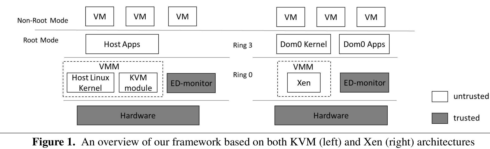
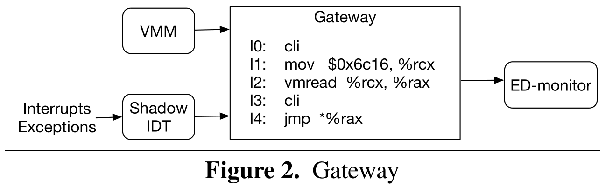
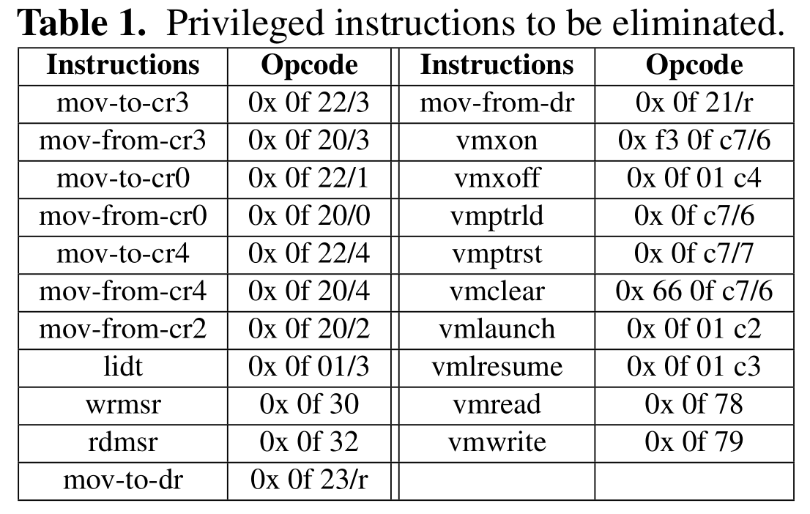

# Dancing with Wolves: Towards Practical Event-driven VMM Monitoring

[pdf]([VEE%202017]%20Dancing%20with%20Wolves%20-%20Towards%20Practical%20Event-driven%20VMM%20Monitoring.pdf)

本文提出了针对云计算中不可信 VMM 的事件驱动监控框架。将可信的监控器与不可信 VMM 放在同一特权级和相同地址空间以实现更高效率，并提出一种相互保护机制确保监控器完整性。实验表明，在保证事件驱动监控的同时仅引入了可忽略的性能开销。

## Introduction

事件驱动监控（主动监控）效果优于基于轮询的监控（被动监控）。

以往的工作有通过自定义硬件实现监控，但代价大、难推广。通过嵌套虚拟化架构进行监控，跨特权级的转换开销太大。基于同级隔离的监控中，有工作基于特定的编译器支持且需要修改较多的代码，还嵌套内核架构，但特权切换需要执行 mov-to-CR0 指令，开销也不低（本文提供数据，嵌套虚拟化切换开销为 0.515μs，而嵌套内核 mov-to-CR0 切换开销为 0.139μs）。

为实现高效的事件驱动监控，既要将监控器与 VMM 放在同一特权级，还要避免较大的边界转换开销（mov-to-CR0，地址空间转换）。

本文提出 x86 平台的新型事件驱动监控框架 ED-Monitor, EDM，关键思想是两种技术**相互保护**。

- 基于插桩的特权限制 IPR，负责拦截 VMM 特权操作，并将控制流转移到 EDM。
- 地址空间随机化 ASR，负责将 EDM 隐藏在 VMM 的地址空间中。

本文贡献：

- 提出不需要自定义硬件的事件驱动监控系统。
- 提出新的 IPR 和 ASR 相互保护机制以确保同特权级监控器的安全。
- 在 KVM 架构基础上实现原型，不需要修改 VMM 源代码。

## Overview

事件驱动的 VMM 监控要在特定事件发生时调用监控器中的完整性评估例程。而捕获指定事件的常见方法就是 hook，可以是代码 hook（插入 jmp），数据 hook（调用表）或其他可转移控制流的技术。VMM 执行到 hook 代码时，控制流就会转移到监控器，然后进行完整性验证。

下图为 KVM 和 XEN 上的监控框架图。

监控器可信依赖于以下的安全要求：

- EDM 完整性，保证 EDM 中的 VMM 完整性评估是可信的。
  - 内存完整性，代码和数据不被 VMM 破坏。
  - 控制流完整性，控制流不被 VMM 恶意修改。
  - 指定的入口点，只能通过指定的入口点切换到 EDM 执行。
- hook 位置保护
  - hook 不被 VMM 移除或修改。
  - 执行到 hook 位置时，控制流不可绕过地转到 EDM。

ASR 可以保护代码和数据免受同一地址空间对手的危害，而 VMM 可以执行特权操作绕过 ASR，如重映射。为此，需要剥夺 VMM 执行最特权操作的能力，IPR 利用代码插桩移除 VMM 代码中的所有特权指令，VMM 只能请求 EDM 代其执行特权指令。EDM 通过这种方式可以拦截并验证 VMM 特权操作。然而，VMM 可以引入新特权指令绕过验证。

本文将 ASR 与 IPR 相结合，提供相互保护形式。IPR 利用 ASR 保证对 VMM 最特权操作不可避免地拦截和验证，而 ASR 依赖 IPR 缓解破坏 ASR 的尝试。

## Design of Mutual-Protection

### Instrumentation-based Privilege Restriction

IPR 允许 EDM 拦截并验证 VMM 的最特权操作。

#### Interception of Privileged Instruction Execution

使用离线代码插桩移除 VMM 代码中的特权指令。其中还分为原本就作为特权指令执行的预期字节和未对齐指令边界的非预期字节。对于前者，使用 hook 替换，将控制流定向到 EDM。对于后者，使用功能等效的不包含非预期字节的指令替换。

通过以下两个机制确保 VMM 无法引入新特权指令：

- W^X，将 VMM 代码和数据页映射为可写异或可执行。同时拦截页表修改。
- 使用 SMEP 阻止 VMM 执行低特权级代码，同时移除 mov-to-CR4 指令。

#### Interception of MMU Configuration

MMU 配置包含两个最特权操作：执行 mov-to-CR3 和更新页表。

从 VMM 代码中移除 mov-to-CR3 指令。使用影子页表拦截页表更新，VMM 维护自己的页表 VMMPT，而硬件实际使用的是 EDM 维护的 SPT。EDM 保证 CR3 只能指向 SPT。VMM 无法直接更新 SPT，只能依赖 EDM 同步更新。

#### Interception of Interrupt and Exception Handling

中断和异常处理函数由 IDT 指定，其基地址存在 IDTR。VMM 管理器自己的 IDT，而 CPU 实际使用 EDM 准备的影子 IDT。

EDM 拦截 lidt 指令执行；影子 IDT 及其中的处理函数都映射为只读；影子 IDT 和处理函数的虚拟地址由 SPT 保护；影子 IDT 使用中断门指定处理函数。

#### Interception of IOMMU Configuration

IOMMU 的控制寄存器映射到固定物理地址，使用 SPT 拦截对控制寄存器的访问。利用影子 I/O 页表控制 DMA 地址转换。

#### Interception of Hardware Virtualization Configuration

EDM 监控两种硬件虚拟化配置：

- VMCS 操作
  - 拦截硬件虚拟化指令 vmptrld, vmptrst, vmclear, vmread, vmwrite 等。
  - 使用 SPT 将 VMCS 区域映射为不可访问。
  - 拦截并验证修改，特别是 host state 字段。
- EPT 更新
  - VMM 管理自己的 EPT，而 VMCS 中的 EPTP 实际指向 EDM 维护的影子 EPT。
  - EDM 拦截并同步 EPT 更新操作。

### Address Space Randomization

IPR 的有效性依赖 EDM 的完整性。首先要确保分配在 EDM 内部内存的 SPT、影子 I/O 页表和影子 EPT 等不被恶意修改。另外，还要确保 EDM 的验证功能不被破坏。

ASR 的思想很简单：系统启动的初始化阶段，将所有 EDM 内存映射到虚拟地址空间的随机位置，依赖地址空间的巨大规模实现概率保护。

#### Possible Attacks

不可信的 VMM 可能通过以下手段破坏 ASR 提供的保护：

- 绕过攻击
  - 禁用分页；
  - 通过 DMA 直接访问物理地址；
  - 将 EDM 内存重映射到已知虚拟地址；
  - 通过受控 VM 在 non-root 模式访问 EDM 内存。
- 信息泄露攻击，获取地址空间布局，找到 EDM 内存位置。
  - 软件层面，指向 EDM 虚拟地址的指针。
  - 硬件层面
    - 页表；
    - 系统寄存器，如 CR2；
    - 调试硬件，如 LBR。
- 暴力攻击，暴力扫描整个虚拟地址空间。

#### Preventing ASR-bypass Attacks

对于绕过攻击，EDM 采用以下手段防御：

- 拦截 mov-to-CR0 指令指向，无法禁用分页。
- 使用影子 I/O 页表阻止通过 DMA 直接访问 EDM 物理内存。
- 拦截并验证 MMU 配置更新，阻止重映射。
- 验证 EPT 更新，阻止 non-root 模式访问。

#### Preventing Software-level Information Leaks

VMM 调用 EDM 执行时会泄露地址。为此，将调用过程分为三个阶段：EDM 调用、执行和返回。

EDM 调用需要 VMM 指导 EDM 入口地址，从而导致地址泄露。为此，提出 VMM 进入 EDM 的新安全方法。将 EDM 入口地址存到 VMCS.HOST_RIP 字段。EDM 通过拦截 VMCS 操作阻止 VMM 读取该字段。基于此，为 VMM 提供了进入 EDM 的安全网关，网关映射为只读并映射到 VMM 已知的地址。

网关指令序列如下图。关中断后从 VMCS.HOST_RIP 字段读取 EDM 入口地址到 RAX 寄存器。然后又关中断，最后将控制流转移到 EDM。虽然此处有一条 vmread 指令，但 VMM 无法用此指令读取 VMCS 字段。因为 vmread 执行后，禁用中断，控制流转移到 EDM。同时，配合影子IDT 可以避免在 vmread 执行后 VMM 马上生成恶意中断劫持控制流。这种设置也有助于捕获 VM Exit 事件，VM Exit 时，控制流会直接转移到 HOST_RIP 指定的 EDM 入口。

为避免 EDM 执行阶段的信息泄露，EDM 使用独立的可执行文件、栈和动态内存。

当 EDM 完成验证和完整性评估任务后，清除所有 CPU 寄存器，切换栈，返回到 VMM 执行。

#### Preventing Hardware-level Information Leaks

IPR 将 VMM 降权后，VMM 无法直接访问底层配置和状态，也就无法信息泄露。

- VMM 只能维护 VMMPT，而 SPT 对 VMM 不可见。
- 从 VMM 中移除 mov-from-CR2 指令，避免泄露。
- 移除 mov-to-dr, mov-from-dr，以禁止 VMM 直接访问调试寄存器和调试控制 MSR。

#### Preventing Brute-force Attacks

VMM 暴力扫描大概率会触发 page fault，引起 EDM 警觉。

EDM 虚拟内存空间可小于 1GB，ASR 提供的概率保护：

$$\frac{1GB}{2^{44}B}=\frac{1}{16384}$$

## Trusted Event-driven VMM Monitoring

在相互保护机制的基础上，可以满足事件驱动监控的安全要求。

- hook 保护
  - 使用 W^X 保护代码 hook；
  - 使用 SPT 保护数据 hook；
  - hook 跳转到独立的挑战，然后关中断，保存 VMM 上下文信息，再跳转到 EDM 安全网关。
- EDM 完整性
  - ASR 保护内存完整性；
  - EDM 执行时禁用中断，屏蔽 NMI，保护控制流完整性。
  - VMM 不知道 EDM 地址，只能通过网关调用 EDM。

## Prototype Implementation

在 x86_64 KVM 基础上实现监控框架原型。系统管理员通过三步使用监控框架：离线插桩、通过 EDM API 添加监控策略和系统启动时将 EDM 作为 LKM 加载。

首先要对 VMM 二进制可执行文件进行离线代码插桩，移除以下特权指令。

框架的初始化阶段：通过系统启动时将 EDM 作为 LKM 加载到系统中。初始化阶段，EDM 会扫描 VMM 代码，验证所有特权指令是否都被移除，同时移除内核在启动过程中引入的新特权指令。然后初始化 IPR 和 ASR，最后在 VMM 中部署 hook。

利用 Linux 内核现有的半虚拟化接口，这些接口原用于内核需要执行 MMU 配置时向更高特权级软件发送请求。EDM 可以在初始化阶段修改这些 hook，让 VMM 的所有 MMU 配置请求都重定向到网关，最后由 EDM 处理。这种方法减小了 EDM TCB，提升了性能，同时不会修改 VMM 代码。

要加载新的 LKM，需要先执行离线插桩，加载时 EDM 会验证代码。

